# 微机原理,汇编语言与接口技术
# 前言
## 教师信息
- 主讲：刘芳
- 办公室：计算机楼528
- 学习QQ交流群：981831953
- 集中线下答疑时间：周三下午
- 两点后

---
## 本次课程主要内容
### 课程介绍
- 微型计算机的发展及应用
- 微型计算机系统的组成
- 计算机中数据的表示（自行复习掌握）
- 计算机中的常用逻辑部件（自行复习掌握）

---
### 教学目的
#### 硬件系列课程之一
- 计算机组成原理
	- 对计算机系统的基本组成和工作机制有了比较透彻的理解
	- 微机原理与系统
	- 计算机体系结构
		- 重点论述计算机系统的各种基本结构，设计技术和性能定量分析方法 

---
#### 本课程的目的
- 进一步理解微处理器的内部结构和工作原理
- 理解微型计算机系统的组成和工作原理
- 理解常用接口芯片的使用方法
- 具有微机系统软硬件开发的初步能力 

---
## 教学内容
- 总学时：56+16. 学分：4
	- 第1章 微型计算机系统概述	->2
	- 第2章 汇编语言基础->16
	- 第3章 汇编语言程序俄设计->7
	- 第4章 16位微处理器的外部特性->3
	- 第6章 微型计算机输入和输出技术	->5
	- 第7章 微型计算机的中断系统->5
	- 第8章 可编程接口芯片->12
	- 第10章 模数和数模转换技术->6 

---
## 课程考核
笔试：50%
- 实验：20%（地点：计算机楼）
	- 8次实验（3次软件，5次硬件机房）16课时
	- 请各位班长区实验室办公室（计311）安排时间
	- 可以顺便咨询一下排课算法
- 平时：30%，包括：
	- 作业：主要考察是否认真学习，以及独立思考，独立理解的能力，**杜绝作业抄袭！**
	- 课堂听讲  

---
## 微型计算机系统组成
---
### 冯·诺依曼思想
- **存储程序，程序控制**，计算机五大功能部件
- 

---
### 微型计算机
- **以微处理器为核心**，配上由大规模集成电路制作的只读存储器（ROM），读写存储器（RAM），输入/输出接口电路以及相应的辅助电路等所组成的计算机，称为**微型计算机[Microcomputer]**
- 将这些组成部分基层在一片超大规模集成电路芯片上，称为单片微型计算机，建成**单片机**。
  - 单片机体积小，功耗低，在智能化仪器仪表以及控制领域应用极广。
- 以微型计算机为中心，配以相应的外围设备（如键盘。鼠标，显示器，打印机等）和其他专用电器，电源，面板，
【没打完】


---
## 系统总线
- **总线**是计算机的部件与部件之间传输信息的**公共通路**，
- 【没打完】
- 
  - 
- 总线使用特点
  - 在某一时刻，只能**由一个总线主控设备**(例如CPU)来控制总线
  - 在连接重点的各个设备中，某时刻只能有一个**发送者** 向总线 **发送信号**；但是可以有**多个设备**从总线上同时**获取信号**  
  - 微机系统采用**“总线结构”**，具有组态灵活，扩展方便的优势

---
## 总线与三态
【没抄完】

## 微机系统主要性能指标


## 计算机内数据的表示


# 第1章 微型计算机系统概述

## 历史背景
- 机械时代
	- 算盘
- 电子时代
	- 第一台数字电子计算机ENIAC，1946年2月于美国宾夕法尼亚大学研制成功；
		- 开关定位，线路连接变成
			- 容易损坏 
		- 十进制
		- 冯·诺依曼计算机的特点：
			- 数据存储
			- 5大部件：控制器，·，存储器，输入设备，输出设备 
- 电子计算机的发展
	- 电子管计算机（Vacuum Tubes）
	- 晶体管计算机（Transistors）
	- 中小规模集成电路计算机
	- **大规模/超大规模集成电路计算机** 
		- 这之后才出现了微型计算机 
		- 集成度->摩尔很著名（提出了什么理论）
			- 查一下
	- 电子计算机按其性能和规模分类
		- 大型计算机
		- 中性计算机
		- 小型计算机
		-   **微型计算机**
			- 我们重点来看微型计算机的特征
				- 大规模/超大规模集成电路为核心  
		- 单片计算机

## 霍夫和Intel 4004
- **1971年**1月，Intel公司的**霍夫**等人成功研制出世界上第一块4位微处理器芯片Intel 4004 ，标志着第一代微处理器问世，微处理器和危机时代从此开始；
- 1971年11月，Intel推出MCS-4微型计算机系统，其包括4001 POM芯片，4002 RAM芯片，4003移位寄存器芯片和4004位处理器
- 
	- 80486还是32位
	- 我们课程要学习的是8086
		- 1978年推出的
		- 非常典型，适合入门学习 
-  
	- 到奔腾系列已经都是64位处理器了

## 微处理器家族的兼容性（compatibility）
- 向上兼容
	- 在多机种同时存在的情况下，为某个单词集中编制的软件能够不加修改地运行在比他高档的机种上

- 向后兼容
  - 为某个时期生产的集中编制的软件能够不加修改地运行在他之后新生产的机种上

## 微型计算机的发展
- 分代标志：**字长和典型微处理器**
- 
	- 8086时已经有了流水线技术，加上市场的需求，所以生产了比前代性能要低的8086

## 微型计算机的应用
- 应用领域
  - 科学计算，数据处理，实时控制，计算机辅助设计，人工智能，...
- 应用方向
  - 数值计算，数据处理及信息管理
    -  通用微机（如PC）
    - 功能越强越好，使用越方便越好   
  - 过程控制及嵌入应用方向
    - 专用微机，例如：工程机，单片机
    -  可靠性高，实时性强
    - 程序相对简单，处理数据量小

---
# 第2章 汇编语言基础
## 汇编语言开发过程


### 第1步:编辑

- **源程序文件要以asm为扩展名**
- 源程序文件的编辑任选一个文本编辑器即可
- DOS中的全屏幕文本编辑器EDIT
  - EDIT ex201.asm
- 其他程序开发工具中的编辑环境(记事本或者写字板)

### 第2步:源程序的汇编

- 汇编是将源程序翻译成由机器代码组成的目标模块文件的过程
  - MASM ex201.asm 或 MASM ex201	; 后缀可以省略
  - 如果源程序中没有语法错误,MASM将自动生成一个目标模块文件(*.obj);否则MASM将给出相应的错误信息
    - 这时根据错误信息,重新编辑修改源程序后再进行汇编

---
## 2.5 汇编语言中的操作数
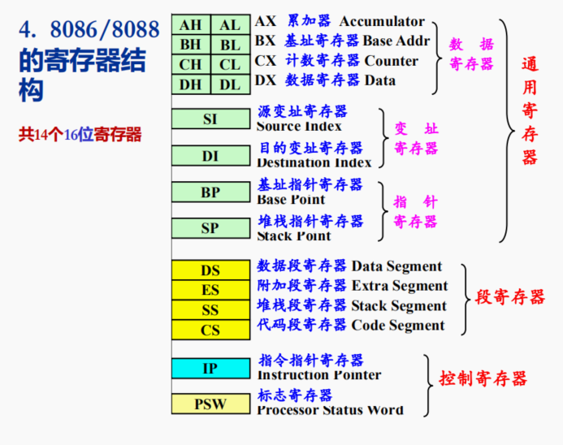


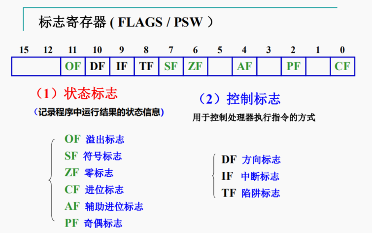
> PF(Parity Flag)奇偶标志
> TF(Trap Flag)陷阱标志

### 2.5.1 常量
- 常量表示一个固定的数值,它又分为多种形式
  - 常数
  - 字符串
  - 符号常量
  - 数值表达式

---
#### 常数
- 指由10、16、2和8进制形式表达的数值，各种进制的数据以后缀字母区分，默认不加后缀字母的是十进制数  

| 十进制 | 十六进制 | 二进制 |
| -------- | -------- | -------- |
| 由0 ~ 9数字组成，以字母D（d）结尾（缺省情况可以省略） | 由0 ~ 9、A ~ F数字组成，以字母H （h）结尾，以字母开头的常数需要加一个前导0 | 由0和1两个数字组成，以字母B（b）结尾  |
| 100，255D | 64H，0FFH，0B800H | 01100100B |

---
#### 字符串
- 字符串常量是用**单引号**或**双引号**括起来的单个字符或多个字符
- 其数值是每个字符对应的ASCII码值
- 例如
  - ‘d’（等于64H）
  - ‘AB’（等于4142H）
  - ‘Hello, Assembly !’

---
#### 符号常量
- 符号常量使用标识符表达一个数值
- 符号常量定义伪指令有“**EQU**”和“**＝**”两种：
  - 符号名 EQU 数值表达式
  - 符号名 ＝ 数值表达式
- EQU用于数值等价时**不能重复定义**符号名，但“＝”允许有重复赋值。  
  例如：
  - X= 7    ；等效于：X equ 7
  - X= X+5  ；“X EQU X+5”是错误的
- 汇编时，对EQU定义的符号名用对应的表达式进行“**替换**”。
  例如：
  ```
  NUM EQU 215 MOD 15
  ERR_MSG EQU “Data Override ”
  ```
  ```
  MESSAGE DB ERR_MSG
  ；等价于MESSAGE DB “Data Override ”
  MOV CX, NUM+1
  ；等价于MOV CX, 215 MOD 15+1
  ```

---
#### 数值表达式
- 数值表达式一般是指由**运算符**连接的**各种常量**所构成的表达式
- 汇编程序**在汇编过程中计算表达式**，最终得到一个确定的数值，所以也是常量
- 表达式的数值在程序运行前的汇编阶段计算，所以**组成表达式的各部分必须在汇编时就能确定**
- 汇编语言支持多种运算符
  - 例如:
    ```
    mov ax,3*4+5 ；等价于：mov ax,17
    ```
- 构成数值表达式可使用以下几类运算符：
  - 算术运算符   
    (+，-，*，/，mod)
  - 逻辑运算符  
    (shl, shr, and, or, xor, not)
  - 关系运算符  
    (gt, ge, eq, le, lt, ne) 
  - 地址运算符
    (seg, offset)
  - 类型运算符
    (type, length, size)


### 2.5.2 变量和符号

1. 变量的定义
2. 

3. 变量的应用

   - 变量应用举例:

   - ;代码段  
<code>
     MOV CL，BVAR             ;BVAR第1个数据送CL，（CL）=01H 

     MOV CH，BVAR+2						;BVAR第3个数据送CH，（CH）=41H 

     MOV BX，WVAR							;VAR第1个数据送BX，（BX）=0001H 

     MOV SI，WVAR+2						;WVAR第2个数据送SI，（SI）=0FFFEH（-2）

     MOV DX, WORD PTR DVAR		;DVAR第1个数据低字送DX，（DX）=0001H 

     MOV AX, WORD PTR DVAR+2	;DVAR第1个数据高字送AX，（AX）=0000H
     MOV DI, VAR1+4 					;VAR1第3个数据送WVAR第7个数据单元。

     MOV WVAR+12, DI
</code>

1. 变量的定位
- 汇编程序按照指令的先后顺序一个接着一个分配存储空间，按照段定义伪指令规定的边界定位属性确定每个逻辑段的起始位置（包括偏移地址）
- 定位伪指令ORG控制数据或代码所在的偏移地址:
  - ORG 参数
- ORG伪指令是将当前偏移地址指针指向参数表达的偏移地址。例如：
  - ORG 100h ；从100H处安排数据或程序
  - ORG $+10 ；偏移地址加10，即跳过10个字节空间 
- 汇编语言程序中，符号“$”表示当前偏移地址值
- 
## **本次课学习要求**
- 掌握：
- [ ] 数据的定义
- [ ] 常量
  - EQU
  -  数值表达式各部分必须在汇编时能够确定
- [ ] 变量的定义与使用
  - DB、DW、DD
  - DUP
  - OFFSET、SEG、PTR、ORG、’$'

---
## 2.6 8086/8088 的寻址方式

1. 指令的组成

- **操作码**说明计算机要执行的**操作**，如传送、运算、移位等操作，它是指令中不可缺少的组成部分。
  - 用一个助记符表示（指令功能的英文缩写）
  - 对应着机器指令的一个或多个二进制编码
- **操作数**是指在指令执行过程中需要处理的**对象**
  - 有些指令不需要操作数，通常的指令都有一个或两个操作数，也有个别指令有3个甚至4个操作数 
  - 可以是一个具体的数值
  - 可以是存放数据的寄存器
  - 或指明数据在主存位置的相关信息
  
**指令的助记符格式**

- 操作数2，源操作数 SRC，
  - 参与指令操作的一个对象
- 操作数1，目的操作数 DST，
  - 参与指令操作的另一个对象；
  - 同时也用来存放指令操作的结果
- 分号后的内容是对指令的解释
---
2. 8086的寻址方式
- 与数据有关的寻址方式：以 MOV 指令为例


### 2.6.1 立即寻址 —— 操作数在指令中给出

- 只能用于 SRC 字段  MOV 40H, AL  (×)
- SRC 和 DST 的字长一致 MOV AH, 3064H (×)


### 2.6.2 寄存器寻址方式 — 操作数在指定的寄存器中
- 指令格式:  
  MOV AX, BX  
  MOV AL, BH  
  MOV AX, 3064H
- 字节寄存器只有 AH AL BH BL CH CL DH DL
- SRC 和 DST 的字长一致 MOV AH, BX (×)
- CS 不能用 MOV 指令改变 MOV CS, AX (×)

### 2.6.3 直接寻址方式 — 有效地址EA由指令直接给出
- 例:  
  MOV AX, [0300H ]  
  EA=0300H, 假设(DS)=0AE8H, 那么PA=0B180H
- 隐含的段为数据段 DS
- 可使用**段超越前缀**:MOV AX, ES: [2000H]
- 操作数地址可由变量（符号地址）表示, 但要注意变量的属性:  
  VALUE DB 10  
  MOV AH, VALUE  
  MOV AX, VALUE (×)
  MOV AX, WORD PTR VALUE (√)  
  

### 2.6.4 寄存器间接寻址

### 2.6.5 寄存器相对寻址方式

### 2.6.6 基址变址寻址

### 2.6.7 相对基址变址寻址


## 2.7 8086/8088指令系统 
### 重点关注：
- 指令的汇编格式
- 指令的基本功能
- 指令支持的寻址方式
- 指令的执行对标志位的影响
- 指令的特殊要求

### 2.7.1 数据传送类指令
- 通用数据传送指令
  - MOV、PUSH、POP、XCHG
- 累加器专用传送指令
  - IN、OUT、XLAT
- 地址传送指令
  - LEA、LDS、LES
    - LEA和OFFSET操作符都可以取到有效地址,但是注意不要把二者搞混了 
- 标志寄存器传送指令
  - LAHF、SAHF、PUSHF、POPF
- 符号扩展指令
  - CBW、CWD
#### 通用数据传送指令    
- 通用传送指令包括
  - 基本传送指令:MOV
  - 堆栈指令PUSH和POP
  - 交换指令XCHG
##### 基本传送指令MOV,
- 传送指令： MOV DST, SRC
- 执行操作： (DST) <- (SRC)
- 注意:
  - DST、SRC必须有**相同的类型**，可以同是字节或字等 
  - DST、SRC **不能同时为段寄存器**
    - 硬件不支持 
    - MOV DS, ES (×)
  - **立即数不能直接送段寄存器**
    - MOV DS, 2000H (×)
  - DST 不能是立即数和CS
  - DST、SRC **不能同时为存储器寻址**
  - 不影响标志位
  - 
- MOV指令正确的数据传送方向
   
  - IP和PSW不可以寄存器寻址,二者都是控制寄存器

- 【例 2-7】数据传送
  - 

- 【例 2-8】 将存储单元3000H的一个字的内容送至4000H单元  
  - 指令  
   MOV AX,[3000H]     
   MOV [4000H],AX  
  - 也可以通过其它通用寄存器传送，但不能直接在两个存储单元间传送

- 【例 2-9】 判断指令对错，并指出错误原因。
  - 
  
##### 堆栈操作指令PUSH和POP
- 堆栈操作指令有两条(用于完成入栈和出栈操作)
  - 入栈指令PUSH
  - 出栈指令POP
- 堆栈：‘先进后出’的存储区，段地址存放在SS中，SP在任何时候都指向栈顶，进出栈后自动修改SP。
- 注意:
  - 堆栈操作**必须以字为单位** 
  - 不影响标志位
  - **不能用立即寻址方式** 
    - PUSH 1234H (×)
  - **DST不能是CS** 
      - POP CS (×)
- 堆栈段的特点：
  - 从较大地址开始分配和使用（数据段、代码段从较小地址开始分配和使用）； 
  - SP指向的存储单元称为“栈顶”，堆栈操作时，数据总是在“栈顶” 位置存入（ “压入”）、取出（ “弹出”）；
  - 最先进入的数据最后被弹出，最后进入的数据最先被弹出
    - 例：堆栈段的定义：
      -   
      - 该程序装入时，操作系统把SSEG的**段基址置入SS**，堆栈段的**字节数置入SP** ，即200（ 0C8H）
  - 如果未定义堆栈段，**用户程序装入内存时：**
    - ES, DS指向PSP;
    - SS指向用户程序区；
    - CS指向用户代码段(由END伪指令指明）；
    - (SP)=0000H, 指向64KB存储器尾部  
    - 

##### 交换指令XCHG
- 利用交换指令可方便地实现通用寄存器与通用寄存器或存储单元见的数据交换

#### 累加器专用传送指令

##### 字节转换指令XLAT(也称换码指令或查表指令)

#### 地址传送指令

### 2.7.2 算数运算类指令
- 加法指令  
  ADD、ADC、INC
- 减法指令  
  SUB、SBB、DEC、NEG、CMP
- 乘法指令  
  MUL、IMUL
- 除法指令  
  DIV、IDIV
- 十进制调整指令  
  DAA、DAS、  
  AAA、AAS、AAM、AAD
#### 加法指令
- 加法指令： ADD DST, SRC
- 执行操作： (DST) <- (SRC) + (DST)
---
- 带进位加法指令： ADC DST, SRC
- 执行操作： (DST) <- (SRC) + (DST) + CF
---
- 加1指令： INC OPR
- 执行操作： (OPR) <- (OPR) + 1
---
- 注意:**都影响状态标志位，但 INC指令不影响CF标志位**

#### 减法指令
- 减法指令： SUB DST, SRC
- 执行操作： (DST) <- (DST) - (SRC)
---
- 带借位减法指令： SBB DST, SRC
- 执行操作： (DST) <- (DST) - (SRC) - CF
---
- 减1指令： DEC OPR
- 执行操作： (OPR) <- (OPR) - 1
---
- 求补指令： NEG OPR
- 执行操作： (OPR) <- - (OPR)
---
- 比较指令： CMP OPR1, OPR2
- 执行操作： (OPR1) - (OPR2)
---
- **注意**:除DEC指令不影响CF标志(进位标志)外，均对状态标志位有影响
---
- 【例 2-17】 试分析如下指令执行结果及标志位的状态  
```
MOV BX,0 ; (BX)=0，不影响标志位
DEC BX 
; (BX)=0FFFFH，CF不影响、PF=1、AF=1、ZF=0、SF=1、OF=0
INC BX ; (BX)=0，CF不影响、PF=1、AF=1、ZF=1、SF=0、OF=0
SUB BX,1
; (BX)=0FFFFH，CF=1、PF=1、AF=1、ZF=0、SF=1、OF=0
NEG BX ; (BX)=1，CF=1、PF=0、AF=1、ZF=0、SF=0、OF=0
```

#### 乘法指令
- 无符号数乘法指令： MUL SRC
- 带符号数乘法指令： IMUL SRC
- 执行操作：
  - 字节操作数 (AX) <- (AL) * (SRC) 
  - 字操作数 (DX, AX) <- (AX) * (SRC)

- 注意:
  - **AL (AX) 为隐含的乘数。 AX (DX,AX) 为隐含的乘积。**
  - **src若为存储器操作数时，注意用ptr明确类型。**  
    如：MUL WORD PTR [BP][DI] ; 字乘，乘积送DX:AX
  - **SRC不能为立即数和段寄存器**
---
- 除CF和OF外，对其它状态标志位无定义 
- 乘法指令对 CF/OF 的影响：
  - MUL指令: CF,OF =
    - 00 乘积的高一半为零
    - 11 否则
  - IMUL指令: CF,OF =
    - 00 乘积的高一半是低一半的符号扩展
    - 11 否则
---
- 例 2-19 ： 已知（AL）=0FFH，（BL）=2，
```
MUL BL ;乘积(AX)= 01FEH,(255×2 = 510), CF=OF=1
IMUL BL ;乘积(AX)= 0FFFEH,(-1×2 = -2), CF=OF=0
```
- 对标志没有定义：指令执行后这些标志是任意的、不可预测（就是不知道是0还是1）
- 对标志没有影响：指令执行不改变标志状态
---
#### 除法指令
- 无符号数除法指令： DIV SRC
- 带符号数除法指令： IDIV SRC
- 执行操作：
  - 字节操作
    - (AL) <- (AX) / (SRC) 的商  
    - (AH) <- (AX) / (SRC) 的余数
  - 字操作
    - (AX) <- (DX, AX) / (SRC) 的商  
    - (DX) <- (DX, AX) / (SRC) 的余数

- **注意:**
  - AX (DX,AX) 为隐含的被除数寄存器。
  - AL (AX) 为隐含的商寄存器
  - AH (DX) 为隐含的余数寄存器
  - **SRC不能为立即数**
  - **对所有状态标志位均无定义。**
  - **两个N位操作数相除，应首先把被除数符号扩展为2N位。**
  - src若为存储器操作数时，注意用ptr明确类型。 
    - 如：IDIV BYTE PTR [DI] ;AX除以8 位存储器操作数 
---
- 例 2-20：已知（AX）=0410H，（BL）= 0B8H。
```
DIV BL ;商AL=05H ，余数AH=78H
IDIV BL ;商AL=F2H(即－14)，余数AH=20H(即32)
;有符号数0410H真值为1040，B8H 真值为－72。 ;注意DIV和I DIV的区别
```
---
#### 表达式计算
- 【例 2-21】X、Y、Z、V、W均为16位有符号数，计算W←(V-(X*Y+Z-1234))/X
##### 确定计算顺序如下：
1. X*Y → 暂存中间结果。
2. X\*Y+Z → X*Y+Z-1234 → 暂存中间结果。
3. V-(X\*Y+Z-1234) → (V-(X*Y+Z-1234))/X → 保存最终结果。
##### 确定各次运算的数据类型：
1. X*Y 乘积为32位。
2. X\*Y结果为32位，Z进行符号扩展成32位， X*Y+Z-1234 结果为32位。
3. X\*Y+Z-1234的结果是32位，V需扩展到32位，(V-(X\*Y+Z-1234))结果为32位，X为16位，因此，(V-(X*Y+Z-1234))/X最终结果为16位。
```
MOV AX, X 
IMUL Y ; X*Y
MOV CX, AX ; X*Y(32位)暂存入BX:CX。DX:AX需用于Z的符号扩展
MOV BX, DX
MOV AX, Z ; Z置入AX进行符号扩展至DX:AX，扩展为32位
CWD
ADD CX, AX
ADC BX, DX ; X*Y+Z
SUB CX, 1234 
SBB BX, 0 ; X*Y+Z-1234
MOV AX, V ; V置入AX进行符号扩展至DX:AX，扩展为32位
CWD
SUB AX, CX
SBB DX, BX ; V-(X*Y+Z-1234)
IDIV X ; (V-(X*Y+Z-1234))/X，商在AX中，余数在DX中。
MOV W, AX ; 保存最终结果
```
---
#### 小结
- 加法指令  
  ADD、ADC、INCo
- 减法指令  
  SUB、SBB、DEC、NEG、CMP
- 乘法指令  
  MUL、IMUL
- 除法指令  
  DIV、IDIV
- 表达式计算
- ---

### 2.7.3 逻辑运算类指令
- 逻辑运算指令  
  AND、OR、NOT、XOR、TEST
- 移位指令  
  SHL、SHR、SAL、SAR、ROL、ROR、RCL、RCR

#### 逻辑运算指令
- 逻辑非指令：NOT OPR
  - **OPR不能为立即数**
  - 执行操作： (OPR)<- $\neg(OPR)$
  - **不影响标志位**
- 逻辑与指令：AND DST, SRC
  - 执行操作： (DST) <-(DST) $\wedge$ (SRC)   
- 逻辑或指令：OR DST, SRC
  - 执行操作： (DST) <- (DST) $\vee$ (SRC) 
- 异或指令： XOR DST, SRC
  - 执行操作： (DST) <- (DST) $\forall$ (SRC)
- 测试指令： TEST OPR1, OPR2  
  - 执行操作： (OPR1) $\wedge$ (OPR2)   

| CF | OF | SF | ZF | PF | AF    |
| -- | -- | -- | -- | -- | ----- |
| 0  |  0 | *  | *  | *  | 无定义|


#### 移位指令
##### 逻辑左移 SHL OPR, CNT


---
##### 逻辑右移 SHR OPR, CNT


---
##### 算术左移 SAL OPR, CNT（同逻辑左移）
---
##### 算术右移 SAR OPR, CNT


---
##### 循环左移 ROL OPR, CNT


---
##### 循环右移 ROR OPR, CNT


---
##### 带进位循环左移 RCL OPR, CNT


---
##### 带进位循环右移 RCR OPR, CNT


---
##### **注意**
- OPR可用除立即数以外的任何寻址方式
- CNT=1，SHL OPR, 1  
  CNT>1，MOV CL, CNT  
  $\qquad$SHL OPR, CL ; 以SH  L为例
- 状态标志位：
  - CF = 移出的数值
  - OF=
    - 1 CNT=1时，最高有效位的值发生变化
    - 0 CNT=1时，最高有效位的值不变
    - **当移位次数大于1时，OF不确定**
- 移位指令： SF、ZF、PF 根据移位结果设置，AF无定义
- **循环移位指令： 不影响 SF、ZF、PF、AF**

> 逻辑左移一位相当于无符号数乘以2  
> 逻辑右移一位相当于无符号数除以2  
> 算术左移一位相当于有符号数乘以2  
> 算术右移一位相当于有符号数除以2  

---
## 2.8 转移控制类指令与分支程序设计
### 程序结构
- 顺序结构
- 循环结构
- 分支结构
- 子程序结构
> 控制转移类指令通过改变IP（和CS）值，实现程序执行顺序的改变

---
### 与转移地址有关的寻址方式  
用来确定转移控制类指令的转向地址（目标地址）。
- 直接寻址方式(用标号表达)   
  - 指令代码中直接给出地址差（即目的地址**相对**于当前IP的位移量），转移到的目的地址（转移后的IP值）就是当前IP值加上位移量 
- 间接寻址方式(用寄存器或存储器操作数表达)
  - 指令代码中指示寄存器或存储单元，目的地址从寄存器或存储单元中**间接**获得 

---
### 目标地址的寻址范围：段内寻址
- 段内转移--近转移（near）
  - 在当前代码段64KB范围内转移（±32KB范围） 
  - 不需要更改CS段地址，**只要改变IP偏移地址**
- 段内转移——短转移（short）
  - 转移范围可以用一个字节表达，在段内－128～＋127范围的转移 

---
### 目标地址的寻址范围：段间寻址
- 段间转移——远转移（far）
  - 从当前代码段跳转到另一个代码段，可以在1MB范围 
  - 需要更**改CS段地址和IP偏移地址**
  - 目标地址必须用一个32位数表达，叫做32位远指针，它就是逻辑地址
  - > 实际编程时，汇编程序会根据目标地址的 段属性，**自动处理**成短转移、近转移或远转移
  - > 程序员可用操作符short、near ptr 或far ptr 强制成为需要的转移类型

---
### 控制转移指令
- 无条件转移指令  
  JMP
- 条件转移指令  
  JZ / JNZ 、 JE / JNE、 JS / JNS、 JO / JNO、JP / JNP、 JB / JNB、 JL / JNL、 JBE / JNBE、JLE / JNLE、 JCXZ
- 循环指令  
  LOOP、LOOPZ / LOOPE、LOOPNZ / LOOPNE
> 8086系统中条件转移类指令和循环指令都只支持段内短转移
- 子程序调用和返回指令  
  CALL、RET
- 中断与中断返回指令  
  INT、INTO、IRET
> 之前学习的指令还会注意指令对标志位的影响  
> 这里还要看这些指令是如何修改CS:IP的值的

- 2-21 设
  ```
  (CS) = 3000H,
  (DS) = 2000H,
  (BX) = 0030H,
  (SI) = 0202H,
  (20232H) = 00H,
  (20233H) = 06H,
  ```
  分别执行下述两条指令后,实际转移的目标地址物理地址多少?
  - JMP BX
    - 相当于 IP<-BX 
      - > 注意IP不能作为MOV指令的操作数 
    - 目标物理地址是30030H
    - > CS的3和IP的0030H
  - JMP Word PTR[BX+SI]
    - 相当于 IP<-Word PTR[BX+SI]
    - 存储器寻址方式里的基址变址寻址
    - > 除了逻辑地址计算是在20位地址加法器里计算的,其他都是在ALU里计算的
    - > 有效地址的计算在ALU中计算,只能留16位
    - BX+SI=0232H 
    - 默认采用DS所以就是20232H取一个Word,即为0600H
    - 30600H
      - > CS的3和IP的0600H 

---
### 无条件转移指令
```
JMP OPR ；程序转向OPR指定的地址
```
- 只要执行JMP指令，就使程序转到指定的目标地址处，从目标地址处开始执行那里的指令
- 操作数OPR是要转移到的**目标地址**
- JMP指令分成4种类型
  - 段内转移、直接寻址
  - 段内转移、间接寻址
  - 段间转移、直接寻址
  - 段间转移、间接寻址

---
#### jmp 示例
```
        jmp again      ；转移到again处继续执行
        ……
again:  dec cx         ；标号again的指令
        ……
        jmp output     ；转向output
        ……
output: mov result,al  ；标号output的指令
```

---
### 条件转移指令  
条件转移指令Jcc根据指定的条件确定程序是否发生转移
```
Jcc label ；条件满足,发生转移
          ；IP←IP＋8位位移量；
          ；否则，顺序执行
```
- label是一个标号、一个8位位移量
- Jcc**只支持短转移**

---
#### Jcc指令的分类
- Jcc指令不影响标志位，但要利用标志位
- 根据利用的标志位不同，分成4种情况：
  - 判断单个标志位状态
  - 比较无符号数高低
  - 比较有符号数大小
  - 测试 CX 的值为 0 则转移
- > Jcc指令实际虽然只有16条，但却有30个助记符
- > 采用多个助记符，目的是为了方便记忆和使用

#### 根据单个条件标志的设置情况转移
| 格式 | 测试条件 |
| ---- |---- |
| JZ(JE) OPR | ；ZF = 1 |


#### 例
设字符的ASCII码在AL寄存器中,将字符加上奇校验位;(字符ASCII码中"1"的个数已为奇数时,则令其最高位为"0";否则令最高位为"1")
```
      and al,fh   ;最高位置"0",同时判断"1"的个数
      jnp next    ;个数已为奇数,则转向next
      or al,80h   ;否则,最高位为"1"
next: ...
```

---
# 第3章 汇编语言程序设计

---
## 3.2分支程序设计
- 根据条件是真或假决定执行与否
  - 判断的条件：各种指令(如CMP、TEST等)执行后形成的状态标志
- 分支控制  
  转移指令Jcc和JMP可以实现
- 分支结构有
  - 单分支结
  - 双分支结构
  - 多分支结构

### 3.2.1 单分支结构
- 条件成立跳转，否则顺序执行分支语句体
- 注意选择正确的条件转移指令和转移目标地址

---
#### 例:计算AL中有符号数的绝对值
```
        cmp al,0
        jge nonneg ；条件满足（AL≥0），转移
        neg al ；条件不满足，求补
nonneg: mov result,al ；条件满足
```
```
        ；不恰当的分支
        cmp al,0
        jl yesneg ；条件满足（AL＜0），转移
        jmp nonneg
yesneg: neg al ；条件满足，求补
nonneg: mov result,al ；条件不满足
```

---
### 3.2.2 双分支结构
- 条件成立跳转执行第2个分支语句体，否则顺序执行第1个分支语句体
- 注意第1个分支体后一定要有一个**JMP指令**跳到第2个分支体后

---
#### 【例 3-3】显示BX的最高位
```
      shl bx,1    ；BX最高位移入CF标志
      jc one      ；CF＝1，即最高位为1，转移
      mov dl,30h  ；CF＝0，即最高位为0：DL←30H＝‘0’
      jmp two     ；一定要跳过另一个分支体
one:  mov dl,31h  ；DL← 31H＝‘1’
two:  mov ah,2
      int 21h     ；显示
```

```
;显示BX的最高位（另解1）
      shl bx,1    ；BX最高位移入CF标志
      jnc one     ；CF＝0，即最高位为0，转移
      mov dl,31h  ；CF＝1，即最高位为1：DL←31H＝‘1’
      jmp two     ；一定要跳过另一个分支体
one:  mov dl,30h  ；DL← 30H＝‘0’
two:  mov ah,2
      int 21h     ；显示
```


---
#### 2-22
编写指令序列,实现下述要求:
- 测试BX中的位0和位4,当这两位同时为零时,将AL各位置1,否则AL各位置0;
```
      TEST BX,0011H
      JZ NEXT
      XOR AL,AL     ;AL清0
      JMP OVER
NEXT: MOV AL,0FFH   ;AL置1
OVER: ......
```


---
## 3.3 循环程序设计
- 3.3.1 计数循环
- 3.3.2 条件循环
- 3.3.3 多重循环

---
### 1. 循环指令
- 注意：
  - CX 中存放循环次数
  - 只能使用段内直接寻址的8 位位移量  
    ```
    LOOP
    LOOPZ / LOOPE
    LOOPNZ / LOOPNE
    ```
- 执行步骤：
  - (1) (CX) ← (CX) - 1
  - (2) 检查是否满足测试条件
    - 如满足则(IP) ← (IP) + 8位位移量，实行循环；
    - 不满足则 退出循环，顺序执行。 

- 循环指令：LOOP OPR
  - 测试条件：(CX) != 0
- 为零或相等时循环指令：LOOPZ(LOOPE) OPR
  - 测试条件：ZF=1 且 (CX) != 0
- 不为零或不相等时循环指令：LOOPNZ(LOOPNE) OPR
  - 测试条件：ZF=0 且 (CX) != 0
---
- LOOP AGAIN <-> DEC CX JNZ AGAIN
---
```
    MOV CX, 10
L1: ……. ; 需要重复执行的若干条指令
    ……
    LOOP L1
```
- 上面的程序将L1到LOOP指令之间的一段程序重复执行10次。指令“MOV CX, 10”称为“装载循环计数器”, 在循环之前完成。
- 如果将上面的程序写成如下的情形：
  ```
  L1: MOV CX, 10
      ……. ; 重复执行的若干条指令
      …… LOOP L1
  ```
  这个程序将无限制地运行下去，称为“死循环”。
---
- 循环结构也称“重复结构”，一般由以下4个部分组成：
  - （1）初始化部分：为循环做准备。
    - 如：累加器清零，设置地址指针和计数器的初始值等。
  - （2）工作部分：实现循环的基本操作。
  - （3）修改部分：修改指针、计数器的值，为下一次循环做准备。
  - （4）控制部分：判断循环条件，确定结束或继续循环。

---
#### 两种结构的循环：
- WHILE循环：
  - 先判断循环条件，条件满足则进入循环
  - 循环次数最少为0次。
- DO-WHILE循环：
  - 先执行工作部分，然后判断循环条件，条件满足则转向工作部分继续循环
  - 循环次数最少1次。
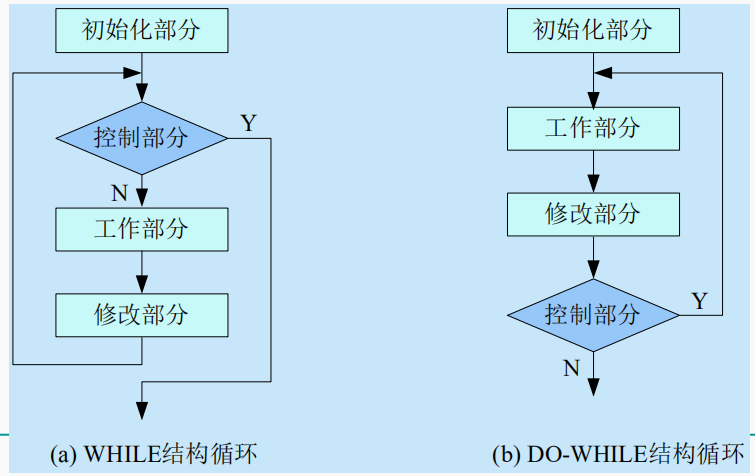

- 按照循环结束的条件，有以下两类循环：
  - 计数循环：**循环的次数事先已知**，用一个变量（寄存器或存储器单元）记录循环的次数（称为“循环计数器”）。
  - 条件循环：**循环的次数事先并不确定**，根据某个条件是否满足来决定是否继续循环。

---
### 3.3.1 计数循环  
用循环计数器的值来控制循环，也可以结合其它条件共同控制。
- 【例 2-31】编程计算1+2+3+…+100=？ 结果保存到字变量SUM中。
  ```
        XOR AX,AX     ;累加器清零
        MOV BX,0001H  ;BX←1
        MOV CX,100    ;CX←循环次数100
  AGAIN:ADD AX,BX     ;AX←(AX)+(BX)
        INC BX        ;BX←(BX)+1
        LOOP AGAIN    ;未循环结束，则继续
        MOV SUM,AX    ;循环结束，保存结果
  ```

---
- 【例 3-7】 字节数组ARRAY存放有10 个有符号数，找出最大数送字节变量MAX。


---
### 3.3.3 多重循环
#### 例3-10 冒泡排序
```
DATA SEGMENT
	ARRAY1 DB 15H, 0A7H, 34H, 55H, 90H, 7EH, 3CH, 25H, 56H, 0D6H
	N EQU $ - ARRAY1
DATA ENDS
CODE SEGMENT
  ASSUME CS:CODE, DS:DATA
START:  MOV AX, DATA
        MOV DS, AX
; **** 开始排序 ****
        MOV CX,N-1  ; 设置外层循环计数器,CX中为排序的"遍数"  (N-1)
; ==== 外层循环循环体开始 ====
LOOP1:  PUSH CX     ; 保存外循环计数器
        MOV BX, 0   ; BX=整序元素在数组内的位移,每一遍从第一个元素开始
; ---- 内层循环循环体开始,CX的值是内层循环的次数 ----
LOOP2:  MOV AL, ARRAY1[BX]
        CMP AL, ARRAY1[BX+1] ; 邻元素比较
        JLE NEXT    ; 不需要整序,转NEXT
        XCHG AL,ARRAY1[BX+1]; 交换相邻元素位置
        XCHG AL,ARRAY1[BX]
NEXT:   INC BX      ; 修改指针
        LOOP LOOP2  ; 本遍未结束,转LOOP2继续
; ---- 内层循环循环体结束 ----
        POP CX      ; 恢复外层循环计数器
        LOOP LOOP1  ; "遍数"未满,转LOOP1继续
; ==== 外层循环循环体结束 ====
        MOV AX,4C00H
        INT 21H
CODE ENDS
  END START   
  
```
---
## 3.4 子程序设计
### 3.4.1 子程序的编写与应用
#### 1. 子程序调用与返回指令
- 子程序是完成特定功能的一段程序
- 当主程序（调用程序）需要执行这个功能时，采用CALL调用指令转移到该子程序的起始处执行
- 当运行完子程序功能后，采用RET返回指令回到主程序继续执行
- > 转移指令有去无回
- > 子程序调用需要返回，其中**利用堆栈保存返回地址** 

---
#### 主程序与子程序
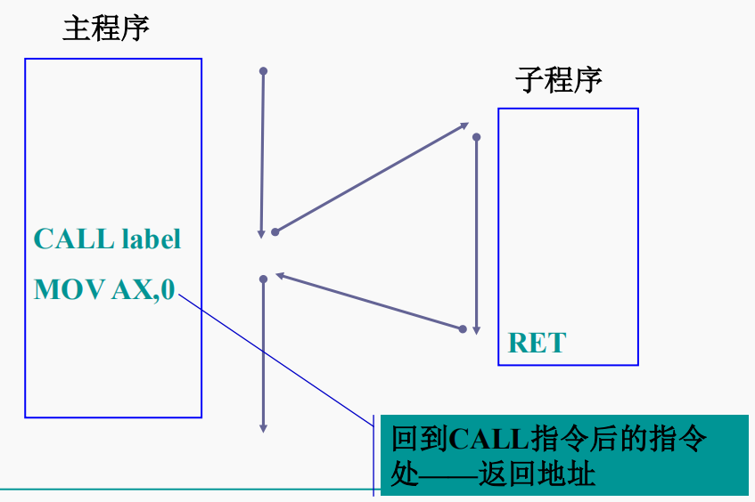

---
#### 子程序定义
- 子程序定义伪操作
  ```
  子程序名 PROC 属 性
  …… ; 子程序体
  子程序名 ENDP
  ```
- 子程序名： 子程序入口的符号地址。子程序名应为合法的标识符，**子程序名不能与同一个源程序中的标号、变量名、其它子程序名相同。**
- 属 性：类型 属 性（NEAR、FAR）
  - **NEAR**： 调用程序和子程序在同一个代码段中（段内调用），缺省为NEAR属性，可以省略。
  - **FAR**：调用程序和子程序不在同一个代码段中（段间调用）

---
#### 近程子程序  
（属性为NEAR 型）
  - **只能被同一个代码段里的程序调用**的子程序。
  - 由于主程序和子程序处于同一个代码段，调用和返回时**只需要改变IP寄存器的值**，CS寄存器的值保持不变。
  - 近程子程序的**入口地址用16位段内偏移地址表示**。

---
#### 远程子程序：   
（属性为FAR 型）
  - **能够被不同代码段的程序调用，也能被同一代码段的程序调用的子程序。** 
  - 调用这样的子程序时，**需要同时改变CS和IP寄存器的值**，返回时，需要从堆栈里弹出32位的返回地址送入IP，CS寄存器。
  - 远程子程序的入口地址用**16位段基址和16位段内偏移地址**表示

---
#### 子程序调用和返回指令
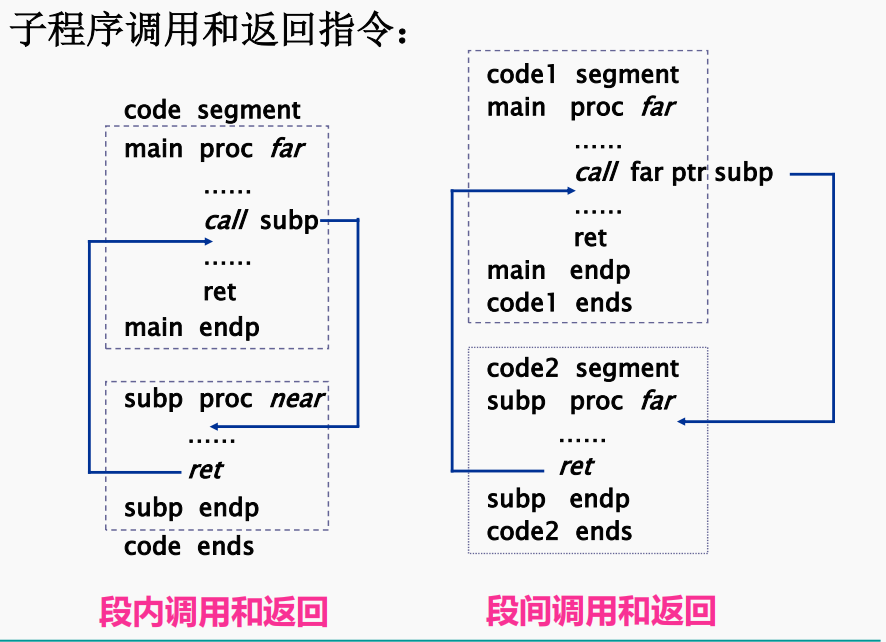


---
## 2.11 中断指令与系统功能调用
### 1. 中断指令和系统功能调用
- 中断（Interrupt）是又一种改变程序执行顺序的方法
- 8086/8088 CPU支持256个中断，每个中断用一个编号（中断向量号）区别
- 中断指令有3条：  
  INT IRET INTO
- 要求掌握中断调用指令**INT** ，进而掌握**系统功能调用**
- 中断向量：  
  中断服务程序的入口地址，存放于中断向量表区。
  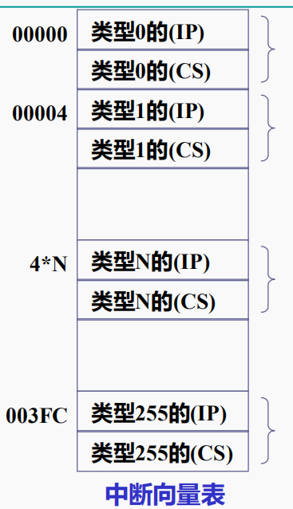
- 中断指令：  
   INT TYPE
  - 执行操作：  
    ```
    (SP) ← (SP) - 2
    ( (SP)+1,(SP) ) ← (FLAGS)
    (SP) ← (SP) - 2
    ( (SP)+1,(SP) ) ← (CS)
    (SP) ← (SP) - 2
    ( (SP)+1,(SP) ) ← (IP)
    (IP) ← (TYPE*4)
    (CS) ← (TYPE*4+2)
    ```
  - 注意：
    - **TYPE (0~255)** 是中断类型号。根据TYPE ，在中断向量表中找到它所对应的中断向量，即得到所要执行的程序段的段基地址：段偏移地址
    - INT 指令还把 IF 和 TF 置0，但不影响其它标志位
- 中断返回指令：**IRET**
  - 执行操作：  
    ```
    (IP) ← ( (SP)+1,(SP) )
    (SP) ← (SP) + 2
    (CS) ← ( (SP)+1,(SP) )
    (SP) ← (SP) + 2
    (FLAGS) ← ( (SP)+1,(SP) )
    (SP) ← (SP) + 2
    ```
    - 注意：
      - IRET 指令执行完，标志位由堆栈中取出的值确定

---
### 2. 基本I/O功能调用
- DOS系统功能调用
  - DOS利用**21H号**中断提供给用户近百个系统功能，主要包括设备管理、目录管理和文件管理三个方面的功能
- ROM-BIOS系统功能调用
  - ROM-BIOS也以中断服务程序的形式，向程序员提供系统的基本输入输出程序
  - ROM-BIOS功能更加基本，且与操作系统无关
  - 当DOS没有启动或不允许使用DOS功能调用时，可以使用ROM-BIOS功能调用

---
#### BIOS和DOS基本调用
调用方法：
1. 将**调用参数**装入**指定的**寄存器中；
2. BIOS或DOS**功能号**装入**AH**；
3. 如需**子功能号**，把它装入**AL**；
4. 按中断号**调用**DOS或BIOS中断(**INT**);
5. 检查或取得**返回参数**。
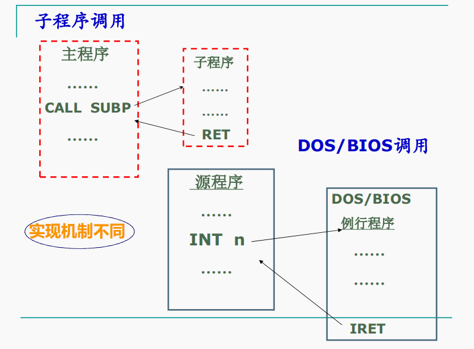
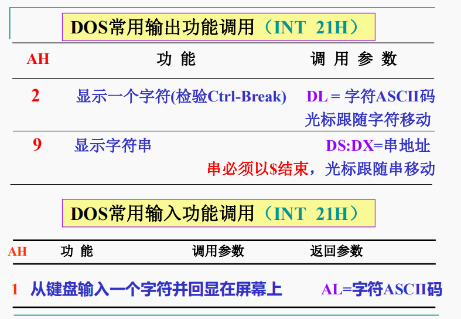

---
- （1）输出单个字符显示
  ```
  DL ← 待输出字符的ASCII代码
  AH ← 02H
  INT 21H
  DL ← 待输出字符的ASCII代码
  AH ← 02H
  INT 21H
  ``` 
  - 例：下面的程序在显示器上输出数字字符“9”：
    ```
    MOV AH, 2 ；功能号02H
    MOV DL, 39H ；字符“9”的ASCII代码
    INT 21H ；调用21H号系统服务程序
    ```
    - 字符“9”显示在光标(Cursor)位置，光标向右移动一个字符位置。
  - X为DB定义的一个变量，下面的程序能够输出X的值吗？
    ```
    MOV AH, 2 ；功能号02H装入AH寄存器
    MOV DL, X ；变量X的值装入DL寄存器
    INT 21H ；调用21H号系统服务程序
    ```
  - [例] 在显示器上输出文字“Hello !”
    ```
    CODE SEGMENT
          ASSUME CS: CODE
    START:LEA BX, STRING
          MOV CX, 7
    ONE:  MOV DL, CS: [BX] ；取出一个字符的ASCII代码
          MOV AH, 2 ；单个字符输出的功能号
          INT 21H ；调用系统服务，输出一个字符
          INC BX ；修改指针
          LOOP ONE ；计数与循环控制
          MOV AX, 4C00H
          INT 21H
    STRING DB “Hello !”
    CODE ENDS
          END START
    ``` 
  - STRING在代码段里定义，取字符需要增加段跨越前缀“CS: [BX]”，否则会到“DS: [BX]”处取字符，输出不确定的内容。
  - 代码为0DH的字符称为“回车（Carriage Return, CR）”，把光标移动到本行的第一个字符位置，
  - 代码为0AH的字符称为“换行（Line Feed, LF）”，把光标移动到下一行的相同位置上
    ```
    MOV CX, 11  
    ……
    STRING DB 0DH, 0AH, “Hello !”, 0DH, 0AH
    ```
---
- （2）输出一个字符串
  ```
  DS: DX ← 待输出字符串的首地址
  AH ← 09H
  INT 21H
  ```
  字符串以字符“$”为结束标志，该字符本身不输出。
  ```
  CODE SEGMENT
        ASSUME CS: CODE, DS: CODE
  START:MOV AX, CODE
        MOV DS, AX
        LEA DX, STRING
        MOV AH, 9
        INT 21H
        MOV AX, 4C00H
        INT 21H
        STRING DB 0AH, 0DH, “Hello !”, 0AH, 0DH, ‘$’
  CODE ENDS
        END START
  ```
  - [例] 从键盘输入5个数字（0到9之间），求它们的和，存入SUM。
    ```
    DATA SEGMENT
      SUM DB ?
    DATA ENDS
    ； --------------------------------------------- 
    CODE SEGMENT
          ASSUME DS: DATA, CS: CODE
    START:MOV AX, DATA
          MOV DS, AX
          MOV CX, 5   ；循环次数
          MOV SUM, 0  ；累加器清零
    ONE:  MOV AH, 1   ；输入单个字符的功能号
          INT 21H     ；输入一个字符，ASCII码在AL中
          AND AL, 0FH ；ASCII码转换成二进制数
          ADD SUM, AL ；累加
          LOOP ONE    ；计数与循环
          MOV AX, 4C00H
          INT 21H
    CODE ENDS
          END START
    ```
  ---
  - 2-28 试编写一个汇编语言程序,要求将键盘输入的小写字母用大些字母显示出来
    ```
    CODE SEGMENT
        ASSUME CS:CODE
    START:MOV AH,01H
          INT 21H
          CMP AL, 0DH   ; 输入回车退出程序
          JZ EXIT 
          CMP AL, 'a'   ; 小于小写字母a,不需要处理
          JB EXIT
          CMP AL, 'z'   ; 大于小写字母z,也不需要处理
          JA EXIT
          SUB AL, 20H   ; 是小写字母,则转换为大写
          MOV DL, AL
          MOV AH, 02H
          INT 21H
          JMP START
    EXIT: MOV AX, 4C00H
          INT 21H
    CODE ENDS
          END START
    ```

---
### 小结
- 中断与中断返回指令
  - INT、IRET
- 常用DOS功能调用（ **INT 21H**） 
  - 字符输入：1号调用
  - 字符输出：2号调用
  - 字符串输出：9号调用

---
## 10.19随笔
- BP指令默认访问堆栈段
- 8086中push指令不支持立即数寻址
  - push指令不可与offset混用
  
## 10.28随笔
- 奇地址连高8位
- 偶地址连低8位


---
# 第4章 16位微处理器的外部特性

---
## 基本I/O接口
### 本讲内容
- I/O接口电路的典型结构
- I/O端口编址及I/O指令
- I/O数据传输：无条件传输、查询传输、中断传输、DMA传输

---
### I/O接口概述
- 为什么需要I/O接口（电路）？
  - 微机的外部设备多种多样
    - 输入设备
      - 键盘、鼠标、扫描仪…
    - 输出设备
      - 显示器、打印机、绘图仪…
    - 复合输入输出设备
      - 外存储设备
  - 工作原理、驱动方式、信息格式、以及工作速度方面彼此差别很大
  - 因此，它们不能与CPU直接相连，必须经过中间电路再与系统相连，这部分电路被称为**I/O接口电路**

---
- 什么是I/O接口（电路）？
  - I/O接口是**位于系统与外设间、用来协助完成数据传送和控制任务的逻辑电路**
  - PC机系统板的可编程接口芯片、I/O总线槽的电路板（适配器）都是接口电路
  - 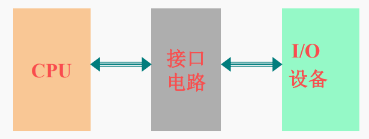

---
- 输入输出要解决的问题
  - 1）找出要进行信息交换的外设
  - 2）协调主机与外设的工作速度
  - 3）了解外设的工作情况
  - 4）向外设发送控制命令

---
### 1.接口的基本功能
- 寻址功能
  - 对接口寄存器进行寻址。（地址译码器）
- 数据缓冲
  - 解决速度匹配问题（数据缓冲寄存器）
    - 输出接口有**锁存环节**；输入接口有**缓冲环节**
      - 保证信息的可靠输入输出
    - 实际的电路常见：**输出锁存缓冲环节**、**输入锁存缓冲环节**
- 控制功能
  - 接收主机命令并提供外设状态（命令／状态寄存器）
  - 根据主机发来的控制命令和外设的状态对接口线路实现控制（控制电路）
- 数据格式转换功能
- 提供主机和I/O所需的驱动能力和工作电平
> 注：某个接口可能具有以上的一种或者多种功能。
  
---
#### 输出接口的锁存环节
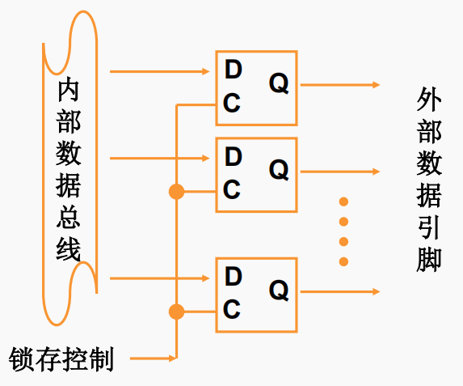
#### 输出接口的锁存缓冲环节
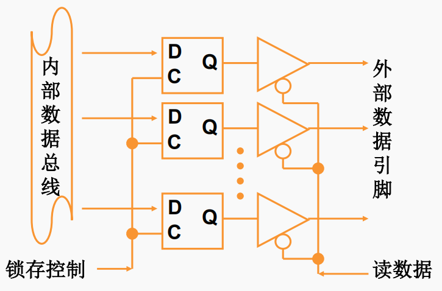
#### 输入接口的缓冲环节
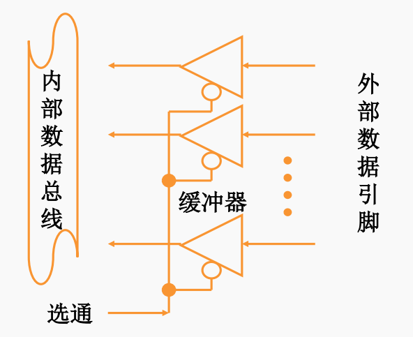
#### 输入接口的锁存、缓冲环节
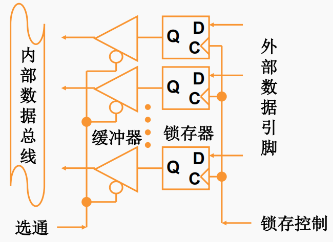

---
### 2.I/O接口的组成
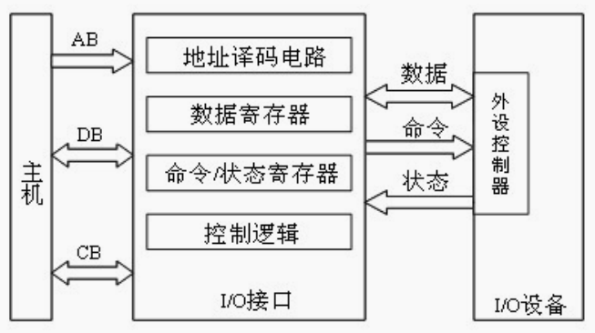
- I/O接口内的各类寄存器也称为**端口**
  - 数据端口可分为数据输入端口和数据输出端口
  - 命令/状态端口可分为单独的命令端口和状态端口
  - > 数据口是指数据**端口**是指IO接口中的数据寄存器
- 主机与I/O接口间的信息均通过**数据总线**传输
  - 三种信息：数据信息、状态信息、控制（命令）

---
#### 注意区分I/O**接口**和I/O**端口**
- 外部设备与主机的通信是通过I/O**接口**进行的，每个接口包括一组寄存器。
- **接口内能够被CPU直接访问的寄存器**，称为“**I/O端口**”。用于在CPU与外部设备之间传递信息。
- CPU通过**地址**来区分和访问不同的I/O端口
- 8086 / 8088 的 I/O地址空间独立于内存，仅使用低16位地址线寻址 ：
  - 0000H ~ FFFFH（64KB）
  - 系统总线20根只用了低16位,高4位是没有使用的


---
### 3. I/O端口的编址
- 不同计算机系统，I/O端口有两类处理形式
  - **I/O端口独立编址**
    - I/O地址空间独立于存储地址空间
    - 如8086/8088
    - 通用PC机一般都是采用独立编址的
  - **I/O端口与存储器统一编址**
    - I/O端口与存储器共享一个地址空间
    - 如M6800

---
####  1) I/O端口单独编址
I/O端口有独立的地址空间。
- 使用专门的I/O指令，如IN、OUT指令
- 主存和I/O分开的读、写控制信号线
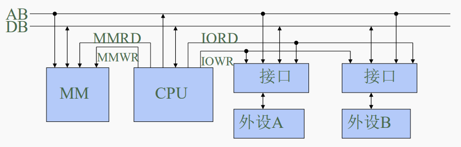
- 优点：
  - I/O端口的地址空间独立
  - 控制和地址译码电路相对简单
  - 专门的I/O指令使程序清晰易读
- 缺点:
  - I/O指令没有存储器指令丰富
  - I/O端口和存储器分开译码，增加了硬件开支
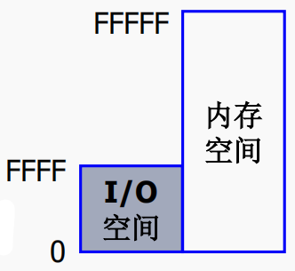
> 80x86采用I/O端口独立编址

---
#### 接口寻址
#### 2) 与存储器统一编址
- 对I/O接口寄存器访问就同访问主存单元一样。
- 特点：
  - 指令系统中不设专门的I/O指令
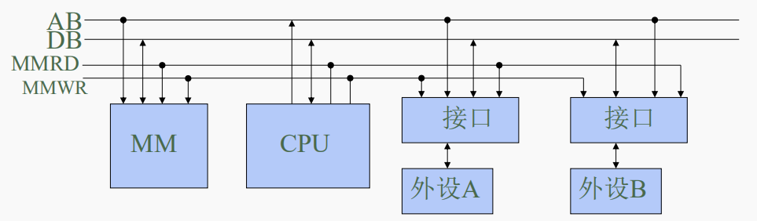
- 优点：
  - 不需要专门的I/O指令
  - I/O数据存取与存储器数据存取一样灵活
- 缺点：
  - I/O端口要占去部分存储器地址空间
  - 程序不易阅读
    - （不易分清访存和访问外设）
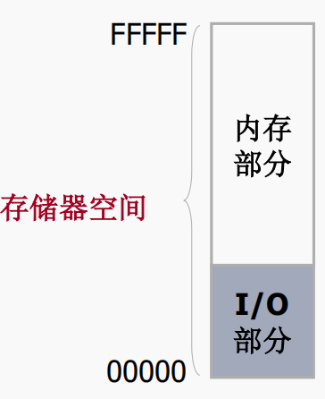
> 注：嵌入式系统常采用统一编址方式，通用计算机常采用独立编址方式


---
### 4. 接口电路的外部特性
- 主要体现在引脚上，分成两侧信号
  - 面向CPU一侧的信号：
    - 用于与CPU连接
    - 主要是数据、地址和控制信号
  - 面向外设一侧的信号：
    - 用于与外设连接
    - 提供的信号五花八门
    - 功能定义、时序及有效电平等差异较大


---
### 5. 接口电路的可编程性
- 许多接口电路具有多种功能和工作方式，可以通过编程的方法选定其中一种
- **接口需进行物理连接，还需编写接口软件**
- 接口软件有两类：
  - 初始化程序段
    - 设定芯片工作方式等
  - 数据交换程序段
    - 管理、控制、驱动外设，负责外设和系统间信息交换


---
### 6. 接口的类型
- 按数据传送格式
  - 并行接口
  - 串行接口
- 按**主机访问外设**的控制方式
  - 程序查询接口
  - 程序中断接口
  - DMA接口
    - > 因为课时缩减的缘故就不讲了,了解即可
  - 通道控制器接口
    - > 因为课时缩减的缘故就不讲了,了解即可
- 按功能选择的灵活性
  - 可编程接口
  - 不可编程接口
- 按通用性
  - 通用接口
  - 专用接口
    - 最典型的就是显卡,网卡


---
### 7. 8086/8088的输入输出指令
- 输入指令
  - IN：将外设数据传送给CPU内的AL/AX
    - > 注意:8086从外设读数据只能送到AL,AX,不能送到其他寄存器
  - ```
    IN AL/AX, i8/DX ;字节/字输入
    ```
- 输出指令
  - OUT：将CPU内的AL/AX数据传送给外设
    - > 8086送给外设的数据也必须先存到AL/AX
  - ```
    OUT i8/DX, AL/AX ;字节/字输出
    ```
- 8086/8088端口有64K个，无需分段，有两种寻址方式
  - **直接寻址**：
    - 只用于寻址00H ~0FFH前256个端口，
    - 操作数i8表示端口号
  - **间接寻址**：
    - 可用于寻址全部64K个端口，
    - **DX**寄存器的值就是端口号
  - **对大于0FFH的端口只能采用间接寻址方式**

---
#### IN指令实例(从20H端口输入一个字)
```
；方法1：直接寻址，字量输入
in ax,20h
```
```
；方法2：间接寻址，字量输入
mov dx,20h
in ax,dx
```
- 端口的间接寻址不用[]
- 存储器寻址只能用BX(基址寄存器),BP(基址指针寄存器),SI(源变址寄存器),DI(目的变址寄存器)


```
；方法3：直接寻址，字节量输入
in al,21h
mov ah,al
in al,20h
```
```
；方法4：间接寻址，字节量输入
mov dx,21h
in al,dx
mov ah,al
dec dx
in al,dx
```

---
#### OUT指令实例（向300H端口输出一个字节）
```
；唯一的方法：间接寻址，字节量输出
mov al,bvar ；bvar是字节变量
mov dx,300h
out dx,al
```
- 送之前一定要设置好AL


---
### 8. I/O地址的译码
#### 作用
- 根据主机发送过来的端口地址信息、端口读写控制信号产生各个端口的控制信号。
  - 输入端口
    - 生成输入使能控制信号 
  - 输出端口
    - 生成锁存控制信号
- 每个接口电路通常只占用几个I/O地址，这时可以利用基本逻辑门电路进行地址译码。
- 除采用译码器、门电路进行译码外，I/O地址译码还经常采用可编程逻辑器件PLD。

----
#### 译码器74LS138
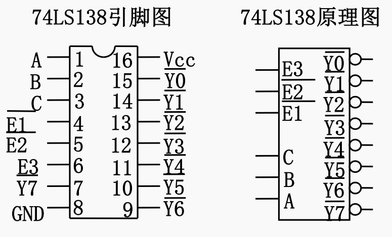
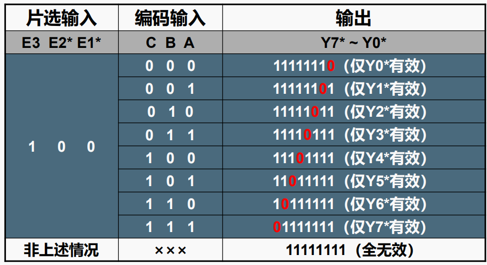

----
#### （1）8088系统中地址译码电路举例
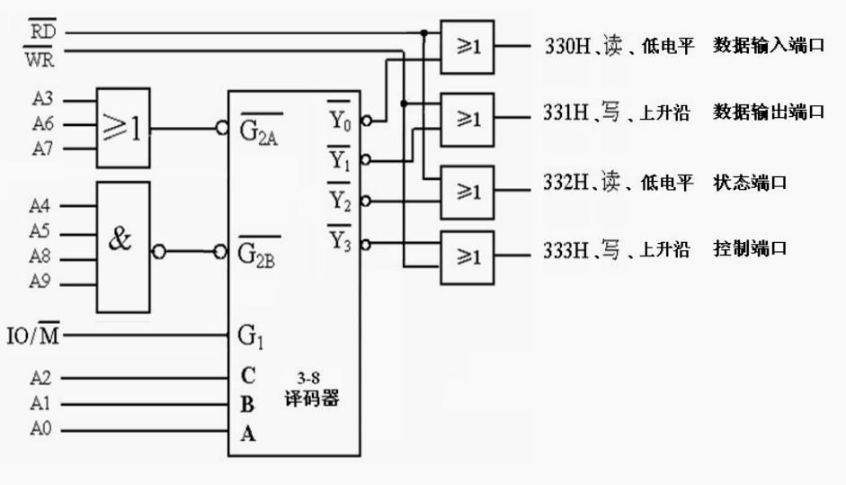
- 思考
  - 各端口的地址、可读写性、端口控制信号的有效状态？

---
##### 两个端口可以共用一个端口地址
- 由于读、写操作不会同时进行，一个输入端口和另一个输出端口可以使用同一个地址
- 例如，在上例中可安排
  - 数据输入端口、数据输出端口使用同一个地址330H
  - 命令端口和状态端口共同使用地址331H。  
  - 译码电路如下
  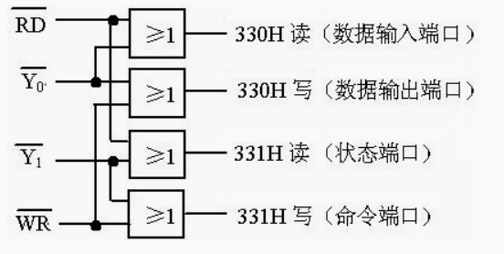 

- > 共享端口的其他方式
  - 利用顺序的不同实现共享
    - 以后会讲 

#### （2） 端口的读写控制
##### 一、8位端口的读操作
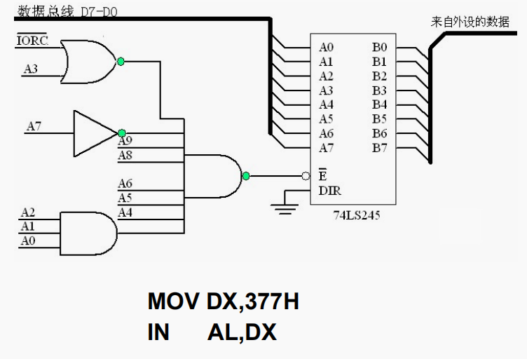
- 输入口可以用IN指令访问
  - 给数据和地址

---
##### 二、 8位端口的写操作
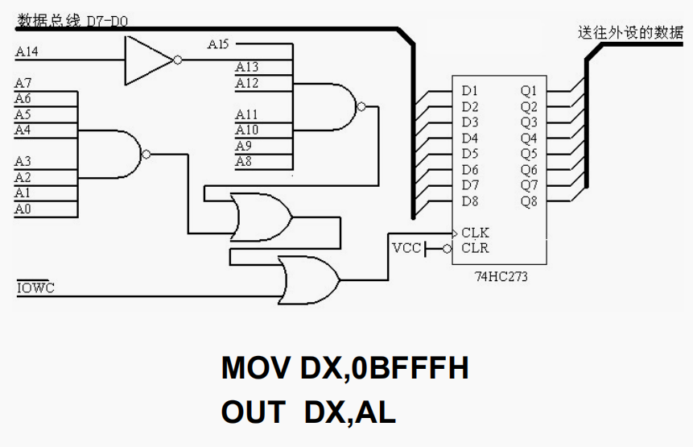
- 273内部是8个D触发器
  - 8位锁存器

---
##### 三、8086系统中16位端口的读操作
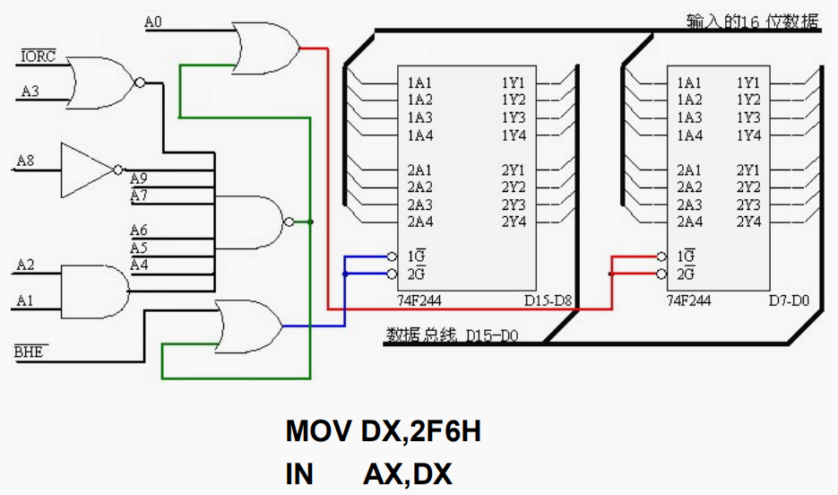
> 244上面都是三态门

---
### 9. I/O 数据传送方式
- 程序控制下的数据传送
  - 通过CPU执行程序中的I/O指令来完成I/O数据传送
  - **无条件传送、查询传送、中断传送**
- 直接存储器存取（DMA）
  - DMAC控制，外设直接和存储器进行数据传送
  - 适合进行大量、快速数据传送
- 通道方式

#### (1)无条件传送方式及其接口
- 定义：
  - CPU与慢速设备交换数据，可以认为他们总是处于"就绪"状态，随时可以进行数据传送
  - 这种传送就是无条件传送 
    - 也称直接控制方式，或立即传送，或同步传输
- 适合简单设备
  - 如LED数码管，按键或按钮等
- 传送前提
  - 外设必须随时就绪
- 无条件传送的借口和操作均十分简单
- CPU随时可通过IN，OUT指令访问数据端口
- 
```
next: mov dx,0100h
      in al, dx。   ; DX指向数据端口
      out dx, al。  ; 送输出端口
      jmp next      ; 重复
```
> 注： 数据输入端口和数据输出端口共用一个地址

---
#### （2）查询传输方式及其接口
- CPU需要先了解（查询）外设的工作状态，然后在外设可以交换信息的情况下（就绪）实现数据输入或输出
- 对多个外设的情况，则CPU按一定顺序依次查询（轮询）。先查询的外设将优先进行数据交换
- **也称异步传输或条件传输**

- 查询传输的两个环节
  - 查询环节
    - 寻址状态口
    - 读取状态寄存器的标志位
    - 若不就绪就继续查询，直至就绪
  - 传送环节
    - 寻址数据口
    - 输入
      - 通过输入指令从数据端口读如数据
    - 输出
      - 通过输出指令想数据端口输出数据
---
- 多台外设轮流查询的流程
  - 
  - 当查询某外设未就绪，不应继续查询该设备而应该查询下一个设备，使得CPU为各个外设服务的几率均衡

---
- 查询方式的输入接口
  - 一般的内部结构
    - 
    
---
- 查询式输入接口内部构造说明
  - 接口内有两个端口
    - 数据端口（8位，输入）
    - 状态端口（1位， 输入， 链接在D7上， =1表示有数据）
  - 选通信号有2个作用：
    - 将外设的数据送到接口的锁存器中
    - 使接口中的D触发器置"1"（READY = 1）
  - 数据信息和状态信息从不同端口经过数据总线送到CPU

---
- 查询式输入程序设计
```
; 如下程序输入1个字节
status:
        mov dx, 0102h  ; DX指向状态端口
	in al, dx      ; 读状态端口
	test al, 80h   ; 测试标志位D7
	jz status      ; D7 = 0，未就绪，继续查询
	mov dx, 0100h  ; D7 = 1， 就绪，DX指向数据端口
	in al, dx      ; 从数据端口输入数据
```
> 思考：若要以查询方式输入100个字节数据，请编制相应的程序；

---
- 查询方式的输出接口
  - 一般的内部结构
    
    
---
- 查询式输出接口内部构造说明
  - 接口内有两个端口：
    - 数据端口
      - 8位， 输出）
    - 状态端口
      - 1位， 输入，连接在D7上， =1表示正在输出，"BUSY"
  - D触发器的作用
    - 为外设提供一个联络信号STB，通知外设接口中现在已有数据可供提取
    - 用作该设备的状态标志（忙，"BUSY"）
  - CPU读取接口中的状态：
    - 外设忙（BUSY = 1）， CPU等待
    - 外设空闲（BUSY = 0）， 向外设输出数据
> "数据端口写"信号作用：把数据打入"锁存器"；将"状态触发器"置1

---
- 查询式输出程序设计
```
; 如下程序输出一个字节
status:
        mov dx, 0102h    ; DX指向状态端口
	in al, dx        ; 读状态端口
	test al, 80h     ; 测试标志位D7
	jnz status       ; D7 = 1， 忙，继续查询
	mov dx, 0100h    ; D7 = 0，不忙，DX指向数据端口
	mov al, char 
	out dx, al       ; 向数据端口输出数据
```
> 若要以查询方式输出以"-1"结束的一串字节数据，请编制相应的程序

---
- 程序查询方式的特点
  - 程序查询方式解决了 CPU与外设工作的协调问题，但是却**大大降低了CPU的使用效率**；
  - 在程序查询方式中，CPU处于主动地位，外设处于**消极等待**的被动地位；
  - 设备较多时，查询方式的数据传送**很难使每一个外设都能工作在最佳状态**
   
---
#### （3）程序中断方式
- 中断方式传送数据的过程
  
  
- 程序中断方式特点：
  - 赋予系统中的外设某种**主动申请，配合CPU工作的"权利"**
    - 外设把数据准备好时，**主动**向CPU发出一个请求信号
    - **CPU不必反复查询该设备的状态，而是正常地处理系统任务**
    - CPU与外设处于某种"**并行工作**"的状态，从而提高CPU的工作效率
  - CPU接收到请求信号后，**暂停**当前的工作，进行该设备的数据传送操作
  - CPU也是通过执行用户编制的程序（中断服务程序）完成与外设间的数据交换
  
---
- 8086/8088中断系统
  - 8086/8088的中断系统采用**向量中断**机制
  - **中断类型**：
    - 用8位2进制表示，可以有256个不同的中断；
  - 中断请求输入引脚
    - **NMI，INTR**
  - 可屏蔽中断借助专用**中断控制器Intel 8259A** 实现统一管理
  
---
#### （4）直接存储器存取（DMA）方式
- DMA，**直接存储器存取**，不经过CPU和程序，通过专门的硬件装置--DMA控制器（DMAC）来进行控制，并借用系统总线作为信息的传送通道；
- 除事先设置DMAC需要CPU介入外，一旦启动DMA传送，则完全由硬件自动操作完成，整个传送过程不在需要CPU的干预；
- 在微机系统中，**DMAC有双重身份**；
  - 在CPU掌管总线时，它时总线上的**被控设备**（I/O设备），CPU可以对它进行I/O读和I/O写
  - 在DMAC接管总线时，它是总线的**主控设备**，通过系统总线来控制存储器和外设直接进行数据交换
  
- DMA方式与前两种方式的比较


----
## 小结
- I/O接口电路的**主要功能**
- I/O接口电路的**内部结构**和外部特点
- I/O**端口编址**方法
- I/O地址译码
- **I/O指令**
- **无条件传送方式**接口及编程应用
- **查询传送方式**接口及编程应用

---
## 开关量输入/输出
### 本章内容
- 开关量输出（数码管）
- 开关量输入（按键）

---
### 6.5  开关量输入/输出
- 开关量可随时进行输入输出，通过借助于简单的接口电路以无条件程序控制方式进行传输。
  > 典型开关量的应用：控制发光二极管；获取按键状态

---
#### 6.5.1  开关量输出
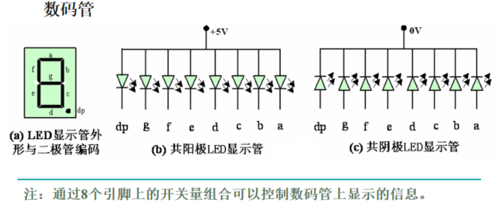
> 注：通过8个引脚上的开关量组合可以控制数码管上显示的信息。
---
- 单个数码管应用举例
  
  - **数码管的类型**以及**引脚与数据总线间的对应关系**决定了欲显示信息的字形码。


---
# 第7章 微型计算机的中断系统

---
## 7.1 中断系统的基本概念

---
### 7.1.1 中断的基本概念
- 中断传送方式
  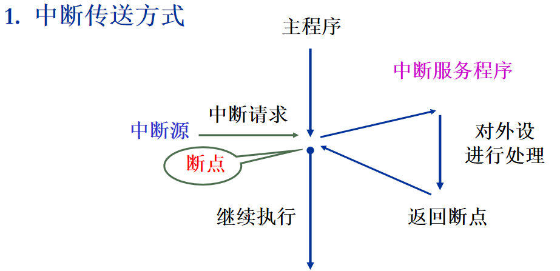
  - CPU在执行程序时，突然有**某个内部或外部的事件**请求CPU处理，CPU暂停当前正在执行的程序，转去执行**处理该事件的服务程序**，服务结束后，又返回**原来程序被中断的地方**继续执行。这个过程称为**中断**。

---
#### 中断传送与接口
- 中断传送是一种效率更高的程序传送方式
- 进行传送的**中断服务程序是预先设计好的**
- **中断请求是外设向CPU提出的**
  - CPU接收到请求信号后，**暂停**当前的工作，进行该设备的数据传送操作。
  - **CPU不必反复查询该设备状态**，CPU与外设处于某种“**并行工作**”的状态，从而提高CPU的工作效率。
> - 1次中断对应**1个**数据的输入/输出
>   - 相应的中断服务程序中不可能出现循环结构
> - 本课程主要论述中断在输入和输出方面的应用,中断还有着非常广泛的应用  

---
- 中断输入接口
  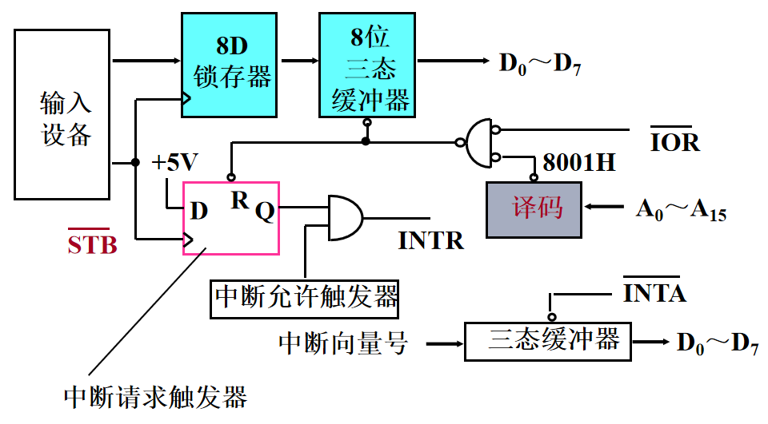


---
### 7.1.2 中断系统的功能

---
### 7.1.3 中断处理过程

---
## 7.2 8086CPU中断系统
- 8086/8088的中断系统采用**向量中断**机制
- **中断类型**：
  - 用8位二进制表示，可以有256个不同的中断;
- 中断请求输入引脚：
  - **NMI、INTR**;
- 可屏蔽中断借助专用**中断控制器Intel 8259A**实现统一管理

---
### 7.2.1 8086中断的分类
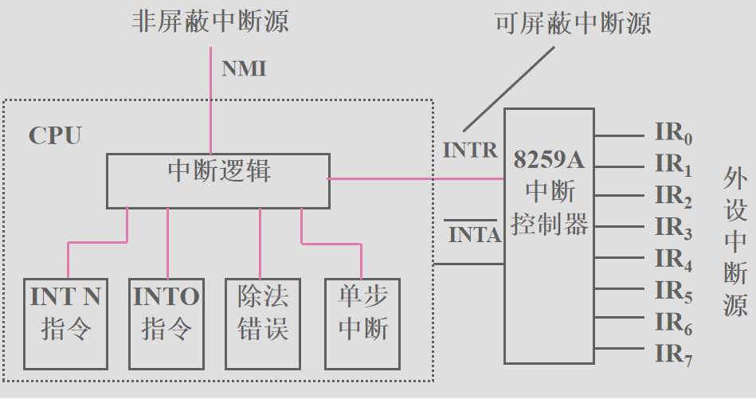
- 内部中断（软件中断）
  - 除法错中断
  - 指令中断
  - 溢出中断
  - 单步中断
  - 断点中断
- 外部中断（硬件中断）
  - 非屏蔽中断
  - 可屏蔽中断

---
#### 内部中断
- 内部中断是由于8086/8088**内部执行程序出现异常或执行软件中断指令所引起的**程序中断
  - 例如，ROM-BIOS和DOS系统利用内部中断为程序员提供了各种功能调用
- 内部中断的**中断类型码已定**

---
- (1)除法错中断
  - 在执行除法指令时，若**除数为0或商超过了寄存器所能表达的范围**，则产生一个**类型码为0**的内部中断，称为除法错中断
    - 例如:
      ```
      mov bl,0
      idiv bl	；除数BL＝0，产生除法错中断

      ```
      ```
      mov ax,200h
      mov bl,1
      div bl	；商＝200H，不能用AL表达
        ；产生除法错中断

      ```
---
- (2)指令中断
  - 在执行中断调用指令  **INT  n**  时产生的一个**类型码为n**（0 ~ 255）的内部中断，称为指令中断

---
- (3)溢出中断
  - 在执行溢出中断指令**INTO**时，若溢出标志OF为1，则产生一个**类型码为4**的内部中断，称为溢出中断
    - 例如:
      ```
      mov ax,2000h
      add ax, 7000h
        ；2000H＋7000H＝9000H，溢出：OF＝1
      into	；因为OF＝1，所以产生溢出中断

      ```

---
- ⑷单步中断
  - 若单步标志TF为1，则在每条指令执行结束后产生一个**类型码为1**的内部中断，称为单步中断
    - 例如：
      - DEBUG.EXE调试程序的单步命令T就利用单步中断实现对程序的单步调试

---
- ⑸ 断点中断
  - 程序调试的**断点中断**，也是一种指令中断。
    - 例如：DEBUG.EXE调试程序的运行命令G设置的断点，就是利用**INT 3**指令实现的

---
#### 外部中断
- 外部中断是由于8086/8088**外部提出中断请求引起**的程序中断
  - 由CPU外部引脚触发： **NMI、INTR**
- 外部中断的原因是处理器外部**随机**产生的，所以是真正的**中断**（Interrupt）
- 内部中断的原因主要是处理器执行程序出现异常，所以经常被称为**异常**（Exception）

---
- ⑴ 非屏蔽中断
  - 通过非屏蔽中断请求信号**NMI**向CPU提出的中断请求，**CPU无法禁止**，将在当前指令执行结束予以响应
  - 8086/8088的非屏蔽中断的**类型码为2**
  - 主要用于处理系统的意外或故障。例如：
    - 电源掉电前的数据保护
    - 存储器读写错误的处理

---
- ⑵ 可屏蔽中断
  - 外部通过**可屏蔽中断请求信号**（**INTR**）向微处理器提出的中断，微处理器在允许可屏蔽中断的条件下，在当前指令执行结束予以响应，同时输出可屏蔽中断响应信号（**INTA*** ）
  - 8086/8088可屏蔽中断通常借助专用**中断控制器Intel 8259A**实现统一管理
  - **可屏蔽中断类型码来自外部中断控制器**
  > **IF控制可屏蔽中断的响应**
  - 中断标志IF的状态
    - 由IF标志控制可屏蔽中断是否允许响应
      - IF＝0：关中断，不响应； 
      - IF＝1：开中断，响应
  - 关中断的情况有：
    - 系统复位，使IF＝0
    - 任何一个中断被响应，使IF＝0
    - 执行指令**CLI**，使IF＝0
  - 开中断：执行指令**STI**，使IF＝1
  - 执行指令IRET恢复原IF状态

---
### 7.2.2 中断向量表
- 中断向量：
  - 中断服务程序的入口地址（首地址）
    - 逻辑地址含有段地址CS和偏移地址IP（32位）
- 8086/8088微处理器从物理地址00000H开始，依次安排各个中断向量
  - 中断向量按其中断类型码（中断类型码从0开始）的大小顺序依次存放。
  - 按照“低对低、高对高”的小端存储方法，每个中断向量的低字是偏移地址、高字是段地址，需占用4个字节
  - 256个中断占用1KB区域（00000H～003FFH），形成**中断向量表**
- 用于中断向量表初始化的两个DOS系统功能调用
  - 中断向量的读取
  - 中断向量的写入
- **类型码为N的中断向量存放的物理地址＝N×4**

---
#### 8086的中断向量表
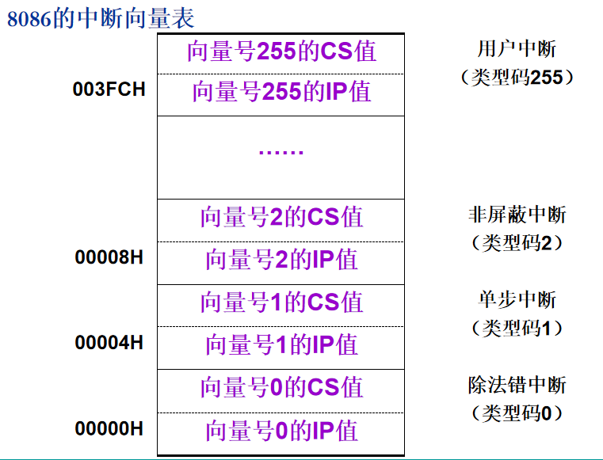

- 例：若中断类型号为3，则由中断类型号取得中断服务入口地址的过程如下图所示：
  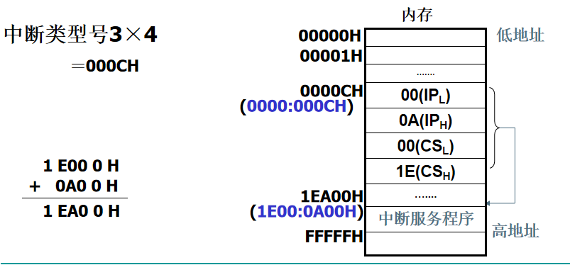

```
mov ax,3580h
		int 21h
		mov intoff,bx	;保存偏移地址
		mov intseg,es	;保存段基地址

```
- 获取中断向量（DOS功能调用INT 21H）
- 功能号：AH＝35H
- 入口参数：AL＝中断类型码
- 出口参数：ES:BX＝中断向量（段地址：偏移地址）

```
push ds
mov dx,offset new80h
mov ax,seg new80h
mov ds,ax
mov ax,2580h
int 21h
pop ds
```
- 设置中断向量（DOS功能调用INT 21H）
- 功能号：AH＝25H
- 入口参数：AL＝中断类型码
- DS:DX＝中断向量（段地址：偏移地址）

---
### 7.2.3 8086对中断的响应
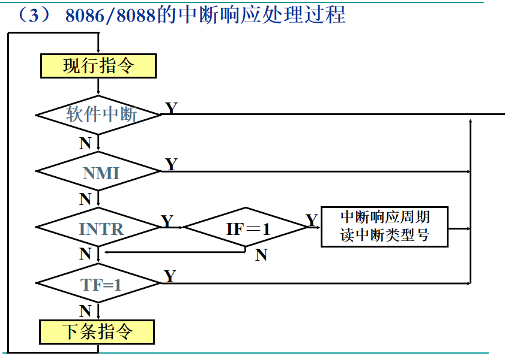
- 查询中断的顺序，决定了各种中断源的优先权
  - 优先权从高到低依次为:
    - 软件中断
      - 除法错中断
      - 指令中断
      - 溢出中断
    - 非屏蔽中断
    - 可屏蔽中断
    - 单步中断
.png)
- 8086/8088各种中断源的优先权，实际上是指被识别出来的先后
- 多种中断同时请求时，最先响应的则可能是单步中断或NMI中断

---
#### 中断服务程序的结构
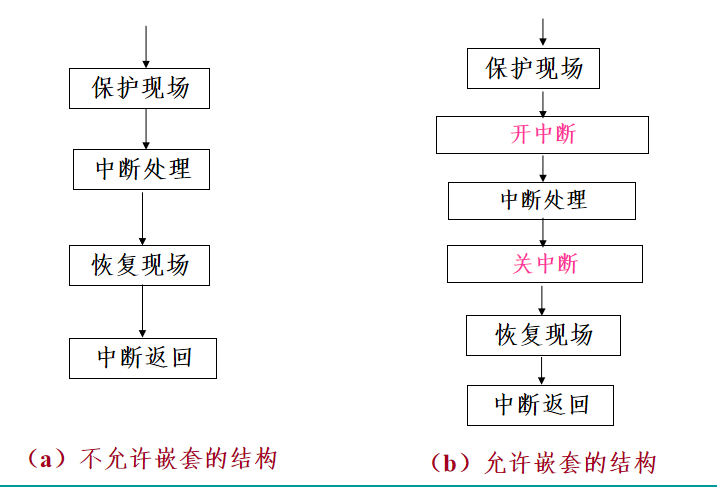


---
## 7.3 中断控制器 8259A
- Intel 8259A是可编程中断控制器（PIC）
- 8259A的主要功能
  - 一片8259A可以管理8级中断，可通过级联扩展至64级；
  - 每一级中断都可单独被屏蔽或允许；
  - 在中断响应周期，8259A可提供相应的中断类型码；
  - 8259A设计有多种工作方式，可通过编程灵活选择。

### 8259A的内部结构
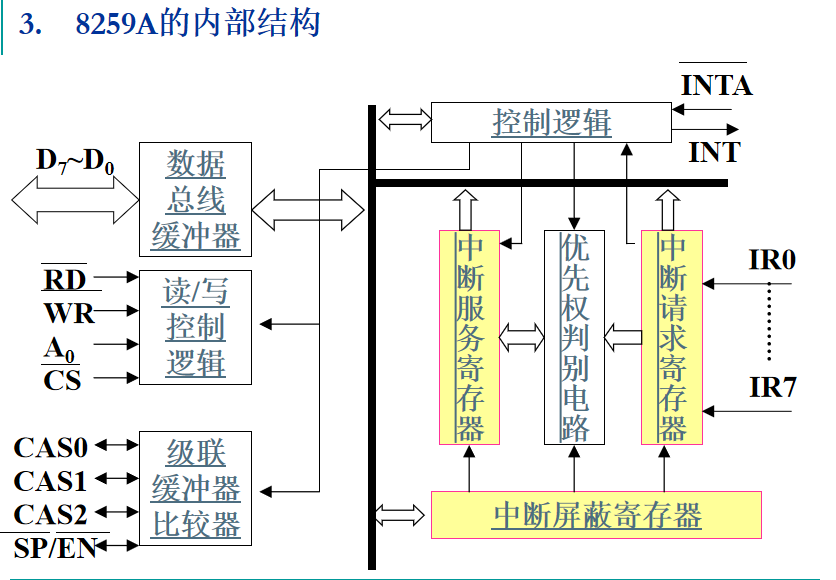
- （1）数据总线缓冲器 :
  - 8位双向三态缓冲器。
  - 传送的信息:
    - CPU向8259A写入的命令字
    - CPU从8259A读取的状态字
    - 8259A向CPU提供的中断类型码

- （2）读/写控制逻辑 ：
  - 内部地址译码和操作控制。
    - 接收来自CPU的读/写命令，完成规定的操作。
    - 操作过程由 $\bar{CS}$   、A0、$\bar{RD}$   和 $\bar{WR}$   输入信号共同控制。 

- （3）级联缓冲/比较器: 用于8259A的级联和缓冲方式
  - 级联方式：
    - 传送从片8259A的编号。
      -  第1个$\bar{INTA}$期间，识别ID标志；
      -  第2个$\bar{INTA}$期间，该从片向CPU提供中断类型码。
  > **缓冲方式：输出局部数据总线允许信号。**

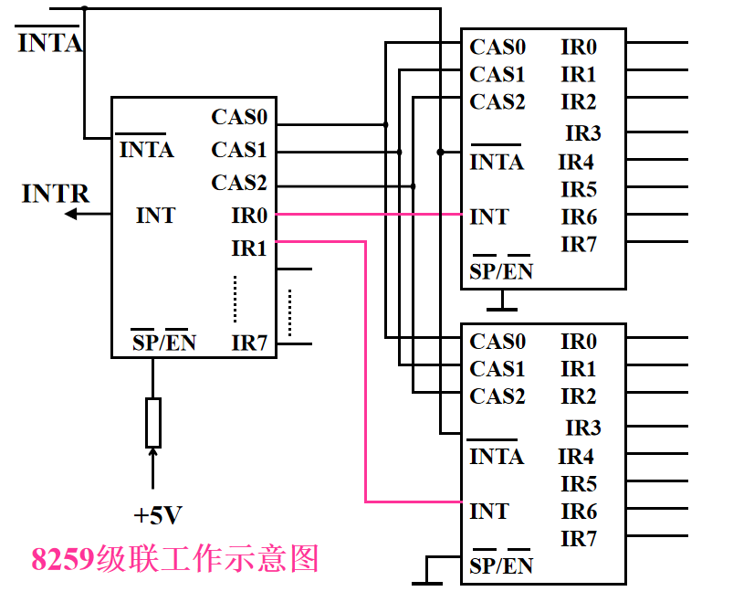

- （4）中断请求寄存器IRR
  - 接收来自IR0～IR7上的中断请求信号
  - 接收来自IR0～IR7上的中断请求信号
- （5）中断服务寄存器ISR
  - 保存CPU正在服务着的中断源状态
  - Di位为1表示IRi中断正在服务中；为0表示没有被服务
- （6）中断屏蔽寄存器IMR
  - 保存对中断请求信号IR0～IR7的屏蔽状态
  - Di位为1表示IRi中断被屏蔽（禁止）；为0表示允许
- （7）优先权判别电路PR
  - 判别同时送达优先权电路的中断请求哪一个级别最高；
  - 判别新的中断请求优先级是否比当前正服务的中断请求更高，以决定是否进入中断嵌套。
- （8）控制逻辑 ：
  - 按设定的工作方式控制8259A的工作过程 
    - 有中断请求
      - IRR相应位置“1”
        - 若中断屏蔽则不允许响应
        - 若中断未屏蔽 ，送PR判优
          - 向CPU发出INT信号 
            - CPU若满足响应条件发回INTA*信号
              - ISR相应位置“1”，IRR相应位清“0” 
                - 8259A向CPU传送中断类型码
                  - 中断服务
                    - 服务完成后，ISR相应位清“0”


---
### 7.3.1 8259A的引脚信号
- 8259A的引脚可分为三个部分：
  - 与CPU的接口引脚
  - 与外设的接口引脚
  - 用于级联的接口引脚 

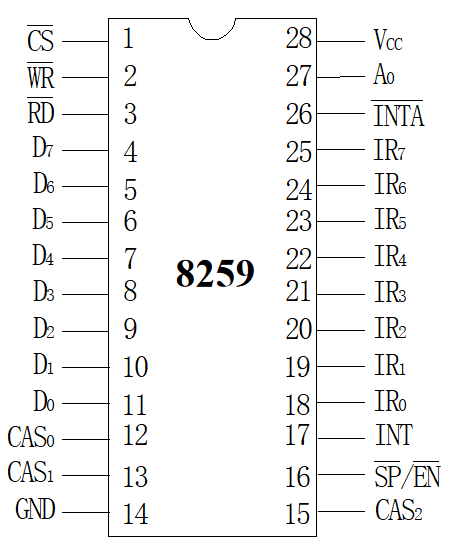

---
#### 8259A与CPU的接口引脚 
- D7~D0：
  - **数据线**，双向，三态 。
  - 传送的信息：
    - 控制字、状态字、中断类型码。
- A0：
  - **地址线**，输入
  - 寻址8259A内部的端口
    - **偶地址端口**： 
      - 3个控制字，
        - ICW1， OCW2， OCW3
      - 3个状态字
        - IRR， ISR， 中断查询字
    - **奇地址端口**： 
      - 4个控制字
        - OCW1，ICW2，ICW3，ICW4
- $\bar{WR}$
  - **写信号**，输入，低电平有效
- $\bar{RD}$
  - **读信号**，输入，低电平有效
- $\bar{CS}$
  - **片选信号**，输入，低电平有效。
- INT
  - **中断请求信号**，输出，高电平有效。
  - 用于由8259A向CPU发出中断请求，**连接CPU的可屏蔽中断请求输入端INTR**。
- $\bar{INTA}$
  - **中断响应信号**，输入，低电平有效。
  - 用于接收CPU送回的中断响应信号。连接CPU控制总线的$\bar{INTA}$


---
### 7.3.2 8259A的工作过程