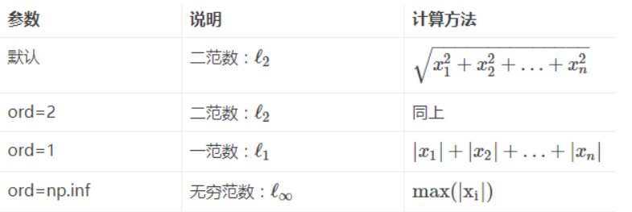

# 练习9 大作业
## 题目1 词频统计
---
### 设计思路
----
#### 自找一篇与Python相关的英文文章(保存格式为txt)
  - 学校图书馆万方数据库搜索
    - 但是这里面外文文献没多少提供下载的
  - 谷歌学术搜索
    - 可以下载PDF,并且并无格式锁
      - 因此可以直接全选复制粘贴到txt文件
---
#### 对所有的单词进行分析统计
- 读取文件
  - 拆分出文件中的所有单词
    - 定义一个空列表用于存储所有单词
    - 用readlines读取每一行字符串组成的列表
    - for循环读取列表中的每个元素(即原文每一行字符串)
      - for循环读取每一行的每个字符
        - 判断字符是否为字母(string.ascii_letters)
          - 不是则该行替换掉这些不是字母的字符
            - 注意这里使用的replace函数生成新列表,因此要用新列表重新初始化旧列表
      - 此时当前行已经滤除了非字母字符
        - for循环读取 每行.split() 生成的字符串列表中的元素(即每个单词)
          - 将这些单词放到用于存储所有单词的列表的尾部
- 统计词频
  - 定义一个空字典用于存储词频结果
  - for循环读取单词列表中的单词
    - 判断该单词是否在词频字典中
      - 若不在则:
        - 字典中加入该词并将值置1
      - 若在则:
        - 字典中该键的值+1
  - 读取字典中的键值对并按照值降序生成词频列表
    - 使用了 dict.items 函数取出所有键值对元组
    - 利用sorted函数生成降序列表

---
#### 将结果以CVS文件保存
- 打开目标文件(若无则自动创建)
  - 写入"单词,出现次数\n"
  - for循环读取词频列表中的元组
    - 写入第一个元素(单词)
    - 写入分隔符 , 
    - 写入第二个元素(出现次数)
    - 写入换行符 \n

---
> 注:所有的文件打开均使用with关键字,不必考虑文件关闭

---
## 题目2 **简单的**学生成绩管理系统
---
- 由于当前周任务量比较大,为了减轻工作量,系统顶层的UI设计并未进行
  - 但是系统采用了模块化编写,以后想添加UI会比较容易

---
### 功能设计
- 增删改查成绩
  - 增
    - CSV格式存储学生成绩信息
      - 姓名,学号,语文,数学,英语
    - append模式添加学生成绩
      - 不允许学号重复
  - 删
    - 先查到学生信息然后将对应列表元素修改
      - 如无信息则判定是否重新输入或退出
    - 读取文件,先将文件清空再覆盖写入修改后的列表
      - 先清空文件是为了防止文件中只有一条待删除的记录,这样就会导致覆写失败
    - 漏洞:
      - 添加元素时未设定各个元素的具体限制导致可能会误输入与学号相同的数据
    - 不足:
      - 覆写耗时耗空间,并不是个好办法
  - 改
    - 偷懒直接采用了删+增的形式实现
  - 查
    - 从删除功能直接提取的代码

---
### 运行方法
- 使用python运行main.py即可

---
### 随笔
#### 创建文档注释脚本
- File->Settings->File and Code Templates
  - 例:Python Script
    - 例:
      ```
      # -*- coding: utf-8 -*-
      # @Time    : ${DATE} ${TIME}
      # @Author  : 咸鱼型233
      # @File    : ${NAME}.py
      # @Software: ${PRODUCT_NAME}
      ```

---
#### 导入自己的模块报红
- [参考文章](https://blog.csdn.net/qq_30622831/article/details/80978118)
- 结论:
  - 本地路径并未被标记“源目录”
- 解决方案:
  -  File | Settings | Build, Execution, Deployment | Console | Python Console 
     -  勾选"Add source roots to PYTHONPAT"
  - 当前程序根目录右键->“Mark Directory as”->“Sources Root”


---
# 练习10 numpy初探
## 1.生成条件数组
- 1.熟练掌握numpy数组元素的访问与修改。输出如下数组：
  - （提示，切片[起始值：终止值：步长]
    ```
    [[1. 0. 1. 0. 1.]
     [0. 1. 0. 1. 0.]
     [1. 0. 1. 0. 1.]
     [0. 1. 0. 1. 0.]
     [1. 0. 1. 0. 1.]]
    ```
- 构建一个空的多维数组:
  ```python
  array_result = np.zeros(shape=(m, n))
  ```

---
## 2.用numpy计算欧式距离 
- 2.查阅资料：什么是欧式距离？如何用numpy计算欧式距离，写出代码。

### 欧氏距离
- 欧式距离一般指欧几里得度量
- 在数学中，欧几里得距离或欧几里得度量是欧几里得空间中两点间“普通”（即直线）距离。
  - 使用这个距离，欧氏空间成为度量空间。
  - 相关联的范数称为欧几里得范数。
  - 较早的文献称之为毕达哥拉斯度量。
- 欧几里得度量（euclidean metric）（也称欧氏距离）是一个通常采用的距离定义，
  - 指在m维空间中两个点之间的真实距离，
  - 或者向量的自然长度（即该点到原点的距离）。
  - 在二维和三维空间中的欧氏距离就是两点之间的实际距离。 

---
### 范数(norm)
- [百度百科链接](https://baike.baidu.com/item/%E8%8C%83%E6%95%B0/10856788?fr=aladdin)
- 范数，是具有“长度”概念的函数。
  - 在线性代数、泛函分析及相关的数学领域，
- 范数是一个函数，
  - 是矢量空间内的所有矢量赋予非零的正长度或大小。
  - 半范数可以为非零的矢量赋予零长度。
> 注：在二维的欧氏几何空间 R 中定义欧氏范数
>   - 在该矢量空间中，元素被画成一个从原点出发的带有箭头的有向线段，
>     - 每一个矢量的有向线段的长度即为该矢量的欧氏范数。

---
### np.linalg.norm(求范数)
- [参考链接](https://blog.csdn.net/hqh131360239/article/details/79061535)
- linalg=linear（线性）+algebra（代数）
- norm则表示范数。
- 函数参数
  ```python
  x_norm=np.linalg.norm(x, ord=None, axis=None, keepdims=False)
  ```
  - x
    - 表示矩阵
    - （也可以是一维）
  - ord
    - 范数类型
    - 向量的范数：
      
  - axis：
    - 处理类型
    - axis=1
      - 表示按行向量处理，求多个行向量的范数
    - axis=0
      - 表示按列向量处理，求多个列向量的范数
    - axis=None
      - 表示矩阵范数。
    - keepding：
      - 是否保持矩阵的二维特性

---
#### 矩阵的范数
- ord=1：
  - 列和的最大值
- ord=2：
  - |λE-ATA|=0，求特征值，
  - 然后求最大特征值得算术平方根
    - (matlab在线版，计算ans=ATA，[x,y]=eig(ans)，sqrt(y)，x是特征向量，y是特征值)
- ord=∞：
  - 行和的最大值
- **ord=None**：
  - 默认情况下，是求整体的矩阵元素平方和，再开根号。（没仔细看，以为默认情况下就是矩阵的二范数，修正一下，默认情况下是求整个矩阵元素平方和再开根号）

### 求解
```python
distance = numpy.linalg.norm(a-b)
```

---
## 3.numpy多项式求解
- constant
  - 常数,常量
- polynomial
  - 多项式
```python 
import numpy as np

constant_array = np.array([3, 0, 2, 5])
polynomial = np.poly1d(constant_array)
print("多项式为:\n", polynomial)

x_array = np.array([1, 4, 7, 9])
print("当x取（1，4，7，9）时多项式的值为:{0}".format(polynomial(x_array)))

# 运行结果:
多项式为:
    3
3 x + 2 x + 5
当x取（1，4，7，9）时多项式的值为:[  10  205 1048 2210]
```

---
## 4.求均值,方差,标准差,最大小值;生成正态分布数值
### 概念一览
- 方差
- 标准差
  - 标准差（Standard Deviation） ，是离均差平方的算术平均数（即：方差）的算术平方根，
    - 用σ表示。
    - 标准差也被称为
      - 标准偏差，
      - 或者实验标准差，
  - 在概率统计中最常使用作为统计分布程度上的测量依据。
- 高斯分布
  - 一般指正态分布
  - 正态分布（Normal distribution），也称“常态分布”，又名高斯分布（Gaussian distribution），
  - 正态曲线呈钟型，两头低，中间高，左右对称因其曲线呈钟形，因此人们又经常称之为钟形曲线。
  - 若随机变量X服从一个数学期望为μ、方差为σ^2的正态分布，记为N(μ，σ^2)。
    - 其概率密度函数为正态分布的期望值μ决定了其位置，
    - 其标准差σ决定了分布的幅度。
    - 当μ = 0,σ = 1时的正态分布是标准正态分布。

---
### 题目一览
- 4.查阅资料，了解什么是均值、标准差、方差。
  - 熟练掌握numpy求均值，方差，标准差的方法，
    - 常用的统计方法，求最大小值、求和等方法。
  - 现有10位学生，产生服从正态分布的身高
    - （均值：169，标准差：4）
  - 和服从高斯分布的体重
    - （均值：105，标准差：10）
  - 的10X2的二维数组。
    - 并求其均值、标准差、方差，最大小值。

---
### numpy.random.normal
```python
numpy.random.normal(loc=0.0, scale=1.0, size=None)
```
- loc
  - 浮点型数据或者浮点型数据组成的数组
  - 分布的均值（中心）
- scale
  - 浮点型数据或者浮点型数据组成的数组
  - 分布的标准差（宽度）
- size
  - 整数或者整数组成的元组，可选参数
  - 输出值的维度。
    - 如果给定的维度为(m, n, k)，
      - 那么就从分布中抽取m * n * k个样本。
    - 如果size为None（默认值）并且loc和scale均为标量，那么就会返回一个值。
      - 否则会返回np.broadcast(loc, scale).size个值
- 功能
  - 从正态（高斯）分布中抽取随机样本。
  
---
### 数组堆叠
-  .hstack() 水平堆叠（横向组合） 
-  .vstack() 垂直堆叠（纵向组合） 
-  .concatenate() 沿指定的轴组合

### 示例&解答
```python
import numpy as np

height_arr = np.random.normal(169, 4, 10)       # 10个身高
weight_arr = np.random.normal(105, 10, 10)      # 10个体重
values_arr = np.vstack((height_arr, weight_arr))
print("10名同学的身高体重为:", values_arr)
aver_value = np.mean(values_arr, axis=1)
print("10名同学身高体重的平均值为:{0}".format(aver_value))
max_value = np.max(values_arr, axis=1)
print("10名同学身高体重的最大值为:{0}".format(max_value))
min_value = np.min(values_arr, axis=1)
print("10名同学身高体重的最小值为:{0}".format(min_value))
std_value = np.std(values_arr, axis=1)
print("10名同学身高体重的标准差为:{0}".format(std_value))
var_value = np.var(values_arr, axis=1)
print("10名同学身高体重的方差为:{0}".format(var_value))

# 运行结果:
10名同学的身高体重为: [[171.5646031  160.30680796 173.80726876 169.16849545 167.14212878
  169.98905624 165.12101032 170.29309801 169.00557026 166.64119317]
 [120.89079343 109.27720695 106.38572598 102.37070699 108.90627319
  104.43040731 109.95417993 107.86696338 114.26314303  96.34766575]]
10名同学身高体重的平均值为:[168.30392321 108.06930659]
10名同学身高体重的最大值为:[173.80726876 120.89079343]
10名同学身高体重的最小值为:[160.30680796  96.34766575]
10名同学身高体重的标准差为:[3.56587091 6.28055964]
10名同学身高体重的方差为:[12.71543533 39.44542944]
```


---
# 练习11 numpy进阶应用

---
## 1.矩阵基本运算
- 某工厂生产三种产品,费用支出见表1,生产量见表2
  

  [表1备用链接](https://codimd.s3.shivering-isles.com/demo/uploads/upload_e2ceb36eb9f9f825c773f116563541fb.png)

  

  [矩阵相乘实例分析表2备用链接](https://codimd.s3.shivering-isles.com/demo/uploads/upload_a8fbeb28aebf1c6936ac9673a0ddc539.png)
- 计算如下数据:
  - 每一季度中每一类成本的数量
    - 设$M =$
      $$\left[
      \begin{matrix}
      0.10 & 0.30 & 0.15\\
      0.30 & 0.40 & 0.25 \\
      0.10 & 0.20 & 0.15
      \end{matrix}
      \right]
      $$
      $N =$
      $$\left[
      \begin{matrix}
      4000 & 4500 & 4500 & 4000 \\
      2000 & 2600 & 2400 & 2200 \\
      5800 & 6200 & 6000 & 6000  
      \end{matrix}
      \right]$$
    - 则每一季度中每一类成本的数量为:
      - $MN$
  - 每一季度三类成本的总数量
    - $MN.sum(axis = 0)$
  - 四个季度每类成本的总数量
    - $MN.sum(axis = 1$
- 代码如下:
```python
import numpy as np

M = np.mat([(0.10, 0.30, 0.15), (0.30, 0.40, 0.25), (0.10, 0.20, 0.15)])
N = np.mat([[4000, 4500, 4500, 4000], [2000, 2600, 2400, 2200], [5800, 6200, 6000, 6000]])
MN = M*N
print("每一季度中每一类成本的数量为:\n{0}".format(MN))
print("每一季度三类成本的总数量为:\n{0}".format(MN.sum(axis=0)))
print("四个季度每类成本的总数量为:\n{0}".format(MN.sum(axis=1)))

# 运行结果:
每一季度中每一类成本的数量为:
[[1870. 2160. 2070. 1960.]
 [3450. 3940. 3810. 3580.]
 [1670. 1900. 1830. 1740.]]
每一季度三类成本的总数量为:
[[6990. 8000. 7710. 7280.]]
四个季度每类成本的总数量为:
[[ 8060.]
 [14780.]
 [ 7140.]]

```

---
## 2.销售额估计
现调查某个饭店的10家分店，季度销售额和去饭店吃饭的人数的数据表，如下表所示。


[练习11T2销售额与人数表格备用链接](https://codimd.s3.shivering-isles.com/demo/uploads/upload_b327e0c551f993aeedbc1170bcca6533.png)

建立线性回归模型，并利用该模型预测当吃饭人数达到35000时，饭店的销售额是多少？

- 先给出数据，将数据保存到txt文本，取名liner_regressor.txt
  ```
  2000 58
  6000 105
  7800 88
  8000 118
  12000 117
  16000 137
  20000 157
  9000 100
  14000 200
  11000 123
  ```

---
### 一、数据读取
```python
import os

# 读取文件，前面是x，后面是y，现在用空格分开
filename = os.path.abspath(os.path.join(os.path.dirname(__file__), './res/liner_regressor.txt'))
X = []  # 自变量列表
Y = []  # 因变量列表
# 读入数据
with open(filename, 'r')as f:
    for line in f.readlines():
        xt, yt = [int(i) for i in line.split()]  # 若两个数据之间是空格，则括号不填东西，否则就填分割的符号
        X.append(xt)
        Y.append(yt)
```

---
### 二、将数据分成训练集、测试集
```python
import numpy as np

# 将数据分成训练集、测试集

num_training = int(0.8 * len(X))
num_test = len(X) - num_training

# 训练数据
# 利用分片取出前num_training并重组数组成列向量
X_train = np.array(X[:num_training]).reshape((num_training, 1))
Y_train = np.array(Y[:num_training])    # Y_train切分出Y的前num_training个数据

print(X_train)

# 测试数据
X_test = np.array(X[num_training:]).reshape((num_test, 1))
Y_test = np.array(Y[num_training:])

```

---
### 三、创建回归器对象
- 安装第三方库sklearn
  ```
  pip install -i https://pypi.tuna.tsinghua.edu.cn/simple sklearn
  ```
```python
from sklearn import linear_model
# 创建线性回归器对象
linear_regressor = linear_model.LinearRegression()

# 利用训练集训练模型
linear_regressor.fit(X_train, Y_train)

```

---
### 四、plot可视化输出
```python
import matplotlib.pyplot as plt     # 可视化输出

plt.figure()
# 绘制散点图
plt.scatter(X, Y, color="orange")   # 绘制橙色散点
# 绘制拟合直线
plt.plot(X_total, y_train_pred, color="blue", linewidth=4)
plt.title("salesPredict")           # 设置图表标题
plt.show()                          # 显示图表
```


---
### 五、全部代码
```python
# -*- coding: utf-8 -*-
# @Time    : 2020/11/17 18:09
# @Author  : 咸鱼型233
# @File    : 2_salesPredict.py
# @Software: PyCharm
# @Function: 预测销售额
import numpy as np
import os                           # 拼接文件路径
from sklearn import linear_model    # 创建回归器对象
import matplotlib.pyplot as plt     # 可视化输出

# 读取文件，前面是x，后面是y，现在用空格分开
filename = os.path.abspath(os.path.join(os.path.dirname(__file__), './res/liner_regressor.txt'))
X = []  # 自变量列表
Y = []  # 因变量列表
# 读入数据
with open(filename, 'r')as f:
    for line in f.readlines():
        xt, yt = [int(i) for i in line.split()]  # 若两个数据之间是空格，则括号不填东西，否则就填分割的符号
        X.append(xt)
        Y.append(yt)


# 将数据分成训练集、测试集

num_training = int(0.8 * len(X))
num_test = len(X) - num_training

# 训练数据
# 利用分片取出前num_training并重组数组成列向量
X_train = np.array(X[:num_training]).reshape((num_training, 1))
Y_train = np.array(Y[:num_training])    # Y_train切分出Y的前num_training个数据

# 测试数据
X_test = np.array(X[num_training:]).reshape((num_test, 1))
Y_test = np.array(Y[num_training:])

# 创建线性回归器对象
linear_regressor = linear_model.LinearRegression()

# 利用训练集训练模型
linear_regressor.fit(X_train, Y_train)

# 预测当吃饭人数达到35000时，饭店的销售额是多少？
print("预测当吃饭人数达到35000时，饭店的销售额为: {0}千元".format(int(linear_regressor.predict([[35000]]))))

# 先计算对应X的拟合直线输出值
X_total = np.array(X).reshape((len(X), 1))    # 将列表X格式化成一列的数组
# 利用创建好的线性回归器带入自变量生成预测因变量
y_train_pred = linear_regressor.predict(X_total)

plt.figure()
# 绘制散点图
plt.scatter(X, Y, color="orange")   # 绘制橙色散点
# 绘制拟合直线
plt.plot(X_total, y_train_pred, color="blue", linewidth=4)
plt.title("salesPredict")           # 设置图表标题
plt.show()                          # 显示图表

```


---
### 参考链接
- [建立线性回归模型的完整步骤](https://blog.csdn.net/weixin_42521211/article/details/105769520)
- [建立简单线性回归模型](https://blog.csdn.net/dieju8330/article/details/82817355)
  > 这次的代码基本是按照这个覆写的


---
## 3.解线性方程组
求解如下线性方程组并求系数矩阵的特征值、特征向量以及系数矩阵的2-范数


[练习11T3备用链接](https://codimd.s3.shivering-isles.com/demo/uploads/upload_c1949335c6907b124a7692c1f4978001.png)

```python
# -*- coding: utf-8 -*-
# @Time    : 2020/11/17 18:13
# @Author  : 咸鱼型233
# @File    : 3_solveLinearEquation.py
# @Software: PyCharm
# @Function: 求解线性方程组
import numpy as np

a = np.mat([[1, 2, 3],
            [4, 5, 6],
            [7, 8, 0]])     # 系数矩阵
b = np.mat([[1],
            [1],
            [1]])           # 常数矩阵
print("方阵a的特征值和右特征向量为:\n{0}"
      .format(np.linalg.eig(a)))    # 计算方阵a的特征值和右特征向量
print("系数矩阵的2-范数为:\n{0}"
      .format(np.linalg.norm(a)))   # 计算系数矩阵的2-范数

```


---
### 2-范数
- 二范数指矩阵A的2范数，就是A的转置共轭矩阵与矩阵A的积的最大特征根的平方根值
  - 是指空间上两个向量矩阵的直线距离。
  - 类似于求棋盘上两点间的直线距离。
- [求二范数参考链接](https://numpy.org/devdocs/reference/generated/numpy.linalg.norm.html#numpy.linalg.norm)
- ```python
  linalg.norm(x[, ord, axis, keepdims])	# 矩阵或向量范数。
  ```
  - ord = None 求2-范数


---
## 4.给程序加注释
```python
# -*- coding: utf-8 -*-
# @Time    : 2020/11/17 18:35
# @Author  : 咸鱼型233
# @File    : 4_addAnnotation.py
# @Software: PyCharm
# @Function: 给程序添加注释
import numpy as np
import os

file_path_savez = os.path.abspath(os.path.join(os.path.dirname(__file__), './res/prog/matrix'))
file_path_savetxt = os.path.abspath(os.path.join(os.path.dirname(__file__), './res/prog/matrix.csv'))
file_path_arr = os.path.abspath(os.path.join(os.path.dirname(__file__), './res/prog/matrix.npz'))

A = np.array([1, 2, 3, 4, 5])   # A = [1 2 3 4 5]
B = np.diag(A)                  # 利用A生成对角阵B,对角线上元素从左到右对应A中元素
C = np.linspace(1, 50, 49, dtype=int)\
    .reshape(7, 7)              # 生成[1,50]等间隔的49个数(去掉小数部分)并将其重构为7×7的数组
C = np.mat(C)                   # 将数组C转换成矩阵C
row = len(C)                    # row = 7; len(矩阵)返回矩阵的行数
col = len(C[0, :])              # col = 1; C[0, :] = [[1 2 3 4 5 6 7]] 长度为1
D = np.diagonal(C)              # D为C对角线上的元素,即为[ 1  9 17 25 33 41 50]
D_diag = np.diag(D)             # D_diag是以D为对角元素生成的方阵
E = np.diag(np.diag(C))         # np.diag(C)获取C对角线上的元素;
E_M = np.mat(E)                 # 将E转换为矩阵E_M
F = np.tril(C)                  # F为C的下三角(上三角置0)
F_1 = np.tril(C, -1)            # 主对角线-1 上方元素置0,效果等效为:下三角&主对角线置0
F1 = np.triu(C)                 # F1为C的上三角
F1_1 = np.triu(C, 1)            # 主对角线+1 下方元素置0,效果等效为:上三角&主对角线置0
np.savez(file_path_savez,
         a=A, b=B, c=C)         # 将几个数组以未压缩的.npz格式保存到单个文件中。
np.savetxt(file_path_savetxt,
           E_M, '%d',
           delimiter=',')       # 将数组保存到文本文件,每一个数据都用','分开
arr = np.load(file_path_arr)    # 从.npy、.npz或pickle文件加载阵列或pickle对象。
# 输出相应对象
print("a:\n{0}\nb:\n{1}\nc:\n{2}\n".format(arr['a'], arr['b'], arr['c']))
# 从文本文件加载数据。
arr1 = np.loadtxt(file_path_savetxt, delimiter=',')
print("E_M:\n{0}"
      .format(arr1))            # 输出E_M

```

---
### 参考链接
- [np.tril](https://numpy.org/devdocs/reference/generated/numpy.tril.html#numpy.tril)
  - 数组的下三角
- [np.savez](https://numpy.org/devdocs/reference/generated/numpy.savez.html#numpy.savez)
- [np.savetxt](https://numpy.org/devdocs/reference/generated/numpy.savetxt.html#numpy.savetxt)