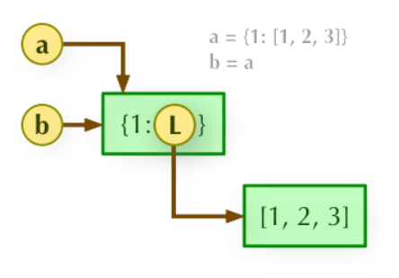
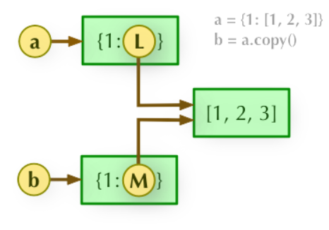
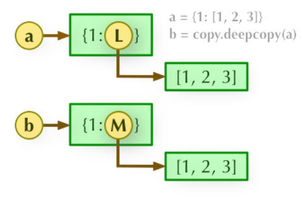
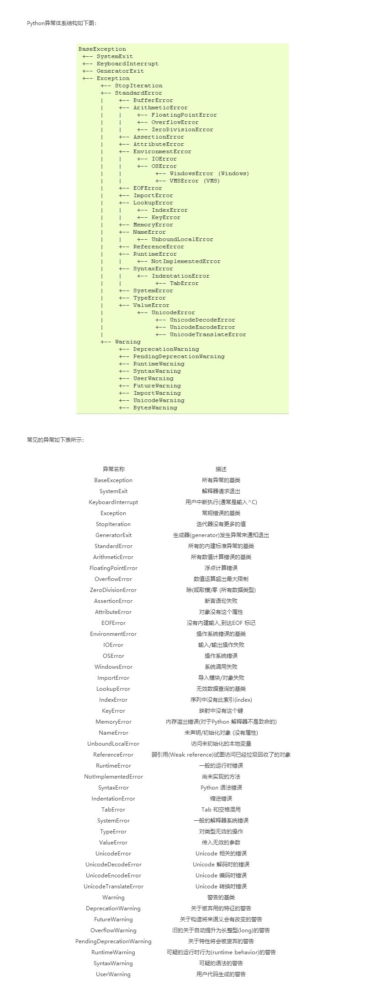

# 前言
- 含有运行代码及结果的代码可复制粘贴在本文档同目录下的globalTest.py运行

---
## 实验环境
- 软件:
  - Pycharm Community Edition 2020.1.2
  - py3.8
- 编码方案
  - 没有特殊声明的情况下都是UTF-8

---
# 作业相关
- 作业上传至 服务器：
  - ftp://211.65.95.251
  - 登陆用户名：student_wll
  - 密码：student_wll
# 换源操作
- [参考文档](https://github.com/winrey/EasyConnectedInChina)
```python
py -3.8 -m pip install -i https://pypi.tuna.tsinghua.edu.cn/simple opencc  
py -3.8 -m pip install -i https://pypi.tuna.tsinghua.edu.cn/simple -r requirements.txt
py -3.8 -m pip install -i https://pypi.tuna.tsinghua.edu.cn/simple --upgrade pip
pip install -i https://pypi.tuna.tsinghua.edu.cn/simple --upgrade pip
```
- 镜像源地址
  - 阿里云   
    https://mirrors.aliyun.com/pypi/simple/
  - 中国科技大学  
    https://pypi.mirrors.ustc.edu.cn/simple/
  - 豆瓣(douban)  
    http://pypi.douban.com/simple/
  - 清华大学  
    https://pypi.tuna.tsinghua.edu.cn/simple/
  - 中国科学技术大学  
    http://pypi.mirrors.ustc.edu.cn/simple/   


# Pycharm相关
## 快捷键
### 查找替换
- Ctrl + R 替换
- Ctrl + Shift + R 全局替换
> 无意中触发了TIM快捷键:Ctrl+Alt+F(文字识别)

## 创建文档注释脚本
- File -> Settings -> Editor -> File and Code Templates
  - 例:Python Script
    - 例:
      ```
      # -*- coding: utf-8 -*-
      # @Time    : ${DATE} ${TIME}
      # @Author  : 咸鱼型233
      # @File    : ${NAME}.py
      # @Software: ${PRODUCT_NAME}
      ```

---
## 导入自己的模块报红
- [参考文章](https://blog.csdn.net/qq_30622831/article/details/80978118)
- 结论:
  - 本地路径并未被标记“源目录”
- 解决方案:
  -  File | Settings | Build, Execution, Deployment | Console | Python Console 
     -  勾选"Add source roots to PYTHONPAT"
  - 当前程序根目录右键->“Mark Directory as”->“Sources Root”


--- 
# 基础杂项
## 深浅拷贝
- [该部分来源](https://www.runoob.com/w3cnote/python-understanding-dict-copy-shallow-or-deep.html)
- 直接赋值：其实就是对象的引用（别名）。
- 浅拷贝(copy)：拷贝父对象，不会拷贝对象的内部的子对象。
- 深拷贝(deepcopy)： copy 模块的 deepcopy 方法，完全拷贝了父对象及其子对象。
### 字典浅拷贝实例
```python
>>>a = {1: [1,2,3]}
>>> b = a.copy()
>>> a, b
({1: [1, 2, 3]}, {1: [1, 2, 3]})
>>> a[1].append(4)
>>> a, b
({1: [1, 2, 3, 4]}, {1: [1, 2, 3, 4]})
```
### 深度拷贝需要引入 copy 模块：
```python 
>>>import copy
>>> c = copy.deepcopy(a)
>>> a, c
({1: [1, 2, 3, 4]}, {1: [1, 2, 3, 4]})
>>> a[1].append(5)
>>> a, c
({1: [1, 2, 3, 4, 5]}, {1: [1, 2, 3, 4]})
```
### 解析
- b = a: 赋值引用，a 和 b 都指向同一个对象。
  
- b = a.copy(): 浅拷贝, a 和 b 是一个独立的对象，但他们的子对象还是指向统一对象（是引用）。
  
- b = copy.deepcopy(a): 深度拷贝, a 和 b 完全拷贝了父对象及其子对象，两者是完全独立的。
  

---
## 逻辑符号
- and的优先级要大于or
- a and b语句的输出全看a的Boolean值，如果a为True，输出b；反之，如果a为False，输出a
- a or b语句的输出也全看a的Boolean值，如果a为True，输出a；反之，如果a为False，输出b
- 在python中not是逻辑判断词，用于布尔型True和False，notTrue为False，notFalse为True
- 只有0、None、空、False的布尔值为False，其余的为True。
  - 参与数学运算时,True->1,False->0;

---
## 随手记
- id是内置函数,不能作为变量名使用

---
## 输出
- print函数的参数end表示分隔参数(默认为回车)
---
### Python格式化输出 %s %d %f
- %% 百分号标记         
  - 就是输出一个%
- %c 字符及其ASCII码
- %s 字符串
- %d 有符号整数(十进制)
- %u 无符号整数(十进制)
- %o 无符号整数(八进制)
- %x 无符号整数(十六进制)
- %X 无符号整数(十六进制大写字符)
- %e 浮点数字(科学计数法)
- %E 浮点数字(科学计数法，用E代替e)
- %f 浮点数字(用小数点符号)
- %g 浮点数字(根据值的大小采用%e或%f)
- %G 浮点数字(类似于%g)
- %p 指针(用十六进制打印值的内存地址)
- %n 存储输出字符的数量放进参数列表的下一个变量中
#### %格式化符也可用于字典，可用%(name)引用字典中的元素进行格式化输出。
   
- 负号指时数字应该是左对齐的，“0”告诉Python用前导0填充数字，正号指时数字总是显示它的正负(+，-)符号，即使数字是正数也不例外。
        
- 可指定最小的字段宽度，如："%5d" % 2。
- 也可用句点符指定附加的精度，如："%.3d" % 3。
```python
# 例：数字格式化
nYear = 2018
nMonth = 9
nDay = 12
# 格式化日期 %02d数字转成两位整型缺位填0
print ('%04d-%02d-%02d' %(nYear,nMonth,nDay))
>> 2018-09-12 # 输出结果

fValue = 8.123
print ('%06.2f' %fValue) # 保留宽度为6的2位小数浮点型
>> 008.12 # 输出

print ('%d' %10) # 输出十进制
>> 10

print ('%o' %10) # 输出八进制
>> 12

print ('%02x' %10) # 输出两位十六进制，字母小写空缺补零
>> 0a
 
print ('%04X' %10) # 输出四位十六进制，字母大写空缺补零
>> 000A
 
print ('%.2e' %1.2888) # 以科学计数法输出浮点型保留2位小数
>> 1.29e+00
```
#### 格式化操作符辅助指令

#### 符号 作用
- \* 定义宽度或者小数点精度
- \- 用做左对齐
- \+ 在正数前面显示加号( + )
- \<sp> 在正数前面显示空格
- \# 在八进制数前面显示零('0'),在十六进制前面显示'0x'或者'0X'(取决于
          用的是'x'还是'X')
- 0 显示的数字前面填充‘0’而不是默认的空格
- % '%%'输出一个单一的'%'
- (var) 映射变量(字典参数)
- m.n m 是显示的最小总宽度,n 是小数点后的位数(如果可用的话)


---
## random
### randint用于生成正数类型随机数
- n = randint(20, 100)        # 20<=n<=100


---
## 时间
### time.localtime()
- 描述:
  -  Python time localtime() 函数类似gmtime()，作用是格式化时间戳为本地的时间。 如果sec参数未输入，则以当前时间为转换标准。 
  -  DST (Daylight Savings Time) flag (-1, 0 or 1) 是否是夏令时。
- 语法:
  - time.localtime([ sec ])
- 参数:
  - sec -- 转换为time.struct_time类型的对象的秒数。  
- 返回值:
  - 该函数没有任何返回值。 


---
# 函数
- 第4节课
---
## lamda函数:定义匿名函数
```python 
g = lambda x:x+1
```
相当于:
```python
def g(x):
     return x+1
```

---
## 函数注释   
- 例子:
```python
def dog(name:str, age:(1, 99), species:'狗狗的品种') -> tuple:
  return (name, age, species)
```
- 查看这些注释可以通过自定义函数的特殊属性__annotations__获取,结果会议字典的形式返回：
```python
dog.__annotations__
# {'age': (1, 99), 'name': str, 'return': tuple, 'species': '狗狗的品种'}
```
- 另外，使用函数注释并不影响默认参数的使用：
```python
def dog(name:str ='dobi', age:(1, 99) =3, species:'狗狗的品种' ='Labrador') -> tuple:
    return (name, age, species)
```

## *args,**kwargs
[原文链接](https://blog.csdn.net/qq_41877039/article/details/97623476>)  
### *args的用法
- 当传入的参数个数未知，且不需要知道参数名称时使用*args;

---
### **kwargs的用法
- 当传入的参数个数未知，但需要知道参数的名称时(立马想到了字典，即键值对)
```python
def func_kwargs(farg, **kwargs):
    print("formal arg:", farg)
    for key in kwargs:
        print("keyword arg: %s: %s" % (key, kwargs[key]))
func_kwargs(1 ,id=1, name='youzan', city='hangzhou',age ='20',四块五的妞是 = '来日方长的')
print('--------------------')
# 输出结果如下：
# formal arg: 1
# keyword arg: id: 1
# keyword arg: name: youzan
# keyword arg: city: hangzhou
# keyword arg: age: 20
# keyword arg: 四块五的妞是: 来日方长的
#利用它转换参数为字典

def kw_dict(**kwargs):
    return kwargs
print(kw_dict(a=1,b=2,c=3))
# 输出结果如下：
# --------------------
# {'a': 1, 'b': 2, 'c': 3}
```


---
# 可迭代序列
- 第5节课
---
## 切片操作
- 逆序
  ```python
  print(txt[::-1])
  ```

---
## ASCII码
- [ASCII码对照](https://tool.ip138.com/ascii_code)
### chr()函数  
- 描述  
  chr() 用一个范围在 range（256）内的（就是0～255）整数作参数，返回一个对应的字符。
- 用法   
  chr(i)
  - i -- 可以是10进制也可以是16进制的形式的数字。
  - 返回值是当前整数对应的 ASCII 字符。

---
## List
列表
### index()
index() 函数用于从列表中找出某个值第一个匹配项的索引位置。
#### 用法  
```python
list.index(x[, start[, end]])
```
- x-- 查找的对象。
- start-- 可选，查找的起始位置。
- end-- 可选，查找的结束位置。
- 该方法返回查找对象的索引位置，如果没有找到对象则抛出异常。

---
### 删除列表中某个元素的3种方法
- [参考](https://www.cnblogs.com/xiaodai0/p/10564956.html)
- remove、pop、del：
---
#### 1.remove
- 删除单个元素，删除**首个**符合条件的元素，按值删除
```python
# 举例说明:
>>> str=[1,2,3,4,5,2,6]
>>> str.remove(2)
>>> str
>>> [1, 3, 4, 5, 2, 6]
```

---
#### 2.pop
- 删除单个或多个元素，按位删除(根据索引删除)
```python
>>> str=[0,1,2,3,4,5,6]
>>> str.pop(1) #pop删除时会返回被删除的元素
>>> str
>>> [0, 2, 3, 4, 5, 6]
>>> str2=['abc','bcd','dce']
>>> str2.pop(2)
>>> 'dce'
>>> str2
>>> ['abc', 'bcd']
```

---
#### 3.del
- 它是根据索引(元素所在位置)来删除 
```python
# 举例说明:
>>> str=[1,2,3,4,5,2,6]
>>> del str[1]
>>> str
>>> [1, 3, 4, 5, 2, 6]

>>> str2=['abc','bcd','dce']
>>> del str2[1]
>>> str2
>>> ['abc', 'dce']

```
- 除此之外，del还可以删除指定范围内的值。
```python
>>> str=[0,1,2,3,4,5,6]
>>> del str[2:4] #删除从第2个元素开始，到第4个为止的元素(但是不包括尾部元素)
>>> str
>>> [0, 1, 4, 5, 6]

```
- del 也可以删除整个数据对象(列表、集合等)
  ```python
  >>> str=[0,1,2,3,4,5,6]
  >>> del str
  >>> str #删除后，找不到对象
  ```
  ```python
  Traceback (most recent call last):
  File "<pyshell#27>", line 1, in <module>
  str
  NameError: name 'str' is not defined
  ```
> 注意：del是删除引用(变量)而不是删除对象(数据)，对象由自动垃圾回收机制（GC）删除。

---
#### 补充: 删除元素的变相方法
```python
s1 = (1, 2, 3, 4, 5, 6)
s2 = (2, 3, 5)
s3 = []
for i in s1:
    if i not in s2:
        s3.append(i)
print('s1_1:', s1)
s1 = s3
print('s2:', s2)
print('s3:', s3)
print('s1_2:', s1)
```

---
### sort()
sort() 函数用于对原列表进行排序，如果指定参数，则使用比较函数指定的比较函数。
#### 用法
```python
list.sort( key=None, reverse=False)
```
- key -- 主要是用来进行比较的元素，只有一个参数，具体的函数的参数就是取自于可迭代对象中，指定可迭代对象中的一个元素来进行排序。
- reverse -- 排序规则，reverse = True 降序， reverse = False 升序（默认）。
- 注意:该方法**没有返回值**，但是会对列表的对象进行排序。
- list.sort()改变自身
  - sorted(list)生成新列表

---
### map()
map() 会根据提供的函数对指定序列做映射。
#### 用法
```python
map(function, iterable, ...)
```
- function -- 函数
- iterable -- 一个或多个序列
- 第一个参数 function 以参数序列中的每一个元素调用 function 函数，返回包含每次 function 函数返回值的新列表。
- 返回值
  - Python 2.x 返回列表。
  - Python 3.x 返回迭代器。
---
#### 示例:
```python
>>>def square(x) :            # 计算平方数
...     return x ** 2
... 
>>> map(square, [1,2,3,4,5])   # 计算列表各个元素的平方
[1, 4, 9, 16, 25]
>>> map(lambda x: x ** 2, [1, 2, 3, 4, 5])  # 使用 lambda 匿名函数
[1, 4, 9, 16, 25]
 
# 提供了两个列表，对相同位置的列表数据进行相加
>>> map(lambda x, y: x + y, [1, 3, 5, 7, 9], [2, 4, 6, 8, 10])
[3, 7, 11, 15, 19]
```

---
#### 注意点:map对象只能访问一次
- [原文链接](https://www.cnblogs.com/stonenox/p/11171080.html)
```python
A_object = map(str,range(3))
A_list = list(A_object)
B_list = list(A_object)
# 观察A_list,其值为  ['1','2','3']
# 观察B_list,其值为  []
```
- 这是由于，map函数返回的，是一个“可迭代对象”。
  - 这种对象，被访问的同时，也在修改自己的值。
    -  类似于 a = a+1 
    -  这样。对于map来说，就是每次访问，都把自己变为List中的下一个元素。
  - 循环取得对象中的值 ，实际上是会调用内部函数__next__，将值改变，或者指向下一个元素。
  - 当多次调用，代码认为到达终点了，返回结束，或者__next__指向空，此时可迭代对象（链表） 就算到终点了，不能再用了。
```python
实验：

>>A_object = map(str,range(3))
>>num = A_object.__next__()
>>num
'0'
>>num = A_object.__next__()
>>num
'1'
>>A_list = List(A_object)
>>A_list
['2']
#此时，A_object已经指向最末尾，空元素了。再次调用next试试
>>num = A_object.__next__()
Traceback( most recent call last):
 Filr "<stdin>" ,line 1 , in <module>
StopIteration
可见，该对象已经到了终点了，不能用了。
```
- 类似于 list(A_object) 或者 for num in A_object 这样的语句，就是调用了迭代器，执行了__next__,消耗了迭代对象。所以，再次使用A_object后，会发现它已经空了。

---
#### 示例
```python
list_x = [3, 8, 2, 6, 8]
print("list_x = [3, 8, 2, 6, 8]")
list_w = [2000, 3000, 2500, 1000, 1500]
print("list_w = [2000, 3000, 2500, 1000, 1500]")
list_c = [0.050, 0.050, 0.075, 0.075, 0.075]
print("list_c = [0.050, 0.050, 0.075, 0.075, 0.075]")
wc = map(lambda w, c: w * c, list_c, list_w)
print("wc = map(lambda w, c: w * c, list_c, list_w) = {0}".format(wc))
print("list(wc):{0}".format(list(wc)))
wcx = map(lambda w, c, x: w * c * x, list_c, list_w, list_x)
print("wcx = map(lambda w, c, x: w * c * x, list_c, list_w, list_x) = {0}".format(wcx))
print("list(wcx):{0}".format(list(wcx)))
a = sum(wcx)
print("a = sum(wcx) = {0} ; wcx = {1}".format(a, wcx))
b = sum(wc)
print("b = sum(wc) = {0}".format(b))
print("wc = {0}".format(wc))
print("type(a) = {0}, type(b) = {1}".format(type(a), type(b)))
x1 = a / b
print("x1 = a / b = {0}".format(x1))
print("sum(wc):{0} \n type(sum(wcx)):{1} \n type(sum(wc)):{2} \n".format(sum(wc), type(sum(wcx)), type(sum(wc))))
print("wc:{0}".format(wc))
print("wcx:{0}".format(wcx))
x1 = sum(wcx) / sum(wc)
print("x1 = sum(wcx) / sum(wc) = {0}".format(x1))

# 运行结果:
list_x = [3, 8, 2, 6, 8]
list_w = [2000, 3000, 2500, 1000, 1500]
list_c = [0.050, 0.050, 0.075, 0.075, 0.075]
wc = map(lambda w, c: w * c, list_c, list_w) = <map object at 0x00000210CFA9A070>
list(wc):[100.0, 150.0, 187.5, 75.0, 112.5]
wcx = map(lambda w, c, x: w * c * x, list_c, list_w, list_x) = <map object at 0x00000210CFA9A040>
list(wcx):[300.0, 1200.0, 375.0, 450.0, 900.0]
a = sum(wcx) = 0 ; wcx = <map object at 0x00000210CFA9A040>
b = sum(wc) = 0
wc = <map object at 0x00000210CFA9A070>
type(a) = <class 'int'>, type(b) = <class 'int'>
Traceback (most recent call last):
  File "E:/GithubProject/MyProJect/JuniorLessons_beta/BigDataMicroMajor/Python/globalTest.py", line 19, in <module>
    x1 = a / b
ZeroDivisionError: division by zero
```

---
#### 问题示例
```python
list_x = [3, 8, 2, 6, 8]
list_w = [2000, 3000, 2500, 1000, 1500]
list_c = [0.050, 0.050, 0.075, 0.075, 0.075]
wc = map(lambda w, c: w * c, list_c, list_w)
wcx = map(lambda w, c, x: w * c * x, list_c, list_w, list_x)
a = sum(wcx)
b = sum(wc)
print(type(a), type(b))
x1 = a / b
print(x1)
print(sum(wc), type(sum(wcx)), type(sum(wc)))
x1 = sum(wcx) / sum(wc)
print(x1)

# 运行结果:
Traceback (most recent call last):
  File "E:/GithubProject/MyProJect/JuniorLessons_beta/BigDataMicroMajor/Python/globalTest.py", line 12, in <module>
    x1 = sum(wcx) / sum(wc)
ZeroDivisionError: division by zero
<class 'float'> <class 'float'>
5.16
0 <class 'int'> <class 'int'>
```
```python
# 原因解释:
list_x = [3, 8, 2, 6, 8]
list_w = [2000, 3000, 2500, 1000, 1500]
list_c = [0.050, 0.050, 0.075, 0.075, 0.075]
wc = map(lambda w, c: w * c, list_c, list_w)
wcx = map(lambda w, c, x: w * c * x, list_c, list_w, list_x)
a = sum(wcx)
print("list(wcx) = {0}".format(list(wcx)))
print("wcx._next_() : {0}".format(wcx.__next__()))

# 运行结果:
Traceback (most recent call last):
  File "E:/GithubProject/MyProJect/JuniorLessons_beta/BigDataMicroMajor/Python/globalTest.py", line 8, in <module>
    print("wcx._next_() : {0}".format(wcx.__next__()))
StopIteration
list(wcx) = []

```


---
### filter
- filter() 函数用于过滤序列，过滤掉不符合条件的元素，返回由符合条件元素组成的新列表。
- 该接收两个参数，第一个为函数，第二个为序列，序列的每个元素作为参数传递给函数进行判断，然后返回 True 或 False，最后将返回 True 的元素放到新列表中。
> 注意: Pyhton2.7 返回列表，Python3.x 返回迭代器对象，具体内容可以查看：Python3 filter() 函数
- 语法:
```python
filter(function, iterable)
```
- function -- 判断函数。
- iterable -- 可迭代对象。


---
## str 
字符串
### replace()
Python replace() 方法把字符串中的 old（旧字符串） 替换成 new(新字符串)，如果指定第三个参数max，则替换不超过 max 次。
#### 用法
```python
str.replace(old, new[, max])
```
- old -- 将被替换的子字符串。
- new -- 新字符串，用于替换old子字符串。
- max -- 可选字符串, 替换不超过 max 次
- 返回字符串中的 old（旧字符串） 替换成 new(新字符串)后**生成的新字符串**，如果指定第三个参数max，则替换不超过 max 次。

---
### split()
Python split() 通过指定分隔符对字符串进行切片，如果参数 num 有指定值，则分隔 num+1 个子字符串
#### 用法
```python
str.split(str="", num=string.count(str)).
```
- str -- 分隔符，默认为所有的空字符，包括空格、换行(\n)、制表符(\t)等。
- num -- 分割次数。默认为 -1, 即分隔所有。
- 返回分割后的字符串列表。
- > 注意:该方法不会改变原本的字符串
```python
# 实例
str_t = "Line1-abcdef \nLine2-abc \nLine4-abcd"
print("str_t:\n"+str_t)
print("str_t.split():")
print(str_t.split())            # 以空格为分隔符，包含 \n
print("str_t.split(' ', 1):")
print(str_t.split(' ', 1))     # 以空格为分隔符，分隔成两个

# 运行结果
str_t:
Line1-abcdef 
Line2-abc 
Line4-abcd
str_t.split():
['Line1-abcdef', 'Line2-abc', 'Line4-abcd']
str_t.split(' ', 1):
['Line1-abcdef', '\nLine2-abc \nLine4-abcd']

```

---
### join()
Python join() 方法用于将序列中的元素以指定的字符连接生成一个新的字符串。
#### 用法
```python
str.join(sequence)
```
- sequence -- 要连接的元素序列。
- 返回通过指定字符连接序列中元素后生成的新字符串。
```python
# 实例
str_t = ""
seq = ("a", "b", "c")
print(str_t.join(seq))
# 运行结果
abc
```

---
### strip()
Python strip() 方法用于移除字符串头尾指定的字符（默认为空格或换行符）或字符序列。
- 注意：该方法只能删除开头或是结尾的字符，不能删除中间部分的字符。
#### 用法
```python
str.strip([chars]);
```
- chars -- 移除字符串头尾指定的字符序列。
- 返回移除字符串头尾指定的字符生成的新字符串。
  
```python
# 用法
str_t = "00000003210Runoob01230000000"
print(str_t.strip('0'))     # 去除首尾字符 0
print()
str2 = "   Runoob      "    # 去除首尾空格
print(str2.strip())

# 运行结果
3210Runoob0123

Runoob
```

---
### lower()
Python lower() 方法转换字符串中所有大写字符为小写。
#### 用法
```python
str.lower()
```
- 返回将字符串中所有大写字符转换为小写后生成的字符串。
- > 注意:此方法并不会改变原有列表,而是生成一个新列表

---
### string 模块
import string 
```python
string.ascii_uppercase  所有大写字母
string.ascii_lowercase 所有小写字母
string.ascii_letters  所有字母
string.digits  所有数字
```


---
## dict 
- 字典是另一种可变容器模型，且可存储任意类型对象。
  - 字典是无序的 
- 字典的每个键值 key=>value 对用冒号 : 分割，每个键值对之间用逗号 , 分割，整个字典包括在花括号 {} 中 ,格式如下所示：
  ```python
  d = {key1 : value1, key2 : value2 }
  ```
- 键一般是唯一的，如果重复最后的一个键值对会替换前面的，值不需要唯一。
  ```python
  >>> dict = {'a': 1, 'b': 2, 'b': '3'}
  >>> dict['b']
  '3'
  >>> dict
  {'a': 1, 'b': '3'}
  ```
- 值可以取任何数据类型，但键必须是不可变的，如字符串，数字或元组。
  - 一个简单的字典实例：
    ```python
    dict = {'Alice': '2341', 'Beth': '9102', 'Cecil': '3258'} 
    ```
  - 也可如此创建字典：
    ```python
    dict1 = { 'abc': 456 }
    dict2 = { 'abc': 123, 98.6: 37 }  
    ```

---
### 访问字典里的值
把相应的键放入熟悉的方括弧，如下实例:
```python
# 实例
dict1 = {'Name': 'Zara', 'Age': 7, 'Class': 'First'}

print("dict1['Name']: ", dict1['Name'])
print("dict['Age']: ", dict1['Age'])

# 运行结果
dict1['Name']:  Zara
dict['Age']:  7
```

---
#### items
- Python 字典(Dictionary) items() 函数以列表返回可遍历的(键, 值) 元组数组。
- 用法
  ```Python
  dict.items()
  ```
  - 返回值
    - 返回可遍历的(键, 值) 元组数组。
- 示例
```Python
dict1 = {'Google': 'www.google.com', 'Runoob': 'www.runoob.com',
         'taobao': 'www.taobao.com'}

print("字典值 : %s" % dict1.items())

# 遍历字典列表
for key, values in dict1.items():
    print(key, values)

# 运行结果
字典值 : dict_items([('Google', 'www.google.com'), ('Runoob', 'www.runoob.com'), ('taobao', 'www.taobao.com')])
Google www.google.com
Runoob www.runoob.com
taobao www.taobao.com
```

---
### 修改字典
向字典添加新内容的方法是增加新的键/值对，修改或删除已有键/值对如下
```python
# 实例
dict1 = {'Name': 'Zara', 'Age': 7, 'Class':'First'}

dict1['Age'] = 8                # 更新
dict1['School'] = "RUNOOB"      # 添加

print("dict1['Age']: ", dict1['Age'])
print("dict1['School']: ", dict1['School'])

# 运行结果
dict1['Age']:  8
dict1['School']:  RUNOOB
```

---
### 删除字典元素
- 能删单一的元素也能清空字典，清空只需一项操作。
- 删除一个字典用del命令
```python
del dict['Name']  # 删除键是'Name'的条目
dict.clear()      # 清空字典所有条目
del dict          # 删除字典
```

---
### 字典键的特性
- 字典值可以没有限制地取任何python对象，既可以是标准的对象，也可以是用户定义的，但键不行。
- **两个重要的点**需要记住：
  - 不允许同一个键出现两次。创建时如果同一个键被赋值两次，后一个值会被记住
  - 键必须不可变，所以可以用数字，字符串或元组充当，所以用列表就不行


---
# 文件操作
- 学习目标
  - 熟练掌握内置函数open()的应用
  - 理解字符串编码格式对文本文件操作的影响
  - 熟练掌握上下文管理语句with的用法
  - 了解标准库json对JSON文件的读写方法
  - 了解扩展库python-docx、openpyxl、python-pptx对Office文档的操作
---
- python中的文件对象：
  - 文件对象不仅可以用来访问普通的磁盘文件, 而且也可以访问任何其它类型抽象层面上的"文件".
  - 一旦设置了合适的"钩子", 你就可以访问具有文件类型接口的其它对象, 就好像访问的是普通文件一样.

---
## 文件与文件类型
- 文件是存储在外部介质上的一组相关数据的集合。文件的基本单位是字节。文件名由两部分组成：主文件名和扩展名
- 按文件中的数据组织形式文件分为两类：
  - 文本文件
    - 由字符组成，按ASCII码、UTF-8或Unicode等格式编码，文件内容方便查看和编辑。
  - 二进制文件
    - 由0和1组成的二进制编码。典型的二进制文件包括bmp格式的图片文件、avi格式的视频文件、各种计算机语言编译后生成的文件等。
  - 无论是文本文件还是二进制文件，都可以用“文本文件方式”和“二进制文件方式”打开，但打开后的操作是不同的。

---
### csv文件
- .csv是一种文件格式（如.txt、.doc等），也可理解.csv文件就是一种特殊格式的纯文本文件。即是一组字符序列，字符之间已英文字符的逗号或制表符（Tab）分隔。


---
## 字符编码
- 编码是用数字来表示符号和文字的一种方式，
  - 是符号、文字存储和显示的基础。  
- 信息传递与编码关系：编码--传递--解码
- 常见的编码
  - ASCII     美国标准信息交换码
    - (1个字节,256个字符)
  - UTF-8    国际通用编码
    - (3个字节表示中文及其他语言)
  - GB2312 中国制定的中文编码
    - (英文1个字节,中文2个字节)
  - GBK      GB2312编码的扩展
    - 完全兼容GB2312标准
  - Unicode    
    - 国际组织制定的可以容纳世界上所有文字和符号的字符编码方案。
---
- 字符串在Python内部的表示是unicode编码
  - 因此，在做编码转换时，通常需要以unicode作为中间编码，
    - 即先将其他编码的字符串解码（decode）成unicode，
    - 再从unicode编码（encode）成另一种编码。
- decode的作用是将其他编码的字符串转换成unicode编码
  -  ```python
     str1.decode('gb2312')
     ```
     表示将gb2312编码的字符串str1转换成unicode编码。
- encode的作用是将unicode编码转换成其他编码的字符串
  - ```python
    str2.encode('gb2312')
    ```
    表示将unicode编码的字符串str2转换成gb2312编码。
- 如：s='中文'
  - 如果是在utf8的文件中，该字符串就是utf8编码，如果是在gb2312的文件中，则其编码为gb2312。
    - 这种情况下，要进行编码转换，都需要先用decode方法将其转换成unicode编码，再使用encode方法将其转换成其他编码。
  - 通常，在没有指定特定的编码方式时，都是使用的系统默认编码创建的代码文件。如下：
    - ```python
      s.decode('utf-8').encode('utf-8')
      ```
- decode():是解码
- encode()是编码
- isinstance(s,unicode):  判断s是否是unicode编码，如果是就返回true,否则返回false

---
## 文件操作基础
### 内置函数open()
- Python内置函数open()使用指定的模式打开指定文件并创建文件对象，该函数完整的用法如下：
  ```python
  open(file, mode='r', buffering=-1, encoding=None,
       errors=None, newline=None, closefd=True, opener=None)
  ```
| 模式 | 说明 |
| -- | -- |
| r | 读模式（默认模式，可省略），如果文件不存在，抛出异常 |
| w | 写模式，如果文件已存在，先清空原有内容；如果文件不存在，创建新文件 |
| x | 写模式，创建新文件，如果文件已存在则抛出异常 |
| a | 追加模式，不覆盖文件中原有内容 |
| b | 二进制模式(可与r、w、x或a模式组合使用) |
| t | 文本模式（默认模式，可省略） |
| + | 读、写模式（可与其他模式组合使用） |

---
### 文件对象常用方法
| 方法 | 功能说明 |
| -- | -- |
| close() | 把缓冲区的内容写入文件，同时关闭文件，释放文件对象 |
| read([size]) | 从文本文件中读取并返回size个字符，或从二进制文件中读取并返回size个字节，省略size参数表示读取文件中全部内容 |
| readline() | 从文本文件中读取并返回一行内容 |
| readlines() | 返回包含文本文件中每行内容的列表 |
| seek(cookie, whence=0, /) | 定位文件指针，把文件指针移动到相对于whence的偏移量为cookie的位置。其中whence为0表示文件头，1表示当前位置，2表示文件尾。对于文本文件，whence=2时cookie必须为0；对于二进制文件，whence=2时cookie可以为负数 |
| write(s) | 把s的内容写入文件，如果写入文本文件则s应该是字符串，如果写入二进制文件则s应该是字节串 |
| writelines(s) | 把列表s中的所有字符串写入文本文件，并不在s中每个字符串后面自动增加换行符。也就是说，如果确实想让s中的每个字符串写入文本文件之后各占一行，应由程序员保证每个字符串以换行符结束 |

### 上下文管理语句with
- 在实际开发中，读写文件应优先考虑使用上下文管理语句with。关键字with可以自动管理资源，不论因为什么原因跳出with块，总能保证文件被正确关闭。除了用于文件操作，with关键字还可以用于数据库连接、网络连接或类似场合。用于文件内容读写时，with语句的语法形式如下：
  - ```python 
    with open(filename, mode, encoding) as fp:
    # 这里写通过文件对象fp读写文件内容的语句块
    ```

---
## 文件的打开或创建的访问模式
```python 
#以只读方式打开
>>> file2=open(“c1.py”,”r”)
#以读/写方式打开，指明文件路径
>>> file3=open(“d:\\python35\\test.txt”,”w+”)
#以读/写方式二进制文件
 >>> file4=open(“tu3.jpg”,”ab+”)
```
```python
import os
file_path = os.path.abspath(os.path.join(os.path.dirname(__file__), './res/files/myData.txt'))
with open(file_path, 'r', encoding='GBK') as f:
    my1 = f.read(9)
    my2 = f.readline()    # 从当前指针处读写
    my3 = f.readlines()
print("f.read(9):", my1)
print("f.readline():", my2)
print("f.readlines():", my3)
f.close()


## 执行结果:
f.read(9): learn pyt
f.readline(): hon

f.readlines(): ['hard work\n', '文本文件\n', '二进制文件']
```

---
## CSV文件
- CSV文件是一种文本文件，由任意数目的行组成，一行被称为一条记录。
- CSV格式存储的文件一般采用.csv为扩展名，
  - 可以记事本或微软 Excel工具打开，可以在其他操作系统平台上用文本编辑工具打开。
- CSV文件特点如下
  - 读取出的数据一般为字符类型，如果要获得数值类型，需要用户完成转换。
  - 以行为单位读取数据。
  - 列之间以半角逗号或制表符为分隔，一般为半角逗号。
  - 一般为每行开头不空格，第一行是属性列，数据列之间用间隔符分隔，无空格，行之间无空行。

---
### csv库
- Python提供了一个读写CSV文件的标准库，可以通过 **import csv**语句导入。
- csv库包含了操作CSV格式文件最基本的功能，典型的方法是**csv.reader()**和**csv.writer()**，分别用于读和写CSV文件。

---
#### 向CSV文件中写入和读取数据
- 用列表变量保存数据，可以使用字符串的join()方法组成逗号分隔形式，再通过文件的write()方法保存到CSV文件中。
- 读取CSV文件中的数据，即读取一行数据，使用文件的read()方法读取即可，也可以将文件的内容读取到列表中。

---
# 异常处理
## 异常的概念
- 异常（Exception）就是程序在运行过程中发生的，由于硬件故障、软件设计错误、运行环境不满足等原因导致的程序错误。
  - 比如网络中断、文件找不到等
- 代码运行时如果发生了异常，将生成代表该异常的一个对象，并交由Python解释器寻找相应的代码来处理这一异常。
- Python异常处理优点
  - 异常处理代码和正常执行的程序代码分离
  - 多个异常统一处理，具有灵活性
  - 可以从try-except之间的代码段中快速定位异常出现的位置

---
## 示例
```python
weekday = ["Mon", "Tues", "Weds", "Thurs", "Fri", "Sat", "Sun"]
print(weekday[2])
print(weekday[7])

# 执行结果:
Weds
Traceback (most recent call last):
  File "E:/GithubProject/MyProJect/JuniorLessons_beta/BigDataMicroMajor/Python/globalTest.py", line 3, in <module>
    print(weekday[7])
IndexError: list index out of range
```
```python
try:
    weekday = ["Mon", "Tues", "Wed", "Thurs", "Fri", "Satur", "Sun"]
    print(weekday[2])
    print(weekday[7])
except IndexError:
    print("列表索引可能超出范围")

# 运行结果:
Wed
列表索引可能超出范围

```

---
## 异常类型
- [图源](https://www.cnblogs.com/yonyong/p/9327663.html)
- 

---
| 异常名称 | 描述 |
| -- | -- |
| BaseException |	所有异常的基类 |
| SystemExit |	解释器请求退出
| KeyboardInterrupt	| 用户中断执行(通常是输入^C)
| Exception	| 常规错误的基类
| StopIteration	| 迭代器没有更多的值
| GeneratorExit	| 生成器(generator)发生异常来通知退出
| SystemExit	| Python 解释器请求退出
| StandardError	| 所有的内建标准异常的基类
| ArithmeticError	| 所有数值计算错误的基类
| FloatingPointError | 浮点计算错误
| OverflowError	| 数值运算超出最大限制
| ZeroDivisionError	| 除(或取模)零 (所有数据类型)
| AssertionError | 断言语句失败
| AttributeError	| 对象没有这个属性
| EOFError | 没有内建输入,到达EOF 标记
| EnvironmentError | 操作系统错误的基类
| IOError	| 输入/输出操作失败
| OSError	| 操作系统错误
| WindowsError |	系统调用失败
| ImportError	| 导入模块/对象失败
| KeyboardInterrupt	| 用户中断执行(通常是输入^C)
| LookupError	| 无效数据查询的基类
| IndexError	| 序列中没有没有此索引(index)【越界】
| KeyError	| 映射中没有这个键
| MemoryError	| 内存溢出错误(对于Python 解释器不是致命的)
| NameError	| 未声明/初始化对象 (没有属性)
| UnboundLocalError	| 访问未初始化的本地变量
| ReferenceError	| 弱引用(Weak reference)试图访问已经垃圾回收了的对象
| RuntimeError |	一般的运行时错误
| NotImplementedError	| 尚未实现的方法
| SyntaxError	| Python 语法错误
| IndentationError |	缩进错误
| TabError	| Tab 和空格混用
|SystemError|	一般的解释器系统错误
|TypeError	|对类型无效的操作
|ValueError	|传入无效的参数
|UnicodeError	|Unicode 相关的错误
|UnicodeDecodeError|	Unicode 解码时的错误
|UnicodeEncodeError|	Unicode 编码时错误
|UnicodeTranslateError|	Unicode 转换时错误
|Warning|	警告的基类
|DeprecationWarning	|关于被弃用的特征的警告
|FutureWarning	|关于构造将来语义会有改变的警告
|OverflowWarning	|旧的关于自动提升为长整型(long)的警告
|PendingDeprecationWarning	|关于特性将会被废弃的警告
|RuntimeWarning|	可疑的运行时行为(runtime behavior)的警告
|SyntaxWarning|	可疑的语法的警告
|UserWarning	|用户代码生成的警告

---
## 异常处理机制
- 程序执行过程中如果出现异常，会自动生成一个异常对象，该异常对象被提交给Python解释器，这个过程称为抛出异常。抛出异常也可以由用户程序自行定义。
- 当Python解释器接收到异常对象时，会寻找处理这一异常的代码并处理，这一过程叫捕获异常。
- 如果Python解释器找不到可以处理异常的方法，则运行时系统终止，应用程序退出。

---
### try-except语句
- 用于处理异常，帮助用户准确定位异常发生的位置和原因。
- 格式如下
    ```python
    try：
	    语句块
    except ExceptionName1:
	    异常处理代码1
    except ExceptionName2:
	    异常处理代码2
    ……

    ```

---- 
#### try语句
- 指定捕获异常的范围，由try所限定的代码块中的语句在执行过程中，可能会生成异常对象并抛出。

---
#### except语句
- 每个try代码块必须有一个或多个except语句，用于处理try代码块中所生成的异常。
- except语句后的参数指明它能够捕获的异常类型。except块中包含的是异常处理的代码。
- 示例:
  ```python
  while True:
    try:
        x = int(input("请输入数据"))
        print(100/x)
    except ZeroDivisionError:
        print("异常信息：除数不能为0")
    except ValueError:
        print("异常信息：输入数据必须是阿拉伯数字")

  # 运行结果:
  请输入数据0
  异常信息：除数不能为0
  请输入数据s
  异常信息：输入数据必须是阿拉伯数字
  请输入数据11.1
  异常信息：输入数据必须是阿拉伯数字
  ```

---
### else语句和finally语句
- 完整的异常处理结构还可以包括else语句和finally语句。
```python
try：
	语句块
except ExceptionName:
	异常处理代码
……                          # except可以有多条语句
else:
   无异常发生时的语句块
finally:
   必须处理的语句块

```

---
#### else语句
- 与循环中的else语句类似，当try语句没有捕获到任何异常信息，将不执行except语句块，而是执行else语句块。

---
#### finally语句
- 为异常处理提供一个统一的出口，使得在控制流转到程序的其他部分以前，能够对程序的状态作统一的管理。
- 不论在try代码块中是否发生了异常，finally块中的语句都会被执行。

---
#### 示例
- 从键盘输入一个整数，求100除以它的商，并显示。
  - 对从键盘输入的数进行异常处理,若无异常发生，打印提示信息。
```python 
while True:
    try:
        x = int(input("请输入数据"))
        print(100 / x)
    except ZeroDivisionError:
        print("异常信息：除数不能为0")
    except ValueError:
        print("异常信息：输入数据必须是阿拉伯数字")
    else:
        print("程序正常结束，未捕获到异常")

# 运行结果:
请输入数据0
异常信息：除数不能为0
请输入数据11.1
异常信息：输入数据必须是阿拉伯数字
请输入数据5
20.0
程序正常结束，未捕获到异常
请输入数据
```
```python
fName = "program0805.py"
file = None
try:
    file = open(fName, "r", encoding="utf-8")
    for line in file:
        print(line, end="")
except FileNotFoundError:
    print("您要读取的文件不存在，请确认")
else:
    print("文件读取正常结束")
finally:
    print("文件正常关闭")
    if file != None:
        file.close()

# 运行结果:
您要读取的文件不存在，请确认
文件正常关闭
```


# numpy
- Numpy是Python第三方库中最常用的科学计算库，
  - 所谓科学计算往往是指类似Matlab那样的矩阵运算能力。
    - 这其中包括
      - 多维数组对象、
      - 线性代数计算，
      - 以及一个高性能的C/C++语言内部实现。
  - 而 Numpy完全拥有上面的所有特性，而且还有很多方便的快捷函数，是做数据科学必不可少的工具。
- 线性代数一个最明显的优势就是用矩阵乘法代替循环可以极大地提高运算速度。

## numpy基础
- 在Numpy中，最主要的数据结构就是ndarray，
  - 这个数据结构不仅可以处理一维数组，还可以处理多维数组。
  - 比如下面的数组就是一个二维数组：
    ```python
     [[0  1  2  3   4] 
      [5  6  7  8   9] 
      [10 11 12 13 14]]
    ```
- 通常我们称数组的维度为“秩（rank）”，
    - 可以通过下面的代码创建并查看一个数组的秩：
      ```python
      import numpy as np 
      a = np.array([(1, 2), (3.4, 5)]) 
      print(a) 
      print(a.ndim)

      # 运行结果
      [[1.  2. ]
      [3.4 5. ]]
      2
      ``` 
- 习惯上我们会将numpy重命名为np并进行使用。
  - 创建二维数组就使用Python中“列表的列表”这种结构，
  - 如果创建三维数组就是使用“列表中的列表中的列表”的结构。
  - 有时为了方便，我们也会使 用一些手段快速创建数组，可参考下面的代码：
    ```python
    import numpy as np

    a = np.arange(15).reshape(3, 5)
    b = np.arange(1, 30, 5)
    c = np.arange(0, 1, 0.2)
    d = np.linspace(0, np.e * 10, 5)
    e = np.random.random((3, 2))
    print('a = ', a)
    print('b = ', b)
    print('c = ', c)
    print('d = ', d)
    print('e = ', e)
        
    # 运行结果
    a =  [[ 0  1  2  3  4]
    [ 5  6  7  8  9]
    [10 11 12 13 14]]
    b =  [ 1  6 11 16 21 26]
    c =  [0.  0.2 0.4 0.6 0.8]
    d =  [ 0.          6.79570457 13.59140914 20.38711371 27.18281828]
    e =  [[0.89648206 0.56055272]
    [0.65490962 0.13706445]
    [0.54199453 0.8091704 ]]
    ``` 
    - 使用np.arange()的方式与Python的range()类似，
      - 会生成一个ndarray类型的数组，
        - 只不过ndarray类型的reshape()方法会将原始的一维数组改变为一个二维数组，
          - 比如上面的例子中就将其改变为 3×5的二维数组了。
      - 与Python的range()函数稍有不同的是:
        - np.arange()支持小数的步长，
          - 比如上例中的np.arange(0,1,0.2)就生成了小数步长的数组，而使用Python的range时则会报错。
    - Numpy还提供 了一个强大的函数np.linspace()，
      - 这个函数的功能类似arange()，但是第三个参数不是步长，而是数量。
      - 这个函数可以按照参数中需要生成元素的数量自动选择步长，
        - 上例中的d就是一个例子。
      - 另外 Numpy中也提供了与math模块中一样的两个常量，
        - 即np.e和np.pi。
          - np.e代表自然底数，
          - np.pi是圆周率。
    - 最后np.random.random()函数提供了直接生成随机元素的多维数组的方法，
---
- 在了解了如何使用Numpy创建数组之后，再来看看如何查看数组的各项属性，参考下面的代码
  ```Python
  import numpy as np

  a = np.arange(15).reshape(3, 5)
  print('a ', '=', a)
  print('a.ndim ', '=', a.ndim)
  print('a.shape ', '=', a.shape)
  print('a.dtype.name ', '=', a.dtype.name)
  print('a.itemsize ', '=', a.itemsize)
  print('a.size ', '=', a.size)
  print('type(a) ', '=', type(a))

  # 运行结果
  a  = [[ 0  1  2  3  4]
        [ 5  6  7  8  9]
        [10 11 12 13 14]]
  a.ndim  = 2
  a.shape  = (3, 5)
  a.dtype.name  = int32
  a.itemsize  = 4
  a.size  = 15
  type(a)  = <class 'numpy.ndarray'>
  ```
  - ndim()函数会返回数组的秩数，
  - shape()函数会返回数组的形状。
  - dtype.name属性是数组中数据的类型，
  - itemsize是数据类型占用的内存空间，
  - size则是数组中总共有多少个元素。
  - numpy的对象在打印时会自动格式化，二维数组则会以矩阵的方式打印出来。
    - 不仅如此，当数组非常大以至于不能够完整地显示出来的时候，numpy还会缩略打印结果，可参考 如下代码：
      ```Python
      import numpy as np

      print(np.arange(10000).reshape(100, 100))

      # 运行结果
      [[   0    1    2 ...   97   98   99]
      [ 100  101  102 ...  197  198  199]
      [ 200  201  202 ...  297  298  299]
      ...
      [9700 9701 9702 ... 9797 9798 9799]
      [9800 9801 9802 ... 9897 9898 9899]
      [9900 9901 9902 ... 9997 9998 9999]]
      ```
---
### 创建特定数组
- Numpy还可以快速地创建一些特定的数组，参考下面的代码：
  ```Python
  import numpy as np

  a = np.zeros((3, 4))
  b = np.ones((2, 3, 4), dtype=np.int64)
  c = np.empty((4, 5))
  print('zeros\n', a)
  print('ones \n', b)
  print('empty\n', c)

  # 运行结果
  zeros
  [[0. 0. 0. 0.]
    [0. 0. 0. 0.]
    [0. 0. 0. 0.]]
  ones 
  [[[1 1 1 1]
    [1 1 1 1]
    [1 1 1 1]]

    [[1 1 1 1]
    [1 1 1 1]
    [1 1 1 1]]]
  empty
  [[3.80261646e-311 4.35210540e-306 1.78716863e-306 1.78022885e-306
    1.16691863e-301]
  [4.20602082e-297 3.25847851e-292 7.06199777e-292 1.21172656e-305
    1.21200470e-305]
  [3.82460765e-297 1.64290200e-287 1.64325271e-287 3.38208191e-292
    7.93893540e-301]
  [1.64290201e-287 1.64357338e-287 5.16064744e-297 3.48020045e-308
    2.50643828e-154]]
  ```
  - 使用zeros()函数可以创建一个对应维度的全零矩阵[1]，
  - ones()则是创建全1矩阵，
  - empty()函数会自动创建一个由随机的小值组成的矩阵

----
## 矩阵(matrix)
- NumPy 中包含了一个矩阵库 numpy.matlib
  - 该模块中的函数返回的是一个矩阵，而不是 ndarray 对象。
    - 矩阵是ndarray的子类,即矩阵是特殊的数组
      - 矩阵的位数是固定的,永远是二位,通常都是数值
- 一个 $m × n$ 的矩阵是一个由 $m$ 行（row） $n$ 列（column）元素排列成的矩形阵列。

---
### 转置矩阵
- NumPy 中除了可以使用 numpy.transpose 函数来对换数组的维度，还可以使用 T 属性。。
- 例如有个 m 行 n 列的矩阵，使用 t() 函数就能转换为 n 行 m 列的矩阵。
```python
import numpy as np

a = np.arange(12).reshape(3, 4)
print('原数组：\n{0}\n\n转置数组：\n{1}'.format(a, a.T))

# 运行结果
原数组：
[[ 0  1  2  3]
 [ 4  5  6  7]
 [ 8  9 10 11]]

转置数组：
[[ 0  4  8]
 [ 1  5  9]
 [ 2  6 10]
 [ 3  7 11]]

```

---
### 生成矩阵
- Numpy生成矩阵常用方法
  - matrix()函数
  - mat()函数
  - bmat()函数

---
#### matrix()
```python 
import numpy as np

a = np.matrix([(1, 2, 4), (2, 2, 4), (3, 4, 5)])
b = np.matrix([[4, 5], [7, 8]])
c = np.matrix(range(6))
d = np.matrix('1, 2, 3; 4, 5, 6; 7, 8, 9')
print(a, b, c, d, sep='\n\n')

# 运行结果
[[1 2 4]
 [2 2 4]
 [3 4 5]]

[[4 5]
 [7 8]]

[[0 1 2 3 4 5]]

[[1 2 3]
 [4 5 6]
 [7 8 9]]

```

---
#### mat()
- 就是asmatrix()
```python
import numpy as np

a = np.mat([(1, 2, 4), (2, 2, 4), (3, 4, 5)])
b = np.mat([[4, 5], [7, 8]])
c = np.mat(range(6))
d = np.mat('1, 2, 3; 4, 5, 6; 7, 8, 9')
print(a, b, c, d, sep='\n\n')

# 运行结果
[[1 2 4]
 [2 2 4]
 [3 4 5]]

[[4 5]
 [7 8]]

[[0 1 2 3 4 5]]

[[1 2 3]
 [4 5 6]
 [7 8 9]]

进程已结束,退出代码0
```
- Unlike matrix, asmatrix does not make a copy if the input is already a matrix or an ndarray. 
  - Equivalent to matrix(data, copy=False).

---
#### bmat()
- 组合矩阵(默认横向组合)
```python
import numpy as np

mat1 = np.eye(3)    # 生成对角为1的矩阵,可生成单位矩阵
mat2 = np.diag([3]*3)   # 生成对角为3的方阵,可生成单位矩阵
mat3 = np.identity(6)   # 生成单位矩阵
print(mat1, mat2, mat3, sep='\n')
mat = np.bmat('mat1, mat2; mat3')
print('mat:', mat, sep='\n')

# 运行结果
[[1. 0. 0.]
 [0. 1. 0.]
 [0. 0. 1.]]
[[3 0 0]
 [0 3 0]
 [0 0 3]]
[[1. 0. 0. 0. 0. 0.]
 [0. 1. 0. 0. 0. 0.]
 [0. 0. 1. 0. 0. 0.]
 [0. 0. 0. 1. 0. 0.]
 [0. 0. 0. 0. 1. 0.]
 [0. 0. 0. 0. 0. 1.]]
mat:
[[1. 0. 0. 3. 0. 0.]
 [0. 1. 0. 0. 3. 0.]
 [0. 0. 1. 0. 0. 3.]
 [1. 0. 0. 0. 0. 0.]
 [0. 1. 0. 0. 0. 0.]
 [0. 0. 1. 0. 0. 0.]
 [0. 0. 0. 1. 0. 0.]
 [0. 0. 0. 0. 1. 0.]
 [0. 0. 0. 0. 0. 1.]]

进程已结束,退出代码0
```

---
### 矩阵特有属性

| 矩阵 | 属性 | 说明 |
| -- | -- | -- |
| A | T | A.T 返回自身的转置 |
| A | H | A.H 返回自身的共轭转置 |
| A | I | A.I 返回自身的逆矩阵 |
| A | A | A.A 返回自身数据的2维数组的一个视图 |

```Python
import numpy as np

a = np.mat([(1, 2, 4), (2, 2, 4), (3, 4, 5)])
print("a.A 自身数据2维数组的一个视图:\n{0}".format(a.A))
print("a.T 返回自身的转置:\n{0}".format(a.T))
print("a.I 返回自身的逆矩阵:\n{0}".format(a.I))
print("a.H 返回自身的共轭转置".format(a.H))

# 运行结果
a.A 自身数据2维数组的一个视图:
[[1 2 4]
 [2 2 4]
 [3 4 5]]
a.T 返回自身的转置:
[[1 2 3]
 [2 2 4]
 [4 4 5]]
a.I 返回自身的逆矩阵:
[[-1.          1.          0.        ]
 [ 0.33333333 -1.16666667  0.66666667]
 [ 0.33333333  0.33333333 -0.33333333]]
a.H 返回自身的共轭转置

```

---
### 矩阵的运算
- 在numpy中对矩阵的下列运算可以直接运算
  - 数乘
    - 矩阵与常数的相乘
      - matr1*3
  - 矩阵相加减
    - $matr1 \pm matr2$
      - 必须都是 $n × m$的矩阵(相同形状的矩阵)
  - 矩阵相乘
    - $matr1 × matr2$
      - **第1个矩阵的列数与第二个矩阵的行数相同**

    ```python
    import numpy as np

    A = np.mat([(1, 2, -1), (3, 1, 0), (-1, 0, -2)])
    C = np.mat([[1, 2], [3, 4], [5, 6]])
    D = np.mat([[11, 22, 33], [44, 55, 66], [77, 88, 99]])
    print("A×3:\n{0}".format(A*3))
    print("A+D:\n{0}\nA*C:\n{1}\n".format(A+D, A*C))

    # 运行结果
    A×3:
    [[ 3  6 -3]
    [ 9  3  0]
    [-3  0 -6]]
    A+D:
    [[12 24 32]
    [47 56 66]
    [76 88 97]]
    A*C:
    [[  2   4]
    [  6  10]
    [-11 -14]]

    ```

---
#### 矩阵相乘实例分析
- 某工厂生产三种产品,费用支出见表1,生产量见表2
  

  [表1备用链接](https://codimd.s3.shivering-isles.com/demo/uploads/upload_e2ceb36eb9f9f825c773f116563541fb.png)

  

  [矩阵相乘实例分析表2备用链接](https://codimd.s3.shivering-isles.com/demo/uploads/upload_a8fbeb28aebf1c6936ac9673a0ddc539.png)
- 计算如下数据:
  - 每一季度中每一类成本的数量
    - 设$M =$
      $$\left[
      \begin{matrix}
      0.10 & 0.30 & 0.15\\
      0.30 & 0.40 & 0.25 \\
      0.10 & 0.20 & 0.15
      \end{matrix}
      \right]
      $$
      $N =$
      $$\left[
      \begin{matrix}
      4000 & 4500 & 4500 & 4000 \\
      2000 & 2600 & 2400 & 2200 \\
      5800 & 6200 & 6000 & 6000  
      \end{matrix}
      \right]$$
    - 则每一季度中每一类成本的数量为:
      - $MN$
  - 每一季度三类成本的总数量
    - $MN.sum(axis = 0)$
  - 四个季度每类成本的总数量
    - $MN.sum(axis = 1$
- 代码如下:
```python
import numpy as np

M = np.mat([(0.10, 0.30, 0.15), (0.30, 0.40, 0.25), (0.10, 0.20, 0.15)])
N = np.mat([[4000, 4500, 4500, 4000], [2000, 2600, 2400, 2200], [5800, 6200, 6000, 6000]])
MN = M*N
print("每一季度中每一类成本的数量为:\n{0}".format(MN))
print("每一季度三类成本的总数量为:\n{0}".format(MN.sum(axis=0)))
print("四个季度每类成本的总数量为:\n{0}".format(MN.sum(axis=1)))

# 运行结果:
每一季度中每一类成本的数量为:
[[1870. 2160. 2070. 1960.]
 [3450. 3940. 3810. 3580.]
 [1670. 1900. 1830. 1740.]]
每一季度三类成本的总数量为:
[[6990. 8000. 7710. 7280.]]
四个季度每类成本的总数量为:
[[ 8060.]
 [14780.]
 [ 7140.]]

```

---
#### 矩阵乘法及其应用


[矩阵乘法示意备用链接](https://codimd.s3.shivering-isles.com/demo/uploads/upload_6c85db63360e553a9c0941e471b8d768.png)

- 求解线性方程组


  [线性方程组备用链接](https://codimd.s3.shivering-isles.com/demo/uploads/upload_152824e62907db7878dcc4f1454c01be.png)
  - 可以写成矩阵相乘的形式:
    - $ax = b$
    - 解方程求x
      - $x = ba^{-1}$


---
##  linalg线代模块
- [官方文档参考链接](https://www.numpy.org.cn/reference/routines/linalg.html#%E7%9F%A9%E9%98%B5%E5%92%8C%E5%90%91%E9%87%8F%E7%A7%AF)
- Numpy中的linalg模块包含线性代数中的函数方法;
  - 如
    - [求矩阵的逆矩阵](https://numpy.org/devdocs/reference/generated/numpy.linalg.inv.html#numpy.linalg.inv)
      - ```python
        linalg.inv(a)
        ``` 
    - [矩阵的特征值](https://www.numpy.org.cn/reference/routines/linalg.html#%E7%9F%A9%E9%98%B5%E7%89%B9%E5%BE%81%E5%80%BC)
    - [解线性方程组](https://www.numpy.org.cn/reference/routines/linalg.html#%E8%A7%A3%E6%96%B9%E7%A8%8B%E5%92%8C%E9%80%86%E7%9F%A9%E9%98%B5)
    - 求行列式等

```python
import numpy as np

a = np.mat([[3, 1], [1, 2]])        # 系数矩阵
b = np.mat([[9, 8]])                # 常数矩阵
x = np.linalg.solve(a, b.T)         # 求解ax = b.T
y = np.linalg.det(a)                # 计算数组a的行列式。
a_I = np.linalg.inv(a)              # 求a的逆矩阵,等价于a.I
a_eigValue = np.linalg.eigvals(a)   # 计算通用矩阵a的特征值。
print("ax = b.T的解为:\n{0}\na的行列式为:\n{1}\n"
      "a的特征值为:\n{2}\n".format(x, y, a_eigValue))
print("方阵a的特征值和右特征向量为:\n{0}"
      .format(np.linalg.eig(a)))    # 计算方阵a的特征值和右特征向量。
print("ax为:\n{0}".format(a*x))
print("a与其逆矩阵的乘积为:\n{0}".format(a*a_I))

# 运行结果
ax = b.T的解为:
[[2.]
 [3.]]
a的行列式为:
5.000000000000001
a的特征值为:
[3.61803399 1.38196601]

方阵a的特征值和右特征向量为:
(array([3.61803399, 1.38196601]), matrix([[ 0.85065081, -0.52573111],
        [ 0.52573111,  0.85065081]]))
ax为:
[[9.]
 [8.]]
a与其逆矩阵的乘积为:
[[1. 0.]
 [0. 1.]]

```

---
### 实例分析
某地区居民连续几年的年底储蓄总金额如表所示:
- (1)计算y关于t的回归方程$\hat{y} = kt + b$的斜率与截距
- (2)用所求的回归方程预测该地区第6年的年底储蓄总金额
  
| 年份 | 2015 | 2016 | 2017 | 2018 | 2019 | 2020 |
| - | - | - | - | - | - | - |
| 第t年 | 1 | 2 | 3 | 4 | 5 | 6 |
| 储蓄总金额 | 6 | 7 | 7.8 | 8 | 9 | 9.8 |


----
### 一元线性回归分析是最基本的回归模型
---
#### 概念
- 一元线性回归是分析只有一个自变量（自变量x和因变量y）线性相关关系的方法。
  - 一个经济指标的数值往往受许多因素影响，若其中只有一个因素是主要的，起决定性作用，则可用一元线性回归进行预测分析。


---
#### 分析
$\hat{y} = ax + b + \epsilon$
- $\hat{y}$
  - 预测对象
- x
  - 自变:自变量相响因素
- a,b
  - 待估计:待估计为回归系数
- $\epsilon$
  - 估计:估计误差,残差

---
- 估计a,b参数,常用最小二乘法:
  - $\sum_{i = 1}^{n} (y_i - \hat{y}_i)^2$

<font size = 5>$a = \frac{n \sum_{i=1}^n x_iy_i - (\sum_{i=1}^nx_i\sum_{i=1}^ny_i)} {n \sum_{i=1}^n x_i^2 - (\sum_{i=i}^n x_i)^2}$</font>  

&nbsp;&nbsp;&nbsp;&nbsp;&nbsp;
<font size = 5>$= \frac{\sum_{i=1}^n x_iy_i - \frac{(\sum_{i=1}^nx_i\sum_{i=1}^ny_i)}{n}}{\sum_{i=1}^n x_i^2 - \frac{(\sum_{i=i}^n x_i)^2}{n}}$</font>

<font size = 5>$b = \frac{1}{n} \sum_{i=1}^ny_i - \frac{a}{n} \sum_{i=1}^n x_i$</font>


---
```python
import numpy as np


def create_a_linear_regressor(X, Y):
    x_m = np.mat(X)
    y_m = np.mat(Y)
    top1 = float(x_m * y_m.T)
    top2 = (X.sum() * Y.sum()) / (X.shape[0])
    top = top1 - top2
    bottom1 = np.multiply(X, X).sum()
    bottom2 = ((X.sum()) * (X.sum())) / (X.shape[0])
    bottom = bottom1 - bottom2
    a = top / bottom
    front = (Y.sum()) / (Y.shape[0])
    back = (a * (X.sum())) / (X.shape[0])
    b = front - back
    return [a, b]


X = np.array([1, 2, 3, 4, 5, 6])
Y = np.array([6.0, 7.0, 7.8, 8.0, 9.0, 9.8])
para = create_a_linear_regressor(X, Y)
print("斜率为:{0}  截距为:{1}".format(para[0], para[1]))
print("第6年年底储蓄总金额为:{0}".format(para[0]*7 + para[1]))

# 运行结果
斜率为:0.7200000000000013  截距为:5.413333333333329
第6年年底储蓄总金额为:10.453333333333337
```


---
## numpy进行数据统计分析时常用的方法
### 去重
- 去掉重复的数据
- 一维数组 unique() 去掉重复数据且返回已排序的结果(只对数组)
```python
unique(b, return_index = True, return_counts = True)
```
- return_index = True
  - 返回元素在数组中第一次出现的位置
- 对二维数组去掉重复行
  - 可以增加一个参数:axis = 0

---
```python
import numpy as np

A = np.random.randint(10, 15, size=(1, 7))
print("原数组:\n{0}".format(A))
B, index = np.unique(A, return_index=True)
print("去重\n{}\nindex\n{}".format(B, index))
C = np.array([[1, 2], [3, 4], [1, 2], [3, 4], [3, 4]])
c = np.unique(C, axis=0)  # 去掉重复的行
print('去掉数组C中重复的行\n', c)

# 运行结果
原数组:
[[12 12 11 13 13 13 10]]
去重
[10 11 12 13]
index
[6 2 0 3]
去掉数组C中重复的行
 [[1 2]
 [3 4]]

```

---
- numpy进行数据统计分析时常用的方法 重复数据，需要将数据重复若干次。常用tile()和repeat() 
  - ```Python
    tile(arr,reps) 
    ```
    - 参数reps指定重复的次数 
  - ```python
    repeat(a,repeats,axis=None) 
    ```
    - a指重复的数组元素,
    - repeats重复次数,
    - axis指沿着哪个轴重复 
  - 它们区别在于：
    - tile函数对数组进行重复，
    - repeat函数是对数组中的每个元素进行重复操作。

```python
import numpy as np

arr = np.arange(5)
arr_tile = np.tile(arr, 2)    # 将数组重复2次
print('原数组为：', arr)
print('重复后的数组为：', arr_tile)
np.random.seed(42)            # 设置随机种子
arr1 = np.random.randint(0, 10, size=(3, 3))  # 生成数组
print('原数组：\n', arr1)
arr1_repeat = np.repeat(arr1, 2, axis=1)
print('重复后数组为：', arr1_repeat)  # 按行进行元素重复，axis=1.按列进行元素重复

# 运行结果
原数组为： [0 1 2 3 4]
重复后的数组为： [0 1 2 3 4 0 1 2 3 4]
原数组：
 [[6 3 7]
 [4 6 9]
 [2 6 7]]
重复后数组为： [[6 6 3 3 7 7]
 [4 4 6 6 9 9]
 [2 2 6 6 7 7]]
```

---
## numpy中的数据常用保存与读取方法
- 二进制的文件和文件列表形式（文本文件和csv文件） 
  - save()函数是以二进制的格式保存数据(保存格式是.npy)。 
    - ```python
      np.save(filename,arr) 
      ```
  - load()函数是从二进制的文件中读取数据(读取npy)。 
    - ```python
      np.load(filename) 
      ```
  - savez函数可以将多个数组保存到一个文件(.npz)中。 
    - ```python
      np.savez(filenme,arr1,arr2) 
      ```
    - ```python
      np.savez(filenme,arr1=arr1,arr2=arr2) 
      ```
    - 存储时可以省略扩展名，但读取时不能省略扩展名。
  - savetxt函数是将数组写到文本文件（txt或cvs）中。
    - ```python
      np.savetxt(filename, arr, fmt="%d", delimiter=" ") 
      ```
  - loadtxt函数把文件加载到一个二维数组中。 
    - ```python
      np.loadtxt(filename,delimiter=",") 
      ```
  - genfromtxt函数面向的是结构化数组和缺失数据。 
    - ```python 
      np.genfromtxt(filename,delimiter = ",")
      ```
```python
import numpy as np
import os

file_path_savez = os.path.abspath(os.path.join(os.path.dirname(__file__), './res/files/prog/matrix'))
file_path_savetxt = os.path.abspath(os.path.join(os.path.dirname(__file__), './res/files/prog/matrix.csv'))
file_path_arr = os.path.abspath(os.path.join(os.path.dirname(__file__), './res/files/prog/matrix.npz'))

A = np.array([1, 2, 3, 4, 5])   # A = [1 2 3 4 5]
B = np.diag(A)                  # 利用A生成对角阵B,对角线上元素从左到右对应A中元素
C = np.linspace(1, 50, 49, dtype=int)\
    .reshape(7, 7)              # 生成[1,50]等间隔的49个数(去掉小数部分)并将其重构为7×7的数组
C = np.mat(C)                   # 将数组C转换成矩阵C
row = len(C)                    # row = 7; len(矩阵)返回矩阵的行数
col = len(C[0, :])              # col = 1; C[0, :] = [[1 2 3 4 5 6 7]] 长度为1
D = np.diagonal(C)              # D为C对角线上的元素,即为[ 1  9 17 25 33 41 50]
D_diag = np.diag(D)             # D_diag是以D为对角元素生成的方阵
E = np.diag(np.diag(C))         # np.diag(C)获取C对角线上的元素;
E_M = np.mat(E)                 # 将E转换为矩阵E_M
F = np.tril(C)                  # F为C的下三角(上三角置0)
F_1 = np.tril(C, -1)            # 主对角线-1 上方元素置0,效果等效为:下三角&主对角线置0
F1 = np.triu(C)                 # F1为C的上三角
F1_1 = np.triu(C, 1)            # 主对角线+1 下方元素置0,效果等效为:上三角&主对角线置0
np.savez(file_path_savez,
         a=A, b=B, c=C)         # 将几个数组以未压缩的.npz格式保存到单个文件中。
np.savetxt(file_path_savetxt,
           E_M, '%d',
           delimiter=',')       # 将数组保存到文本文件,每一个数据都用','分开
arr = np.load(file_path_arr)    # 从.npy、.npz或pickle文件加载阵列或pickle对象。
# 输出相应对象
print("a:\n{0}\nb:\n{1}\nc:\n{2}\n".format(arr['a'], arr['b'], arr['c']))
# 从文本文件加载数据。
arr1 = np.loadtxt(file_path_savetxt, delimiter=',')
print("E_M:\n{0}"
      .format(arr1))            # 输出E_M

```

---
# 待更新记录点(Python数据科学实践指南)
[三种乘法](https://blog.csdn.net/zenghaitao0128/article/details/78715140)
---
## 随手记
- arrange创建数组默认大小是50;


