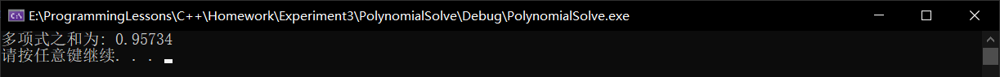

# 前言
- 上机作业的提交方式
    - 把源程序代码（.cpp文件）和程序正确运行的界面截图，以附件形式发到我的邮箱：jiangz@ujs.edu.cn.
      - 邮件标题：完整学号+姓名
        - 3180612019+张宇凡
> 注意：邮件标题必须按照指定方式命名！！！否则不予统计成绩！
# 上机2
## 题目1
将一个三位数(假设个位数不为0)的个位数和百位数进行交换;该数通过键盘输入,请编写代码实现
```C++
	int num;
	cout << "请输入一个三位数: ";
	cin >> num;
	num = (num % 10) * 100 + (num / 10 - (num / 100) * 10)*10 + (num / 100);
	cout << "经交换后输出的数为:" << num << endl;
```
- / 整除(两个整型数据)
  - $624/100=6$
- % 取余
  - $624\%100=24$

## 题目2
```C++
#include "cmath"
#include <iostream>
using namespace std;
int main()
{
	double a, b, c, d;
	cout << "请依次输入多项式的系数abc:  " ;
	cin >> a >> b >> c;
	d = b * b - 4 * a * c;
	cout << "一元二次方程"<<a<<"x**2+"<<b<<"x+"<<c<<"的解为:" << endl;
	if (a == 0)
		cout << "x=" << -c / b << endl;
	else {
		if (d >= 0)
			cout << "x1=" << (-b + sqrt(d)) / (2 * a) << "  x2=" << (-b - sqrt(d)) / (2 * a) << endl;
		else
			cout << "x1=" << (-b) / (2 * a) << "+" << (sqrt(-d)) / (2 * a) << "i" << endl << "x2=" << (-b) / (2 * a) << "-" << (sqrt(-d)) / (2 * a) << "i" << endl;
	}
	system("pause");
	return 0;
}
```
1. 设计一个程序，从键盘输入十位同学的成绩（0-100），计算其中及格学生的平均成绩。
```C++
#include <iostream>
#include<iomanip>
using namespace std;
int main()
{
	double score[10];	// 存放十名学生成绩
	int countPass = 0;	// 统计及格学生个数
	double sumPass = 0;	// 统计及格学生总分
	double averPass;	// 及格学生均分
	cout << "请依次输入十名同学的成绩:" << endl;
	for (int i = 0; i < 10; i++) {
		cin >> score[i];
		if (score[i] >= 60) {
			countPass++;
			sumPass += score[i];
		}
	}
	averPass = sumPass / countPass;
	cout << "10名同学中有" << countPass << "位学生及格,总分为:" << sumPass << "及格学生均分为:" << setprecision(4) << averPass << endl;
	system("pause");
	return 0;
}
```
- setpresision(i)
  - ```C++
    #include<iomainp>
    ```
  - 保留有效位数i位
    - > 注意:不是保留小数后有效位数而是整体的有效位数

---
# 上机3
- 时间:
  - 周四910节课(6点开始)
- 内容:
  - 课堂练习12,13,14题

## for循环


## 题目1(T12,100内各数字之积小于各数字之和)
```C
void main()
{
	int i,mul,sum ,t;
	for(i=1;i<100;i++)
	{
		t=i;   
 mul=1__  ;  sum=0    	;	
while(t!=0)
		{
			mul*=t%10;
			sum+=t%10;
			   t/=10;       		
         }
		if(mul<sum) printf(“%d  “,i);
}
```
- 个人解决方案:
```C++
#include<iostream>
using namespace std;

int main()
{
	int i;			// 计数器
	int mul, sum;	// 各位之积/和
	int t;			// i的临时容器
	cout << "100以内满足“各位数字之积小于数字之和”的整数如下:" << endl;
	for (i = 1; i < 100; i++)	// 遍历1 -> 100
	{
		t = i;					// 临时取出当前遍历数i
		mul = 1;  sum = 0;		// 初始化乘积,和
		while (t != 0)	
		{
			mul *= t % 10;		// 取出当前最低位做乘
			sum += t % 10;		// 取出当前最低位做和
			t /= 10;			// 舍弃当前最低位
		}
		if (mul < sum)
			cout << i << " ";
	}
	system("pause");
	return 0;
}
```
  - 运行结果
    

---
## 题目2(T13)
- 13.编写程序，求
  - $x=1-\frac{1}{22} + \frac{1}{333} - \frac{1}{4444} + \frac{1}{55555} ……+ \frac{1}{999999999}$

```C++
#include<iostream>
using namespace std;

int main()
{
	double x = 0;				// 多项式结果
	for (int i = 1; i < 10; i++) {
		double denominator = 0;	// 当前项分母(用double是为了让1/denominator为double类型数据)
		for (int t = 1; t <= i;t++) {
			denominator += i * pow(10, t - 1);
		}
		x += (1 / (denominator)) * pow(-1, i + 1);
	}
	cout << "多项式之和为: " << x << endl;
	system("pause");
	return 0;
}
```
- 运行结果
  

## 题目3(T14)类水仙花数
- 14.数学中有一种水仙花数（3位数），它本身恰好等于其各位数值的立方和，
  - 比如：$153 = 1^3 + 5^3 + 7^3$ 
    - 153便是水仙花数。
- 那么是否存在这样的四位数，它本身也恰好等于其各位数值的四次方之和。
	- 试编程求这样的四位数。
```C++
#include<iostream>
using namespace std;

int main()
{
	int t;			// 计数器的临时容器
	for (int i = 1000; i < 10000; i++) {
		t = i;
		int sumPow = 0;	// 当前数各位4次方之和
		while (t != 0) {
			sumPow += pow(t % 10, 4);
			t /= 10;	// 舍弃最低位
		}
		if (i == sumPow)
			cout << i << " ";
	}
	cout << endl;
	system("pause");
	return 0;
}
```
- 运行结果
  

## 题目4(T15)
- 15.每个苹果0.8元，第一天买2个苹果，
  - 第二天买前一天的2倍，
  - 直至购买的苹果个数达到不超过100的最大值。
  - 编写程序求每天平均花多少钱？

---
# 上机4

---
## 题目1 完数
- 一个数如果恰好等于除它本身外的因子之和,这个数就称为完数
- 要求按如下格式输出:
```
6->1,2,3
```
```C++
#pragma once
// 有头结点的双向循环列表
#include<iostream>
using namespace std;

template <class T>
class List;	// 前向引用,用于声明友元

// 结点类
template <class T>
class ListNode {
	T valueLN;
public:
	ListNode<T>* nextLN;
	ListNode<T>* priorLN;
	ListNode() {			// 空构造函数,用于创建头结点
		valueLN = NULL;
		nextLN = NULL;
		priorLN = NULL;
	}
	
	ListNode(T valueT){		// 含参构造函数,用于创建普通结点
		valueLN = valueT;
		nextLN = NULL;
		priorLN = NULL;
	}
	T getValueLN() {		// 获取结点数据值
		return valueLN;
	}
	friend class List<T>;
};

// 链表类
template <class T>
class List {
public:
	ListNode<T> headLN;
	List() {		// 空构造函数,用于创建空链表
		headLN = ListNode<T>();
		headLN.nextLN = &headLN;
		headLN.priorLN = &headLN;
	}
	void addLN(T valueLN) {	// 加入一个结点
		ListNode<T>* LN = new ListNode<T>(valueLN);
		LN->priorLN = headLN.priorLN;
		LN->nextLN = &headLN;
		headLN.priorLN->nextLN = LN;
		headLN.priorLN = LN;
	}
};

```
```C++
#include"list.h"
#include<iostream>
#include<string>
#include<sstream>
using namespace std;

string itos(int i) {
	stringstream s;
	s << i;
	return s.str();
}

int main()
{
	for (int i = 1; i <= 1000; i++)	// 第一个循环遍历1-1000所有的数
	{
		int sumFactor = 0;
		for (int j = 1; j < i; j++)
		{
			if (i % j == 0)
				sumFactor += j;
		}
		if (sumFactor == i) {
			List<int> factorList;
			for (int k = 1; k < i; k++) {
				if (i % k == 0) {
					factorList.addLN(k);
				}
			}
			cout << i << "->";
			ListNode<int>* p = factorList.headLN.nextLN;
			while (p != factorList.headLN.priorLN) {
				cout << p->getValueLN() << ",";
				p = p->nextLN;
			}
			cout << p->getValueLN() << endl;

		}
			
	}
	system("pause");
	return 0;
}
```

---
## 题目2 菱形
```C++
#include<iostream>
using namespace std;

int main()
{
	int lineNum;				// 菱形行数
	int correctInput = 0;		// 正确输入
	cout << "请输入一个奇数作为菱形的行数: ";
	while (!correctInput) {		// 当输入不正确时选择0重新输入或2放弃
		try {
			cin >> lineNum;
			int functSelect;	// 选择
			if (lineNum % 2 != 1) {
				cout << "该输入并非奇数,输入下列选项并回车以选择相应功能:\n0:重新输入奇数行数;1:退出" << endl;
				cin >> functSelect;
				if (functSelect == 1)
					correctInput = 2;		// 放弃
				else if (functSelect == 0) {}	// 什么都不做,correctInput仍为0,继续循环
				else {
					cout << "您选择的功能不存在,程序已退出" << endl;
					correctInput = 2;	// 相当于放弃输入
				}
			}
			else correctInput = 1;
		}
		catch (exception e) {
			cout << e.what() << endl;
		}
	}
	if(correctInput == 1){
		for (int b = 1; b <= (lineNum + 1) / 2; b++)
		{
			for (int c = 1; c <= (lineNum + 1) / 2 - b; c++)
				cout << " ";
			for (int c = 1; c <= (b * 2) - 1; c++)
				cout << "*";
			cout << endl;
		}
		for (int b = (lineNum + 1) / 2 + 1; b <= lineNum; b++)
		{
			for (int c = 1; c <= b - (lineNum + 1) / 2; c++)
				cout << " ";
			for (int c = 1; c <= (lineNum + 1 - b) * 2 - 1; c++)
				cout << "*";
			cout << endl;
		}
	}
	system("pause");
	return 0;
}
```