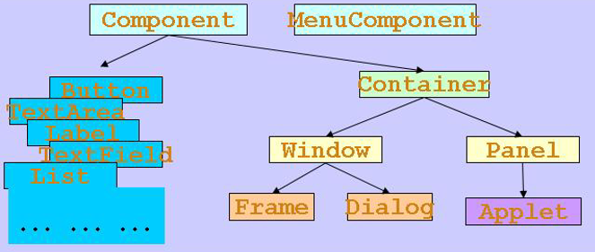
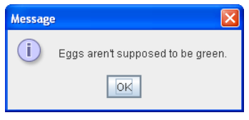
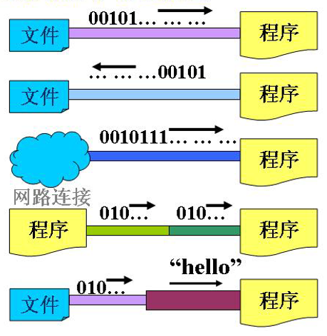
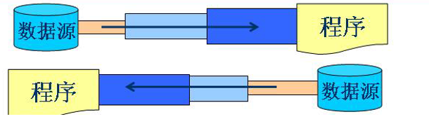
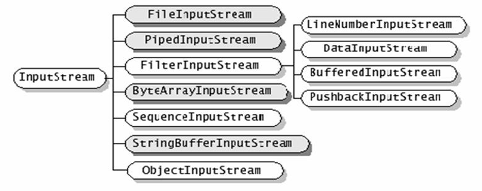
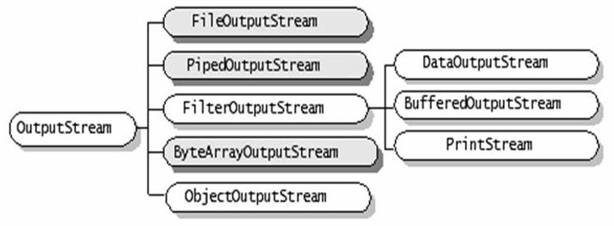

# 前言
## 实验环境
- 软件:
  - IDEAU2020.2
- 编码方案
  - 没有特殊声明的情况下都是UTF-8

---
# API文档
- [在线文档链接](https://www.matools.com/api/java8)
# 各种类的介绍
- Week4
## 任务
- 常用类
- 容器类
- 异常类
## 实验课任务
- 字符串相关类(String StringBuffer)
- 基本数据类型包装类
- Math类
- File类
- 枚举类

## 常用类
### String类
java.lang.String
```java
public final class String
extends Object
implements Serializable, Comparable<String>, CharSequence
```

---
#### 实现了以下接口
- Serializable
- CharSequence
- Comparable< String >

---
#### 概述
- String类代表字符串。   
  Java程序中的所有字符串文字（例如"abc" ）都被实现为此类的实例。 
-  字符串不变; 它们的值在创建后不能被更改。 
-  字符串缓冲区支持可变字符串。 因为String对象是不可变的，它们可以被共享。 例如： 
```java
 String str = "abc";
```
相当于： 
```java
     char data[] = {'a', 'b', 'c'};
     String str = new String(data);
```

---
#### String类型与其他类型的转换
- [原文链接](https://www.cnblogs.com/mingbai/p/intToString.html)
- 其他类型转String
  ```Java
  String s = String.valueOf( value); // 其中 value 为任意一种数字类型。 
  ```
- String转其他类型
  ```Java
  String s = "169"; 
  byte b = Byte.parseByte( s ); 
  short t = Short.parseShort( s ); 
  int i = Integer.parseInt( s ); 
  long l = Long.parseLong( s ); 
  Float f = Float.parseFloat( s ); 
  Double d = Double.parseDouble( s );
  ```


---
## 随笔


# JavaGUI
- Week5  
## 内容包括
- AWT(Abstract Window Toolkit)
- 组件和容器 
- 布局管理器
- 事件处理
- Java图形
- Window事件

---
## AWT
- 使用AWT所涉及的类一把在java.awt包及其子包中;
- Container和Component是AWT中的两个核心类;
  
     
## Component&Container
- java图形界面最基本的组成成分是Component,该类及其子类对象是可视化的可交互的GUI元素;
- 而Component不能独立存在,要放在Container中存在
- Container子类对象可以容纳其他Component对象
- Container对象使用add方法添加其他Component对象
  - Container作为Component的子类自然地一个Container对象也可添加到另一个Container对象中
- 有两种常用的Container
  - Window  
    其对象表示自由停泊的顶级窗口
  - Panel  
    其对象作为可容纳其他Container的对象不能独立存在,需要放在其他Container中(如Window或Applet)


## Frame&JFrame
- Frame是Window的子类,由Frame或其子类创建的对象为一个窗体
- 常用构造方法
  - 空参
  - Frame(String s) //创建标题栏为字符串s的窗口
  -  

---
## JTextField
文本输入框
- 获取文本输入框内容
  ```Java
  textField.getText();
  ```
  - 获取到的内容判空
  ```Java
  if(textField.getText().equals(""))
  ```

---
## 本周作业:记事本
### 任务
用javaGUI完成记事本的程序功能。

### 具体要求：
- 具有以下菜单项：文件、编辑、设置、版本
- 文件菜单中有：打开、保存、退出的功能，其中涉及到流操作可以只将文件的路径答应出来。
- 编辑菜单中有拷贝、黏贴、剪切功能。
- 设置菜单中可以设置文档文字大小、颜色。
- 版本菜单能够显示版本信息。
- 文本域中提供右键菜单功能。
### 提交方式
项目文件打包作为答案上传

---
### 要求解构分析
- 结构分析
  - 不采用分层结构JLayeredPane仅采用一层结构就够用了
    - 毕竟记事本做得太臃肿也不是什么好事 
  - > 下面自下而上将GUI分层
  - JFrame baseFrame(采用默认的BorderLayout)
    -  baseFrame.add(菜单栏)
      - 菜单栏:Menubar
      - 因为菜单栏可能后续会有扩展,所以将菜单栏的创建封装成一个函数
      - 文件菜单中有：打开、保存、退出的功能，其中涉及到流操作可以只将文件的路径答应出来。
        - 文件菜单file
          -  打开open
          -  新建newFile
          -  保存save
          -  退出
       - 编辑菜单
         - 拷贝copy
         - 粘贴paste
         - 剪切cut
       - 设置菜单
          - 设置文档文字大小setTextSize
          - 设置文字颜色setTextColor
       - 版本version
         - 显示版本信息   

    -  baseFrame.add(文本区域)
      - 文本区域始终不改变形态,设置成一个静态对象 
        - static TextArea textArea;  
      - 文本区域也要添加功能,所以添加文本区域也封装成一个函数
      - 可以右键菜单

---
### 实验随笔
- JTextField
  - 获取内容
    ```Java
    textField.getText();
    ```
    - 判空
      ```Java
      if(textField.getText().equals(""))
      ```
- 界面构建好之后重新设置组件大小或者加入新的组件应当重载面板
  ```Java
  containerName.revalidate();
  ```
- 弹出简单的提示对话框
  ```Java
  JOptionPane.showMessageDialog(baseFrame, "请输入特殊点纵坐标");
  ```
  - 
- 


---
## 随笔
- 不等列的二维数组
  - java中可以使用不等长的二维数组
    ```java
        public static void main(String[] args){
          int a[][]=new int[5][];
          a[0]=new int[4];
          for(int i=0;i<a.length;i++){
            System.out.println(a[i]);
          }
        }
    ```
   - 输出结果:
      ```
      [I@1b6d3586
      null
      null
      null
      null
      ```
- JFrmae默认布局模式为BoarderLayout

---
# 流
- Week6
## 本节内容

---
## Java流输入输出原理

- 在java程序中,对于数据的输入/输出操作以"流"(stream)方式进行;
- J2SDK提供了各种各样的"流"类,用以获取不同种类的数据;
- 程序中通过**标准**的方法输入或输出数据
---
- java.io 包中定义了多个流类型(类或抽象类)来实现输入/输出功能;  
  可以从不同的角度对其进行分类:
  - 按数据流的方向不同可以分为输入流和输出流
  - 按数据单位不同可以分为字节流和字符流
  - 按照功能不同可以分为节点流和处理流
---
- J2SDK 所提供的所有流类型位于包java.io内部分别继承自一下四种抽象流类型
  |   | 字节流 | 字符流 |
  | - | - | - |
  | 输入流 | InputStream | Reader |
  | 输出流 | OutputStream | Writer |
---
- 节点流为可以从一个特定的数据源(节点)读写数据(如:文件,内存)
  
- 处理流是"连接"在已存在的流(节点流或处理流)之上,通过对数据的处理为程序提供更为强大的读写功能;
  

---
##  InputStream
- 继承自InputStream的流都是用于向程序输入数据,且数据的单位为字节(8 bit):  
  下图中深色为节点流,浅色为处理流
  
```Java
这里应当有一个示例
```

---
## OutputStream
- 继承自OutputStream的流适用于程序中输入数据,且数据的单位为字节(8 bit);  
  下图中深色为节点流,浅色为处理流
  
```Java 
// 向输出流中写入一个字节数据,该字节数据为参数b的低8位
void write(int b) throws IOException

// 将一个字节类型的数组中的数据写入输出流
void write(byte[] b) throws IOException

// 将一个字节类型的数组中的从指定位置(off)开始的
// len个字节写入到输出流
void write(byte[] b, int off, int len) throws IOException

// 关闭流释放内存资源

```

---
# 线程
- Week7
## 线程概述
- 线程与进程
  - 进程就是一个运行中的程序。
  - 一个进程中可以有多个线程，线程是CPU调度和分派的基本单位。
    - 我们可以理解为线程就是程序运行中的一条路径。

---
- 多线程存在的意义
  - 允许多个线程并发执行，提高程序运行效率。
    - 例如：迅雷多线程下载，QQ多个人同时聊天，凌波多个人同时共享屏幕。

---
- 线程是操作系统的概念，线程也称为轻量级进程（light-weight process，LWP），是CPU的基本使用单元，它的轻量级名称是和进程相关的。
  - 线程由线程ID、程序计数器、寄存器和堆栈组成
  - 多个线程可以共享代码段、数据段和诸如打开的文件等系统资源。  
    - 而传统的进程其实就是单线程控制程序，每个进程都有自己的代码段、数据段和其他系统资源。
      - 这无疑使得每个进程管理更多的内容，从而称为重量级进程。
      - “轻量”是指线程没有独自的存储空间，而是和同一个进程的多个线程共享存储空间。

---
## 线程的使用
- Java的多线程机制提供了两种方式实现多线程编程：
  - 一种是通过继承 java.long.Thread 类来实现，
  - 另一种是通 过实现Runnable接口实现。

---
###  继承Thread类创建线程
- Thread类为Java实现多线程提供了简单的方法。
  - Thread类已经具备了运行多线程所需要的资源，
    - 用户只需要重载该类的run()方法，把需要使用多线程运行的代码放入该方法。这样这些代码就可以和 其他线程“同时”存在，
    - 创建线程对象并用该对象调用start()方法则线程开始运行。
      - start()方法提供了启动线程和线程运行所需要的框架。

---
## 加锁
- 关键字:
  ```Java
  synchronized
  ```
### 给代码段加锁
```Java
        // 对类的当前对象加锁
        synchronized(this){
            temp = count;
            temp = temp - 500;
            count = temp;
            System.out.println("kids:The current count is:"+count);
        }
```

---
## 线程随笔
- ```Java 
  object.wait();
  ```
  - 该对象执行该操作后,该对象释放占用资源的占有权
  - 该对象进入深睡眠状态直至被唤醒
- ```java
  Object.notify();    // 只能通知一个沉睡的对象
  Object.notifyAll(); // 通知所有沉睡的对象
  ```
  唤醒需要占用该对象占用资源的深睡眠状态的对象
- > 需要注意的是无论是wait还是notify,都需要放在synchronized代码块中
  - > 毕竟要限制资源访问嘛


- ```Java
  Math.random();
  ```
  生成一个0-1之间的数据


---
### 给函数加锁
- 锁加在了当前函数所在类的当前实例上
  - 即与之前加在 this 上的效果是一致的


---
# 网络编程
- 网络编程与网站编程
  - 网络编程
    - 构建多台电脑之间的通信
    - 主(Server)从(Client)
      - C/S架构
  - 网站编程
    - 构建一台电脑与多台电脑之间的通信
      - 主(Server)和Browser
        - B/S架构

---
## Socket编程
- 电脑端口
  - 65535个端口
    - 1-1024基本上都被系统使用

---
### 案例分析1 UDPTest
#### UDP
- Internet 协议集支持一个无连接的传输协议，
- 该协议称为用户数据报协议（UDP，User Datagram Protocol）。
- UDP 为应用程序提供了一种无需建立连接就可以发送封装的 IP 数据包的方法。
- Internet 的传输层有两个主要协议，互为补充。
  - 无连接的是 UDP，它除了给应用程序发送数据包功能并允许它们在所需的层次上架构自己的协议之外，几乎没有做什么特别的事情。
  - 面向连接的是 TCP，该协议几乎做了所有的事情。

---
#### 功能

---
#### 发送端定义
```Java
import java.net.DatagramPacket;
import java.net.DatagramSocket;
import java.net.InetAddress;

public class UDPSender {
    public static void main(String[] args) throws Exception {
        // 定义一个指定端口号为3000的发送端DatagramSocket对象
        DatagramSocket client = new DatagramSocket(3000);
        // 定义要发送的数据
        String str = "hello world";
        // 定义一个DatagramPacket数据报对象，封装发送端信息以及发送地址
        DatagramPacket packet = new DatagramPacket(str.getBytes(),
                str.getBytes().length,
                InetAddress.getByName("localhost"),
                8900);
        System.out.println("开始发送信息...");
        client.send(packet); // 发送数据
        byte[] buff = new byte[1024];
        DatagramPacket receivepacket =
                new DatagramPacket(buff,buff.length);
        client.receive(receivepacket);
        String string = new String(receivepacket.getData(),0,receivepacket.getLength());
        System.out.println(string);
        client.close();      // 释放资源
    }
}
```
- Datagram 数据报
- Socket 套接字
  - 所谓套接字(Socket)，就是对网络中不同主机上的应用进程之间进行双向通信的端点的抽象。
  - 一个套接字就是网络上进程通信的一端，提供了应用层进程利用网络协议交换数据的机制。
  - 从所处的地位来讲，套接字上联应用进程，下联网络协议栈，是应用程序通过网络协议进行通信的接口，是应用程序与网络协议根进行交互的接口
---
- DatagramSocket
  - 此类表示用于发送和接收数据报数据包的套接字。
  - 数据报套接字是分组传送服务的发送或接收点。 
    - 在数据报套接字上发送或接收的每个数据包都被单独寻址和路由。 
      - 从一个机器发送到另一个机器的多个分组可以不同地路由，并且可以以任何顺序到达。
  - send(DatagramPacket p)
    - 返回类型
      - void
    - 功能
      - 从此套接字发送数据报包。
  - ```Java
    public void receive(DatagramPacket p)
             throws IOException
    ```
    - 从此套接字接收数据报包。
    - 当此方法返回时， DatagramPacket的缓冲区将填充接收到的数据。

---
- DatagramPacket
  - 该类表示数据报包
  - 数据报包用于实现无连接分组传送服务。 
  - 仅基于该数据包中包含的信息，每个消息从一台机器路由到另一台机器。 
  - 从一台机器发送到另一台机器的多个分组可能会有不同的路由，并且可能以任何顺序到达。 
  - 包传送不能保证。
- InetAddress
  - 此类表示Internet协议（IP）地址。
  - IP地址是由IP使用的32位或128位无符号数字，构建UDP和TCP协议的低级协议。
  - InetAddress的一个实例由一个IP地址和可能的相应主机名组成（取决于它是用主机名构造还是已经完成了反向主机名解析）。
  - getByName(String host)
    - 返回类型
      - static InetAddress
    - 功能
      - 确定主机名称的IP地址。
---
```Java
import java.net.DatagramPacket;
import java.net.DatagramSocket;

public class UDPReceiver {
    public static void main(String[] args) throws Exception {
        // 定义一个指定端口号为8900的接收端DatagramSocket对象
        DatagramSocket server = new DatagramSocket(8900);
        // 定义一个长度为1024的字节数组，用于接收数据
        byte[] buf = new byte[1024];
        // 定义一个DatagramPacket数据报对象，用于封装接收的数据
        DatagramPacket packet = new DatagramPacket(buf, buf.length);
        System.out.println("等待接收数据...");
        while (true){
            // 等待接收数据报数据，在没有接收到数据之前会处于阻塞状态
            server.receive(packet);
            // 调用DatagramPacket的方法获得接收到的信息,并转换为字符串形式
            String str = new String(packet.getData(),
                    0, packet.getLength());
            System.out.println(packet.getAddress()+ ":"
                    + packet.getPort()+"发送消息："+str);
            DatagramPacket returnpacket = new DatagramPacket(
                    "I get it".getBytes(), "I get it".length()
                    ,packet.getAddress(),packet.getPort());
            server.send(returnpacket);
        }
    }
}
```

---
# MyBatis
## 下载
- [下载链接](https://github.com/mybatis/mybatis-3/releases")
  


---
# Spring

---
## 1.1 概述
- Spring 是当前主流的 Java Web 开发框架，它是为了解决企业应用开发的复杂性问题而产生的;

---
### 1.1.1 什么是Spring
- 一个分层的 Java SE/EE full-stack (一站式)轻量级开源框架


----
# Java基础备课笔记学习
## 1.2 Java开发环境搭建
### jdk与jre
- JDK(Java Development Kit)    
  Java开发工具，包含开发Java程序的所有组件，**包含JRE**
- JRE(Java Runtime Environment)    
  Java运行环境，如果要运行Java程序，就需要JRE的支持
- 常用组件
  - src.zip	  	  
    Java是一门开源的语言，其源代码都在这个压缩包中  
  - rt.jar <br/>
    Java的基础核心类库，我们编写Java程序时使用的class都在这个jar包中
  - javac.exe	  	  
    编译器，将.java源代码编译为.class文件
  - java.exe  <br/>     	  	
    虚拟机，运行Java程序的工具
  - jar.exe	  <br/>    	
    将class文件打成jar包的工具
  - javadoc.exe	     
    生成帮助文档的工具
---
### 环境变量
- 环境变量是指在操作系统中用来指定操作系统运行环境的一些参数
#### path
- 如果想在任意目录下运行一个程序，我们就需要将程序所在的路径配置在path环境变量中。 
- 通常我们会将javac.exe所在目录配置到path中，因为我们需要在任意目录下都能编译Java源文件。
- 配置完成之后可以在命令行输入javac测试，如果显式帮助信息则是配置成功。
- ---
#### classpath
- Java虚拟机运行时加载类的路径。JDK5之后不配置默认为当前目录“.”。如使用JDK1.4或以下版本时需要人工配置。
- 暂时不需要配置，默认加载当前目录下的所有class文件。 
> 环境变量删除:
> - CLASSPATH
> - .;%JAVA_HOME%\lib\dt.jar;%JAVA_HOME%\lib\tools.jar
---
#### 配置方式
- 命令行
  - 点击屏幕左下角开始 – 运行 – 输入cmd – 在命令行中直接输入命令进行修改
  - 查看变量值：set 变量名
  - 设置变量值：**set 变量名=变量值**，
    - 多个值之间使用分号“;”分割，引用变量时使用“%变量名%”形式
  - 注意：此种方式**仅适用于当前窗口**
- 我的电脑(此电脑)
  - 鼠标右键点击我的电脑 – 属性 – 高级 – 环境变量
  - 找到要修改的变量将其值修改，此种方式永久有效 
- 注意：
  - 配置环境变量之后可以查看编译器(javac.exe)和虚拟机(java.exe)版本，**虚拟机版本不能低于编译器**。
  - 使用哪个版本的编译器和虚拟机取决于path环境变量，如果虚拟机版本过低，可以通过环境变量来修改。
  - 编译器版本查看方式：javac –version
  - 虚拟机版本查看方式：java –version
  > 由此方法发现了我的虚拟机版本低于我的编译器版本
  > - 原因是我装了两个jdk,配置环境变量的时候配置串了
  > - 于是我把jdk配置改成了openjdk
---
## 1.3 第一个Java程序
### 编写源代码
- 新建文本文档，扩展名改为.java，在文件中写入代码。

- 注意：
  - windows操作系统默认是隐藏已知文件扩展名的。
  - 请测试新建一个文本文档，如果看到的文件名是“新建 文本文档”而不是“新建 文本文档.txt”，那么说明你的扩展名被隐藏了。
  - 请选择菜单栏中的 工具 – 文件夹选项 – 查看 – 下拉滚动条找到“隐藏已知文件扩展名” – 取消掉这一项。
---
### 编译字节码文件
- 左键单机屏幕左下角开始 – 运行 – 输入cmd启动命令行窗口
  - > 或Win+R,输入cmd并回车 
- 使用DOS命令进入源代码所在目录
  - cd目录路径 
- 使用编译器（javac.exe）编译源代码
  - javac 文件名.java
  - 编译后在该目录中会出现扩展名为class的字节码文件
  - > 这里我编译报错" 编码GBK的不可映射字符",因为我的项目设置里编码类型选的是UTF-8,所以这里的编码命令应当是
    > ```
    > javac -encoding UTF-8 文件名
    >  ```


---
## 3.21 包
- 如果一个类被声明为**public**，那么必须和文件名同名
- 导入类的时候
  - 直接导入该类所属包的全部类
    - 优先匹配当前包中的类,若无再匹配导入包中的类  
  - 导入具体类名
    - 不论当前包中是否有同名类都匹配导入的类
- 无包的类可以使用有包的类，有包的类不能使用无包的类。