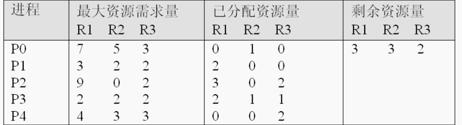
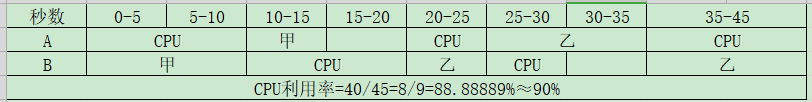

# 前言
## 实验环境
- 软件:
  - VisualStudio2019Community


---
# 第1章

## 随堂测验-2

1. 采用**微内核**结构时,将OS封城用于实现OS基本功能的内核和提供各种服务的服务器两个部分
2. 操作系统的发展过程是**管理程序，原始操作系统，操作系统**
3. 在目态(用户态)执行的是**命令解释程序**
4. **火箭飞行控制系统**是实时控制系统。
5. 为实现多道程序设计需要有**更大的内存**
6. 特权指令**只能在管态下**执行
7. 实时系统的响应时间是由**控制对象所能接受的时延**确定的。
8. 在分时系统中，当用户数目为100时，为保证响应时间不超过2 s，此时的时间片最大应为**20 ms**
9. 在设计分时操作系统时，首先要考虑的是**交互性和响应时间**
10. 在OS中采用多道程序设计技术，能有效地提高CPU、内存和I/O设备的**利用率**
11. 分时系统的响应时间(及时性)主要是根据**用户所能接受的等待时间**确定的
12. 多个用户在终端设备上以交互方式输入、排错和控制其程序的运行，该操作系统是**分时操作系统**
13. UNIX操作系统是著名的**分时系统** 
14. 在多道批处理系统中，为了充分利用各种资源，系统总是优先选择**计算型和I/O型均衡的**多个作业投入运行。
15. 批处理系统的主要缺点是**无交互性**
16. 操作系统是计算机系统中必不可少的系统软件。(√)
17. 与分时系统相比，实时操作系统对响应时间的紧迫性要求高得多。(√)
18. 多道程序设计是利用了CPU和通道并行工作来提高系统的效率。(×)
19. 在分时系统中，响应时间≈时间片×用户数，因此为改善系统的响应时间，常用的原则是使时间片越小越好。(×)
20. 系统调用是操作系统和用户进程的接口，库函数也是操作系统和用户的接口。(×)
- 库函数只有一部分用到系统调用,但是大部分的库函数没有用到系统调用(不涉及内核的操作就不会进行系统调用)

## 第一次作业

### 什么是操作系统,他在计算机中的作用是什么?
- 操作系统是一个系统软件;
- 操作系统是计算机系统中不可或缺的基础系统软件;
- 其管理和空值计算机中的软硬件资源,是计算机资源的管理者,控制者和执行者,提供了与用户直接交互的接口;

### 为什么对作业进行批处理可以提高系统效率

- 用户把要计算的问题,数据和作业说明书一起交给操作员,操作员将一批算题输入到计算机,然后由操作系统来控制执行;
- 通常,采用这种批量化处理作业技术的操作系统称为批处理操作系统;
- 批处理操作系统又分为单道和多道批处理系统;
- 由于批处理系统的作业之星没有与用户的交互,避免了系统等待时间,提高了系统效率;
- 多道批处理可以将适用不同资源的走也搭配进入系统执行,从而使用不同资源的作业搭配进入系统执行,从而使多个作业分别占用不同资源同时执行,踢桃了资源利用率和系统效率;

### 批处理系统,分时系统和实时系统各有什么特点?各适用于哪些方面?

- 批处理系统是将作业呈批交给计算机系统,用户无需干预,资源利用率高,
  - 适用于大型作业且不需要人工干预的场合;
- 分时系统具有独立性,及时性,交互性和同时性,
  - 适用于多终端用户的场合;
- 实时系统对随机发生的外部事件作出及时的相应并做出处理,适用于较少有人敢于的实时监控系统


---
# 第2章 进程与线程

## 第2次作业
---
### 为什么要引入进程概念？它与程序有何区别？

- 为什么要引入进程的概念:

  - 由于程序是静态的,而程序执行是一个动态过程。 为了使程序在多道程序环境下能并发执行,并对并发执行的程序加以控制和描述,在操作系统中引入了进程概念。
  - 进程与程序的主要区别是进程是动态的,有生命周期;而程序是静态的。
  - 程序的缺点：无法表示系统的动态特性;
    - 如：两个用户同时执行CC编译自己的程序，某时刻程序的执行状态难以刻画（运行、就绪、等待）。
  - 引入进程（程序＋处理对象）:可表示执行动态特性。
- 进程和程序的区别: 
  - 进程是一段程序的一次运行活动：动态概念；有一定“生命期”。 
  - 程序是一组指令的集合：静态概念
  - 程序段运行在两个**不同数据集合**上，就是两个不同的进程； 
  ---
  - 一个程序可以对应多个进程； 
  - 一个进程至少要对应一个程序，或对应多个程序，多个进程也可对应相同的程序。
  - 进程具有并行特征（独立性和异步性）
  - 进程是资源分配的**基本单位**
---
 ###  进程的含义是什么？进程存在的标志是什么？
- 进程的定义（**程序段+数据**）  
  能和其它程序并行执行的程序段在某数据集合上的**一次运行过程**，它是系统资源分配和调度的一个**独立单位**。 
- 进程存在的标志
  - 进程存在的唯一标志是PCB
  - 进程控制块（PCB）[process Control Block]：
    - 描述和标志进程（创建进程时，建立PCB；
    - 完成任务被撤销时，撤销PCB。） 
---
### 现代操作系统一般都提供多任务的环境，为支持进程的状态变迁，系统应至少提供哪些进程控制原语？它们具体完成什么操作。
- 为支持进程的状态变迁，系统应至少提供哪些进程控制原语？
  - 在进程的整个生命周期中会经历多种状态。进程控制的主要职能是对系统中所有进程实施有效地管理它具有创建新进程、撤销已有进程、实现进程的状态转换等功能。
  - 在操作系统内核中有一组程序专门用于完成对进程的控制这些原语至少需要包括:
    - 进程创建原语
      - 创建进程原语总是先为新建进程申请一空白 PCB ,并为之分配惟一的数字标示符,使之获得 PCB 的内部名称;
      - 若该进程所对应的程序不在内存中,则应将它从外存储器调入内存:并将该进程有关信息(如进程外部名、优先级数、程序入口地址和所需资源请单等)填入 PCB 中,然后置该进程为就绪状态,并将它排入就绪队列和进程家族队列中。 
    - 进程撤销原语
      - 以调用者提供的标志符 n 为索引,从 PCB 集合中检索出被撤消进程的 PCB ,获得该进程的内部状态标志。然后找到该进程所在的队列,将它从该队列中消去,并撤消属于该进程的一切“子孙进程”;
      - 若有父进程则从父进程 PCB 中删除指向该进程的指针,并释放撤消进程所占用的全部资源,或者将其归还给其父进程,或者归还给系统。
      - 若被撤消的进程处于执行状态,应立即中断该进程的执行,并设置调度标志为真,以指示该进程被撤消后系统应重新调度。 
    - 进程阻塞原语
      - 开始时,进程正处于执行状态,因此首先应中断 CPU 执行,并保存该进程的 CPU 现场,然后把阻塞状态赋于该进程,并将它插入到具有相同实体的阻塞队列中。  
    - 进程唤醒原语
      - 先把被唤醒进程从阻塞队列中移出,设置该进程当前状态为就绪状态,然后再将该进程插入到就绪队列中。 
---
### 什么是线程？线程与进程有何区别？线程与进程相比，在实现并行性机制方面有何优势？
- 什么是线程:
  - 线程也叫轻量级的进程,它是一个基于进程的运行单位;
  - 它可以不占有资源,一个进程可以有一个线程或者多个线程 ( 至少一个 ) ,这些线程共享此进程的代码、 Data 和部分管理信息,但是每个线程都有它自己的 PC 、 Stack 和其他。 
- 线程与进程的区别:  
  线程与进程的区别主要表现在以下几个方面: 
  - 地址空间和资源不同:
    - 进程间相互独立;
    - 同一进程的各个线程之间却共享它们。 
  - 通信不同:
    - 进程间可以使用 IPC 通信;
    - 线程之间可以直接读写进程数据段来进行通信,但是需要进程同步和互斥手段的辅助,以保证数据的一致性。 
  - 调度和切换不同:
    - 线程上下文切换比进程上下文的切换要快得多。 
- 线程在实现并行性机制方面有何优势:
  - 并行执行涉及上下文切换、数据共享和通信等因素;
  - 由于线程上下文切换开销小,进程内线程可以共享进程中的数据和资源,线程是比进程更小的执行单位,所以在并行性方面,线程比进程更具有优势。
---
# 第3章 互斥与同步
## 3.5 死锁
### 10.6随堂练习
银行家算法中，若出现以下资源分配情况，试问：
- （1）系统是否安全？如果安全，请给出一个安全执行序列，如果不安全，说明理由
- （2）如果进程依次有如下资源请求，系统将怎样进行资源分配？请说明理由。
  - P1(1,0,2)
  - P2(3,3,0)
  - P3(0,2,0)
   

#### 解:
- 将系统中各种资源的总和和此刻各进程对资源的需求数目用向量或矩阵表示出来为:  
  - P0(7,4,3)
  - P1(1,2,2)
  - p2(6,0,0)
  - P3(0,1,1)
  - P4(4,3,1)  
- 当前系统资源剩余量为(3,3,2)满足P1或P3的最大需求,P3当前资源占有量比P1多,先满足P3的需求,P3执行结束后剩余资源量为(5,4,3)
- 当前系统资源剩余量满足P1,P4,P4当前资源占有量比P1多,先

---
## 第三章随堂测验1
- 1.当进程等待的时间结束时,将进程状态改为就绪态所使用的原语是?
  - 1
- 2.临界区是指?
  - 访问临界区的一段代码
- 3. 若果一组并发进程是无关的,则他们?
  - 可以包含想用的程序但是没有共享变量
- 4.设有三个进程共享一个资源,若果每次只允许一个进程使用该资源,用PV操作管理时信号量S的可能取值是?
  - 1,0,-1,-2
  - 每次只允许一个进程使用该资源对应1
  - 全部请求分配则一个在使用两个在等待,对应-2
- 5.设与某资源相关联的信号量初值为3,当前值为1,若M表示该资源的可用个数,N表示等待资源的进程数,则M,N分别是?
  - M表示该资源的可用个数为1
    - 与上一题一致
  - N表示等待资源的进程数,表示0
    - 资源有可用个数就不会有等待进程数
- 6.在单个处理器系统中,可以并发但是不可以并行工作的是?
  - 进程与进程
  - > 以下三组均可以并行:  
      > 处理器与设备可以  
      > 处理器与通道可以  
      > 设备与设备可以  
- 7.关于进程与线程的叙述中,正确的是?
  - 同一进程中的各个线程拥有不同的地址空间
    - (×)
    - 同一个进程中的各个线程共享
  - 系统级线程和用户级线程的切换都需要内核的支持
    - 本身处理器的内核并不参与
  - 线程是资源分配的基本单位,进程是调度的基本单位
    - ×
    - 反了
  - 不管系统是否支持线程,进程都是资源分配的基本单位`
    - √
- 8.在支持多线程的系统中,进程P创建的若干个线程不能共享的是?
  - 进程P中某线程的栈指针
- 9.用V操作唤醒一个等待进程时,被唤醒进程的状态变为?
  - 就绪
- 10.有两个程序:
  - A程序按顺序使用CPU10s,甲5s,CPU5s,乙10s,CPU10s;  
  - B程序按顺序使用设备甲10s,CPU10s,设备乙5s,CPU5s,乙10s;  
  
若他们采用非抢占方式并发执行,并不考虑切换等开销,则CPU的利用率约为?
- 90% 


---
### 判断题
- 1.进程是最小的拥有资源的单位
- 2.用户为每个自己的进程创建PCB,并控制进程的执行过程
  - ×
  - PCB由操作系统创建并控制进程的执行过程
- 3.在UNIX系统中,1#进程是所有用户进程的祖先
  - √ 
- 4.原语是具有独立功能的程序段,它在执行中不能被终端
  - √
- 5.在单处理机中,最多只能哟一个进程处于运行状态
  - √
- 6.进程可以删除自己的PCB表
  - PCB的创建和删除都是有操作系统执行的
- 7.多道程序设计是利用了CUU和通道并行工作来提高系统的小喇叭 
  - ×
- 8.进程和程序一一对应
  - ×
- 9.在采用多道程序设计的系统中,系统的程序刀数越多,系统的效率越高
  - ×
  - 反而容易造成堵塞
- 10.临界区指的是多个并发进程共享的存储区域
  - 临界区指的访问临界资源的代码   


## 10.20 第三章随堂测验2 
### 选择题
- 1.资源静态分配策略可以防止死锁
- 2.产生系统死锁的原因可能是:多个进程竞争资源出现了循环等待
- 3.按序分配资源破坏了死锁产生条件中的:资源循环等待
- 4.m为同类资源数,n为系统中的并发进程数,当n个进程共享m个互斥资源,每个进程最大需求是w,下列情况系统会死锁的是?  
  A. m=5,n=4,w=2 &nbsp; B. m=5,n=4,w=3  
  C. m=3,n=3,w=1 &nbsp; D. m=2,n=3,w=1
  - B
  - 每个并发进程至少占用1个资源,若是B则5-4=1,无论分给哪个进程都不会到达该进程的最大资源
  - 条件应当是$m - n \geq w-1$ or $w = 1$ 
- 5.系统有某类资源
- 6.邮箱的通信方式是一种?通信方式
  - 间接
- 7.死锁的预防是通过破坏产生死锁的四个必要条件来实现的.下列方法中,?破坏了"部分分配"条件
  - 资源静态分配策略
  - 
  - > 资源有序分配->破坏循环等待面
  - > SPOOLing->设备的虚拟分配
- 8.死锁预防策略的是?
    - 资源有序分配阀
- 9.死锁避免策略的是?
  - 银行家算法
- 10.我们吧一段时间内,只允许一个进程访问的资源成为临街资源,一次你下面结论正确的是?
  - 对临街资源,应采取互斥访问方式来实现共享
  - > 只要是程序并发执行,这些并发执行的程序便可以对临界资源实现共享(×)
  - > 为临界资源配上相应的设备控制块后,来实现共享(×)

---
### 判断题
- 1.死锁的处置方式有预防,避免,检测和接触.剥夺资源属于死锁接触,破坏循环等待属于死锁避免;
  - ×
  - 后半句错了,破坏循环等待属于

- 2. 进程同步和进程互斥关于直接和渐渐控制
-  3.PV操作不可中断
   -  √
   -  都是源于操作,不可中断
- 4.银行家算法主要用于解决进程使用设备的死锁问题
  - ×
- 5.产生思索的根本原因是供使用的资源数少于需求数
  - √
  - 太根本了,资源够的话就不用考虑共享了,就不会产生循环等待就不会产生死锁
- 6.进程的互斥和同步总是因为相互制约而同时引起
  - 错
  - 不会同时引起
- 7.利用银行家算法有效预防死锁,所以在操作系统中广为使用
  - ×
- 8.产生死锁的四个必要条件在死锁发生时会同时发生
  - √
- 9.用PV操作可以解决互斥与同步问题
  - √
  - 确实**可以**
- 对信号量S的操作只能通过源于操作进行,对应每一个信号设置了一个等待队列
  - √

---
## 互斥与同步练习
- 1.设有N个进程，共享一个资源R，但每个时刻只允许一个进程使用R。算法如下：
  - 设置一个整型数组flag[N]，
    - 其每个元素对应表示一个进程对R的使用状态，
      - 若为0表示该进程不在使用R，
      - 为1表示该进程要求或正在使用R，
      - 所有元素的初值均为0。
  ```C++
  process Pi{
    …
    flag[i] = 1;
    for (j=0; j<i; j++)
      do while (flag[i]) ;
    for (j=i+1; j<N; j++)
      do while (flag[i]) ;
    use resource R ;
    flag[i] = 0;
    …
  }
  ```
  - 试问该算法能否实现上述功能？为什么？若不能请用P、V操作改写上述算法。
    - 该算法无法实现上述功能:
      - 假设有两个进程执行了flag[i] = 1, 再执行两个for循环等待其他进程的执行完成, 这就形成了循环等待, 永远都不会有进程能申请到资源;
    - 用P, V操作改写上述算法
      ```C++
      semaphore mutex;  // 定义互斥变量
      mutex.value = 1;  /* 变量初始值为1表示该互斥资源总数为1且当前可申请数目为1 */
      Process Pi{
        ...
        P(&mutex);      // 申请一份资源
        use resource R; // 使用资源执行进程
        V(&mutex);      // 释放一份资源
        ...
      }

      ```  

---
- 2.有三个进程R, M, P，
  - R负责从输入设备读入信息并传送给M,
  -  M将信息加工并传送给P，
  -  P将打印输出，
  - 写出下列条件下的并发进程程序描述。
    - (1) 一个缓冲区，其容量为K；
      ```C++
      semaphore mR, mM, mP; // 设置三个进程内部的互斥信号量(mutex)
      int sR, sM, sP;       /* 进程执行时从缓冲区存取数据的数组下标(subscript)[从数组中存取数据没有数组下标怎么存取嘛] */
      TypeInfo buffer[K];   // 定义一个容量为K的缓冲区
                            // TypeInfo表示存取数据的类型
      sR = sM = sP = 0;     // 初始化存取数据数组下标为0
      mR.value = K;         /* 输入信息进程互斥变量资源初值为K,表示缓冲区中的最多K个资源都可以使用 */
      mM.value = mP.value = 0;  /* 传递和输出的互斥信号量的初值为0,表示初始并无资源写入自然没有资源可以参与传递与输出 */
      // 并行进程执行,重复执行三个进程
      cobegin 
        repeat R;
        repeat M;
        repeat P;
      coend
      
      
      // 并行进程定义

      // 读入信息进程R的定义
      Process R{ 
        ...                 // 从输入设备读入信息
        P(&mR);             // 申请一份资源
        buffer[sR] = info;  // 在缓冲区选个位置存入数据
        sR = (sR + 1) % K;  // 设置下一个存入数据的数组下标为循环的当前下标+1
        V(&mM);             /* 进程执行完毕"释放"一份M进程的资源"[其实就是1个R进程执行完毕后M进程的资源数增加了1] */
                            /* 注意这里不能释放R的资源:因为R申请的资源存在缓冲区里呢,得等打印进程执行完才能释放 */
      }

      // 传送进程M的定义
      Process M{
        P(&mM);             // 申请一份资源
        info = buffer[sM];  // 在缓冲区选个位置读取数据 
        ...                 // 对读取到的数据执行相关操作
        buffer[sM] = info;  // 将处理完的数据存回缓冲区
        sM = (sM + 1) % K;  /* 设置下一个读取数据的数组下标为循环的当前下标+1 */
        V(&mP);             /* 进程执行完毕后"释放"一份P进程的资源[原理与注意点与R进程的相应操作一致] */
      }

      // 打印进程P的定义
      Process P{
        P(&mP);             // 申请一份资源
        info = buffer[sP];  // 从缓冲区选个位置读取数据
        ...                 // 执行数据的输出操作
        sP = (sP + 1) % K;  /* 设置下一个读取数据的数组下标为循环的当前下标+1 */  
        V(&mR);             /* "释放"一份R的资源[其实就是数据打印完成后缓冲区的一个数据失效,代表着缓冲区多个位置待存入数据] */
      }
      ```
    - (2) 两个缓冲区，每个缓冲区容量均为K。
      - 进程设计方面大体没变,需要注意的是M进程有两个操作
        - 从缓冲区1读取数据
        - 处理读取到的数据并存入缓冲区2  
         因此这两个操作均要设置互斥信号量
      - 除此之外R进程资源的释放通过M进程从缓冲区1读取完数据后释放
      - P进程执行完毕后释放的应当是M进程的资源2而非之前的R进程的资源
      ```C++
      /* 设置三个进程内部的互斥信号量(mutex) */
      semaphore mR, mM1, mM2, mP; 
      /* 进程执行时从缓冲区存取数据的数组下标(subscript)[从数组中存取数据没有数组下标怎么存取嘛] */
      int sR, sM1, sM2, sP; 
      /* 定义两个容量为K的缓冲区[TypeInfo表示存取数据的类型] */
      TypeInfo buffer1[K], buffer2[K]; 
      sR = sM1 = sM2 = sP = 0;   // 初始化存取数据数组下标为0
      /* 输入信息进程互斥变量资源初值为K,表示缓冲区中的最多K个资源都可以使用 */
      mR.value = mM2.value = K;  
      /* 读取信息进程的互斥信号量的初值为0,表示初始并无资源写入自然没有资源可以参与传递与输出 */       
      mM1.value = mP.value = 0;  
      // 并行进程执行,重复执行三个进程
      cobegin 
        repeat R;
        repeat M;
        repeat P;
      coend
      
      
      // 并行进程定义

      // 读入信息进程R的定义
      Process R{ 
        ...                 // 从输入设备读入信息
        P(&mR);             // 申请一份资源
        buffer[sR] = info;  // 在缓冲区选个位置存入数据
        sR = (sR + 1) % K;  // 设置下一个存入数据的数组下标为循环的当前下标+1
         /* 进程执行完毕"释放"一份M进程的资源"[其实就是1个R进程执行完毕后M进程的读取数据的资源数增加了1] 
         [注意这里不能释放R的资源:因为R申请的资源存在缓冲区里呢,得等打印进程执行完才能释放]*/
        V(&mM1);            

      // 传送进程M的定义
      Process M{
        P(&mM1);            // 申请一份读数据资源
        info = buffer[sM1]; // 在缓冲区1选个位置读取数据 
        /* 设置下一个读取数据的数组下标为循环的当前下标+1 */
        sM1 = (sM1 + 1) % K;
        /* 进程执行完毕后"释放"一份R进程的资源 */
        V(&mR);             
        ...                 // 对读取到的数据执行相关操作
        P(&mM2);            // 申请一份存数据资源
        buffer[sM2] = info; // 将处理完的数据存到缓冲区2
        sM2 = (sM2 + 1) % K;
        V(&mP);
      }

      // 打印进程P的定义
      Process P{
        P(&mP);             // 申请一份资源
        info = buffer[sP];  // 从缓冲区选个位置读取数据
        ...                 // 执行数据的输出操作
        sP = (sP + 1) % K;  /* 设置下一个读取数据的数组下标为循环的当前下标+1 */  
        V(&mM2);            // "释放"一份M存数据的资源           
      ```

---
- 3.假定一个阅览室最多可以容纳100人阅读,读者进入和离开阅览室时,都必须在阅览室门口的一个登记表上注册或注销。假定每次只允许一个人注册或注销,设阅览室内有100个座位。
  - （1）试问：应编制几个程序和设置几个进程？程序和进程的对应关系如何？
    - 应编制一个读者程序。
    - 应设置100个读者进程。
    - 程序和进程的对应关系为一对多($1:N$);具体来讲是$1:100$，
      - 1个读者程序为100个读者进程共享。
  - （2）试用P、V操作编写读者进程的同步算法。
    ```C++
    semaphore inM, outM;  // 设置入出馆互斥量
    PID pool[100];        // 设置1个容量100的进程识别码槽
    int i;
    // 假设初始馆内人数为空则出馆互斥量资源数为0,相应的入馆量资源数为100
    inM.value = 100;  outM.value = 0;
    // 初始化识别号,
    for (i=0; i<100; i++) pool[i]=-1;
    // 定义读者进程
    Process reader(PID procID ){ 
      int i;
      P(&inM);    // 申请入馆资源
      P(&outM);   // 申请出馆资源(毕竟同时只能有一人出/入馆)
      i=0;
      // 寻找进程识别码槽中未被占用的部分
      while (pool[i] != -1) i++ ; 
      pool [i] = procID;
      V(&outM);   // 释放出馆资源
      ...         // 读书(占用资源中)
      P(&outM);   // 申请出馆资源
      pool[i]= -1;// 重置当前位置进程识别码
      V(&outM);   // 释放出馆资源
      V(&inM);    // 释放入馆资源
    }
    ``` 

---
- 4.写一个用信号量解决哲学家就餐问题不产生死锁的算法。
  ```C++
  semaphore chopstick[5]={1，1，1，1，1}；
  ／*哲学家进程*／
  void philosopher(int i){
    while (true){
      P(chopstick[i])；
      P(chopstick[(i+1)％5])；
      …;
      eat； ／*进餐*／ 
      …：
      V(chopstick[i])；
      V(chopstick[(i+1)％5])； 
      …：
      think； ／*思考*／ 
      …； 
    } 
  }
  ```

---
- 5.系统有输入机和打印机各一台，有两进程都要使用它们，采用P、V操作实现请求使用和归还释放后，还会产生死锁吗？若不会，说明理由；若会，你认为应怎样来防止死锁。
  - 会产生死锁
    - 假设两个进程相互使用了两个不同的设备,那么接下来他们使用另一个设备的时候就会因为相互申请不到对方正在占用的资源而产生死锁
  - 防止死锁的方法:
    两个进程定义的时候不独立申请设备,而是进程刚开始就一次性申请两个设备的资源,当只有一个互斥量的时候就不会产生死锁了

---
- 6.若系统有同类资源m个，被n个进程共享
  - 问：当m>n和m≤n时，每个进程最多可以请求多少个这类资源，使系统一定不会发生死锁？
    - $m>n$时
      - 每个进程最多申请$\frac{m-1}{n}+1$个
    - $m≤n$时
      - $m=n$时
        - 每个进程**只能**申请一个
      - $m<n$时
        - 每个进程**最多**申请一个

---
- 7.设系统有某类资源共12个，用银行家算法判断下列每个状态是否安全。如果是安全的，说明所有进程是如何能运行完毕的。如果是不安全的，说明为什么可能产生死锁。
 
  - 状态A
    - 系统剩余资源$=12-2-4-5=1$
    - 先完成进程3回收6个资源,如此一来这剩余的6个资源分配给其余任何一个进程都可执行完毕，因此系统是安全的;
  - 状态B
    - 系统剩余资源$=12-4-2-5=1$，剩余的一个资源不满足人一个进程的最大资源需求,系统不安全;

---
- 8.某银行提供1个服务窗口和10个供顾客等待的座位。顾客到达银行时，若有空座位，则到取号机上领取一个号，等待叫号。取号机每次仅允许一位顾客使用。当营业员空闲时，通过叫号选取一位顾客，并为其服务。请用信号量和P、V操作描述顾客和营业员的互斥与同步。要求写出完整的过程，说明信号量的含义并赋初值。
```C++
semaphore  mutex, empty, full,service；                                 
mutex.value=1; 
empty.value=10;
full.value=0; 
service.value=0; 
cobegin{
   process customer{   
      P(&empty);     
      P(&mutex);  
      ...           // 获取号码;
      V(&mutex);    
      V(&full); 
      P(&service); 
      ...
  }   
  process assistant{
    while(true){
      P(&full); 
      V(&empty); 
      V(&service);
      ...
    }
  }
}coend

```

---
# 第4章
## 第4章随堂测验
- 10.29
### 一,选择题
- 1.用来指示与处理器有关的系统状态，中断装置在保护现场时一定要保护起来的是? 
  - PSW(程序状态字)  
  - 其他选项
    - PCB(进程控制块)  
    - C、SPOOL  
    - D、CCW  

- 2、下列选项中，降低进程优先权级的合理时机是?。
  - 进程的时间片用完  


- 3、在三种基本类型的操作系统中，都设置了?。
  - 进程调度
  - 其他选项
    - 作业调度
      - 主要是批处理器  
    - 优先级调度
      - 对应实时系统
    - 时间片轮转法调度 
      - 对应分时系统

- 4、在批处理系统中除了进程调度外，还应设置?。
  - 作业调度  

- 5、在分时系统中常采用的进程调度算法是?。
  - 时间片轮转法  

- 6、下面关于优先权大小的论述中，正确的是?。
  - 在动态优先权时，随着进程执行时间的增加，其优先权降低  

- 7、单处理机系统中，可并行的是(      )。    
  - II 处理机与设备     
  - III 处理机与通道     
  - IV 设备与设备
  - > 进程与进程不可在单处理机系统中并行 

- 8、下列选项中，降低进程优先权级的合理时机是(　  　)。
  - 进程的时间片用完   

- 9、一个进程被唤醒意味着?。
  - 进程变为就绪态   

- 10、下列进程调度算法中，综合考虑进程等待时间和执行时间的是?
  - 高响应比优先调度算法   1

### 二、判断题（共10题，50分）
- 1、在一单处理机中,最多只能允许有一个进程处于运行状态。   1
- 2、UNIX的进程调度采用的是多级反馈轮转调度算法。1
- 3、处理器亲和性能够有效地提高高速缓存的命中率，但却不能缓解负载不均衡的问题。1
- 4、程序的并发执行是指同一时刻有两个以上的程序，它们的指令都在同一处理器上执行。2
- 5、多个CPU的角色功能平等，没有主从之分，这种多CPU结构称为对称多处理器结构(Symmetric Multi-Processor Architecture)，或简称为SMP结构。1
- 6、多处理器经典调度算法有负载共享调度算法、组调度算法和专用处理器分配调度算法。（5分）1
- 7、在计算机结构中，多处理器结构和多核结构是同一个概念的不同说法，它们的实现原理是相同的。  2
- 8、UNIX系统中0#进程负责进程调度与交换。  1
- 9、实时系统和其它系统的主要区别在于，其处理和控制的正确性不仅仅取决于计算的逻辑结果，而且取决于计算和处理结果产生的时间。（5分）1
- 10、一个进程必须经过长程调度、中程调度和短程调度才能占用处理器。  2
