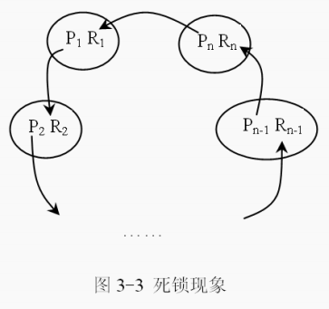
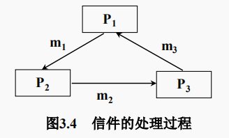
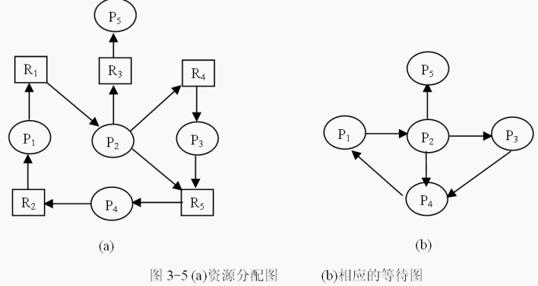
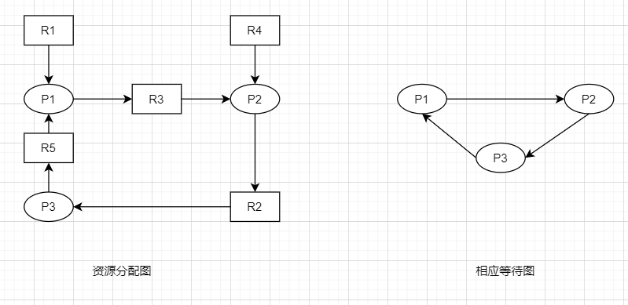
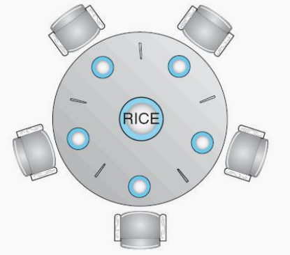
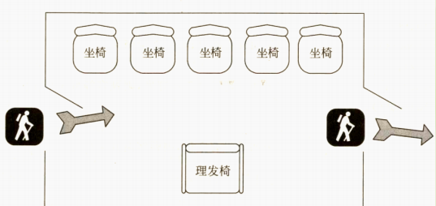
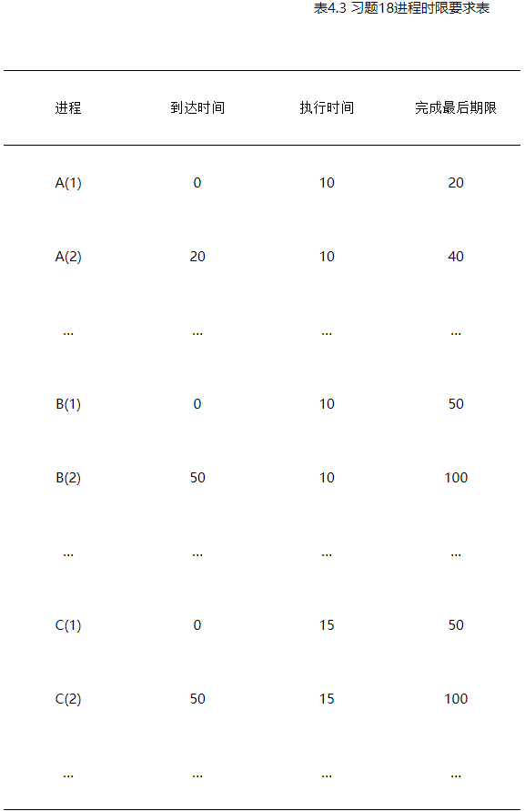
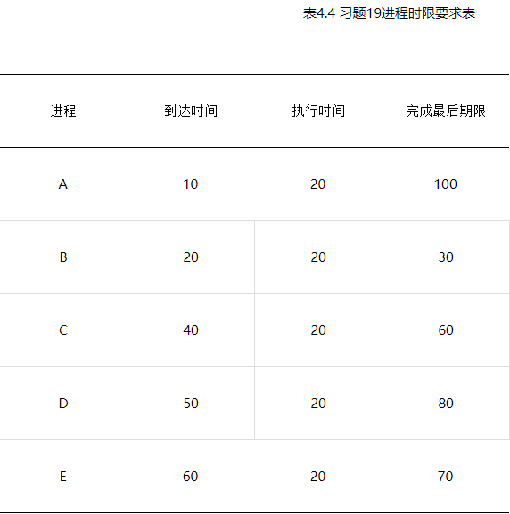

**操作系统设计原理**

# 课程大纲

操作系统A（双语）

(Operating System A (bilingualism))

课程编号：06410076

学  分：5

学  时：75 （其中：讲课学时： 60 实验学时：15 上机学时：）

先修课程：程序设计、数据结构A、计算机组成原理

适用专业：计算机科学与技术

教  材：《操作系统设计原理》，鞠时光等，科学出版社，2016月1月第一版

《ModernOperating Systems》，AndressS等. Publisher: Pearson, 2014年第四版

开课学院**：**计算机科学与通信工程学院

课程网站：http://202.195.168.13:8080\os

一、课程性质与课程目标

**（一）课程性质**

操作系统是计算机系统中不可缺少的基础系统软件。它用于管理和控制计算机系统中软、硬件资源，提供用户交互接口，是计算机系统的灵魂和核心。《操作系统A》是计算机科学与技术专业的重要专业基础课和必修课，在整个教学体系中占据非常重要的地位。作为计算机科学与技术专业的核心课程之一，本课程既培养学生掌握操作系统的基本概念、原理和设计方法，又培养学生具备一定的软件系统的设计与开发能力及计算机系统的管理与维护能力。

**（二）课程目标**

课程具体目标如下:

课程目标1：能够理解和解释操作系统的基本概念、基本原理、功能和作用。

课程目标2：能够理解操作系统的实现是一个系统化的过程。

课程目标3：能运用计算机系统工程科学的基本原理，识别和判断操作系统功能模块实现问题的关键环节和影响因素。

课程目标4：能认识到操作系统功能模块的实现有多种方案可选择。

课程目标5：能够通过文献研究，在相关操作系统功能模块实现的多种方案中，寻求一种更合适的解决方案。

课程目标6： 能够遵循系统化的基本要求，确定操作系统相关功能模块设计目标和技术方案，并体现创新意识。

课程目标7：能够运用所学知识设计实现作系统的功能模块相关算法。

课程目标8：能够对实验结果进行输入条件关联分析和解释，并能综合应用场景和技术需求，得出结论的有效性。

课程目标9：能够阅读和理解操作系统相关英文资料，能基本听懂文件系统英文授课内容。

课程目标10：能正确理解文件系统的英文表达问题，给出问题的解决方案。

**（三）课程目标与专业毕业要求指标点的对应关系**

**本课程支持的毕业要求指标点如下：**

指标点3.1：能运用数学、自然科学和工程科学的基本原理，识别和判断计算机领域复杂工程问题的关键环节和影响因素。

指标点3.3：能认识到计算机领域复杂工程问题的解决有多种方案可选择，会通过文献研究寻求可替代的解决方案。

指标点4.1：针对计算机领域复杂工程问题，能够遵循计算机系统开发和工程化的基本要求，确定设计目标和技术方案，并具有创新意识。

指标点5.5：能够对实验结果进行输入条件关联分析和解释，并通过信息综合给出合理有效的结论。

指标点10.1：掌握一门外语，具有外语听说读写能力；了解不同的文化，具有一定的国际视野和跨文化交流和沟通的能力。

课程目标与专业毕业要求指标点的支撑关系：

| 毕业要求指标点 课程目标 | 3.1  | 3.3  | 4.1  | 5.5  | 10.1 |
| :-----------: | :--: | :--: | :--: | :--: | :--: |
|            1            | 0.4  |      |      |      |      |
|            2            |      |      | 0.3  |      |      |
|            3            | 0.6  |      |      |      |      |
|            4            |      | 0.4  |      |      |      |
|            5            |      | 0.6  |      |      |      |
|            6            |      |      | 0.7  |      |      |
|            7            |      |      |      | 0.5  |      |
|            8            |      |      |      | 0.5  |      |
|            9            |      |      |      |      | 0.2  |
|           10            |      |      |      |      | 0.8  |


二、课程内容与教学要求

**第1章 绪论**

本章支持课程目标：1能够理解和解释操作系统的基本概念、基本原理、功能和作用；2能够理解操作系统的实现是一个系统化的过程；3能运用计算机系统工程科学的基本原理，识别和判断操作系统功能模块实现问题的关键环节和影响因素。

**1.** **教学内容与教学方法**

（1）操作系统概述。（讲授）

（2）操作系统的形成与发展。（讲授）

（3）操作系统的分类。（讲授+案例式）

（4）操作系统的运行环境。（讲授）

（5）操作系统结构。（讲授+自学+案例）

（6）现代操作系统。（自学）

**2.** **知识、能力与素质等方面的基本要求**

（1）掌握操作系统的概念、基本类型和功能。

（2）了解操作系统的发展历史及操作系统的结构。

（3）激发学生学习本课程的兴趣和创新意识。

（4）能够从操作系统的发展过程中了解计算机科学技术的发展现状与发展趋势。

（5）能够熟练安装、使用和维护一种操作系统。

（6）能够理解操作系统的实现是一个需求、功能、效率、经济、安全综合考虑的系统化的过程。

（7）识别和判断操作系统功能模块实现问题的关键环节和影响因素。

**3.** **重点与难点**         

（1）**重点**是操作系统的概念和分类。

（2）**难点**是操作系统结构。

**第****2****章** **进程与线程**

本章支持课程目标：1能够理解和解释操作系统的基本概念、基本原理、功能和作用；3能运用计算机系统工程科学的基本原理，识别和判断操作系统功能模块实现问题的关键环节和影响因素；4能认识到操作系统功能模块的实现有多种方案可选择；5能够通过文献研究，在相关操作系统功能模块实现的多种方案中，寻求一种更合适的解决方案；6能够遵循系统化的基本要求，确定操作系统相关功能模块设计目标和技术方案，并体现创新意识。

**1.** **教学内容与教学方法**

（1）多道程序与并发执行。（讲授）

（2）进程模型。（讲授）

（3）线程模型。（讲授）

（4）多核、多线程与超线程。（讲授）

（5）进程管理实例。（讲授+自学+案例）

**2.** **知识、能力与素质等方面的基本要求**

（1）理解多道程序与并发执行情况。

（2）掌握进程与线程的概念。

（3）理解多核、多线程与超线程。

（4）了解Linux、UNIX、Windows中的进程与线程的管理。

（5）具有按情形正确选用进程与线程模型的能力。

（6）能识别和判断进程、线程实现问题的关键环节和影响因素。

（7）能认识到进程、线程的实现有多种方案可选择，并能根据场景寻求一种更合适的解决方案。

（8）能够确定进程、线程模型设计目标和技术方案，并力求改进。

**3.** **重点与难点**

（1）**重点**是进程与线程概念和模型。

 （2）**难点**是多核、多线程与超线程。

**第****3****章** **互斥与同步**

本章支持课程目标：

1能够理解和解释操作系统的基本概念、基本原理、功能和作用；3能运用计算机系统工程科学的基本原理，识别和判断操作系统功能模块实现问题的关键环节和影响因素；4能认识到操作系统功能模块的实现有多种方案可选择；5能够通过文献研究，在相关操作系统功能模块实现的多种方案中，寻求一种更合适的解决方案；6能够遵循系统化的基本要求，确定操作系统相关功能模块设计目标和技术方案，并体现创新意识；7能够运用所学知识设计实现作系统的功能模块相关算法；8能够对实验结果进行输入条件关联分析和解释，并能综合应用场景和技术需求，得出结论的有效性。

**1.** **教学内容与教学方法**

（1）进程管理的背景。（讲授+案例）

（2）进程互斥。（讲授+案例）

（3）进程同步。（讲授+案例+实验）

（4）进程通信。（讲授+案例）

（5）死锁。（讲授+案例）

（6）多核环境下的进程同步。（讲授+自学）

（7）进程同步与通信实例。（讲授+案例）

**2.** **知识、能力与素质等方面的基本要求**

（1）掌握进程同步、进程互斥、进程通信及死锁的概念。

（2）掌握进程互斥、进程同步、进程通信及死锁的防止、避免、检测与恢复的实现方法。

（3）理解进程管理的背景。

（4）了解临界区管理的硬件与软件实现方法。

（5）了解Linux、UNIX、Windows中进程同步与通信的实现方法。

（6）能识别和判断同步、互斥实现问题的关键环节和影响因素。

（7）能认识到同步、互斥功能模块的实现有多种方案可选择，并能根据场景寻求一种更合适的解决方案。

（8）能够确定同步、互斥功能模块设计目标和技术方案，并力求改进。

（9）能够运用所学知识设计实现同步、互斥相关算法。

（10）能对同步、互斥实验结果能进行输入条件关联分析和解释，得出结论的有效性。

**3.** **重点与难点**

（1）**重点**是进程的同步、进程互斥、进程通信与死锁概念；进程互斥、进程同步、进程通信及死锁的防止、避免、检测与恢复的实现方法。

（2）**难点**是进程同步与互斥的实现方法。

**第****4****章** **处理机调度**

本章支持课程目标：1能够理解和解释操作系统的基本概念、基本原理、功能和作用；3能运用计算机系统工程科学的基本原理，识别和判断操作系统功能模块实现问题的关键环节和影响因素；4能认识到操作系统功能模块的实现有多种方案可选择；5能够通过文献研究，在相关操作系统功能模块实现的多种方案中，寻求一种更合适的解决方案；6能够遵循系统化的基本要求，确定操作系统相关功能模块设计目标和技术方案，并体现创新意识；7能够运用所学知识设计实现作系统的功能模块相关算法；8能够对实验结果进行输入条件关联分析和解释，并能综合应用场景和技术需求，得出结论的有效性。

**1.** **教学内容与教学方法**

（1）处理器调度层次。（讲授）

（2）调度准则。（讲授）

（3）短程调度算法。（讲授+实验）

（4）多处理器调度。（讲授）

（5）实时调度。（讲授）

（6）处理机调度实例。（讲授+自学+案例）

UNIX进程管理、Linux进程管理和Windows处理机调度。

**2.** **知识、能力与素质等方面的基本要求**

（1）掌握单处理机调度算法、多处理机调度算法和实时调度算法。

（2）了解处理机调度实例。

（3）能识别和判断处理机调度功能模块实现问题的关键环节和影响因素。

（4）能认识到处理机调度功能模块的实现有多种方案可选择，并能根据场景寻求一种更合适的解决方案。

（5）能够确定处理机调度功能模块设计目标和技术方案，并力求改进。

（6）能够运用所学知识设计实现处理机调度的功能模块相关算法。

（7）能对处理器调度实验结果能进行输入条件关联分析和解释，得出结论的有效性。

**3.** **重难点**

（1）重点是短程调度算法；

 （2）难点是多处理器调度。

**第****5****章** **存储器管理**

本章支持课程目标：1能够理解和解释操作系统的基本概念、基本原理、功能和作用；3能运用计算机系统工程科学的基本原理，识别和判断操作系统功能模块实现问题的关键环节和影响因素；4能认识到操作系统功能模块的实现有多种方案可选择；5能够通过文献研究，在相关操作系统功能模块实现的多种方案中，寻求一种更合适的解决方案；6能够遵循系统化的基本要求，确定操作系统相关功能模块设计目标和技术方案，并体现创新意识；7能够运用所学知识设计实现操作系统的功能模块相关算法；8能够对实验结果进行输入条件关联分析和解释，并能综合应用场景和技术需求，得出结论的有效性。

**1.** **教学内容与教学方法**

（1）存储管理的功能。（讲授）

（2）重定位。（讲授）

（3）单道环境下的存储管理。（讲授）

（4）分区存储管理。（讲授）

（5）页式存储管理。（讲授+实验）

（6）段式及段页式存储管理。（讲授）

（7）内存管理实例。（讲授+自学+案例）

**2.** **知识、能力与素质等方面的基本要求**

（1）掌握存储管理的功能、分区内存管理、覆盖与交换、分页式和段式内存管理。

（2）理解段页式内存管理实现原理。

（3）了解局部性原理和抖动问题。

（4）了解内存管理的实例。

（5）能识别和判断存储管理功能模块实现问题的关键环节和影响因素。

（6）能认识到存储管理功能模块的实现有多种方案可选择并能寻求一种更合适的解决方案。

（7）能够确定存储管理相关功能模块设计目标和技术方案，并力求改进。

（8）能够运用所学知识设计实现存储管理的相关算法。

（9）能对存储管理实验结果进行输入条件关联分析和解释，得出结论的有效性。

**3.** **重点与难点**

（1）**重点**是分页式内存管理与分段式内存管理技术。

（2）**难点**是页面置换的高效实现。

**第****6****章****文件管理**

本章支持课程目标：1能够理解和解释操作系统的基本概念、基本原理、功能和作用；3能运用计算机系统工程科学的基本原理，识别和判断操作系统功能模块实现问题的关键环节和影响因素；4能认识到操作系统功能模块的实现有多种方案可选择；5能够通过文献研究，在相关操作系统功能模块实现的多种方案中，寻求一种更合适的解决方案；6能够遵循系统化的基本要求，确定操作系统相关功能模块设计目标和技术方案，并体现创新意识；9能够阅读和理解操作系统相关英文资料，能基本听懂文件系统英文授课内容；10能正确理解文件系统的英文表达问题，给出问题的解决方案。

**1.** **教学内容与教学方法**

（1）文件概述。（讲授+自学）

（2）文件目录。（讲授）

（3）文件共享与保护。（讲授）

（4）文件存储空间的管理。（讲授）

（5）文件分配。（讲授）

（6）文件管理实例。（讲授+自学+案例）

（7）采用应用原版教材内容作为学习资料，采用双语的方式讲授。

**2.** **知识、能力与素质等方面的基本要求**

（1）使用英文材料学习文件系统。

（2）掌握文件的概念、常用的文件组织方法及文件的存取方法，掌握文件目录管理方法及文件的共享与保护。

（3）理解文件系统的实现过程。

（4）了解分布式文件系统。

（5）了解文件系统实例。

（6）了解Linux、UNIX、Windows中的进程与线程的管理。

（7）能运用所学的基本原理，识别和判断文件系统功能模块实现问题的关键环节和影响因素。

（8）能认识到文件系统功能模块的实现有多种方案可选择，并能寻求一种更合适的解决方案。

（9）能够确定文件系统功能模块设计目标和技术方案，并思考如何改进。

（10）能够阅读和理解文件系统相关英文资料，能基本听懂文件系统英文授课内容。

（11）能正确理解文件系统的英文表达问题，给出问题的解决方案。

**3.** **重点与难点**

（1）**重点**是文件的概念、常用的文件组织方法及文件的存取方法，文件目录管理方法及文件的共享与保护。

 （2）**难点**是文件分配与存取的高效实施。

**第****7****章** **输入****/****输出管理**

本章支持课程目标：1能够理解和解释操作系统的基本概念、基本原理、功能和作用；3能运用计算机系统工程科学的基本原理，识别和判断操作系统功能模块实现问题的关键环节和影响因素；4能认识到操作系统功能模块的实现有多种方案可选择；5能够通过文献研究，在相关操作系统功能模块实现的多种方案中，寻求一种更合适的解决方案；6能够遵循系统化的基本要求，确定操作系统相关功能模块设计目标和技术方案，并体现创新意识；7能够运用所学知识设计实现作系统的功能模块相关算法；8能够对实验结果进行输入条件关联分析和解释，并能综合应用场景和技术需求，得出结论的有效性。

**1.** **教学内容与教学方法**

（1）I/O管理概述。（讲授）

（2）I/O控制方式。（讲授）

（3）I/O缓冲。（讲授）

（4）设备驱动程序。（讲授）

（5）设备分配。（讲授）

（6）磁盘存储器的管理。（讲授+实验）

（7）磁盘阵列(RAID)。（讲授）

（8）I/O管理实例。（讲授+自学+案例）

**2.** **知识、能力与素质等方面的基本要求**

（1）掌握I/O控制方式，I/O缓冲，I/O软件，磁盘调度。

（2）理解I/O硬件结构与核心I/O子系统。

（3）了解虚拟设备实现过程。

（4）了解I/O管理的实例。

（5）能识别和判断I/O功能模块实现问题的关键环节和影响因素。

（6）能够阅读I/O方面的资料，在I/O功能模块实现的多种方案中，寻求一种更合适的解决方案

（5）具有设计磁盘驱动调度的能力。

（6）能够运用所学知识，确定I/O功能模块设计目标和技术方案，并体现创新意识。

（7）能对I/O管理实验结果进行输入条件关联分析和解释，得出结论的有效性。

**3.** **重点与难点**

（1）**重点**是I/O控制方式，I/O缓冲，I/O软件，磁盘调度。

（2）**难点**是I/O软件架构实现。

**第****8****章** **操作系统安全**

本章支持课程目标：1能够理解和解释操作系统的基本概念、基本原理、功能和作用；2能够理解操作系统的实现是一个系统化的过程；3能运用计算机系统工程科学的基本原理，识别和判断操作系统功能模块实现问题的关键环节和影响因素；4能认识到操作系统功能模块的实现有多种方案可选择；5能够通过文献研究，在相关操作系统功能模块实现的多种方案中，寻求一种更合适的解决方案。

**1.** **教学内容与教学方法**

（1）操作系统安全概述。（讲授+自学）

（2）安全评估与标准。（讲授+自学）

（3）安全机制。（讲授）

（4）安全模型。（讲授）

（5）操作系统安全体系结构。（讲授+自学+案例）

（6）安全操作系统简介。（讲授+自学+案例）

**2.** **知识、能力与素质等方面的基本要求**

（1）掌握计算机系统安全基本概念和操作系统中的常用的保护机制。

（2）理解计算机系统安全性保证的方法。

（3）了解安全操作系统的研究和开发状况。

（4）能够理解安全操作系统的实现是一个系统化的过程。

（5）能够识别和判断操作系统安全功能实现的关键环节和影响因素。

（6）能够对操作系统安全功能实现进行有效分解，知道有多种技术方案可选。

（7）能够判断或借助于必要的工具判断操作系统是否安全的能力。

（8）能够阅读安全有关的资料，在作系统安全功能模块实现的多种方案中，寻求一种更合适的解决方案。

**3.** **重点与难点**

（1）**重点**是计算机系统安全基本概念和操作系统中的常用的保护机制。

 （2）**难点**是安全机制与安全模型的实施。

**第****9****章** **新型操作系统**

本章支持课程目标：1能够理解和解释操作系统的基本概念、基本原理、功能和作用；2能够理解操作系统的实现是一个系统化的过程；3能运用计算机系统工程科学的基本原理，识别和判断操作系统功能模块实现问题的关键环节和影响因素。

**1.** **教学内容与教学方法**

（1）嵌入式操作系统。（讲授+自学+案例）

（2）分布式操作系统。（讲授+自学+案例）

（3）虚拟化技术。（讲授+自学+案例）

**2.** **知识、能力与素质等方面的基本要求**

（1）了解嵌入式操作系统与分布式操作系统的最新发展技术。

（2）了解常见的分布式操作系统包括多核操作系统、客户机/服务器操作系统、集群操作系统和MapReduce的计算模型。

（3）理解一个操作系统实现需系统地考虑设计目标。

（4）能认识和判断新型操作系统功能模块实现问题的关键环节和影响因素。

（5）激发学生学习新技术的兴趣和创新意识。

**3.** **重难点**

（1）重点是嵌入式技术与虚化技术。

（2）难点是分布式计算模型的理解与运用。

三、本课程开设的实验项目

 

​                              

| **编号** | **实验项目名称** | **学时** | **类型** | **要求** | **支撑的课程目标** |
| -------- | ---------------- | -------- | -------- | -------- | ------------------ |
| 1.     1 | 处理器调度       | 4        | 设计型   | 必做     | 6 8                |
| 2.       | 虚拟存储器       | 4        | 设计型   | 必做     | 6 8                |
| 3.     2 | 驱动调度         | 4        | 综合型   | 必做     | 6 8                |
| 4.       | 同步机构         | 3        | 综合型   | 必做     | 6 8                |

**实验** **1** **处理器调度**

**1** **．实验目的与要求**

(1)运用已学过的知识完成单处理器情况下处理器调度实验方案的设计。

(2)编程并利用相关软件完成实验测试，得到实验结果。

(3)通过对实验数据的分析、整理，得出实验结论，培养学生创新思维和编写实验报告的能力，以及处理一般工程设计技术问题的初步能力及实事求是的科学态度。

(4)利用实验更加直观、方便和易于操作的优势，提高学生学习兴趣，让学生自主发挥设计和实施实验，发挥出学生潜在的积极性和创造性。

**2** **．实验主要内容**

(1)设计一个按优先数调度算法实现处理器调度的程序。

(2)设计一个根据用户进程运行状况的多级时间片轮转法实现处理器调度的程序。

**3．** **设备要求**

(1)  PC一台。

(2)  C++编程软件。

**实验****2****虚拟存储器**

**1** **．实验目的要求**

(1)运用已学过的知识完成分页式虚拟存储管理器实验方案的设计。

(2)编程并利用相关软件完成实验测试，得到实验结果。

(3)通过对实验数据的分析、整理，得出实验结论，培养学生创新思维和编写实验报告的能力，以及处理一般工程设计技术问题的初步能力及实事求是的科学态度。

(4)利用实验更加直观、方便和易于操作的优势，提高学生学习兴趣，让学生自主发挥设计和实施实验，发挥出学生潜在的积极性和创造性。

**2** **．实验主要内容**

(1)模拟分页式存储管理中硬件的地址转换和产生缺页中断。

(2)设计一个执行开销小的近似最近最少用（LRU）页面置换程序。

   **3** **．实验仪器设备**

(1)PC一台。

(2) C++编程软件。

**实验** **3****驱动调度**

**1** **．实验目的要求**

(1)运用已学过的知识完成磁盘驱动调度实验方案的设计。

(2)编程并利用相关软件完成实验测试，得到实验结果。

(3)通过对实验数据的分析、整理，得出实验结论，培养学生创新思维和编写实验报告的能力，以及处理一般工程设计技术问题的初步能力及实事求是的科学态度。

(4)利用实验更加直观、方便和易于操作的优势，提高学生学习兴趣，让学生自主发挥设计和实施实验，发挥出学生潜在的积极性和创造性。

**2** **．实验主要内容**

设计一个以电梯调度思想为主并考虑旋转优化的程序，对磁盘进行移臂和旋转调度。

   **3** **．实验仪器设备**

(1)PC一台。

(2)C++编程软件。

**实验****4****同步机构**

**1** **．实验目的要求**

(1)运用已学过的知识完成模拟PV操作同步机构实验方案的设计。

(2)编程并利用相关软件完成实验测试，得到实验结果。

(3)通过对实验数据的分析、整理，得出实验结论，培养学生创新思维和编写实验报告的能力，以及处理一般工程设计技术问题的初步能力及实事求是的科学态度。

(4)利用实验更加直观、方便和易于操作的优势，提高学生学习兴趣，让学生自主发挥设计和实施实验，发挥出学生潜在的积极性和创造性。

**2** **．实验主要内容**

用利用Unix或Linux的PV操作设计进程的同步与互斥问题。

题目：桌上有一只盘子，每次只能放入5只水果。爸爸专放苹果，妈妈专放橘子，一个儿子专等吃盘子中的橘子，一个女儿专等吃盘子中的苹果。用P，V操作实现爸爸、妈妈、儿子、女儿进程的同步控制。

**3** **．实验仪器设备**

(1)PC一台。

(2)C++编程软件。

**注：**本课程为计算机专业的专业基础课，授课对象为大三学生，实验类型为设计型和综合型实验，需提交报告。实验报告主要包括题目、程序中使用的数据结构及符号说明、流程图、源程序并附上注释、程序运行时的初值和运行结果、实验结果分析。实验评价内容和评分细则参见**附录****1****。**

四、学时分配及教学方法

 

​                                                                              

| **章** **（按序填写）** | **课时分配** | **教学方法** | **支撑的课程目标** |      |                        |                      |
| ----------------------- | ------------ | ------------ | ------------------ | ---- | ---------------------- | -------------------- |
| 讲课                    | 实验         | 上机         | 课外               |      |                        |                      |
| 第一章 绪论             | 3            |              | 0                  |      | 讲授、案例             | 1，2，3              |
| 第二章 进程与线程       | 5            |              | 0                  |      | 讲授、案例、自学       | 1，3，4，5，6        |
| 第三章 互斥与同步       | 10           |              | 4                  |      | 讲授、案例、自学、实验 | 1，3，4，5，6，7，8  |
| 第四章 处理机调度       | 6            |              | 3                  |      | 讲授、案例、自学、实验 | 1，3，4，5，6，7，8  |
| 第五章 存储器管理       | 10           |              | 4                  |      | 讲授、案例、自学、实验 | 1，3，4，5，6，7，8  |
| 第六章 文件管理         | 10           |              | 0                  |      | 讲授、案例、自学、实验 | 1，3，4，5，6，9，10 |
| 第七章 输入/输出管理    | 8            |              | 4                  |      | 讲授、案例、自学、实验 | 1，3，4，5，6，7，8  |
| 第八章 操作系统安全     | 6            |              | 0                  |      | 讲授、案例、自学       | 1，2，3，4，5        |
| 第九章 新型操作系统     | 2            |              | 0                  |      | 讲授、案例、自学       | 1，2，3              |
| **合计**                | 60           |              | 15                 |      |                        |                      |

 

（二）其它教学活动

通过网络教学平台完成辅助教学。通过随堂测验和大作业等活动检验学生的知识掌握情况和对复杂问题的分析与解决能力。大作业所占比重和具体评分细则如下。

**大作业评分比重表**

​               

| **评分项编号** | **大作业评价内容**           | **所占比重** | **要求**                                                     | **对课程目标支撑** |
| -------------- | ---------------------------- | ------------ | ------------------------------------------------------------ | ------------------ |
| 1              | 作业进度                     | 10%          | 能够按时完成。                                               |                    |
| 2              | 设计解决问题的目标和技术方案 | 90%          | 能按系统化的要求，设计解决问题的目标和技术方案，并有创新意识。 | 5                  |

 

大作业具体评分细则如下：

**大作业评分细则（按****5****级制评分，折成****100****分计算）**

​                  

| **项目**                        | **优**                                                       | **良**                                                       | **中**                                                       | **及格**                                                     | **不及格**                                                   |
| ------------------------------- | ------------------------------------------------------------ | ------------------------------------------------------------ | ------------------------------------------------------------ | ------------------------------------------------------------ | ------------------------------------------------------------ |
| 作业进度，10%                   | 提前完成，4.5-5分。                                          | 按时完成，4分。                                              | 基本按时完成，3.5分。                                        | 有一定的时间延迟，3分。                                      | 在一定的时间内未能完成，3分以下。                            |
| 设计解决问题的目标和技术方案90% | 能严格按系统化的要求，很好地设计解决问题的目标和技术方案，并有创新意识4.5-5分。 | 能按系统化的要求，较好地设计解决问题的目标和技术方案，并有创新意识，4分。 | 能按系统化的要求，设计解决问题的目标和技术方案，并有创新意识，3.5分。 | 能按系统化的要求，基本正确地设计解决问题的目标和技术方案，并体现创新意识，3分。 | 不能按系统化的要求设计解决问题的目标和技术方案，未体现创新意识，3分以下。 |

五、课程考核

（一）考核方式

​                                   

| **考核方式或途径** | **考核要求**                                                 | **考核权重** | **支持课程目标**                                             | **对指标点支持** |
| ------------------ | ------------------------------------------------------------ | ------------ | ------------------------------------------------------------ | ---------------- |
| 考勤及平时作业     | 按照作业题目进行5级评分，总分数平均计算（5次以上）；无故缺勤占总课时1/3以上，总成绩不及格。 | 5%           | 1（各章的第一次作业） 3（第二、八章章除第一次外的作业） 6（第四、五、七章除第一次外的作业） 7（第三章除第一次外的作业） 9（第六章平时检查） 10（第六章作业） | 3.1 3.3 4.1 10.1 |
| 随堂测验           | 主要考查学生的问题识别、判断和选择有效解决方案的能力。       | 10%          | 1（填空题或选择题） 2（简答题） 4（综合方案题）              | 3.1 4.1 3.3      |
| 大作业             | 主要考查学生的设计解决问题的目标和技术方案的能力。           | 5%           | 5 6                                                          | 4.1              |
| 实验               | 完成4个实验，每次5分；主要考查问题解决的设计目标和设计技术方案的能力以及实验结果关联分析的能力。 | 20%          | 6（平时检查、验收交流） 8（实验报告）                        | 4.1 5.5          |
| 期末考试           | 采用闭卷考试。试卷题型包括选择题、判断题、简答题和综合分析应用题等，以卷面成绩的60%计入课程总成绩。其中考核操作系统概念、原理和算法等基础知识型题目占50%；考核针对操作系统原理及算法问题的综合分析与设计能力的题目占50%。 | 60%          | 1（选择） 3（判断题） 4（非英文简答题） 4 5（非英文综合应用题） 7（综合算法题） 10（英文简答题和综合应用题） | 3.1 3.3 4.1 10.1 |
| 合计               |                                                              | 100%         |                                                              |                  |

 

**期末考试评分比重表**

​                                    

| **评分项编号** | **题型**   | **所占比重** | **要求**                                                     | **支持课程目标** | **对毕业要求指标点支撑** |
| -------------- | ---------- | ------------ | ------------------------------------------------------------ | ---------------- | ------------------------ |
| 1              | 选择题     | 10%          | 正确理解基本概念及基本原理。                                 | 1                | 3.1                      |
| 2              | 是非判断题 | 10%          | 能够清晰地把握基本概念与原理。                               | 3                | 3.1                      |
| 3              | 简答题     | 30%          | 能够对操作系统的基本问题正确地识别并选择给出解决方案         | 4 10（英文题）   | 3.3 10.1                 |
| 4              | 综合应用题 | 40%          | 对处理机调度算法、页面置换算法、磁盘驱动调度算法、文件实现原理及读写操作、银行家算法、死锁检测算法等算法和原理能够全面分析、理解和综合应用 | 5 10（英文题）   | 3.3 10.1（英文题）       |
| 5              | 综合算法题 | 10%          | 能够给出操作系统相关综合性问题(如处理机调度、存储管理、文件管理、进程同步与互斥等)的正确算法 | 7                | 4.1                      |

（二）本课程毕业要求指标点达成度计算

**1.** **本课程目标达成度计算**

****

其中为课程目标第i个评价项的权重。

**2.** **本课程毕业要求达成度计算**

****

其中为课程目标i对毕业要求指标点的支撑权重。

六、参考书目及学习资料

1．《操作系统原理》，鞠时光等，武汉理工出版社，2008年8月。

2．《计算机操作系统》, 汤小丹、梁红兵等，西安电子科技大学出版社，2014年第四版。

3．《Operating Systems, Internals and Design Priciples》，William Stallings，Prentice Hall，2010年第七版。

4．《Operating SystemsConcepts》，Abraham Silberschatz等，Wiley, 2013年第9版。

5、《操作系统课程的实验指导书》，刘金平，自编讲义。

七、大纲说明

\1. 采用多媒体教学手段，建议采用讲练结合的方式，多种教学手段综合运用。

\2. 课后需要完成约60道习题作业，以加深学生对所学内容的理解和掌握。

\3. 本课程有16个学时的实验，具体实验内容见《操作系统A》课程实验教学大纲，任课教师亦可以根据实际教学情况适当调整。

 

​                       **制定人**：詹永照

​                       **审定人**：潘雨青

​                    **批准人**：毛启容

 

​              2017年9月1日


附录1：

**实验评价权重表**

​                              

| **评分项编号** | **实验评价内容**       | **所占比重**      | **要求**                                                     | **支持课程目标** | **对毕业要求指标点支撑** |
| -------------- | ---------------------- | ----------------- | ------------------------------------------------------------ | ---------------- | ------------------------ |
| 1              | 方案的系统化和创新意识 | 30%（检查与交流） | 能按系统化的要求设计算法的目标和技术方案，并有创新意识。     | 6                | 4.1                      |
| 2              | 程序设计与调试能力     | 30%（检查与交流） | 能按系统化的要求设计程序，有创新意识，并根据实验结果的关联性而调试程序 | 6                | 4.1                      |
| 3              | 结果分析与表述能力     | 30%（报告）       | 能够分析实验结果的关联性，并通过信息综合给出合理有效的结论。 | 8                | 5.5                      |
| 4              | 报告清晰，按时提交     | 10%（报告）       | 报告条理清晰，提交准时                                       | 8                | 5.5                      |

具体实验评分细则如下：

**实验评分细则（每次实验按五级制折成****100****分计算）**

​                              

| **项目**                    | **优**                                                       | **良**                                                       | **中**                                                       | **及格**                                                     | **不及格**                                                  |
| --------------------------- | ------------------------------------------------------------ | ------------------------------------------------------------ | ------------------------------------------------------------ | ------------------------------------------------------------ | ----------------------------------------------------------- |
| 方案的系统化和创新意识，30% | 能够系统地设计问题解决的目标和技术方案，并有创新性；4.5-5分  | 能够较系统地设计问题解决的目标和技术方案，并有创新意识；4分  | 能够设计问题解决的目标和技术方案，并有一定创新意识；3.5分    | 能够设计问题解决的目标和技术方案，算法基本正确；3分          | 问题解决的目标不明确，设计技术方案错误较多；3分以下         |
| 设计与调试能力，30%         | 设计的程序很规范、很系统，有创新性，并很好分析实验结果的关联性而调试程序；4.5-5分 | 设计的程序较规范、较系统，有创新性，并较好分析实验结果的关联性而调试程序；4分 | 能系统考虑程序设计，但易读性稍差。能分析实验结果的关联性而调试程序；3.5分 | 程序设计基本正确，有分析实验结果的关联性而调试程序；3分      | 程序错误较多能，不能分析实验结果的关联性而调试程序。3分以下 |
| 结果分析与表述能力，30%     | 能够依据相关原理清晰明了地分析实验结果的关联性，并通过信息综合给出合理有效的结论；4.5-5分 | 能够依据相关原理分析实验结果的关联性，并通过信息综合给出合理有效的结论； 4分 | 能够依据相关原理分析实验结果的关联性，并通过信息综合给出有效的结论；3.5分 | 基本上能够依据相关原理分析实验结果的关联性，并通过信息综合给出有效的结论；3分 | 对实验结果的分析依据不足，结论存在错误：3分以下             |
| 报告清晰，按时提交 10%      | 报告条理非常清楚，并通过综合比较得到结论的有效性，按时提交；4.5-5分 | 报告条理很清楚，并通过综合比较得到结论的有效性，按时提交；4分 | 报告条理较清楚，并通过综合比较得到结论的有效性，按时提交；3.5分 | 能写出报告，并能比较分析结论，基本按时提交；3分              | 未按时提交，报告条理不清晰；3分以下                         |

 

# 前言

### 任课老师
- 薛安荣
- 江大计算机科学系
- E-Mail：xuear@ujs.edu.cn
- QQ： 514166081
- 办公室：计算机楼416

### 概述
- 操作系统是计算机系统中不可或缺的基础系统软件，用于管理和控制计算机中软硬件资源，是计算机系统的灵魂与核心，直接与用户打交道的界面； 
- 课程任务是学习并掌握计算机操作系统的基本原理和实现方法；以UNIX，Linux或Windows为实例，加深理解操作系统的基本概念和原理，为今后适应系统软件的研究与开发工作以及企事业计算机系统的管理和维护工作打下良好的基础；
 - UNIX比Windows安全可靠运行效率高，因此国家银行系统用UNIX而非Windows；
 - Linux开源，维护工作由全世界开发者共同维护；

### 课程目标
- 理解解释操作系统的基本概念，基本原理，功能和作用；


### 考核
- 有一章节英文教学英文考核
- 
- 

# 第一章 操作系统概述
## 1.1 操作系统的定义
### 操作系统的概念
- 系统软件
- 计算机资源的管理者,控制者和执行者
- 提供用户交互接口

### 概念
- 操作系统是系统软件而非应用软件
- 是计算机资源的管理者，执行者，控制者（管理计算机资源）
- 提供用户交互接口
- 
  - 操作系统的核心语言是C语言和汇编
  - 操作系统提供接口：
    - 系统命令
    - 编程接口：供用户程序和系统程序调用操作系统功能
    
### 基本功能
- 计算机系统组成
  - 软件资源
  - 存储器
    - 文件管理
    - 存储管理
  - 外部设备
  - 处理器
  - 运行任务控制    

- 文件管理
解决软件资源的存储，共享，保密和保护；
  - 文件存储空间管理
  - 目录管理
  - 文件的读写管理和存取控制
  - 软件管理

- 存储管理
  - 管理目标：提高利用率，方便用户使用，提供足够的存储空间，方便进程并发运行；
    - 存储分配与回收
    - 存储保护
    - 地址映射（变换）
    -  内存扩充（覆盖，交换和虚拟存储）
  
- 设备管理
  - 你还可以：方便设备的使用，提高CPU和I/O设备利用率
    - 设备操作：利用设备**驱动程序**（通常在内核中）完成对设备的操作。还需处理外设的IRQ； 
    - **设备独立性**（device independence）：提供统一的I/O设备接口，使应用程序独立于物理设备，提高可适应性；在同样的接口和操作下完成不同的内容。  
   - 设备分配与回收
     - 我们通常指的主机就是处理器和内存 
   - 虚拟设备
   - 缓冲区管理


## 1.2 操作系统的形成和发展


### 工作方式
#### 手工阶段
- 工作方式
  - 用户：用户既是程序员，又是操作员；用户是计算机专业人员
  - 编程语言:机器语言
  - 输入输出：纸带或卡片；
- 计算机的工作特点
  - 用户独占全机：不出现资源被其他用户占用，资源利用率低； 
  - CPU等待用户：计算前，手工装入纸带或卡片；计算完成后，手工卸取纸带或卡片；CPU利用率低；

#### 通道，中断
60年代计算机硬件获得两个重大进展：
**通道技术**和中断技术 
- 通道：
    是一种专用部件，负责外部设备与内存之间信息的传输
- 中断
     指主机接到外界信号时，立即终止原来的工作，专去处理这一外来事件，处理完后，主机又回到原来的工作点上继续工作；

#### 管理程序
- 主要功能
  - 向用户提供多个共享资源来运行他们的程序；
  - 帮助操作员控制用户程序的执行和管理计算机的部分资源
- 计算机的工作特点
  - 程序员与操作员分开；
  - 操作员通过命令与计算机交互。 

#### 多道程序设计
- 定义
    多道程序设计技术是在计算机内存中同时存放几道相互独立的程序，他们在管理程序的控制下相互穿插地运行；
- 特征
  - 多道：内存中同时存放几个作业
    - **宏观上并行运行**:都处于运行状态，但都未运行完；
    - 微观上串行运行：各作业交替使用CPU；
- 优点
  - 资源利用率高
    - CPU和内存利用率较高；
  - 作业吞吐量大
    - 单位时间内完成的工作总量大； 
- 缺点
  - 用户交互性差
    - 整个作业完成后或中间出错时，才与用户交互，不利于调试和修改； 
  - 作业平均周转时间长
    - 短作业的周转时间显著增
长； 

#### 分时系统
- “分时”是指多个用户分享使用同一台计算机。多个程序分时共享硬件和软件资源。
  - 多个用户分时
    - 单个用户使用计算机的效率低，因而允许多个应用程序同时在内存中，分别服务于不同的用户。有用户输入时由CPU执行，处理完一次用户输入后程序暂停，等待下一次用户输入->时走时停； 
  - 前台和后台程序(foreground & background)分时
    - 后台程序不占用终端输入输出，不与用户交互－－现在的图形用户界面(GUI)，除当前交互的程序(输入焦点)之外，其他程序均作为后台；
  - 通常按时间片(time slice)分配
    - 各个程序在CPU上各执行一小段时间。 
- 特点
  - 人机交互性好
    - 在调试和运行程序时用户随时可与计算机交道。 
  - 共享主机
    - 多个用户同时使用主机。
  - 用户独立性：对每个用户而言好象独占主机。
  
#### 云计算操作系统
- 云计算
  - 通过Internet以服务方式提供动态可伸缩的虚拟化资源的计算模式。
- 云计算操作系统：
  - 构架于服务器、存储、网络等基础硬件资源和单机操作系统、中间件、数据库等用于管理海量的基础硬件、软件之上的云平台综合管理系统。
    - 唤来了基于网络的分布式操作系统和虚拟化软件的研究的春天

## 1.3 操作系统的分类
**按操作系统所提供的功能分:**
1. 单用户操作系统
2. 批处理操作系统
3. 实时操作系统
4. 分时操作系统
5. 网络操作系统
6. 分布式操作系统
7. 嵌入式操作系统

### 单用户操作系统
- 基本特征：
  - 一个用户独占计算机系统资源。系统所有软、硬件资源全为一个用户服务，单独地执行该用户提交的一个任务。 
- 常用的单用户操作系统:
  - 单用户单任务：MS DOS；CP/M 

### 批处理操作系统
- 特点
  - 用户脱机使用计算机
  - 成批处理 
- 作业的处理流程
  - 作业提交：作业的输入； 
  - 作业执行
  - 作业完成：作业的输出；
- 分类：
  - 单道批处理系统
  - 多道批处理系统


### 实时操作系统
- 特征
  - 专用系统：许多实时系统是专用系统。
  - 实时控制：实时系统用于控制实时过程，要求对外部事件的迅速响应，具有较强的中断处理机构。 
  - 高可靠性：实时系统用于控制重要过程，要求高度可靠，具有较高冗余。如双机系统。
  - 事件驱动和队列驱动：实时系统的工作方式：接受外部消息，分析消息，调用相应处理程序进行处理。
  - 可与**通用系统结**合成通用实时系统：实时处理前台作业，批处理为后台作业.

### 分时操作系统
- 特征
  - 同时性：多个用户同时工作。
    - 共享系统资源，提高了资源利用率。节省维护开支，可靠性高：笨终端－－至今仍在使用。促进了计算机的普遍应用，提高资源利用率：远地用户通过终端（较便宜）联机使用.
  - 独立性：各用户独立操作，互不干扰。
  - 交互性：系统能及时对用户的操作进行响应，显著提高调试和修改程序的效率：缩短了周转时间 
  - 及时性：用户的请求能在较短时间内得到响应 。
  
- 与多道批处理操作系统的区别

|          | 分时操作系统      | 多道批处理操作系统  |
| -------- | --------        | --------        |
| 目标      | 用户请求的快速响应 | 提高系统效率提高系统效率 |
|适用作业性质|小作业             |大作业|
|效率       |适用于多个执行相同功能的作业 |充分利用系统资源|


### 网络操作系统
- 提供网络通信和网络资源共享功能的操作系统
- 功能
  - 通常操作系统的功能：
    - 处理机管理、存储器管理、设备管理、文件管理等； 
  - 网络通信功能
    - 通过网络协议进行高效、可靠的数据传输；
  - 网络资源管理：协调各用户使用；
  - 网络服务：文件和设备共享，信息发布；
  - 网络管理：安全管理、故障管理、性能管理等；

### 分布式操作系统
- 特征
  - 系统中任意两台计算机可以通过通信来交换信息。
  - 系统中各台计算机无主次之分，既没有控制整个系统的主机，也没有受控于它机的从机 
  - 系统的资源为所有用户共享。
  - 系统中若干台计算机可以互相协作来完成一个共同任务，或者说，一个程序可以分布于几台计算机上并行地运行。

### 嵌入式操作系统
- 特征
  - 嵌入式操作系统（Embedded Operating System，简称：EOS）是指用于嵌入式系统的操作系统 
  - 通常包括与硬件相关的底层驱动软件、系统内核、设备驱动接口、通信协议、图形界面、标准化浏览器等
  - 它必须体现其所在系统的特征，能够通过装卸某些模块来达到系统所要求的功能
  - 常用的有：嵌入式Linux、Windows Embedded、VxWorks等，以及应用在智能手机和平板电脑的Android、iOS等

### 与操作系统的五个资源管理功能密切相关的硬件环境：
- CPU
- 特权指令:
  - 指令系统中那些只能由操作系统使用的指令
- 处理器状态:
  - 多数系统将处理器工作状态较简单地划分为:
    - 管态（一般指操作系统管理程序运行的状态）
    - 目态（用户程序运行时的状态）
- 程序状态字(PSW)


## 1.5 操作系统的结构
**随着操作系统的发展，功能越强，OS自身代码量越大－－
采用良好的结构：有利于保证正确性以及自身修改和扩充。**
- 软件组件化
  - **分层**:每层完成操作系统要求的一个功能子集，每层都依赖紧挨着的较低一层的功能，并且为较高层提供服务 
- 操作系统的层次模式：


## 1. 6 现代操作系统
1. 现代操作系统特点
2. UNIX的特点
3. LINUX的特点
4. Windows Server

### 特点：
1. 绝大多数是个人独占计算机，通常使用交互方式。
2. 多机系统，尤其对称多处理器SMP(symmetric multiprocessing）方式被广泛使用 。
3. 设计技术上和结构上的改进和发展

### 技术改进与发展：
  - 微内核结构：减少内核的大小
  - 多线程机制：加快调度速度
  - 对称多处理器（SMP）机制
    - 特点：两个或多个处理器、共享资源、执行同样功能
    - 优点：高性能、高可靠性和可扩展性
  - 分布式操作系统
  - 采用面向对象技术

### UNIX
- 一个通用的、交互式的分时系统
- 设计目标
  - 统一的硬件管理
  - 多用户
  - 多任务

### Linux
- 基于IBM PC结构的一个UNIX 变种
- 开源
- 主要特点
  - 接口符合POSIX 1003.1标准
  - 支持多用户访问和多任务编程
  - 高效的存储资源管理
  - 支持动态链接
  - 支持多种文件系统
  - 支持TCP/IP、SLIP和PPP

### Windows Server
- Windows NT 3.1是微软的第一代产品
- Windows NT 3.5x系列
- Windows NT 4.0
- Windows NT 5.0X：Windows 2000、XP和WindowsServer 2003
- Windows NT 6.0X ： Windows Vista 、 WindowsServer 2008、Windows 7、Windows Server 2008 R2、Windows 8、Windows8.1和Windows Server 2012
- Windows 10

### 国产安全操作系统
- OS是计算机系统的运行维护中心，信息系统基石，影响国家安全和社会和谐稳定
- OS产品受西方发达国家垄断
- 国产安全OS任重道远
- 自主产权OS研发之路
  - 1970年中期，南京大学孙钟秀院士，DJS200系列的DJS200/XTI操作系统
  - 2019年华为，鸿蒙操作系统（Harmony OS）：基于微内核的面向全场景分布式OS
  - 麒麟芯片、鸿蒙OS、鲲鹏主板、……
  - 未来 …… 可期！

## 小结
1. 操作系统的概念。
   - 操作系统是方便用户、管理系统资源的系统软件。有了操作系统的支持，用户可以自如地使用操作命令，方便地运行自己的程序。否则，用户面对“死”的硬件则难以将它运转起来；通过操作系统可以自动调动系统的软硬件资源，使它们高效协调地运转；同时，操作系统又是系统软件，处于软件系统三个层次的最下层，其它程序只有在它的支持下才能完成自己的操作。
2. 操作系统的分类
   - 通过本章的学习，要能正确理解单用户与多用户系统的区别；单道批处理系统和多道批处理系统以及批处理系统、分时系统、实时系统、网络操作系统、分布式操作系统和嵌入式操作系统各有什么区别和特点。 
3. 操作系统的功能。
   - 操作系统的资源管理有四项功能：处理器管理、存储器(内存)管理、设备管理和文件管理。前两者主要表现在多用户操作系统中，系统为多个用户动态地分配CPU和内存，使之高效协调地运转。设备管理主要是解决外部设备的驱动和分配问题、系统为用户提供简便有效的操作手段。文件管理就是系统把庞杂繁多的文件有组织地存放在外存空间内，使得用户方便地按文件名实行存取。此外还提供文件保护和共享的能力。
4. 操作系统的运行环境。
   - 操作系统作为系统的管理程序，为了实现其预定的的各种管理功能，需要有一定的运行环境，主要包括系统的硬件环境和由其它的系统软件形成的软件环境。我们在系统的视图及系统的运行环境两节中分别介绍了这个概念
5. 现代操作系统设计特点。
   - 现代操作系统设计的特点主要体现在图形用户界面的交互技术、对称多处理器的支持、微内核结构、多线程机制、分布式操作系统的实现和面向对象技术的采用等方面。

## 作业
1. 什么是系统软件? 它起什么作用?
2. 什么是操作系统? 它在计算机系统中起什么作用?
3. 简述操作系统的发展历程。
4. 什么是单用户操作系统?什么是多用户操作系统? 二者本质区别何在?
5. 操作系统的功能有哪几项? 扼要地说明之。
6. 为什么对作业进行批处理可以提高系统效率?
7. 操作系统有哪些分类方法?
8. 何谓批处理操作系统?它有哪些类型?各有什么特征?
9. 批处理系统、分时系统和实时系统各有什么特点?各适用于哪些方面?
10. 当今流行的嵌入式操作系统有哪些？

# 第2章 进程与线程
## 总述
- 操作系统的重要任务之一：
  - 是充分、有效地利用系统的各类资源
- 最宝贵的资源：处理器
- 分配调度策略、处理冲突、资源回收
- 引入进程：作为资源分配的基本单位和基本实体
- 处理器的管理→进程管理 

- 2.1 多道程序与并发执行
- 2.2 进程模型
- 2.3 线程模型
- 2.4 多核、多线程与超线程
- 2.5 进程管理实例

## 2.1多道程序与并发执行
- 本节内容：
  - 分析程序顺序执行的特点
  - 对程序顺序执行的缺点进行  
   分析
  - 引入程序的并发执行解决问题
  - 分析程序的并发执行和特点

### 2.1.1 程序的顺序执行和特点
- 计算机上运行的是：程序
- 程序：是指令的有序集合
  - 它规定完成某一任务时所需做的各种操作
  - 规定操作顺序

**单道程序系统**：每次只允许一道程序进入计算机执行的系统。

- 单道程序系统
  - 每次只允许一道程序运行； 
  - 它将独占系统资源（处理器、主存、辅存、外设、软件）
  - 系统按照程序的步骤顺序地执行。 
  - 在该程序执行完之前，其它程序只能等待。

- 例：假设有两道程序都需运行，在单道程序系统中的运行情况如下：
  - I代表输入，用C代表计算，P代表打印


- 顺序执行的特点：
  - 程序执行的顺序性：前一步完才做下一步；
  - 程序运行时对资源的独占性：没有其它程序与之争夺资源
  -  程序结果的可再现性：程序执行的结果与执行速度、时间无关。
  -  程序结果的封闭性：程序的运行只由初始条件和程序本身来确定。
  
- 优点：系统管理简单
- 缺点：使系统的资源得不到充分的利用。
  
    &nbsp;&nbsp;&nbsp;&nbsp;&nbsp;&nbsp;&nbsp; **中断和通道技术的引入**

### 2.1.2程序的并发执行和特点
- 程序的并发执行： 
  - 一道程序不用某一系统资源,另一道程序就可以马上利用
  - 多道程序并发执行的情形：
  
  - 宏观：同时驻留在主存的几道程序都按照自己的程序规定动作执行； 
  - 微观：是这几道程序交替执行；

- 例如: I1、C1、P1的执行必须严格按照I1，C1，P1的顺序，而C1与I2，C2与I3,P1是可以同时执行的。  
  


- 程序的并发执行的特点： 
  - 程序执行时的资源共享性：硬资源、软件资源（系统软件、数据）；
  - 程序失去了封闭性和可再现性：举例:
    - 
  - 并发程序之间的相互制约性：共享系统内的资源，因此程序之间产生相互制约关系。
  - 并发程序活动规律：执行—>暂停—>执行
  - 程序：静态概念（难于描述动态系统）->进程

## 2.2进程
- 进程的引入：
  - 程序的缺点：无法表示系统的动态特性，如：两个用户同时执行CC编译自己的程序，某时刻程序的执行状态难以刻画（运行、就绪、等待？）。
  - 引入进程（程序＋处理对象）可表示执行动态特性。

- 进程的六种理解方法（任务、活动） 
  - 任何一个处于执行的程序。 
  - 可以和别的计算并发执行的计算。
  - 程序及其数据在处理器上顺序执行时的活动。
 - 抽象实体，当它执行一个任务时，将要分配和释放各种资源。
 - 独立的可以调度的活动。
 - 具有独立功能的程序关于某个数据集合的一次运行活动。

- 进程的定义（**程序段+数据**）
  
  - 能和其它程序并行执行的程序段在某数据集合上的**一次运行过程**，它是系统资源分配和调度的一个**独立单位**。 
- 注意的问题：
  - 程序段可以并行执行。（**并发性**） 
  - 基础是一个**程序段**，而不是整个程序。
  - 程序段在数据上的一次运行（**某数据集合上的运行**）
  - 动态的，是程序的一次执行过程。（**动态性**） 
  - 能独立运行的基本单位。（**独立性**）
  
- **进程和程序的区别**: 
  - 进程是一段程序的一次运行活动：动态概念；有一定“生命期”。 
  - 程序是一组指令的集合：静态概念
  - 程序段运行在两个**不同数据集合**上，就是两个不同的进程； 
  ---
  - 一个程序可以对应多个进程； 
  - 一个进程至少要对应一个程序，或对应多个程序，多个进程也可对应相同的程序。
  - 进程具有并行特征（独立性和异步性）
  - 进程是资源分配的**基本单位**
  ---
  - 例 子 ： 光 盘 （ CD、VCD）
    - 光盘（程序)放光盘的
    - 活动（进程）

##### 进程与作业的关系: 
- 作业是用户向计算机提交任务的实体,进程是完成任务的实体
- 作业可由多个进程组成(至少一个),反之不然
- 作业主要存在于批处理系统,而进程可存在于所有形式的操作系统中。

### 2.2.2 进程的实体
- 1. 进程的组成
   - 物质基础:
     - 程序：进程→完整的程序、一部分程序； 
     - 数据集合:运行需要的数据、工作区域；
   - 进程控制块（PCB）[process Control Block]：描述和标志进程（创建进程时，建立PCB；完成任务被撤销时，撤销PCB。） 

- 纯代码（pure） 
  - 它在执行中自身不改变。
  - 也称为可重入（Reentry）；享用该程序的各进程应提供工作区。

- 进程控制块 PCB (Process Control Block)
  - 存放进程的管理和控制信息（标识信息，说明信息，现场信息，管理信息）的数据结构称为进程控制块。在创建进程时，建立PCB，并伴随进程运行的全过程，直到进程撤消而撤消。PCB就象我们的户口表。
  - 
  
- 2. PCB的组织方式（为了管理上的方便）
  - 线性方式：所有的PCB组成一个数组；
  - 链接方式：运行队列、就绪队列、阻塞队列；
  - 索引方式：建立N张索引表。例如就绪索引表、阻塞索引表等

- 线性方式
  - PCB使用一个数组来组织和保存
  - 通过下标访问PCB
  - 缺点：找到某一状态的PCB，需要扫描整个线性表；
  - 


## 2.4 多核、多线程与超线程
1. 多核技术简介
- 单处理器体系结构已无法满足用户需求
- 并行计算成为高性能计算的新的突破口
- 随着集成电路技术的高度发展，单个芯片内集成器件的数目呈指数倍增长，处理器体系结构研究的重心转移到多核技术上
- 当处理器速度非常高时，系统总线的速度将成为整个系统性能的瓶颈
- 新兴的多处理器技术使用片内总线连接各个不同的处理器，这种结构被称为片上多处理器(Chip Multi-Processor，CMP，或者ChipMulti-Threading，CMT)结构，即多核，每个处理核心都可以独立运行
- 
  > (b)比(a)减少了对系统总线的依赖  
  > (c)共享二级缓存
2. 多核基本概念
- 多核计算机的出现，打破了单核环境下的许多操作系统设计的正确性或可靠性。因此，为了适应多核环境所提出的新要求，也为了更好地利用多核技术提供的新方便，操作系统需要作出相应调整。在x86体系结构下，多处理功能芯片经过了对称多处理结构、超线程结构、多核结构和多核超线程结构的4个演变阶段。
- 多处理器结构
  - 多处理器结构说简单一点就是在一条总线上挂载多个处理器。多个CPU之间的关系不同又可以分为**对称**和**非对称**多处理器结构
  - **对称多处理器结构**(Symmetric Multi-Processor Architecture，SMP)：多个CPU的角色功能平等，没有主从之分。
  - **非对称多处理器结构**(Asymmetric Multi-Processor Architecture，AMP)：不同CPU的角色地位不同，有所谓的主从CPU之分。
  - 
- 超线程结构
  - 超线程(Hyper Threading)：让一个CPU同时执行多重线程，从而提高CPU效率。理论上像两个CPU在同一时间执行两个线程。超线程技术可在同一时间里，让应用程序使用芯片的不同部分。
  - 采用超线程技术能同时执行两个线程，但它并不像两个真正的CPU那样，每个CPU都具有独立的资源。当两个线程都同时需要某一个资源时，其中一个要暂时停止，并让出资源，直到这些资源闲置后才能继续。因此超线程的性能并不等同于两个CPU的性能。
  - 
- 多核结构
  - 多核结构：在一个CPU里面布置两个执行核，即两套执行单元，如ALU、FPU和L2缓存等。而其他部分则两个核共享。这样，由于使用的是一个CPU，其功耗和单CPU一样。由于布置了多个核，其指令级并行将是真正的并行，而不是超线程结构的半并行
  - 
- 多核超线程
  - 多核情况下，也可以将超线程技术予以使用，从而形成多核超线程(Multi-core Hyper Threading Architecture)技术。即每个物理执行核里面又分解为两个或多个逻辑执行单元。
  - 
- 多处理器、超线程和多核的共同点均是为了**提升计算机性能**而设计、均可以同时执行多个指令序列。
- 区别：
  - 主要体现在同时执行的两个线程之间共享资源的多少。
    - 多处理器的共享物理资源最少，每个线程有自己单独的处理器；超线程共享最多，ALU、FPU、MSR、缓存等均为共享物理资源；
    - 而多核则介于两者之间，共享处理器，但不共享ALU、FPU等。

## 2.5进程管理实例
### 2.5.1 UNIX进程管理

- 0#进程：核心态
  - 创建1#进程；
  - 处理器调度；
  - 进程切换；
- 1#进程：是所有用户进程的祖先进程；1#进程及其派生进程在用户态和核心态两者体现模式下执行。
#### UNIX的进程结构

#### UNIX的进程状态及转换


### 2.5.2 Linux进程管理
1. Linux进程
- Linux中，进程包括以下四个要素:
  - 内存空间的正文段
  - 内存空间数据段
  - task_struct结构
  - 系统堆栈
- 每当产生一个新的进程时，就会在内核空间中分配一个8KB的空间记录新进程信息。
  

2. Linux线程
- Linux的线程模型是一种一对一模型(即一个进程中只有一个线程)，也就是每个线程实际上在核心是一个单独的进程，核心的调度程序负责线程的调度，就像调度普通进程。线程用系统调用vfork()和clone()创建，Linux允许新进程共享父进程的存储空间、文件描述符和软中断处理程序。

3. 进程状态
- Linux进程有5种状态


### 2.5.3  Windows进程管理
#### Windows 2000／XP进程的特点主要有以下几个方面：
- 进程作为对象实现;
- 一个可执行的进程可以含有一个或多个线程；
- 进程对象和线程对象都具有同步能力。
#### win32中每个进程都用一个进程控制块表示，它描述了进程的基本信息，主要内容包括以下几方面:
- 线程列表：
  - 描述属于该进程所有线程的相关信息，处理机的分配和回收是以线程为单位的；
- 虚拟地址空间描述(Virtual Address space Descriptor，VAD):
  - 描述进程地址空间各个部分的属性，用于虚拟存储管理； 
- 对象列表：
  - 列出该进程正在访问的所有对象，用于对象访问。当进程创建或打开一个对象时，就会得到这个对象句柄。 

#### Win32子系统用于进程、线程控制的系统调用：
- CreateProcess创建新进程及其主线程，以执行指定的程序段；
- ExitProcess和TerminalProcess都可以用于进程的退出；
- CreateThread完成线程的创建工作；
- ExitThread用于结束当前线程；
- SuspendThread可挂起指定的线程；
- ResumeThread可激活指定的线程。

#### Windows 2000／XP使用两类与进程有关的对象：进程和线程。进程是对应一个拥有存储空间、打开的文件等资源的程序实体；线程是执行体的一个可分派单元，它在执行中是可以被中断的，是处理机调度的单位。

#### 

#### 一个Windows 2000／XP的进程至少包含一个执行线程，该线程可能会创建别的线程。在多处理机系统中，同一个进程中的多个线程可以并行执行。


#### Windows 2000/XP的线程状态及其转换


# **第3章 互斥与同步**
- 本书重难点,考试分数能占到35%
- 重点: 
  - 临界区
  - 进程同步与互斥
  - 进程通信
  - 死锁
## 3.1 进程管理的背景
- 并发进程执行可能是无关的，也可能是交往的。
- **无关的并发进程**是指它们分别在不同的变量集合上操作，所以一个进程的执行与其它并发进程的进展无关，即一个并发进程不会改变另一个并发的变量值。
- **交往的并发进程**，它们共享某些变量，所以一个进程的执行可能影响其它进程的执行结果 ,**产生各种与时间有关的错误**。
---
- 例1 :生产者(producer)和消费者(consumer)问题.生产者将得到的数据放入缓冲区中，而消费者则从同一个缓冲区中取数据消费。缓冲区buffer为一有界数组，缓冲区中的数据个数用count变量表示，它们均是两个进程的共享变量。
- 
  - 结果不唯一
    

---
- 例2 假设有两个并发进程borrow和return分别负责申请与归还主存资源，两个并发进程的程序片段如下所示。X表示现有的空闲主存量，为共享变量，B表示申请或归还的主存量。
  - 
  - 永远等待
  

## 3.2 进程互斥
### 3.2.1 互斥与临界区
#### 临界区
- 交往的进程会产生错误的原因：  
  两个进程交叉访问的共享变量count或X。
- 我们把并发进程中与共享变量有关的程序段称为“**临界区**”（Critical section)。
- 一次只允许一个进程使用的资源称**临界资源**。
- 为保证临界资源的正确使用，可把临界资源的访问过程分成四个部分：  
  进入区->临界区->退出区->剩余区
- 进程中访问临界资源的那段代码称临界区。
---
- 生产者和消费者两进程中：
  
---
#### 互斥
- 如果能保证一个进程在临界区中执行时，不让另一个进程进入相关的临界区执行，那么就不会造成与时间有关的错误。这种**不允许两个以上共享共有资源或变量的进程同时进入临界区执行的性质称为互斥**(mutual exclusion)，即相关临界区的执行必须具有排它性。
- **间接制约**：并发进程间由于共享公有资源或变量而造成的执行速度上的制约关系。
- 临界区的管理应有三个要求：
  - 体现竞争的公平性
    - **互斥性**：如果一个进程在它的临界区中执行，其它任何进程均不能进入相关的临界区执行； 
    - **进展性**：如果一个进程不在它临界区中执行，不应阻止其它任何进程进入相关的临界区执行；
  - 避免死锁
    - **有限等待性**：某个进程从申请进入临界区时开始，应在有限的时间内得以进入临界区执行。
---
### 3.2.2 临界区管理的讨论
#### 3.2.2.1互斥的软件实现方法
##### 标志法
- 如P1和P2两个进程，它们的程序代码均包含有相关的临界区。我们对P1和P2分别用两个变量**inside1**和**inside2**来标志它们是否在临界区中，当进程在它的临界区内时其值为1，不在临界区时其值为0。
- 两并发进程的程序如下：
  
---
##### 严格轮换法 
- 用一个指针turn来指示应该由哪个进程进入临界区。
- 若turn = 0则表示P0可进入临界区；若turn = 1则表示P1可进入临界区。 进程程序描述如下：

---
#####  Peterson算法
- 该方法为每一个进程设置一个标志，当标志为1时表示该进程请求进入临界区。
- 设置一个指针turn以指示可以由哪个进程进入临界区，当turn等于i时则可由进程Pi进入临界区。
- 提供两个函数来管理临界区，这两个函数为enter_region, leave_region，程序描述如下：
 
- 好处：  
  能正确解决互斥问题
- 缺点：  
  进程会出现“忙等待”
---
#### 3.2.2.2 互斥的硬件实现方法    

 

---
### 3.2.3 信号量及P、V原语
- 为何引入信号量及P、V原语？
  - 前述的方法或“代价高”或“忙等待”浪费CPU资源。
  - 荷兰著名的计算机科学家Dijkstra，于1965年提出了一个信号量(semaphore)和P、V操作的同步机构 
- 信号量
  - 基本原则是在多个相互合作的进程之间使用简单的信号来协调控制。一个进程检测到某个信号后，就被强迫停止在一个特定的地方，直到它收到一个专门的信号为止才能继续执行。这个信号就称为“信号量”。其工作方式有点类似于十字路口的交通控制信号灯 。
- 信号量被定义为含有整型数据项的结构变量，其整型值大于等于零代表可供并发进程使用的资源实体数，但小于零时则表示正在等待使用临界区的进程数。
---
#### 信号量数据结构 


---
#### P操作原语
- 原语 :执行时不可中断的过程。
- P操作P(s)：将信 号量s的整型值减去1，若结果小于0，则将调用P(s)的进程置成等待信号量s的状态。
```C
Void P(semaphore *s){ 
s->value = s->value – 1;
if ( s->value<0 ) {
  insert (CALLER, s->PCB); 
  /*将调用进程插入到等待信号量s的进程队列中*/
  block (CALLER); /*阻塞调用进程*/ 
  } 
}
```
---
#### V操作V(s)原语
- V操作V(s)：将信号量s的整型值加上1，若结果不大于0，则释放一个等待信号量s的进程。
```C
Void V(semaphore *s){ 
PID proc_id; s->value = s->value + 1;
if ( s->value<=0 ) {
  remove (s->PCB, &proc_id ); 
  /*从等待信号量s的进程队列中摘除一个进程*/
  wakeup(proc_id); /*唤醒该进程*/ 
  } 
}
```
---
#### 总结
为进一步理解P、V操作的物理含义，我们可以这样来分析与看待：
- P 操作：
  - 当信号量s的整型值大于0时，它表示某类公用资源的可用数。因此，每执行一次P操作就意味着请求分配一个单位的该类资源给执行P操作的进程使用，信号量s的整型值应减去1。
  - 当信号量s的整型值小于等于0时，表示已经没有此类资源可供分配了，因此，请求资源的进程将被阻塞在相应的信号量s的等待队列中。此时，s的整型值的绝对值等于在该信号量上等待的进程数。 
- V 操作：
  - 执行一次V操作就意味着进程释放出一个单位的该类可用资源，故信号量s的整型值应增加1。
  - 若s的整型值还小于等于0，表示在信号量s的等待队列中有因请求该类资源而被阻塞的进程，因此，就把等待队列中的一个进程唤醒，使之转移到就绪队列中去。
  - **注意：唤醒的次序依系统而定。** 
---
### 3.2.4 用P、V操作实现进程间的互斥
- 例1 有两个并发进程insert_item和delet_item分别负责对一个队列进行插入数据项和删除数据项的操作。
  - 分析：插入数据项和删除数据项均需要对队列中的指针进行修改。因此，它们对队列中指针的操作是一种互斥关系。定义一个公共的互斥信号量mutex，初值为1。
  - 
---
####  n个进程实现互斥的一般形式


---
#### 使用P、V操作实现进程间互斥注意点
- 当有多个进程在等待进入临界区的队列中排队，而允许一个进程进入临界区时，应先唤醒哪一个进程进入临界区？不应有刻意要求。
- 在证明使用P、V操作的程序的正确性时，必须证明进程按任意次序进入临界区都不影响程序的正确性。

## 3.3 进程同步
### 3.3.1 进程同步概念
#### 进程同步的引入 
例1：生产者(producer)和消费者(consumer)两个进程，它们通过一个缓冲区进行生产和消费的协作过程
- 有两种情况会导致不正确的结果:
  - 生产者把产品存入已满的缓冲区；
  - 消费者从一个空的缓冲区buffer中取产品。

#### 为什么会出现这样的情况？？？
- 原因在于两个进程访问缓冲区的速率不匹配。
#### 直接制约
- 一组在异步环境下的并发进程，其各自的执行结果互为对方的执行条件，从而限制各进程的执行速率的过程，称为并发进程间的**直接制约**.

#### 如何解决？？？
- 异步环境下的一组并发进程，因直接制约互相发送消息而进行相互协作、相互等待，使得各进程按一定的速度执行的过程称为**进程间的同步**。
- 操作系统中实现进程同步的机制称**同步机制**。

#### 两种经典的同步机制：
- P、V操作
- 管程。

### 3.3.2 用P,V操作实现同步
- 私有信号量  
  各进程发送的用于控制进程同步的消息；
- 公有信号量  
  用于进程互斥的信号量；
- 二者的区别  
  私有信号量只与制约进程及被制约进程有关，而与整组并发进程无关。 

#### P,V操作实现进程间同步具体步骤
- 分为3步：
1. 为各并发进程设置私有信号量；
2. 为私有信号量赋初值；
3. 利用P,V操作和私有信号量为各进程设计执行顺序。

##### 例1 生产消费
- 生产者每次生产一件物品（数据）存入缓冲区，消费者每次从缓冲区取一件物品消费。假定缓冲区只能存放一件物品。生产者进程和消费者进程的程序描述如下：
```
//生产者
semaphore s1,s2 ;
int B;
s1.value = 1 ; s2.value = 0 ;
```
```C
//生产者
process producer{ 
  int data;
  生产一件物品并暂存在data中；
  P(&s1); B = data ;
  V(&s2); 
}
```
```C
//消费者
process consumer{ 
  int data;
  P(&s2);
  data = B ;
  V(&s1);
  消费data；
}
```
##### 例4 生产消费
现有m个生产者和n个消费者，它们共享可存放k件物品的缓冲区。
- ```C
  int buffer[k]; 
  semaphore s1,s2,s; 
  int in, out ; 
  s.value =1 ;    //互斥信号量
  s1.value = k ; //容器剩余容量
  s2.value = 0 ; 
  in = 0 ;        //放产品初值
  out = 0 ;       //取产品初值
  ```
- ```
  Cobegin
    repeat produceri;
    repeat consumerj; 
  Coend;
  ```
```C
process produceri{ 
  int item;
  生产一件物品并暂存在item中；
  P(&s1);
  P(&s);
  buffer[in] = item ;
  in = (in+1) % k ;
  V(&s2);
  V(&s);
}
```
```C
process consumerj{ 
  int item;
  P(&s2); //检测容器中有无产品
  P(&s);  //获得容器使用权
  Item = Buff[out] ;
  out = (out+1) % k ;
  V(&s1); 
  V(&s);
  消费item； 
}
```
##### 思考：若把生产者进程的两个P操作使用次序交换一下，即先P(s)后P(s1)结果怎样？
- 分析：当缓冲区中存满了k件物品时，此时s.value =1 s1.value = 0 , s2.value = k，生产者又生产了一件物品，它欲向缓冲区存放时将在P(&s1)上等待，但它已经占有了使用缓冲区的权利（现在s.value =0）。这时，消费者欲取物品时将由执行P(&s)而被挂起，它得不到存取缓冲区的权利。从而导致生产者等待消费者取走物品，而消费者却在等待生产者释放缓冲区，这种相互等待永远也无法结束，故产生了死锁现象，
- 在用P、V操作实现同步与互斥共存的问题时，应特别小心P操作的次序。一般来说，私有信号量的P操作应在前执行，而用于互斥的公用信号量P操作应在后执行

##### 例2 用pv操作实现：A->B
```
semaphore s1;
s1.value = 0 ;
```
```
process A { 
  … 
  V(&s1); 
} 
```
```
process B { 
  P(&s1); 
  … 
}
```
##### 例3 用P，V操作实现

```
semaphore sa,sb,sc,sd,se; 
Sa.value=sb.value=sc.value=sd.value=se.value=0;
```
```
cobegin 
  Pa(); 
  Pb(); 
  ……
  Pe(); 
  coend;
```
```
Process Pa { 
  ……
  V(&sa);V(&sa);V(&sa); 
}
```
```
Process Pb
{
P(&sa);
……
V(&sb);
}
```
```
Process Pc
{
P(&sa);
……
V(&sc);
}
```
```
Process Pd
{
P(&sa);
……
V(&sd);
}
```
```
Process Pe 
{ 
P(&sb); 
P(&sc); 
……
V(&se); 
}
```
```
Process Pf 
{ 
P(&se); 
P(&sd); 
……
}
```

## 3.4 进程通信
### 3.4.1 进程通信概念
- 进程通信  
  一个进程将一批信息发送给另一进程的过程。
- 通信机制实现
  - 低级进程通信  
    仅交换控制信息，如：P,V操作和信号量的交换来控制进程的协同工作。 
  - 高级进程通信  
    一个进程将一批数据传输给另一个进程。
    
    - 通信机制紧密地与进程的阻塞和释放相联系。

- 进程通信的应用情形
  - 同一个作业的多个进程之间；
  -  共享有关资源的进程以及客户／服务器进程之间。
- 高级通信方式的实现技术，分为
  -  直接通信；(Windows 2000/NT) 
  -  间接通信。(Unix,Linux,Windows 2000/NT)
  >  不同的系统采用的方法不同

### 3.4.2 直接通信
#### 直接通信的概念
- 是指发送进程把信件直接发送给接收进程。
#### 对称指名通信方式
- 发送进程必须指出信件发给哪个进程，而接收进程必须指出从哪个进程接收信件。
- 使用两个不可分操作send原语和receive原语实现
- 原语
  - send(P，信件)：表示把一封信件发送给进程P；
  - receive(Q，信件)：表示从进程Q处接收一封信件。
  > 在P,Q之间建立了通信链

#### 非对称指名通信方式
- 仅发送者进程指出接受者，而接受者进程不指出发送者，如：信件缓冲；

##### 非对称指名通信方式的通信过程

- 数据结构
  - 信件： 包括信息：接收进程Id，发送进程Id，信件长度和正文。 
  - 信件缓冲区：包括：发送进程Id，信件长度，正文和形成信件缓冲队列的链指针的数据项。
  - 信件缓冲队列：为信件缓冲区的链表结构，其头指针保存在接收进程的进程控制块PCB中。队列可按先进先出或优先级的原则来组织。
  - 信号量sm：为信件缓冲队列的同步信号量。
  - 信号量mutex： 为信件缓冲队列操作互斥信号量。
##### 通信原语算法
```
send(接收进程Id，信件) { 
  向系统申请一个信件缓冲区；
  将信件存入该信件缓冲区；
  根据接收进程Id找到其PCB；
  P(&mutex) ;
  把信件缓冲区链接到接收进程PCB的信件
  缓冲队列的尾部；
  V(&mutex)；
  V(&sm) ; 
}
```
```
receive(信件) {
  P(&sm) ;
  P(&mutex) ;
  从信件缓冲队列中摘取第一个缓冲区；
  V(&mutex)；
  将该缓冲区中的信息考到信件的存储区域中；
  释放该缓冲区；
}
```
---
### 3.4.3 间接通信
#### 概念
- 间接通信是指发送信件进程把信件发送到一个共享的数据结构—信箱(mailbox)中，接收进程也到信箱去取信件。即进程间发送或接收信件均通过信箱来进行
- 
- 信箱
  - 存放多封信件的存储区域，有信箱头和信箱体两部分。
  - 信箱头描述信箱容量、指针和信件格式等；
  - 信箱体是存放信件的区域，信箱体分成若干个区，每个区存放一封信。
  - 
---
#### 发送和接收原语
- send(B，信件)：把一封信件传送到信箱B中。
- receive(B，信件)：从信箱B中接收一封信件。
- 进程间的通信要满足如下条件：
  - a.发送进程发送消息时，邮箱中至少要有一个空格存放该消息。
  - b.接收进程接收消息时，邮箱中至少要有一个消息存在。 
---
#### 直接通信与间接通信的区别
- **进程间的密切关系不同**：直接通信常用于进程间关系比较密切的情形，而间接通信则用于联系不十分紧密的进程之间通信。
- **间接通信具有较大的灵活性**：发送进程和接收进程之间的关系可以有**一对一、一对多、多对一和多对多**的多种关系；进程与信箱的关系**可以是静态的，也可以是动态的**(提供connect，disconnect原语 ) 。
---
### 3.4.4 进程通信的有关问题
#### 缓冲问题(容量) 
- 缓冲区容量为0 ：发送者必须等待接收者
  - 如：对称指名通信方式；
- 缓冲区容量有界 ：有时需等待；
  - 如：间接通信；
- 缓冲区容量无界 ：无法真正实现 (实际无法实现）。
#### 并行性问题
- 双向通信：发信后等待回答消息，接收者等收到信后再回信。
- 发信后立即往下执行，直到需要回答消息时，才等待回答消息。并行性高，但需要增加两条原语：
  - **Wait(Q, result)**：等待接收进程Q的回答消息result。
  - **answer(P, result)**：向进程P发送回答消息result。
---
### 3.4.5 进程通信的例――管道
- 管道（pipe）通讯由unix首创，作为unix 的一大特色立即引起了人们的兴趣。由于其有效性，一些系统继unix之后相继引入了管道技术，如pc-dos，管道通信将成为进程通讯的一种重要方式。
- 消息缓冲通信机构是以内存缓冲区为基础。
- 管道是以文件系统为基础。
- 管道（pipe）――连接两个进程之间的一个打开的共享文件，专用于进程之间进行数据通信。

#### 管道通信的思想
- 发送进程可以源源不断的从pipe一端写入数据流，在规定的pipe文件的最大长度（如4096字节）范围内，每次写入的信息长度是可变的；
- 接收进程在需要时可以从pipe的另一端读出数据，读出单位长度也是可变的。
  
#### 1.Pipe的建立和使用方式
- pipe 文件在使用之前，必须先由使用者建立并打开，建立pipe的主要工作是在系统打开文件表中建立该pipe的两个表目，一个表目用于控制该pipe的写操作，另一表目用于控制该pipe的读操作，即它们分别定义了该pipe的写入端和读出端，此时，pipe本身还是个空白文件。
- 系统文件 write(Fd[1],buf,size)
  - 功能：把buf中的长度为size字符的消息送入管道入口fd[1]
  - fd[1]—pipe入口
  - buf:存放消息的空间
  - size :要写入的字符长度 
- 系统文件 read(fd[0],buf,size)
  - fd[0]――Pipe的出口
  - 功能：从pipe出口fd[0]读出size字符的消息置入 buf中。  
- pipe只允许建立者及其子进程使用。一进程及其所有‘子孙’构成一个进程族，同族中的多个进程可共享一个pipe，为了避免混乱，通常一个pipe为两个进程专用，且一个进程只用其写入端，另一进程只用其读出端。

---
##### Pipe文件的读写操作的同步与互斥
- 如同消息缓冲一样，在对pipe文件进行读写操作过程中要对发送进程和接送进程实施正确的同步与互斥以确保通信的正确性
- 接收进程：  
  当接收进程读pipe时，若发现pipe为 空，则进入等待状态。一旦有发送进程对该pipe执行写操作则唤醒等待进程
- 发送进程：  
  当发送进程在写pipe时，总是先按pipe文件的当前长度设置，如果pipe文件长度已经到4096字节，但仍有一部分信息没有写入，则系统使要求写pipe的进程进入睡眠状态，当 读pipe进程收走了全部信息时，此时，系统再唤醒待写的进程。它将余下部分信息继续送入pipe中。

---
#### 共享内存
思想：    
不需要移动数据，两个需要相互交换信息的进程通过对同一共享数据区的操作来达到相互通信的目的。该数据区是每个相互通信进程的一个组成部分。 

---
## 3.5 线程的同步与互斥控制
- 在一个支持多线程的系统中，系统可能同时并发执行多个进程，一个进程也可能有多个线程并发执行。由于同一进程中的所有线程共享该进程的所有资源和地址空间，任何一个线程共享资源的操作都会给其它相关线程的执行带来影响。因此，**线程管理中也存在着同步与互斥问题**。
- 线程中使用的同步与互斥控制机制与进程中所使用的同步与互斥控制机制相同。同样**可采用如P、 V操作**解决线程间的同步与互斥问题。

---
## 3.5 死锁
### 3.5.1 死锁的概念
- 死锁是指一组并发进程彼此相互等待对方所占有的资源，而且这些进程在得到对方的资源之前不会释放自己所占有的资源，从而造成这组进程都不能继续向前推进的状况。我们称这组进程处于死锁状态。
- 具体地说：  
  
- 举例
  - 例1. 3.3.2节例2中的生产者与消费者问题；
  - 例2.系统中有m个进程均需要使用若干个的某类资源，该 类资源共有n个，而每一个进程最多可使用该类资源的数目为k个，这里的k≤n且k·m>n。若对该类资源的分配不加限制的话，也会出现一组进程处于死锁状态； 
  - 例3. 临时性资源（如信件）的使用不加限制也会出现死锁现象。
    - 
- 死锁产生的原因：资源的使用不加合理的控制而引起的  

---
### 3.5.2 死锁的必要条件
- (1)互斥条件(mutual exclusion)：  
  一个资源一次只能由一个进程使用，如果有其它进程申请使用该资源，申请进程必须等待直到所申请的资源被释放。
- (2)部分分配条件(hold and wait)；一个进程已占有一定资源后，执行期间又再申请其它资源。
- (3)不可抢占条件(no preemption)：一个资源仅由一个占有它的进程来释放，不能被其它进程抢占使用。
- (4)循环等待条件(circular wait)：在系统中存在一个由若干进程申请使用资源而形成的循环等待链，其中每一个进程占有若干资源，同时又在等待下一个进程所占有的资源。

---
#### 解决死锁的办法
- （1）死锁的预防，消除可能产生死锁的原因。
- （2）死锁的避免
- （3）死锁的检测和修复。

---
### 3.5.3 预防死锁的办法
- 破坏条件（1），即破坏互斥条件，允许多个进程同时访问资源。这是不切实际的。
- 破坏条件（3），即破坏不可抢占条件，强迫进程把占有的资源暂时让给其它进程使用，须小心控制。
- 第三个可能的途径是破  坏条件（2），即破坏部分分配条件，一次性为进程分配所有应使用的资源：**资源静态分配法**。
- 第四个可能的途径是破坏条件（4），即破坏循环等待条件，使运行期间不存在进程循环等待现象：**资源层次分配法**。

---
#### 资源静态分配法
- 思想  
资源静态分配法是破坏部分分配条件的死锁防止的方法，它是指一个进程必须在执行前就申请它所需的全部资源，并且直到它所需的资源得到满足后才
能开始执行。
- 优点  
实现简单
- 缺点  
资源利用率低
- 改进  
把程序分成几个相对独立的“程序步”来运行，并且资源分配以程序步为单位来进行

---
#### 资源层次分配法
- 思想  
  把资源分成多个层次，一个进程得到某一层的一个资源后，它只能再申请较高一层的资源；当一个进程要释放某层的一个资源时，必须先释放所占有的较高层的资源；当一个进程获得了某一层的一个资源后，它想再申请该层中的另一个资源，则必须先释放该层中的已占有的资源。--简化为资源的按序分配法
- 优点  
  资源利用率有了明显的提高.  
- 缺点
  - （1） 各类设备的资源层次一经排定，不可经常随意改动。若系统要添加一些新设备，就必须重新改写已经存在的程序和系统。 
  - （2） 资源层次的安排要大体反映大多数进程使用资源的顺序。对资源使用与此层次相匹配的进程，资源能得到有效的利用，否则，资源的浪费现象将仍然存在。

---
### 3.5.4 死锁的避免
- 死锁避免方法的基本思想:  
  在为申请者分配资源前先测试系统的资源状况，若把资源分配给申请者会产生死锁的话，则拒绝分配，否则接受申请并为它分配资源。
- 著名的避免死锁的方法是银行家算法。

---
#### 银行家算法的基本思想：
- 检查申请者对各类资源的最大需求量，如果系统现存的各类资源可以满足它的最大需求量时，就满足当前的申请。换句话说，仅仅在申请者获得资源最终能运行完毕，无条件地归还它所申请的全部资源时，才分配资源给它。

- 例1:假设系统现有三个进程P, Q, R，系统只有一类资源共10个，每个进程使用该资源的总数都小于10，目前分配情况如下表所示：
  - | 进程 | 已占有资源数 | 还需申请数 |
    | ---- | ----------- | ----------|
    | P | 4 | 4 |
    | Q | 2 | 2 |
    | R | 2 | 7 |
  - 分析：
    - 当前占有资源数目=4+2+2=8
    - 当前空闲资源数目=10-8=2,只能分配给Q
    - Q结束释放4个资源,分配给P
    - P结束后释放8个资源分配给R 
  - 结论：只有资源分配顺序为Q P R时，系统状态才是安全的

- 例2:某系统有R1,R2,R3共3种资源，在T0时刻P1,P2,P3和P4这4个进程对资源的占用和需求如下，系统的可用资源向量为（2，1，2）
  - | 进程 | &nbsp;&nbsp;&nbsp; 最大需求  | &nbsp;&nbsp;&nbsp;&nbsp;&nbsp;&nbsp;&nbsp;&nbsp;&nbsp;&nbsp;&nbsp;&nbsp;占有量&nbsp;&nbsp;&nbsp;&nbsp;&nbsp;&nbsp;&nbsp; |
    | -- | -- | -- |
    
    |  | R1 | R2 | R3 | R1 | R2 | R3 |
    | - | - | - | - | - | - | - |
    | P1 | 3 | 2 | 2 | 1 | 0 | 0 | 
    | P2 | 6 | 1 | 3 | 4 | 1 | 1 |
    | P3 | 3 | 1 | 4 | 2 | 1 | 1 |
    | P4 | 4 | 2 | 2 | 0 | 0 | 2 | 
  - 请回答下列问题：
    - （1）将系统中各种资源的总和和此刻各进程对资源的需求数目用向量或矩阵表示出来。 
    - | | R1 | R2 | R3 |
      | - | - | - | - |
      | P1 | 2 | 2 | 2 |
      | p2 | 2 | 0 | 2 |
      | p3 | 1 | 0 | 3 |
      | p4 | 4 | 2 | 0 |
    - （2）如果此时P1和P2均发出资源请求向量（1，0，1），为了保持系统安全性，应如何分配资源给这两个进程。
      - 由于系统剩余资源无法满足P1的最大需求,但是可以满足P2的最大需求,所以系统先将资源分配给P2

### 3.5.5 死锁检测与恢复
#### 基本思想
- 对资源的分配不加限制，但系统必须定时或不定时地运行一个“死锁检测”程序，判断系统内是否出现死锁，若检测到死锁则采取相应的办法解除死锁，并以尽可能小的代价恢复相应的进程运行。

---
#### 资源分配图和进程等待图


#### 死锁检测
死锁检测算法可基于等待图来检测:
- 只要检测出等待图中存在一个环时，就意味着检测到了一个进程循环等待链，因此检测到系统中存在死锁。
- 例：
  - 资源分配表为：

    | 资源号 | 占有资源的进程号 |
    | -- | -- |
    | R1 | P1 |
    | R2 | P3 |
    | R3 | P2 |
    | R4 | P2 |
    | R5 | P1 |
  - 进程等代表为:
    
    | 进程号 | 所等待的资源号 |
    | -- | -- |
    | P1 | R3 |
    | P2 | R2 |
    | P3 | R5 |
  
  - 请画出等待图
  - 判断有无环路，是否会产生死锁
  - 

- 死锁检测程序何时运行？
  - （1）当进程申请资源得不到满足时进行检测； 
  - （2）定期检查。（每隔一个小时或CPU的利用率低于40％时）

---
#### 解除死锁
操作系统可有两种方法来解除死锁，一种是撤消进程法，另一种是剥夺资源法。

---
## 3.6 经典问题
### 3.6.1 读者-写者问题
#### 例7 读者与写者问题。
- 一个数据集为多个并发进程所共享，其中一些进程只要求读该数据集的内容，这些进程称为“读者”，而另一些进程则要求修改该数据集的内容，这些进程称为“写者”。
- 具体要求是：  
  允许多个读者同时读该数据集的内容，若有一个写者在写，则其他读者不能读，若一个写者在写或有其他读者在读，则其他写者均被拒绝。
```
int readcount;    // 读者数目
semaphore wmutex , rmutex;  // 读写者互斥信号量
  readcount = 0;  // 读者初始量为
  rmutex.value =wmutex.value = 1 ; 
```
> semaphore 信号标 -> Flag
> mutex 互斥量
```
cobegin 
  repeat readeri; 
  repeat writerj; 
coend;
```
```
process readeri{ 
  P(&rmutex) ; 
  readcount ++ ; 
  if ( readcount ==1 ) 
    P(&wmutex) ; 
  V(&rmutex) ; 
  读数据集 ；
  P(&rmutex) ; 
  readcount -- ; 
  if ( readcount == 0 ) 
    V(&wmutex) ;
  V(&rmutex) ;
}
```
```
process writerj {
  P(&wmutex) ;
  写数据集 ；
  V(&wmutex) ; 
}
```

#### 例8 读写者问题
具体要求是：
- 允许多个读者同时读该数据集的内容；若有一个写者在写，则其他读者不能读；
- 若一个写者在写或有其他读者在读，则其他写者均被拒绝；
- **当一个写者正在写，而有多个读者与写者在等待时，写者应优先唤醒**。

```
int readcount, readapp, writecount; 
semaphore mutex , sw, sr;
readcount = 0; writecount = 0; readapp = 0; 
mutex.value = 1 ; sr.value = 0 ; sw.value = 0 ;
```
```
cobegin 
  repeat readeri; 
  repeat writerj; 
coend;
```
读者进程:
```
process readeri{ 
  P(&mutex) ; 
  if (writecount>0 ){ 
    readapp++; V(&mutex) ; P(&sr) ; 
    P(&mutex) ; readapp--; readcount++;
    if (readapp>0 ) V(&sr) ; // 如果后面还有读者,那么唤醒后面的读者
    V(&mutex) ; // 释放互斥信号量
  }
  else {
    readcount ++ ;
    V(&mutex) ; 
  }
  读数据集 ；
  P(&mutex) ; 
  readcount -- ; 
  if ( readcount == 0 && writecount>0 ) V(&sw) ;
  V(&mutex) ;
}
```
写者进程
```
process writerj {
  P(&mutex) ;
  writecount ++ ;
  if (readcount>0 || writecount>1 ){
    V(&mutex) ; 
    P(&sw) ;
  }
  else V(&mutex) ; 
  写数据集 ；
  P(&mutex) ;
  writecount -- ;
  if (writecount>0 ) V(&sw) ; 
  else if (readapp>0 ) V(&sr) ; 
  V(&mutex) ;
}
```

---
### 3.6.2 哲学家进餐问题
#### 例9 哲学家进餐
- 有5个哲学家，他们的生活方式是交替地思考和进餐。哲学家们共用一张圆桌，围绕着圆桌而坐;
- 在圆桌上有6个碗和5支筷子，平时哲学家进行思考，饥饿时拿起其左、右的两支筷子，试图进餐，进餐完毕又进行思考;
- 如图所示。这里的问题是   
  哲学家只有拿到靠近他的两支筷子才能进餐  
  而拿到两支筷子的条件是他的左、右邻居此时都没有进餐。

```
semaphore chopstick[5]={1，1，1，1，1}；
void philosopher(int i) ／*哲学家进程*／ {
  while (true){
    P(chopstick[i])；
    P(chopstick[(i+1)％5])；
     …;
    eat； ／*进餐*／ 
    …：
    V(chopstick[i])；
    V(chopstick[(i+1)％5])； 
    …：
    think； ／*思考*／ 
    …； 
  } 
}
```
- 思考：
1. 是否存在死锁问题？ 
2. 若存在死锁问题如何消除？
- 解决方案:  
资源的层次分配方法。
```
if((i+1)%5<i){
  P(chopstick[(i+1)％5])；
  P(chopstick[i])； 
}
else{
  P(chopstick[i])；
  P(chopstick[(i+1)％5])； 
}
```


---
### 3.6.3 打瞌睡的理发师问题
例9 有理发店有一名理发师，一把理发椅，还有N把供等候理发的顾客坐的普通椅子。如果没有顾客到来，理发师就坐在理发椅上打瞌睡。当顾客到来时，就唤醒理发师。如果顾客到来时理发师正在理发，顾客就坐下来等待。如果N把椅子都坐满了，顾客就离开该理发店去别处理发，如图所示。要求为理发师和顾客各编写一段程序，描述他们的行为，并用信号量保证上述过程的实现。

- 用信号量解决打瞌睡的理发师问题
```C++
# define CHAIRS 5 //为等候的顾客准备的坐椅数
semaphore customers=0：
semaphore barners=0：
semaphore mutex=l：
int waiting；
```
```C++
// 理发师进程
void barber(){
  while (true){
    P(customers)；
    P(mutex)；
    waiting--；
    V(barners)；
    V(mutex)；
    cut-hair()； 
  } 
}
```
```C++
// 顾客进程
void customer(){
  P(mutex)；
  if(waiting<CHAIRS){
    waiting++；
    V(customers)；
    V(mutex)；
    P(barners)；
    get-haircut()； 
  }
  else V(mutex)； 
}
```

---
### 3.6.4 过独木桥问题
例10 “过独木桥”问题：同一方向的行人可连续过桥，当某一方向有人过桥时， 另一方向的行人必须等待；当某一方向无人过桥时，另一方向的行人可以过桥。请用信号量和P、V操作解决该问题。
```C++
semaphore sa,sb,mutex；
int countA=0, countB=0;
sa.value= sb.value=mutex.value=1; 
cobegin 
  repeat PAi; 
  repeat PBj; 
coend
```
```C++
Process PAi{
  P(&sa);
  countA++;
  if(countA==1) P(&mutex);
  V(&sa); 
  过独木桥；
  P(&sa);
  countA--;
  if (countA==0) V(&mutex);
  V(&sa); 
}
```
```C++
Process PBi{
  P(&sb);
  countB++;
  if(countB==1) P(&mutex);
  V(&sb);
  过独木桥；
  P(&sb);
  countB--;
  if (countB==0) V(&mutex);
  V(&sb); 
}
```

### 3.6.5 课堂练习
- 有A、B两人通过信箱进行辩论，每个人都从自己的信箱中取得对方问题，将答案和向对方提出的问题组成一个邮件放入对方的邮箱中。假设A的信箱最多放M个邮件，B的信箱最多放N个邮件。初始时A的信箱中有x个邮件($0<x<M$)，B的信箱中有y个邮件($0<y<N$)。辩论者每取出一个邮件，邮件数减1。请用信号量和PV操作描述A、 B两人的同步算法。
```C++
semaphore amutex, aempty,afull,bmutex,bempty,bfull ； amutex.value=bmutex.value=1;
aempty.value=M-x; afull.value=x;
bempty.value=N-y; afull.value=y;
cobegin 
  repeat PA; repeat PB; 
coend
```  
```C++
Process PA{
  P(&afull);
  P(&amutex);
  item取一份邮件;
  V(&amutex); V(&aempty);
  item答案+向对方提出的问题;
  P(&bempty);
  P(&bmutex); 将item放入对方邮箱；
  V(&bmutex); V(&bfull); 
}
```
```C++
Process PB{
  P(&bfull);
  P(&bmutex);
  item取一份邮件;
  V(&bmutex); V(&bempty);
  item答案+向对方提出的问题;
  P(&aempty);
  P(&amutex); 将item放入对方邮箱；
  V(&amutex); V(&afull); 
}
```

---
- 某银行提供1个服务窗口和10个供顾客等待的座位。顾客到达银行时，若有空座位，则到取号机上领取一个号，等待叫号。取号机每次仅允许一位顾客使用。当营业员空闲时，通过叫号选取一位顾客，并为其服务。请用信号量和P、V操作描述顾客和营业员的互斥与同步。要求写出完整的过程，说明信号量的含义并赋初值。
```C++
semaphore mutex, empty, full,service；
mutex.value=1; //互斥使用取号机
empty.value=10; //空座位数
full.value=0; //已占座位数
service.value=0; //等待服务
```
```C++
cobegin{
  process 顾客i { 
    P(&empty);
    P(&mutex);
    从取号机获得一个号码;
    V(&mutex);
    V(&full);
    P(&service); //等待叫号；
    获得服务；
  }
  process 营业员{
    while (TRUE){
      P(&full);
      V(&empty);
      V(&service); //叫号；
      为顾客服务；
    } 
  } 
}coend
```

---
## 3.7 多核环境下的进程同步
- 多核环境与单核环境的区别：
  - 不仅仅是线程的同步，而有可能是执行核或CPU之间的同步
- 硬件原子操作
  - 加载存入指令
  - 测试与设置指令
  - 总线锁
  - 交换指令

---
### 多核环境下的软件同步原语
- 1. Linux内核提供的原子操作包括如下几种：
  - 总线锁：置换，比较与置换，原子递增操作。
  - 原子算术操作：原子读、设置、加、减、递增、递减、递减与测试。
  - 原子位操作：位设置、位清除、位测试与设置、位测试与清除、位测试与改变。
- 2. Windows内核提供的原子操作包括如下几种：
  - 互锁操作(Interlocked Operation)；
  -  执行体互锁操作(Executive Interlocked Operation)。

---
### 旋锁
- 旋锁(spin lock)是几乎所有多核操作系统均会提供的一种CPU互斥机制，是操作系统内核用于多处理器互斥的机制，即用户程序不能使用旋锁来进行互斥。
- 旋锁通常用于保护某个全局的数据结构。这里的互斥指的是多个处理器或执行核之间的互斥，即两个处理器或核不能(物理上)同时访问同一个数据结构；而不是多线程之间的互斥。
- 旋锁的使用与Windows API里面的mutex使用非常类似。

---
## 3.8 进程同步与通信实例
- 3.8.1 UNIX同步与通信
- 3.8.2 Linux进程通信
- 3.8.3 Windows同步与通信

---
### 3.8.1 UNIX同步与通信
- UNIX System V中的进程通信分为三个部分：
  - 低级通信：用来传递进程间的控制信号
  - 管道通信
  - 进程间通信IPC(InterProcess Communication)
- 低级通信实现方法：
  - 1)利用睡眠原语sleep和唤醒原语wakeup实现进程间的同步与互斥。
    - sleep:使当前进程以指定的优先数在指定的队列上睡眠；
    - wakeup:唤醒在指定队列上睡眠的所有进程
  - 2) 利用软中断信号实现同一用户的诸进程之间的通信。
    - 软中断是对硬件中断的一种模拟，发送软中断就是向接收进程的proc结构中的相应项发送一个信号。
    - 软中断处理程序不像硬中断处理程序那样，收到中断信号后立即被启动，它必须等到接收进程执行时才能生效。

---
- UNIX管道通信：
  - 管道和有名管道是最早的进程间通信机制之一，管道可用于具有亲缘关系进程间的通信，有名管道克服了管道没有名字的限制，因此，除具有管道所具有的功能外，它还允许无亲缘关系进程间的通信。
  - sleep:使当前进程以指定的优先数在指定的队列上睡眠；
  - wakeup:唤醒在指定队列上睡眠的所有进程
- 进程间通信IPC
  - 是UNIX System Ⅴ的一个核心程序包，它负责完成进程之间的大信息量的数据传输工作。由三部分构成：
    - 消息(message)：用于进程之间分类的格式化数据；
    - 共享存储区(shared memory)：可使得不同进程通过共享彼此的虚拟空间而达到互相对共享区操作和数据通信目的；
    - 信号量(semaphore) 机制：用于进程之间的同步控制。

---
#### （1）消息机制


---
## 本章小结
- 并发进程的执行可能是无关的，也可能是交往的。交往的并发进程执行必须进行合理的控制，否则就会出现与时间有关的错误：结果不唯一和永远等待。
- 交往的进程主要表现在竞争资源和协作工作两方面。并发进程由于竞争资源而产生的间接制约即互斥，并发进程由于协作工作而产生的直接制约即同步。它们都是由于共享某些变量而引起的，这种与共享变量有关的程序段称为临界区。
- 互斥的实现可以采用软件的方法和硬件的方法，但都存在着“忙式等待”的问题，影响系统的效率。从而提出了采用信号量和P、V操作原语的实现方法。P、V操作可以解决互斥问题，也可以解决同步问题及同步与互斥共存问题。
- > 注意:在解决同步与互斥共存问题时，对同步的私有信号量的P操作应安排在前执行，而对互斥的公用信号量的P操作安排在后执行，V操作的顺序无关紧要。
- 进程通信有直接通信和间接通信两种方式。
  - 直接通信是指进程把信件直接发送给另一进程;
  - 间接通信是指进程间通过信箱进行通信
  - 它们均应使用相应的通信原语来实现。
- 死锁是由于一组进程相互等待对方所占有的资源，而出现的一种相互永远等待的现象。

---
# 第4章 处理器调度
## 习题
- 1.长程调度与短程调度的主要任务是什么？为什么要引入中程调度？
- 2.试说明短程调度的主要功能。
- 3.在抢占调度方式中，抢占的原则是什么？
- 4.在选择调度方式和调度算法时，应遵循的准则是什么？
- 5.在批处理系统、分时系统和实时系统中，各采用哪几种进程(作业)调度算法？
- 6.何谓静态和动态优先级？确定静态优先级的依据是什么？
- 7.试比较先来先服务和最短进程优先两种进程调度算法。
- 8.在时间片轮转法中，应如何确定时间片的大小？
- 9.多处理器调度应该考虑哪些问题？
- 10.通过一个例子来说明通常的优先级调度算法不能适用于实时系统？
- 11.为什么说多级反馈队列调度算法能较好地满足各方面用户的需要？
- 12.多级反馈队列调度对哪种类型的进程有利，是受处理器限制的进程还是受I/O限制的进程？请简要说明原因。
- 13.一个使用轮转调度和交换的交互式系统，试图按照如下方式对普通的请求给出有保证的相应：在所有就绪进程完成一次轮转循环后，系统通过用最大响应时间除以需要服务的进程数目，确定在下一个循环中分配给每个就绪进程的时间片。请问这是否是合理的策略？
- 14.为什么在实时系统中，要求系统(尤其是CPU)具有较强的处理能力？
- 15.在交互式操作系统中，最重要的性能要求是什么？
- 16.按调度方式可将实时调度算法分为哪几种？
- 17.5个批作业，从A到E，同时到达系统。它们的估计运行时间分别为15、9、3、6和12分钟，它们的优先级分别为6,3,7,9和4（值越小，便是的优先级越高）。对下面的每种调度算法，确定每个进程的周转时间和所有作业的平均周转时间（忽略进程却换的开销），并解释是如何得到这个结果的。对于最后三种情况，假设一次只有一个作业运行直到它结束，并且所有作业都完全受处理器的限制。时间片为1分钟的轮转法。
  - 1)优先级调度
  - 2)先来先服务（按15、9、3、6和12的顺序运行）
  - 3)最短作业优先
- 18.有一组周期性的任务（3个），表4.3给出了它们的时限要求表，请给出关于这组任务的调度顺序图。
  - 
- 19.考虑如表4.4所示的一组非周期性任务，请给出这组任务的调度顺序图。
  - 
  {{[770947581,774394459][Math.floor(Math.random()*2)]}}


