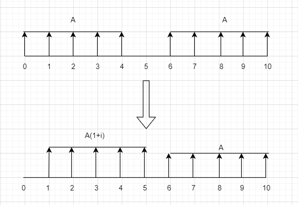
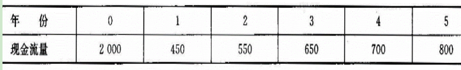
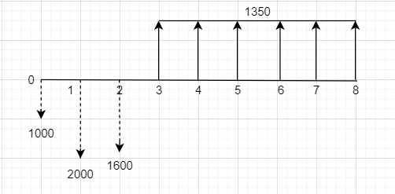
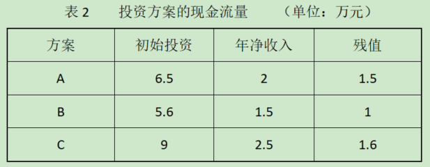

# 第2章 现金流量及其构成
## 练习一
### 名词解释
#### 工程项目
- 工程项目是以工程建设为载体的项目，是作为被管理对象的一次性工程建设任务。它以建筑物或构筑物为目标产出物，需要支付一定的费用、按照一定的程序、在一定的时间内完成，并应符合质量要求。
#### 现金流量
- 现金流量是评价投资方案经济效益的必备资料。具体内容包括：
  - 现金流出：现金流出是投资项目的全部资金支出。它包括以下几项：
    - ①固定资产投资。购入或建造固定资产的各项资金支出。
    - ②流动资产投资。投资项目所需的存货、货币资金和应收帐款等项目所占用的资金。
    - ③营运成本。投资项目在经营过程中所发生的生产成本、管理费用和销售费用等。通常以全部成本费用减去折旧后的余额表示。
  - 现金流入：现金流入是投资项目所发生的全部资金收入。它包括以下几项：
    - ①营业收入。经营过程中出售产品的销售收入。
    - ②残值收入或变价收入。固定资产使用期满时的残值，或因故未到使用期满时，出售固定资产所形成的现金收入。
    - ③收回的流动资产。投资项目寿命期满时所收回的原流动资产投资额。此外，实施某项决策后的成本降低额也作为现金流入。 
#### 固定资产
- 固定资产是指企业为生产产品、提供劳务、出租或者经营管理而持有的、使用时间超过12个月的，价值达到一定标准的非货币性资产，包括:
  - 房屋、建筑物、机器、机械、运输工具以及其他与生产经营活动有关的设备、器具、工具等。
- 固定资产是企业的劳动手段，也是企业赖以生产经营的主要资产。从会计的角度划分，固定资产一般被分为:
  - 生产用固定资产
  - 非生产用固定资产
  - 租出固定资产
  - 未使用固定资产
  - 不需用固定资产
  - 融资租赁固定资产
  - 接受捐赠固定资产等
#### 无形资产
- 无形资产是指企业拥有或者控制的没有实物形态的可辨认非货币性资产。- 无形资产具有广义和狭义之分
  - 广义的无形资产包括货币资金、金融资产、长期股权投资、专利权、商标权等，因为它们没有物质实体，而是表现为某种法定权利或技术。
  - 但是，会计上通常将无形资产作狭义的理解，即将专利权、商标权等称为无形资产。
#### 流动资产
- 流动资产（Current Assets）是指企业可以在一年或者超过一年的一个营业周期内变现或者运用的资产，是企业资产中必不可少的组成部分。
- 流动资产在周转过渡中，从货币形态开始，依次改变其形态，最后又回到货币形态（货币资金→储备资金、固定资金→生产资金→成品资金→货币资金），各种形态的资金与生产流通紧密相结合，周转速度快，变现能力强。加强对流动资产业务的审计，有利于确定流动资产业务的合法性、合规性，有利于检查流动资产业务帐务处理的正确性，揭露其存在的弊端，提高流动资产的使用效益。
#### 经营成本
- 运营成本也称经营成本、营业成本。是指企业所销售商品或者提供劳务的成本。
- 营业成本应当与所销售商品或者所提供劳务而取得的收入进行配比。营业成本是与营业收入直接相关的，已经确定了归属期和归属对象的各种直接费用。
- 营业成本主要包括主营业务成本、其他业务成本。
---
### 简答题
#### 工程项目经济评价过程中应遵循哪些基本原则
- 无对比原则
- 效益与费用计算口径相一致的原则
- 收益与风险权衡的原则
- 定量分析与定性分析相结合的原则
- 动态分析和静态分析相结合的原则。
#### 工程项目评价的基本内容
- 包括三个方面:
  - 经济评价
  - 技术评价
  - 社会评价 
#### 工程项目评价的基本程序
- 工程项目后评价的基本程序一般包括
  - 制订后评价计划
    - 工程项目后评价的计划应提早，最好在工程项目前评估和项目执行过程中就确定下来，以便项目管理者和执行者在项目实施过程中就开始收集资料。从项目周期的概念出发，每一个工程项目都应重视和准备后评价工作。  
  - 选择后评价范围
    - 在工程项目后评价实施之前必须明确评价的范围和深度。工程项目后评价的范围通常是以后评价任务书的形式来确定，这包括：后评价的目的、内容、深度、时间等，特别是有关工程项目后评价必须完成的特定要求，应给出十分明确而具体的说明。 
  - 建立后评价组织
    - 一般情况下工程项目后评价要确定一名负责人，该负责人不应是参与过此项目评估、决策和实施的人。该负责人聘请和组织工程项目后评价专家组去实施后评价。 
  - 实施后评价
    - 其主要内容包括工程项目后评价相关资料收集、工程项目后评价的现场调查与资料整理和工程项目后评价的分析结论。
  - 编制工程项目后评价报告等阶段。 
    - 即项目后评价各种结果的汇总与撰写，它必须真实地反映情况，客观分析评价问题，认真全面地总结经验，恰当地给出工程项目后续发展的对策与建议。将分析研究的成果汇总，编制出项目后评价报告，并提交委托单位和被评价单位。尽管随着建设项目的规模大小、复杂程度的不同，每个项目后评价的具体工作程序也存在一定的差异，但是，从总体看，一般项目的后评价都遵守一个客观的、循序渐进的基本程序。工程项目后评价的基本程序一般包括制订后评价计划、选择后评价范围、建立后评价组织、实施后评价以及编制工程项目后评价报告等阶段。 

#### 建设项目的总投资由哪些部分构成
- 固定资产投资
  - 建设投资
  - 建设期利息
  - 固定资产投资方向调节税 
- 流动资产投资

#### 流动资金的作用及特点是什么?流动资金包含哪些内容?
- 流动资金是在工业项目投产前预先垫付在投产后的生产经营过程中用于购买原材料、燃料动力、备品备件、支付工资和其他费用及被在产品、半成品、产成品和其他存货占用的周转资金。在生产经营过程中流动资金以现金及各种存款、存货、应收及预付款项等流动资产的形态出现。
- 流动资产是在一年内或超过一年的一个营业周期内变现或耗用的资产。在整个项目寿命期结束时全部流动资金才能退出生产与流通以货币资金的形式回收。流动资金是流动资产与流动负债的差额。 
- 流动资金是在工业项目投产前预先垫付,在投产后的生产经营过程中用于购买原材料、燃料动力、备品备件、支付工资和其他费用及被在产品、半成品、产成品和其他存货占用的周转资金。
- 在生产经营过程中,流动资金以现金及各种存款、存货、应收及预付款项等流动资产的形态出现。流动资产是在一年内或超过一年的一个营业周期内变现或耗用的资产。在整个项目寿命期结束时,全部流动资金才能退出生产与流通,以货币资金的形式回收。流动资金是流动资产与流动负债的差额。

#### 什么是固定资产原值,净值,残值
- 固定资产原值
  - “固定资产原始价值”的简称，亦称“固定资产原始成本”、“原始购置成本”或“历史成本”。固定资产原值反映企业在固定资产方面的投资和企业的生产规模、装备水平等。它还是进行固定资产核算、计算折旧的依据。
- 净值
  - 固定资产净值也称为折余价值,是指固定资产原始价值减去已提折旧后的净额。它可以反映物流企业实际占用在固定资产上的资金数额和固定资产的新旧程度。这种计价方法主要用于计算盘盈、盘亏、毁损固定资产的损益等。
- 残值  
  - 固定资产残值是固定资产残余价值的简称。指固定资产报废清理时收回的一些残余材料的价值。在计算固定资产折旧时，一般要预计固定资产残值。按照我国有关会计制度规定，固定资产的净残值(残值减去清理 费用后的余额) 比例，应在原值3%～5%的 范围内，由企业主管部门确定，报同级财政备案。根据固定资产原值减去净残值后的余额和规定的折旧年限，采用平均年限法计算固定资产年折旧额和年折旧率。 
#### 试分别从成本中心建设互总成本费用的构成
- 总成本费用包括
  - 生产成本
    - 直接费用和制造费用销售费用、财务费用和管理费用统称为期间费用。 
  - 销售费用
  - 财务费用
  - 管理费用。

---
# 第3章 资金的时间价值与等值计算
## 练习2
### 一.选择题(单选题)
1. 公积金贷款的计息期为月,月利率为3‰,则贷款的名义年利率为(c)  
   a.8% &nbsp;&nbsp; b.8‰ &nbsp;&nbsp; c.3.6% &nbsp;&nbsp; d.3.6‰
   - $名义利率 = 计息周期的利率 \times 一年的计息次数$
2. 整付终值系数与整付现值系数之间的关系是(b)  
   a.一定是倍数关系 &nbsp;&nbsp; b.互为倒数 &nbsp;&nbsp; c差值为 &nbsp;&nbsp; d没有任何关系
   - 整付终值系数:$F/P$
   - 整付现值系数:$P/F$
3. $(P/F, i, n)(F/A, i, n)(F/P, i, n)(A/F, i, n)=(c)$  
   a.i+1 &nbsp;&nbsp; b.0 &nbsp;&nbsp; c.1 &nbsp;&nbsp; d.1/1+i
   - 整付终值系数 * 整付现值系数 = 1
   - 等额分付终值系数 * 等额分付偿债基金系数 = 1
4. 公式$A=F(A/F, i, n)$中的F应发生在(b).  
   a.第一期等额支付时刻的前一期 &nbsp;&nbsp; b.与最后一期等额支付时刻相同 &nbsp;&nbsp;   
   c.与第一期等额支付时刻相同 &nbsp;&nbsp;&nbsp;&nbsp;&nbsp;&nbsp; d任意时期
   - 等额分付的集中等值计算公式需要满足的条件:
     - 每期支付金额相同(A值)
     - 支付间隔相同(如一年)
     - 每次支付都在年末,**终值与最后一期支付同时发生**
5. 某人储备养老金,每年年末存款1000元,已知银行存款年利率为4%,20年后他的养老金总数可以应用(a)公式计算.  
   a. 等额分付终值 &nbsp;&nbsp; b等额分付偿债基金 &nbsp;&nbsp; c.等额分付现值 &nbsp;&nbsp; d.等额资本回收系数
   - 每年年末等额付款,计算终值

---
### 二.计算题
1. 假设你从银行借了 10000 元,年利率为 10%, 贷款期为3年.假设有两种方案可供选择,试问两种方案是否等值,为什么?
   - 1.每年年末支付利息,第三年末归还本金;
   - 2.第3年年末本金和利息一次性偿还    
- 选择方案一则总共偿还的金额为:  
  $10000\times10\%\times3+10000=13000$
  - 将偿还金等值到第三年末为:  
  $10000\times10\%\times((1+10\%)^2+(1+10\%)+1)+10000=13310$
- 选择方案二则第三年末一次性偿还的金额为:  
  $F_n=P(1+i)^n=13310$
- 故两种方案不等值

---
2. 假设在10年间你每年向储蓄账户中存款50000元，年利率是8%，其中第1年—第5年的每笔存款发生在每年的年初，第6年--第10年的每笔存款发生在每年的年末，试问在10年后能获得多少资金？

$F=A((1+i)+1)(F/A,i,5)+A(1+i)(F/A,i,5) \times ((1+8\%)^5-1)$  
  &nbsp;&nbsp;&nbsp;&nbsp;&nbsp;$=50000(2+8\%)(F/A,8\%,5)+50000 \times 1.08(F/A,i,5) \times ((1.08)^5-1)$  
  &nbsp;&nbsp;&nbsp;&nbsp;&nbsp;$=50000\times 2.08\times5.86660 + 148681.4451$  
  &nbsp;&nbsp;&nbsp;&nbsp;&nbsp;$=758807.8451$  
  故10年后能获得758807.8451元资金

---
3. A公司是一家小型生物技术公司  ，为进行基因实验贷款250万元购买设备，假设贷款年利率为10%，需要在以后6年分期等额偿还，试计算每年分期付款的金额  
每年分期付款金额 = 欠款利息 + 还本 =  
$250 \times 10\% + 250 \times(A/F,10\%,6)=$   
$250 \times 0.12961 + 250 \times 10\% = 57.4025$万元  
故每年分期付款的金额为57.4025万元

---
## 练习3
- 1.有甲、乙两方案，其寿命期甲较乙长，在各自的寿命期内，两方案的净现值大于0且相等，则（ B ）。   
   a甲方案较优  &nbsp;&nbsp;&nbsp;&nbsp;  b乙方案较优   
   c两方案一样  &nbsp;&nbsp;&nbsp;&nbsp;  d无法评价
- 2.所谓内部收益率，是指项目在（ B ）的情况下的收益率。   
    a 期末不能回收投资  &nbsp;&nbsp;&nbsp;&nbsp;   b 期末刚好回收投资       
    c 期末超额回收投资  &nbsp;&nbsp;&nbsp;&nbsp;   d 项目整个寿命期内净现值大于零
- 3.下列对净现值法理解不正确的是（ D ）。   
  a 净现值法考虑了资金的时间价值  
  b 不能揭示各个投资方案本身可能达到的投资报酬率  
  c 在互斥选择决策中，净现值法最为适用  
  d 在有多个备选方案的互斥选择中，一定要选用净现值最大的方案。  
- 4.项目的（ A ）计算结果越大，表明其盈利能力越强。   
  a．财务净现值  &nbsp;&nbsp;&nbsp;&nbsp;  b．投资回收期   
  c．盈亏平衡点  &nbsp;&nbsp;&nbsp;&nbsp;  d．借款偿还期
- 5.下列评价中，属于动态指标的是（ C ）。   
  a．投资利润率  &nbsp;&nbsp;&nbsp;&nbsp;  b．投资利税率    
  c．内部收益率  &nbsp;&nbsp;&nbsp;&nbsp;  d．平均报酬率

---
### 二、判断题（正确为T，错误为F）
- 1.（ F ）投资项目的直接收益即为内部收益，间接收益即为外部收益。
- 2.（ T ）常规项目的净现值大小随基准折现率的增加而减少
- 3.（ F ）净年值与费用年值是等效评价指标。
- 4.（ F ）内部收益率反映了投资的使用效率。
- 5.（ F ）若方案的净现值小于零，则表明此方案为一亏损方案。

---
### 三、简答题
- 1.净现值函数有什么特点？如何用净现值进行方案评价？
  - 净现值函数一般有如下特点
    - 同一净现金流量的$NPV$(净现值) 随 $i$ (折现率) 的增大而减小
      - 故基准折现率 $i_0$ 越大则 NPV 就越小甚至为零或负值因而可被接受的方案也就越少；
    - $NPV$ 随 $i$ 的增大可从正值变为负值
      - 因此必然会有当 $i$ 为某一数值 $i^*$ 时使得$NPV=0$  
---
- 2.简述影响内部收益率大小的因素？内部收益率的经济含义是什么？
  - 影响内部收益率大小的因素
    - 项目初始投资
    - 项目在寿命期内各年的净现金流量
  - 内部收益率的经济含义
    - 所谓内部收益率是指项目在计算期内各年净现金流量现值累计值(净现值)等于零时的折现率
  
---
### 四 计算题
- 1.两个方案的经济寿命相同，甲方案投资为10000元，年经营费为8000元，残值为1000元，乙方案投资为8000元，年经营费为9000元，残值为0，若基准投资收益率为8％，试比较哪个方案好？  
假设使用寿命为y,则:  
$AC_甲 = [10000 + 8000(P/A, 8\%, y) - 1000(P/F, 8\%, y)](A/P, 8\%, y)$  
$AC_乙 = [8000 + 9000(P/A, 8\%, y)](A/P, 8\%, y)$    
$AC_乙 - AC_甲 = [1000(P/A, 8\%, y) + 1000(P/F, 8\%, y) - 2000](A/P, 8\%, y)$  
&nbsp;&nbsp;&nbsp;&nbsp;&nbsp;&nbsp;&nbsp;&nbsp;&nbsp;&nbsp;&nbsp;&nbsp;&nbsp;&nbsp;&nbsp;&nbsp;&nbsp;&nbsp;&nbsp;&nbsp;&nbsp;&nbsp;&nbsp;&nbsp;&nbsp;&nbsp;
$= [1000(\frac{1.08^y-1}{0.08 \times 1.08^y}+\frac{1}{1.08^y}) - 2000] \frac{0.08 \times 1.08^y}{1.08^y - 1}$      
&nbsp;&nbsp;&nbsp;&nbsp;&nbsp;&nbsp;&nbsp;&nbsp;&nbsp;&nbsp;&nbsp;&nbsp;&nbsp;&nbsp;&nbsp;&nbsp;&nbsp;&nbsp;&nbsp;&nbsp;&nbsp;&nbsp;&nbsp;&nbsp;&nbsp;&nbsp;
$= [1000(\frac{1.08^y - 0.92}{0.08 \times 1.08^y}) - 2000] \frac{0.08 \times 1.08^y}{1.08^y - 1}$     
&nbsp;&nbsp;&nbsp;&nbsp;&nbsp;&nbsp;&nbsp;&nbsp;&nbsp;&nbsp;&nbsp;&nbsp;&nbsp;&nbsp;&nbsp;&nbsp;&nbsp;&nbsp;&nbsp;&nbsp;&nbsp;&nbsp;&nbsp;&nbsp;&nbsp;&nbsp;
$= 1000[(\frac{1.08^y - 0.92}{0.08 \times 1.08^y}) - 2] \frac{0.08 \times 1.08^y}{1.08^y - 1}$  
&nbsp;&nbsp;&nbsp;&nbsp;&nbsp;&nbsp;&nbsp;&nbsp;&nbsp;&nbsp;&nbsp;&nbsp;&nbsp;&nbsp;&nbsp;&nbsp;&nbsp;&nbsp;&nbsp;&nbsp;&nbsp;&nbsp;&nbsp;&nbsp;&nbsp;&nbsp;
$= 1000[\frac{0.84 \times 1.08^y - 0.92}{0.08 \times 1.08^y}] \frac{0.08 \times 1.08^y}{1.08^y - 1}$  
$使用寿命y > 0$    
$\frac{0.08 \times 1.08^y}{1.08^y - 1} > 0$    
$0.08 \times 1.08^y > 0$  
设$F(y) = 0.84 \times 1.08^y - 0.92$   
易知F(y)为单调增函数,  
且$F(1) = -0.0128 < 0$ &nbsp;&nbsp;&nbsp; $F(2) = 0.059776 > 0$  
故当两个方案的经济寿命在2年及以上时甲方案更好,当且仅当两方案的经济寿命为1年时乙方案更好;

---
- 2.某方案的现金流量如下表所示，基准收益率为15％，试计算；
  - （l）静态与动态的投资回收期；
  
  
    
  $P_t = 4 - 1 + \frac{350}{700} = 3.5$     
  故静态投资回收期为3.5年
  - （2）净现值NPV。(第0年末的现金流量为负值)  
  $NPV = -2000 + 450 \times 1.15^{-1} + 550 \times 1.15^{-2} + 650 \times 1.15^{-3} + 700 \times 1.15^{-4} + 800 \times 1.15^{-5}$  
  $\approx 32.54$   

# 第4章 投资项目经济评价的基本方法      
## 10.21课堂练习
### 比较两个寿命期不同的互斥方案的优劣
- 求净年值   
  - $NAV_A = [-300(A/P, 10\%, 4) +96$        
    $= 0.31547 \times (-300) +96$  
    $= 1.359$

---
## 练习四
### 一、计算题
- 1.某项目各年的净现金流量如表1所示，基准收益率为12%。
  
  - (1).画出现金流量图；
    
  - (2).试用净现值、净现值指数、净年值、内部收益率等指标判断该项目是否可行。
    - 净现值:  
      $NPV=-1000-2000(P/F,12\%,1)-1600(P/F,12\%,2)+1350(P/A,12\%,6)\\=-1000-2000 \times 0.89286-1600 \times 0.79719+1350 \times 4.11141\\=1489.1795$ 
        - 说明该项目实施后的经济效益除达到12%的收益率外,还有1489.1795万元的收益现值,项目可行
    - 净年值  
      $NAV=[-1000+(-2000)×(P/F,12\%,1)\\+(-1600)×(P/F,12\%,2)\\+1350×(P/F,12\%,3)\\+1350×(P/F,12\%,4)\\+1350×(P/F,12\%,5)\\+1350×(P/F,12\%,6)\\+1350×(P/F,12\%,7)\\+1350×(P/F,12\%,8)]×(A/P,12\%,8)\\\approx 73.18(万元)$ 
    - 内部收益率
       - 设i1=12%,i2=15%  
        $NPV(i_1)≈363.52>0\\NPV(i_2)≈-85.78<0\\i_2-i_1<5\%\\IRR≈i_1+\frac{NPV(i_1)}{NPV(i_1)+|NPV(i_2)|}(i_2-i_1)=14.43\%>10\%$
    - 故方案可行

---
- 2.购置一间临时仓库需用6000元。但一经拆毁即无残值。假定每年净收益为1260元，则
  - 1.若使用8年，IRR为多少？
    - 设$i_1=12\%$  
      $NPV(i_1)≈259.23>0$ 
    - 设$i_2=14\%$  
      $NPV(i_2)≈-155.03<0\\i_2-i_1<5\%\\IRR \approx i_1+\frac{NPV(i_1)}{NPV(i_1)+|NPV(i_2)|}(i_2-i_1)\\=13.25\%$ 

  - 2.如果基准收益率为10%，则该仓库至少应使用多少年才值得投资？  
    $NPV = -6000 + 1260 \times \frac{1.1^{-1} \times (1 - 1.1^{-n})}{1-1.1^{-1}} \geq 0 \\ n \geq 6.784$
    - 答:至少用7年才值得投资

---
- 3.某公司拟定了三个相互独立的投资方案，其现金流量如表2所示，基准收益率为10%，寿命期均为10年。

- 若无资金约束，应该选择哪个方案？  
  $NPV_A=-6.5 + 2 × (P/A, 10\%, 10) + 1.5 × (P/F, 10\%, 10) \\ ≈ 6.38(万元)$  
$NPV_B= -5.6 + 1.5 × (P/A, 10\%, 10) + 1 × (P/F, 10\%, 10) \\ ≈ 4.00(万元)$  
$NPV_C= -9 + 2.5 × (P/A, 10\%, 10) + 1.6 × (P/F, 10\%, 10) \\ ≈ 6.98(万元)$  
$NPV_C > NPV_A > NPV_B$
  - 若无资金约束,应选择方案C
- 若资金限额为15万元，应当选择哪种组合方案？  
$NPVR_A = \frac{NPV_A}{K_P} ≈ 0.98$  
$NPVR_B = \frac{NPV_B}{K_P} ≈0.71$  
$NPVR_C = \frac{NPV_C}{K_P} ≈0.78$  
$NPVR_A > NPVR_C > NPVR_B$
  - 若资金限额为15万元，应当选择方案A和方案B

---
- 4.某企业为加工某种产品有两种设备可供选择，A设备需投资3万元，年操作成本为2000元，设备寿命为6年，期末残值为500元；B设备需投资4万元，年操作成本为1600元，设备寿命为9年，期末无残值。设基准收益率为10%，两种设备的生产率相同，试对两种方案进行选择。
  - 设两种设备的年收益为x万元  
  $NPV_1=-3+(x-0.2)×(P/A,10\%,6)+0.05×(P/F,10\%,6)$  
  $≈4.355x-3.843$  
  $NPV_2=-4+(x-0.16)×(P/A,10\%,9)$  
  $≈5.759x - 4.921$  
  $NPV_1-NPV_2≈-1.404x+1.078$   
    - 当x<0.768时,NPV1>NPV2;
    - 当x>0.768时,NPV1<NPV2.
  - 当两种设备年收益小于7680元时,选择A设备;
  - 当两种设备的年收益答于7680元时,选择B设备.