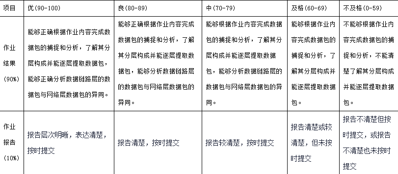
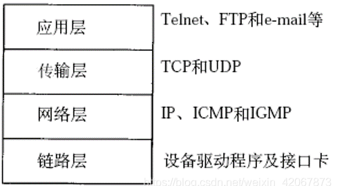
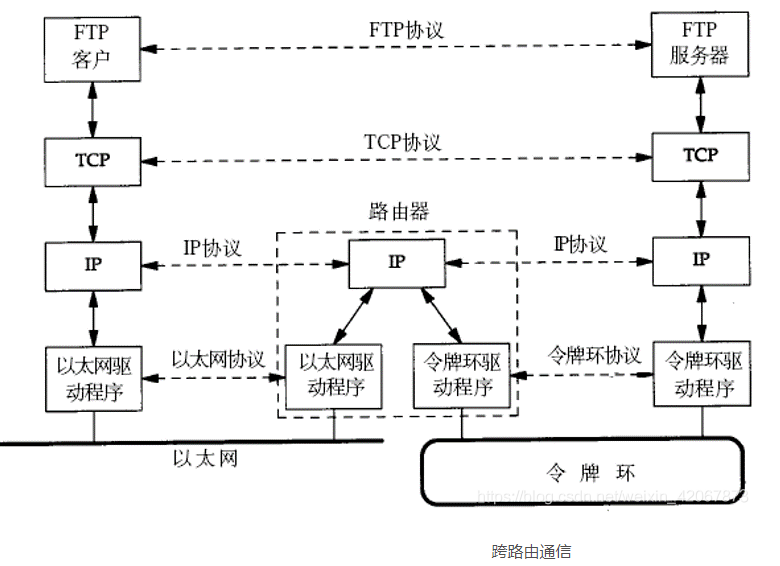

# 第2单元练习
## 一,单选题
- 1.采用专用线路通信时，可以省去的通信阶段是?
  - 建立通信线路
    - 既然是专用线路,因此通信时可以省去建立通信线路的时间
- 2.通信系统必须具备的三个基本要素是 $?$ 
  - 信源、通信媒体(信道)、信宿
- 3.网络接口卡的基本功能包括：数据转换、通信服务和?
  - 数据缓存
- 4.在星型局域网结构中，连接文件服务器与工作站的设备是?
  - 集线器
- 5.在中继系统中，中继器处于 $?$ 
  - 物理层
- 6.各种网络在物理层互连时要求?
  - 数据传输率和链路协议都相同
- 7.市话网在数据传输期间，在源节点与目的节点之间有一条利用中间节点构成的物理连接线路。这种市话网采用 $?$ 技术。
  - 电路交换
- 8.采用异步传输方式，设数据位为7位，1位校验位，1位停止位，则其通信效率为 $?$
  -  70%
     - $通信效率=\frac{7个数据位}{1个起始位+7个数据位+1个停止位尾数+1个校验位}$ 
- 9.采用相位幅度调制PAM技术，可以提高数据传输速率，例如采用8种相位，每种相位取2种幅度值，可使一个码元表示的二进制数的位数为 $?$
  - 4
    - 采用8种相位,每种相位取2种幅度值,则可表示16种状态,即4位
- 10.采用曼彻斯特编码，100Mbps传输速率所需要的调制速率为 $?$
  - 200Mbaud
    - 调制速率要传输速率的2倍
- 11.若信道的复用是以信息在一帧中的时间位置(时隙)来区分，不需要另外的信息头来标志信息的身分，则这种复用方式为 $?$
  - 同步时分复用
- 12.在同一个信道上的同一时刻，能够进行双向数据传送的通信方式是 $?$
  - 全双工
- 13.计算机通信子网技术发展的顺序是 $?$
  - 电路交换->报文分组交换->帧中继->ATM
- 14.报文交换技术说法不正确的是 $?$
  - 报文交换方式适用于语言连接或交互式终端到计算机的连接
  - 正确的是:
    - 报文交换采用的传送方式是“存储一转发”方式
    - 报文交换方式中数据传输的数据块其长度不限且可变
    - 报文交换可以把一个报文发送到多个目的地
- 15.若在一个语音数字化脉码调制系统中，在量化时采用了128个量化等级，则编码时相应的码长为 $?$ 位
  - 7
    - $2^7=128$
- 16.能从数据信号波形中提取同步信号的典型编码是 $?$
  - 曼彻斯特编码 
- 17.有关光缆陈述正确的是 $?$
  - 光缆的光纤通常是偶数，一进一出
  - 错误的是:
    - 光缆不安全
    - 光缆传输慢
    - 光缆较电缆传输距离近
- 18.通过改变载波信号的相位值来表示数字信号1、0的方法叫做 $?$
  - PSK
    - 相移键控(phase-shift keying)
    - 一种用载波相位表示输入信号信息的调制技术。
      - 移相键控分为绝对移相和相对移相两种。
        - 绝对移相  
          以未调载波的相位作为基准的相位调制。
      - 以二进制调相为例，取码元为“1”时，调制后载波与未调载波同相；取码元为“0”时，调制后载波与未调载波反相；“1”和“0”时调制后载波相位差180°
  - 其他选项
    - ASK
      - 无相关含义
    - FSK
      - 频移键控(Frequency-shift keying)
      - 是信息传输中使用得较早的一种调制方式
      - 它的主要优点是: 
        - 实现起来较容易
        - 抗噪声与抗衰减的性能较好。
      - 在中低速数据传输中得到了广泛的应用。
      - 最常见的是用两个频率承载二进制1和0的双频FSK系统。
    - ATM 
      - 异步转移模式
      - 是一种以固定长度的分组方式，并以[异步时分复用](https://baike.baidu.com/item/%E5%BC%82%E6%AD%A5%E6%97%B6%E5%88%86%E5%A4%8D%E7%94%A8/666141)方式，传送任意速率的宽带信号和数字等级系列信息的交换设备。
      - 异步转移模式是用于实现[宽带综合业务数字网（ B-ISDN ）](https://baike.baidu.com/item/%E5%AE%BD%E5%B8%A6%E7%BB%BC%E5%90%88%E4%B8%9A%E5%8A%A1%E6%95%B0%E5%AD%97%E7%BD%91/7830053)的基础技术。它可综合任意速率的话音、数据、图像和视频的业务。
- 19.计算机网络由通信子网和资源子网组成。下列设备中属于资源子网的是 $?$
  - 主机
- 20.电路交换是实现数据交换的一种技术，其特点是 $?$
  - 信息延时短，且固定不变
- 21.在计算机网络通信系统中，一般要求误码率低于 $?$
  - $10^{-6}$
- 22.下列陈述中，不正确的是 $?$
  - 数字通信系统比模拟通信系统的信道利用率更高 
  - 正确选项
    - 数字通信系统比模拟通信系统的抗干扰性更好
    - 数字通信系统比模拟通信系统更便于集成化
    - 数字通信系统比模拟通信系统更便于微形化
- 23.信号传输率为1200Baud，每个码元可取8种离散状态，该信号的数据传输率是 $?$
  - 3600 bsps
    - 每个码元可取种中离散状态,即每个码元3位2进制
      - 因此传输速率为3600 bps
        - $1200 \times 3 Byte Per Second=3600 bps$
- 24.一个8相的PSK调制解调器，其波特率为1600波特，可获得的数据传输率为 $?$
  - 4800 bps
    - 一个8相的PSK调制解调器每个码元3位二进制
      - 因此数据传输速率为$1600 \times 3 = 4800 bps$
- 25.对语音信号进行脉码调制(PCM)时采样频率应 $?$
  - $\geq 8000次/s$
    - 依据采样定理,PCM采样频率要大于信号最高频率的2倍,而语音信号的最高频率为4K左右,因此应$\geq 2 \times 4000 = 8000次/s$
- 26.理想低通信道的最高码元传输速率为 $?$
  - 2Wbaud
- 27.一个理想低通信道带宽为3KHZ，其最高码元传输速率为 $?$ 。若一个码元携带2 bit信息量，则最高信息传输速率为 $?$ 。
  - 6000Baud，12000bit/s
- 28.两台计算机利用电话线路传输数据信号时，必备的设备是 $?$
  - 调制解调器
- 29.双绞线传输介质是把两根导线绞在一起，这样可以减少 $?$
  - 信号之间的相互串扰
    - 把两根导线绞在一起,可降低信号之间干扰的程度,每一根导线在传输中辐射的电波会被另一根线上发出的电波抵消
- 30.对于带宽为50kHz的信道,若有8种不同的物理状态来表示数据，信噪比为20DB。问按奈奎斯特定理，最大数据速率是多少?按香农定理，最大数据速率又是多少?
    - 300K(b/s)，50K×log2(101)(b/s)
- 31.通信子网为网络源结点与目的结点之间提供了多条传输路径的可能性，路由选择指的是 $?$
  - 网络中间结点收到一个分组后，确定转发分组的路径
- 32.在下列多路复用技术中， $?$ 具有动态分配时隙的功能
  - 统计时分多路复用
- 33.共有4个站进行码分多址通信。4个站的码片序列为: 
  - a：(-1 -1 -1 +1 +1 -1 +1 +1) ，
  - b：(-1 -1 +1 -1 +1 +1 +1 -1)，  
  - c：(-1 +1 -1 +1 +1 +1 -1 -1) ，
  - d：(-1 +1 -1 -1 -1 -1 +1 -1) 
  - 现收到这样的码片序列：
    - (-1 +1 -3 +1 -1 -3 +1 +1)，
  - 则 $?$ 发送1。
    - a和d
- 34.承载信息量的基本信号单位是 $?$
  - 码元
- 35.以下关于物理层基本概念的描述中错误的是 $?$
  - 数据传输单元是字节 
    - 数据传输单元是比特
      - $1 byte(字节) = 8 bit(比特)$
  - 正确选项
    - 0SI参考模型的最底层
    - 为通信的主机之间建立，管理和释放物理连接
    - 实现比特流的透明传输
- 36.以下关于OSI环境基本概念的描述中错误的是 $?$
  - 连接主机的物理传输介质包括在0SI环境中
    - OSI环境中并无连接主机的物理传输介质
  - 正确选项
    - 0SI体系结构包括从应用层到物理层的7层
    - 主机不连入计算机网络中可以不需要有实现从物理层到应用层功能的硬件与软件
    - 主机的进程分别处于本地操作系统控制，不属于0SI环境
- 37.以下关于0SI环境中数据传输过程的描述中错误的是 $?$
  - 表示层只进行数据的格式交换，不増加协议头
    - 几乎每一层都会增加协议头,表示层也一样
  - 正确选项
    - 源主机应用进程产生的数据从应用层向下纵向逐层传送
    - 目的主机逐层按照各层的协议读取报头，执行协议规定的动作
    - 整个过程不需要用户介入 
- 38.以下关于物理层的描述中，错误的是 $?$
  - 物理层屏蔽了 Ethernet与IP的差异性
    - 物理层是最底层,不可能屏蔽Ethernet与IP的差异性
  - 正确选项
    - 物理层的主要任务是保证比特流通过传输介质的正确传输
    - 连接物理层的传输介质可以有不同类型，如光纤与无线通信线路等
    - 物理层协议可以分为基于点-点通信线路与基于广播线路两类
- 39.以下关于时分多路复用概念的描述中，错误的是 $?$
  - 统计时分多路复用将时间片预先分配给各个信道
    - 固定时分多路复用将时间片预先分配给各个信道
  - 正确选项
    - 时分多路复用将线路使用的时间分成多个时间片
    - 时分多路复用分为同步时分多路复用与统计时分多路复用
    - 时分多路复用使用“帧”与数据链路层“帧”的概念、作用是不同的
- 40.以下关于奈奎斯特准则的描述中，错误的是 $?$
  - 用于计算有随机噪声状态下的“带宽”与“速率”的关系
    - 奈奎斯特准则描述的是理想状态下"带宽"与"速率"的关系
  - 正确选项
    - 使用了窄脉冲信号通过理想通信信道的计算模型
    - 线路最大传输速率在数值上等于信道带宽的2倍
    - 传输速率的单位为波特率
- 41.以下选项中不属于自含时钟编码的是 $?$
  - 非归零码
    - 曼彻斯特编码和差分曼彻斯特编码都是自含时钟的编码
- 42.以下关于传输速率基本概念的描述中，错误的是 $?$
  - 比特率S与调制速率B之间的关系可以表示为:$S=B \times lgk$ (k为多相调制的相数)
    - 比特率S与调制速率B之间的关系可以表示为:
      - $S=B \times log2k$
  - 正确描述
    - 调制速率描述的是每秒钟载波调制状态改变的数值
    - 调制速率称为波特率(单位是1/s)
    - 比特率描述在计算机通信中每秒传送的构成代码的二进制比特数
- 43.在电缆中屏蔽有什么好处 $?$ 。 
  - (1)减少信号衰减 
  - (2)减少电磁干扰辐射和对外界干扰的灵敏度   
  - (3)减少物理损坏 
  - (4)减少电磁的阻抗
    - 仅(2)
      - 电缆中屏蔽主要用来减少电磁干扰辐射和对外界干扰的灵敏度
- 44. 以下关于数据报工作方式的描述中 $?$ 是不正确的
  - 在每次数据传输前必须在发送方与接收方之间建立一条逻辑连接
    - 这个描述指的是虚电路方式
  - 正确描述
    - 同一报文的不同分组到达目的结点时可能出现乱序、丢失现象
    - 同一报文的不同分组可以由不同的传输路径通过通信子网
    - 每个分组在传输过程中都必须带有目的地址与源地址
- 45.计算机网络数据传输过程中所产生时延主要包括 $?$ 。
  -  (1)、发送时延 
  -  (2)、传播时延   
  -  (3)、处理时延  
  -  (4)、排队时延   
  -  (5)、确认时延  
  -  (6)、转发时延
     - (1)、(2)、(3)、(4)
       - 计算机网络数据传输过程中所产生时延主要包括发送/传播/处理/排队时延
- 46.下面哪种不是计算机网络中常用的信道复用技术 $?$
  - 电路复用
- 47.在下列传输介质中，错误率最低的是 $?$
  - 光缆
  - 另外三个
    - 同轴电缆
    - 微波
    - 双绞线
- 48.设单路语音信号的最高频率是4kHz，采样频率为8kHz，采用PCM编码传输，试问采样后按256级量化，则传输系统的最小带宽是多少?
  - 64 Kbps
    - 采样频率8 KHz, 量化精度按256级量化, 即8位
    - $8 KHz \times 8 bit = 64 Kbps$

---
## 二. 填空题（共20题，32.8分）
- 49.通信系统中，称调制前的电信号为基带信号，调制后的电信号为 $?$ 信号。
  - 调制
- 50.串行数据通信的方法有三种:单工、半双工和 $?$
  - 全双工
- 51.模拟信号传输的基础是 $?$ ，它是频率恒定的连续信号
  - 载波
- 52.三种最典型的多路复用技术是：频分多路复用和 $?$ 多路复用和码分多路复用 。
  - 时分
- 53.为了防止发送方和接收方的计时漂移，它们的时钟必须设法 $?$
  - 同步
- 54.中继器具有完全再生网络中传送的原有 $?$ 信号的能力。
  - 物理
- 55.信号传输中差错是由噪声所引起的。噪声有两大类，一类是信道所固有的，持续存在的 $?$ ；另一类是由外界特定的短暂原因所造成的冲击噪声。
  - 随机热噪声
- 56.按照实际的数据传送技术，交换网络又可分为电路交换网、报文交换网和 $?$交换网。
  - 分组
- 57.计算机网络中采用的传输媒体可分为有线和无线两大类。双绞线、同轴电缆和光纤是常用的三种 $?$ 传输媒体。
  - 有线
- 58.模拟信号数字化的转换过程包括: 采样、 $?$ 和编码三个步骤。
  - 量化
- 59.曼彻斯特编码是一种同步方式为 $?$ 的编码方案。
  - 自同步
- 60.为进行计算机网络中的数据交换而建立的规则  、标准或约定的集合称为 $?$。
  - 网络协议
- 61.模拟信号传输的基础是载波，载波具有三个要素,即幅度、频率和 $?$ 。数字数据可以针对载波的不同要素或它们的组合进行调制，有三种基本的数字调制形式，即移幅键控法ASK、移频键控法FSK和移相键控法PSK。
  - 相位
- 62.组成数据通信网络的基本要素为 $?$ 、信宿和传输系统三项。
  - 信源
- 63.在一个码元的全部时间内发出或不发出电流(单极性)，以及发出正电流或负电流(双极性)。每一位编码占用了全部码元的宽度。这种编码方式称为 $?$
  - 不归零码NRZ
- 64.在数据通信或计算机网络系统中，传输媒体的带宽或容量往往超过传输单一信号的需求，为了有效地利用通信线路，可以利用一条信道传输多路信号，这种方法称为信道的 $?$ 技术。
  - 多路复用
- 65.从一个站点开始发送数据到另一站点开始接收数据，也即载波信号从一端传播到另一端所需要的时间，称为信号 $?$ 时延。
  - 传播
- 66.香农关于噪声信道的主要结论是：任何带宽为W (赫兹)，信噪比为s/n的信道其最大数据率为 $?$ 。
  - $W \times log2 (1+ \frac{s}{n}) (b/s)$
- 67.非屏蔽双绞线的英文简写是 $?$
  - UTP
- 68.非屏蔽双绞线，由 $?$ 根铜缆组成。
  - 8

---
# 第3单元练习
一. 单选题（共37题，74分）
1. (单选题) 在数据通信中，当发送数据出现差错时，发送端无须进行数据重发的差错控制方法为(    )。
A
ARQ

B
 FEC

C
BEC

D
CRC

2. (单选题) LAN参考模型可分为物理层、(    )等三层。
A
MAC、LLC

B
 LLC、MHS

C
MAC、FTAM

D
LLC、VT

3. (单选题) 在码元速率为1600波特的调制解调器中，采用8PSK(8相位)技术，可获得的数据速率为(    )。
A
2400bps

B
 4800bps

C
9600bps

D
1200bps

4. (单选题) HDLC的帧格式中，帧校验序列字段占(    )。
A
1个比特

B
8个比特

C
16个比特

D
24个比特

5. (单选题) 在局域网参考模型中，两个系统的同等实体按协议进行通信。在一个系统中，上下层之间则通过接口进行通信，用(    )来定义接口。
A
服务原语

B
服务访问点

C
服务数据单元

D
协议数据单元

6. (单选题) 采用全双工通信方式，数据传输的方向性结构为(    )。
A
可以在两个方向上同时传输

B
 出只能在一个方向上传输

C
可以在两个方向上传输,但不能同时进位

D
以上均不对

7. (单选题) 若网络形状是由站点和连接站点的链路组成的一个闭合环,则称这种拓扑结构为(    )。
A
星形拓扑

B
总线拓扑

C
环形拓扑

D
树形拓扑

8. (单选题) 若HDLC帧的数据段中出现比特串”01011111001”，则比特填充后的输出为(    )。
A
010011111001

B
010111110001

C
010111101001

D
 010111110010

9. (单选题) 以下各项中，不是数据报操作特点的是(    )。
A
每个分组自身携带有足够的信息，它的传送是被单独处理的

B
在整个传送过程中，不需建立虚电路

C
使所有分组按顺序到达目的端系统

D
网络节点要为每个分组做出路由选择

10. (单选题) 对于基带CSMA/CD而言，为了确保发送站点在传输时能检测到可能存在的冲突，数据帧的传输时延至少要等于信号传播时延的(    )。
A
1倍

B
2倍

C
4倍

D
2.5倍

11. (单选题) 由于帧中继可以使用链路层来实现复用和转接，所以帧中继网中间节点中只有(    )。
A
物理层和链路层

B
链路层和网络层

C
物理层和网络层

D
网络层和运输层

12. (单选题) 使用同样网络操作系统的两个局域网络连接时，为使连接的网络从网络层到应用层都能一致，连接时必须使用(    )。
A
文件服务器

B
适配器

C
网卡

D
网桥

13. (单选题) 比特串01111101000111110010在接收站经过删除“0”比特后的代码为(    )。
A
01111101000111110010

B
011111100011111010

C
0111111000111110010

D
011111010011111010

14. (单选题) 局域网具有的几种典型的拓扑结构中，一般不含(    )。
A
 星型

B
 环型

C
总线型

D
全连接网型

15. (单选题) 在计算机网络中，所有的计算机均连接到一条通信传输线路上，在线路两端连有防止信号反射的装置。 这种连接结构被称为(    )。
A
总线结构

B
环型结构

C
星型结构

D
网状结构

16. (单选题) 在10Base T的以太网中，使用双绞线作为传输介质，最大的网段长度是(    )。
A
2000m

B
500m

C
185m

D
100m

17. (单选题) 在计算机网络中，一般局域网的数据传输速率要比广域网的数据传输速率(    )。
A
高

B
低

C
相同

D
不确定 

18. (单选题) 在数字通信中广泛采用CRC循环冗余码的原因是CRC可以(    )。
A
检测出一位差错

B
 检测并纠正一位差错

C
 检测出多位突发性差错

D
检测并纠正多位突发性差错 

19. (单选题) 传输介质是通信网络中发送方和接收方之间的 (    )通路。
A
物理

B
逻辑

C
 虚拟

D
数字 

20. (单选题) 网桥工作于(    )用于将两个局域网连接在一起并按 MAC 地址转发帧。
A
物理层

B
 数据链路层

C
网络层

D
传输层 

21. (单选题) 有10台计算机建成10Mbps以太网，如分别采用共享以太网和交换以太网技术，则每个站点所获得的数据传输速率分别为(    )。
A
10Mbps和10Mbps

B
10Mbps和1Mbps

C
1Mbps和10Mbps

D
1Mbps和1Mbps 

22. (单选题) 下列对以太网交换机的说法中错误的是(    )。
A
以太网交换机可以对通过的信息进行过滤

B
以太网交换机中端口的速率可能不同

C
在交换式以太网中可以划分VLAN

D
利用多个以太网交换机组成的局域网不能出现环路 

23. (单选题) 以太网交换机中的MAC地址映射表(    )。
A
是由交换机的生产厂商建立的;

B
是交换机在数据转发过程中通过学习动态建立的;

C
是由网络管理员建立的;

D
是由网络用户利用特殊的命令建立的。

24. (单选题) 目前交换机中使用最广泛的局域网交换技术是(    )。
A
ATM交换

B
 信元交换

C
 端口交换

D
 帧交换 

25. (单选题) 以太网介质访问控制技术CSMA/CD的机制是(    )。
A
争用带宽

B
预约带宽

C
 循环使用带宽

D
按优先级分配带宽

26. (单选题) 下面关于虚拟局域网VLAN的叙述错误的是(    )。
A
VLAN是由一些局域网网段构成的与物理位置无关的逻辑组

B
利用以太网交换机可以很方便地实现VLAN

C
每一个VLAN的工作站可连接在不同的交换机中

D
虚拟局域网是一种新型局域网 

27. (单选题) 关于无线局域网，下列叙述错误的是(    )。
A
无线局域网可分为两大类，即有固定基础设施的和无固定基础设施的

B
无固定基础设施的无线局域网又叫做自组网络

C
有固定基础设施的无线局域网的MAC层不能使用CSMA/CD协议，而是使用CSMA/CA协议

D
移动自组网络和移动IP相同 

28. (单选题) 某一速率为100M的交换机有20个端口，则每个端口的传输速率为(    )。
A
100M

B
10M

C
2000M

D
5M 

29. (单选题) 以太网中的最小帧长是根据(    )来设定的。
A
网络中传送的最小信息单位

B
物理层可以区分的信息长度

C
 网络中检测冲突的最长时间

D
网络中发生冲突的最短时间 

30. (单选题) 划分VLAN的方法有多种，这些方法中不包括(    )。
A
基于路由设备的划分

B
基于MAC地址的划分

C
基于端口的划分

D
基于IP组播划分 

31. (单选题) 以下是关于数据链路层的基本概念的描述错误的是(    )。
A
相邻高层是网络层

B
可以在释放物理连接后建立数据链路

C
采用差错控制与流量控制的方法使有差错的物理线路变成无差错的物理链路

D
数据链路层的数据传输单元是帧 

32. (单选题) 一个24口的交换机，连接有10台PC，划分了5个VLAN，则冲突域有(    )。
A
1个

B
 5个

C
10个

D
24个

33. (单选题) 以下哪个是MAC地址(    )。
A
0D-01-02-AA

B
00-01-22-0A-AD-01

C
 A0.01.00

D
139.216.000.012.002

34. (单选题) 用来组建VLAN的设备是(    )。
A
交换机

B
路由器

C
集线器

D
网关

35. (单选题) 如果网络的传输速度为56Kbps,要传输2M字节的数据大约需要的时间是(    )。
A
10分钟

B
1分钟

C
1小时10分钟

D
5分钟

36. (单选题) 若待传输数据为11100011，生成多项式G(X)=X5+X4+X+1，计算出的CRC校验码为(    )。
A
01101

B
11010

C
 001101

D
0011010

37. (单选题)
在一个采用CSMA/CD的网络中，传输介质是一根完整的电缆，数据传输速率S为1Gbps，电缆中的信号传播速度SR为（2/3）c，（c的值3×m/s），若最短帧长减少800b，则相距最远的两个站点之间的距离至少需要（    ）

A
增加160m     

B
增加80m     

C
减少160m    

D
减少80m

二. 填空题（共13题，26分）
38. (填空题) 在计算机网络和数据通信中用得最广泛的检错码是CRC码(循环冗余码)又称_______。
第1空

39. (填空题) 通过增加冗余位使得码字中“1”的上数恒为奇数或偶数的编码方法为  _______。
第1空

40. (填空题) 同步传输时，可以采用面向字符的方案，也可采用面向_______的方案。
第1空

41. (填空题) 以太网采用的CSMA算法进行载波监听，采用_______算法决定冲突后的避让时间。
第1空

42. (填空题) 从一个站点开始发送数据到另一站点开始接收数据，也即载波信号从一端传播到另一端所需要的时间，称为信号_______时延。
第1空

43. (填空题) 线缆长度为1km，数据传输速率为10Mb/s的以太网，电磁信号传播速率为2×m/ms，则其最短帧长为_______。
第1空

44. (填空题) 在将计算机与10BASE-T集线器进行连接时，UTP电缆的长度不能大于_______。
第1空

45. (填空题) 虚拟局域网英文简写是_______。
第1空

46. (填空题) CSMA/CD发送流程：先听后发，_______，冲突停止，延迟重发。
第1空

47. (填空题) 带宽为4000Hz的无噪声信道，采用振幅键控调制技术，信号幅度为16级，其数据传输速率为_______。
第1空

48. (填空题) 带宽为4000Hz的噪声信道，信噪比为1000（或为30dB），采用振幅键控调制技术，信号幅度为16级，其信道容量为_________。
第1空

49. (填空题)
假定10Mbps总线形以太网由单段电缆构成，电缆长度L为  

             200m，电信号传播速度SR为（2/3）c ，即2×m/s），

             求出对应的最短帧长 。

第1空

50. (填空题) 多径效应最严重的情况是经过两条路径传输的电磁波到达接收端时相位相差180º，如果电磁波的频率f是1GHz，两条路径相差________距离才会造成这一情况。
第1空

---
# 大作业1 ---- 抓包与分析
## 作业目的
- 了解网络通信的分层实现过程，了解不同层次PDU的逐层封装与解封过程；
- 了解数据通信的过程，进一步认知协议的构成与通信过程，进而对TCP/IP分层体系结构有更深刻的了解。

---
## 作业内容
- 在局域网范围内从协议层面分析ping命令的执行过程，包括所使用协议，以及不同层级的数据包封装与解封的过程。
- 访问www.ujs.edu.cn网站，分析其中所使用的协议，以及数据包的逐层封装与解封过程。
- 思考在数据链路层的数据包与网络层数据包的异同，包括包长度和数据构成等，并进一步思考为何会存在这些区别？

---
## 作业要求
- 能够正确捕捉ping命令执行过程中所产生的数据包，并逐层分析其构成，进而了解数据包的封装与解封过程；
- 能够正确捕捉访问www.ujs.edu.cn网站过程所产生的相关数据包，分析出其所使用的协议，以及各协议的访问流程；
- 能够正确分析数据链路层的数据包与网络层数据包的异同。
- 了解并熟悉常见的抓包工具，例如Wireshark、Sniffer等，熟悉以太网数据帧和IP数据包的结构
- 以PDF文档提交本次作业报告。

---
## 评价与考核
- 考核方式：大作业报告
- 评分标准
  
- 评分方式：
  - 依据作业报告对照评分标准对大作业酌情评分。

---
## 定点求解
---
### 网络通信的分层实现过程
---
#### 网络分层模型
- [参考链接](https://blog.csdn.net/weixin_42067873/article/details/104189251)
##### OSI七层模型

---
- 物理层
  - 主要定义物理设备标准
    - 如网线的接口类型、光纤的接口类型、各种传输介质的传输速率等。
  - 它的主要作用是传输比特流
    - 就是由1、0转化为电流强弱来进行传输，到达目的地后再转化为1、0，
      - 也就是我们常说的数模转换与模数转换。
  - 这一层的数据叫做比特。
---
- 数据链路层
  - 定义了如何让格式化数据以帧为单位进行传输，
  - 以及如何控制对物理介质的访问。
  - 这一层通常还提供错误检测和纠正，以确保数据的可靠传输。
    - 如：串口通信中使用到的115200、8、N、1
---
- 网络层
  - 在位于不同地理位置的网络中的两个主机系统之间提供连接和路径选择。
  - Internet的发展使得从世界各站点访问信息的用户数大大增加，而网络层正是管理这种连接的层。
---
- 传输层
  - 定义了一些传输数据的协议和端口号（WWW端口80等）如：
    - TCP
      - 传输控制协议
      - 传输效率低，可靠性强
      - 用于传输可靠性要求高，数据量大的数据
    - UDP
      - 用户数据报协议
      - 与TCP特性恰恰相反
        - 用于传输可靠性要求不高，数据量小的数据
          - 如QQ聊天数据就是通过这种方式传输的。 
      - 主要是将从下层接收的数据进行分段和传输，到达目的地址后再进行重组。
        - 常常把这一层数据叫做段。
---
- 会话层
  - 通过传输层(端口号：传输端口与接收端口)建立数据传输的通路。
  - 主要在你的系统之间发起会话或者接受会话请求
    - 设备之间需要互相认识可以是IP也可以是MAC或者是主机名）。
---
- 表示层
  - 可确保一个系统的应用层所发送的信息可以被另一个系统的应用层读取。
    - 例如，PC程序与另一台计算机进行通信，其中一台计算机使用扩展二一十进制交换码(EBCDIC)，而另一台则使用美国信息交换标准码（ASCII）来表示相同的字符。
  - 如有必要，表示层会通过使用一种通格式来实现多种数据格式之间的转换。
---
- 应用层
  - 最靠近用户的OSI层。
  - 这一层为用户的应用程序（例如电子邮件、文件传输和终端仿真）提供网络服务。
---
##### TCP/IP四层模型
- TCP/IP网络协议栈分为
  - 应用层（Application）
  - 传输层（Transport）
  - 网络层（Network）
  - 链路层（Link）

- 一般在应用开发过程中，讨论最多的是TCP/IP模型。

---
#### 通信过程
- 两台计算机通过TCP/IP协议通讯的过程如下所示
  
  - 上图对应两台计算机在同一网段中的情况，
  - 如果两台计算机在不同的网段中，那么数据从一台计算机到另一台计算机传输过程中要经过一个或多个路由器，如下图所示：
     

---
- 链路层有以太网、令牌环网等标准
  - 链路层负责
    - 网卡设备的驱动、帧同步
      - 即从网线上检测到什么信号算作新帧的开始
    - 冲突检测
      - 如果检测到冲突就自动重发
    - 数据差错校验等工作。
  - 交换机是工作在链路层的网络设备，可以在不同的链路层网络之间转发数据帧
    - 比如十兆以太网和百兆以太网之间、以太网和令牌环网之间
    - 由于不同链路层的帧格式不同，交换机要将进来的数据包拆掉链路层首部重新封装之后再转发。

---
- 网络层的IP协议是构成Internet的基础。
  - Internet上的主机通过IP地址来标识，
  - Inter-net上有大量路由器负责根据IP地址选择合适的路径转发数据包
    - 数据包从Internet上的源主机到目的主机往往要经过十多个路由器。
  - 路由器是工作在第三层的网络设备同时兼有交换机的功能
    - 可以在不同的链路层接口之间转发数据包
      - 因此路由器需要将进来的数据包拆掉网络层和链路层两层首部并重新封装。
  - IP协议不保证传输的可靠性，数据包在传输过程中可能丢失
    - 可靠性可以在上层协议或应用程序中提供支持。

---
- 网络层负责点到点（ptop，point-to-point）的传输
  - 这里的“点”指主机或路由器
  - 而传输层负责端到端（etoe，end-to-end）的传输
    - 这里的“端”指源主机和目的主机。
    - 传输层可选择TCP或UDP协议。

---
- TCP是一种面向连接的、可靠的协议
  - 有点像打电话，双方拿起电话互通身份之后就建立了连接，然后说话就行了，这边说的话那边保证听得到，并且是按说话的顺序听到的，说完话挂机断开连接。
    - 也就是说TCP传输的双方需要首先建立连接，
    - 之后由TCP协议保证数据收发的可靠性，丢失的数据包自动重发，
    - 上层应用程序收到的总是可靠的数据流，通讯之后关闭连接。

---
- UDP是无连接的传输协议,不保证可靠性
  - 有点像寄信，信写好放到邮筒里，既不能保证信件在邮递过程中不会丢失，也不能保证信件寄送顺序。
  - 使用UDP协议的应用程序需要自己完成丢包重发、消息排序等工作。

---
- 目的主机收到数据包后，如何经过各层协议栈最后到达应用程序呢？其过程如下图所示：
  
  - 以太网驱动程序首先根据以太网首部中的“上层协议”字段确定该数据帧的有效载荷是IP、ARP还是RARP协议的数据报，然后交给相应的协议处理
    - 该数据帧的有效载荷
      - payload，指除去协议首部之外实际传输的数据
    - 假如是IP数据报，IP协议再根据IP首部中的“上层协议”字段确定该数据报的有效载荷是TCP、UDP、ICMP还是IGMP，然后交给相应的协议处理。
    - 假如是TCP段或UDP段，TCP或UDP协议再根据TCP首部或UDP首部的“端口号”字段确定应该将应用层数据交给哪个用户进程。
    - IP地址是标识网络中不同主机的地址，
      - 而端口号就是同一台主机上标识不同进程的地址，
      - IP地址和端口号合起来标识网络中唯一的进程。
  - 虽然IP、ARP和RARP数据报都需要以太网驱动程序来封装成帧，
    - 但是从功能上划分
      - ARP和RARP属于链路层
      - IP属于网络层。
  - 虽然ICMP、IGMP、TCP、UDP的数据都需要IP协议来封装成数据报，但是从功能上划分
    - ICMP、IGMP与IP同属于网络层
    - TCP和UDP属于传输层。

---
- 了解不同层次PDU的逐层封装与解封过程；
- 了解数据通信的过程，进一步认知协议的构成与通信过程，进而对TCP/IP分层体系结构有更深刻的了解。